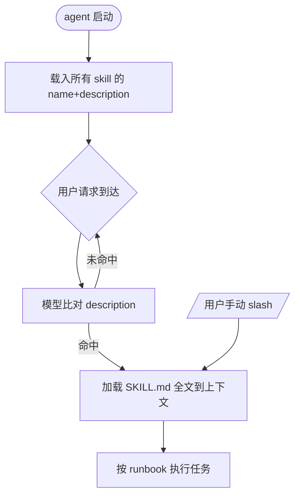

# AI Agent Skill

## 思维链路速查

```chain
技能是什么 | 定义与边界 | 概念
渐进式披露 | 为什么省上下文 | 核心
触发与加载 | 模型如何决定用 | 机制
组成结构 | SKILL.md+资源 | 落地
面试问答 | 高频辨析 | 复盘
```

skill 是 [[AI 工具]] 卷里 agent 的能力扩展机制，本质是「渐进式披露」——平时只在上下文留名字与描述，被需要时才加载整份 runbook，干专业活也不撑爆系统提示。

## 技能是什么

**skill（智能体技能）** 是给 AI agent 用的「打包好的可复用能力单元」：一份 `SKILL.md`（指令 / runbook）加可选的 `references/`（只读知识）与 `scripts/`（可执行代码）。

| 维度 | skill | agent | 提示词 |
|---|---|---|---|
| 存在形式 | 磁盘上的 SKILL.md + 资源 | 常驻子进程 | 上下文内文本 |
| 何时生效 | 被模型命中或手动 /调用 | 启动即运行 | 写入即生效 |
| 复用粒度 | 任务级能力 | 完整角色 | 单次指令 |

## 渐进式披露

把领域知识塞进系统提示会常驻占用上下文、拖慢推理、难以维护；skill 用「渐进式披露（progressive disclosure）」破解——启动只把每个 skill 的 `name` + `description` 元数据登记进上下文，正文与资源被命中才加载。

- 少占上下文：常驻只有元数据，加一个 skill 不挤占现有提示。
- 易维护可共享：逻辑落在磁盘文件，改 skill 不动全局提示。

> [!tip] 何时抽成 skill
> 「多步、领域强、可复用」的任务适合抽成 skill；一次性、强上下文绑定的逻辑留在 prompt 或 agent 里。

## 触发与加载

skill 分「发现（discovery）」与「触发（invocation）」两段：启动只载入 `name` 和 `description`，全文不进提示；模型比对用户意图与某条 `description` 命中后加载全文，用户也可 `/技能名` 手动调用。

```chain
启动登记 | name+description 进上下文 | 轻量
请求到来 | 模型比对 description | 判定
命中触发 | 加载 SKILL.md 全文 | 全量
手动调用 | 用户输入 /技能名 | 直达
```

<details>
<summary>展开加载流程图</summary>



</details>

## 落地：组成结构

重活下沉到 `references/` 与 `scripts/`，保持正文可读。

```yaml
---
name: note-checkup
description: |
  Vinea 笔记唯一入口 skill：写/改笔记、写后体检、全库审查。
  响应「体检」「查一下这篇对不对」「全库审查」。含骨架与组件语法基准。
---
```

```text
skill-name/
├── SKILL.md       # 指令与流程（含 frontmatter）
├── references/    # 只读知识，被加载时带入
│   └── api.md     # 接口 / 字段速查
└── scripts/       # 可执行代码（bash / python）
    └── run.sh
```

> [!warning] description 写法坑
> `description` 是模型决定要不要调的唯一依据：要写「当用户说 XX / 要做 XX 时调用」，写成「本技能用于 XX」等于没写触发条件——不触发或误触发。

> [!note] 两类资源边界
> `references/` 给模型**读**（API 文档、schema、示例）；`scripts/` 让模型**调**，而不是现编。

<details>
<summary>面试问答 (3题)</summary>

Q：skill 和把知识写进系统提示有什么区别？

A：系统提示常驻占上下文；skill 只登记元数据，全文按需加载，省 token 且可共享。

Q：模型怎么决定调用哪个 skill？

A：比对用户意图与各 skill 的 `description`，命中即加载全文；也可手动 `/技能名`。

Q：为什么 description 比正文更关键？

A：它是触发判定的唯一依据，写不清「何时用」，正文再好也加载不到。

</details>

<details>
<summary>常见误区 (3条)</summary>

- 误区：skill 越多越好。实际元数据也占上下文，description 重叠会干扰触发判定。
- 误区：把全部步骤写进系统提示更稳。实际常驻拖慢推理，改一次要动全局。
- 误区：description 写成功能介绍。实际要写触发条件，模型靠它决策。

</details>
