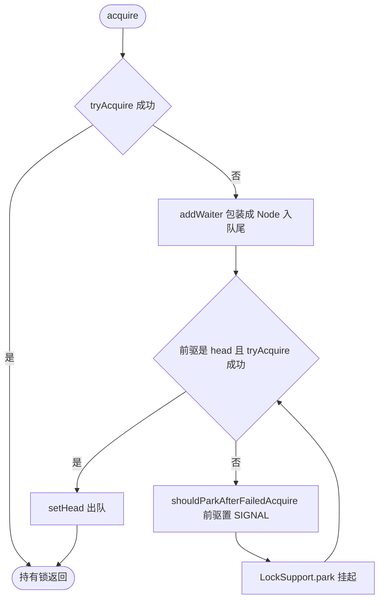

# AQS

## 思维链路速查

```chain
核心结构 | state + CLH 队列变体 | 骨架
获取流程 | tryAcquire→入队→park | 核心
模板方法 | tryAcquire/Release | 扩展点
独占/共享 | 两种模式 | 模式
面试问答 | 高频考点 | 复盘
```

AQS(AbstractQueuedSynchronizer)是 JUC 同步器基石 → 用 volatile int state + CLH 队列变体 → 抢锁失败入队 park、释放时 unpark 后继 → 子类只重写 tryAcquire/tryRelease → 支撑 [[ReentrantLock]]/[[Semaphore]]/[[CountDownLatch]]。

## 核心结构

| 组件 | 作用 |
|---|---|
| `volatile int state` | 同步状态(0=未占用,>0=重入次数/许可数),CAS 修改 |
| 同步队列 | CLH 队列**变体**:双向 Node 队列,抢锁失败线程 park 入队 |
| head / tail | 队列头尾指针,head 是"当前持锁"的哨兵节点 |
| `Node.waitStatus` | CANCELLED(1 已取消) / SIGNAL(-1 需唤醒后继) / CONDITION(-2 在条件队列) / PROPAGATE(-3 共享传播) |

> [!note] 为什么是 CLH 变体
> 经典 CLH 是**单向 + 自旋**;AQS 改成**双向(加 prev 指针) + park/unpark**。加 prev 才能处理节点取消与中断出队,改 park 才不至于空烧 CPU。

## 获取流程

```chain
tryAcquire | 抢 state | 快路径
addWaiter | 失败包装 Node 入队尾 | 入队
acquireQueued | 前驱是 head 才再抢,否则 park | 阻塞
release | unpark 后继,被唤醒者接替 | 出队
```

<details>
<summary>展开获取流程图</summary>



</details>

> [!note] 自旋很克制
> 入队后不是无脑自旋:`acquireQueued` 只在**前驱是 head** 时才再试一次 tryAcquire,否则 park 挂起,等前驱释放时 unpark。

## 底层原语：LockSupport

> AQS 的挂起/唤醒**全部**走 LockSupport,它就是 AQS 的 `Thread.sleep` 替代品——能精确唤醒、能脱离 monitor、能被中断。

| API | 行为 |
|---|---|
| `park()` / `park(Object blocker)` | 有许可就消耗并返回,否则阻塞;带 blocker 的版本让 `jstack` 能看到阻塞对象 |
| `parkNanos` / `parkUntil` | 带超时,线程进入 `TIMED_WAITING` |
| `unpark(Thread t)` | 给指定线程补 1 个许可(上限 1,不累积) |
| `getBlocker` | 读回 blocker,诊断用 |

> [!note] 许可是二元的,不是计数器
> 只有 0 和 1 两态：连着 `unpark` 5 次再 `park`,只放行 1 次,多出的被丢弃。

### park vs wait vs suspend

| 维度 | LockSupport | Object.wait / notify | Thread.suspend / resume |
|---|---|---|---|
| 需不需要持锁 | ❌ | ✅ 必须在 synchronized 内 | ❌ |
| 唤醒目标 | 精确指定线程 | notify 随机 / notifyAll 全体 | 指定线程 |
| 可先于阻塞调用 | ✅ 先 unpark 不丢失 | ❌ 先 notify 后 wait 信号丢失 | ❌ 先 resume 永久挂起 |
| 中断响应 | 直接返回,**不抛异常** | 抛 `InterruptedException` | — |
| 现状 | 推荐 | 配合 [[synchronized]] 仍可用 | 已废弃(易死锁) |

> [!warning] park 会虚假唤醒
> 正确姿势是 `while (!canAcquire()) LockSupport.park(this);`,必须循环判条件。AQS 的 `acquireQueued` 就是这么写的。

> [!danger] 中断不抛异常,标记要自己查
> 被中断唤醒时 park 直接返回,中断标记被置上但**不抛异常**。调用方要么用 `Thread.interrupted()` 检测后处理,要么明确忽略——否则上层 `lockInterruptibly` 这类中断语义失效。

### 在 AQS 中的落点

| 环节 | 调用 |
|---|---|
| 入队后挂起 | `shouldParkAfterFailedAcquire` 把前驱置为 `SIGNAL` → `LockSupport.park(this)` |
| 释放时唤醒 | `unparkSuccessor` 找 head 之后的有效节点 → `LockSupport.unpark(s.thread)` |
| 取消/中断出队 | `cancelAcquire` 修正前后指针,唤醒仍交给 unpark |

> [!note] 为什么 AQS 不用 wait/notify
> 两条硬伤:wait 要求先持有 monitor,而 AQS 的阻塞恰发生在**不持任何 monitor** 的路径上;notify 无法精确唤醒队列里某一个后继。

## 模板方法（子类重写）

| 模式 | 方法 |
|---|---|
| 独占 | `tryAcquire` / `tryRelease` |
| 共享 | `tryAcquireShared` / `tryReleaseShared` |
| 判断 | `isHeldExclusively` |

> [!note] 实现者只需写 try* 方法
> 入队、park/unpark、CAS 改 state、取消与中断处理等复杂逻辑已由 AQS 实现；子类只定义「如何获取/释放 state」。

## 两种模式

- **独占**：同一时刻一个线程持有。例：[[ReentrantLock]]、ReentrantReadWriteLock 的写锁。
- **共享**：多个线程可同时持有。例：[[ReentrantReadWriteLock]] 的读锁、共享同步器(见 [[Java 锁对比]])。

> [!tip] 共享模式会传播
> 共享释放走 `doReleaseShared` + `setHeadAndPropagate`,唤醒是**级联**的(唤醒一个后继后继续向后传播),保证多个等待者一起被放行,而不是一次只放一个。

## Condition：第二条队列

> [!note] ConditionObject 是独立的条件队列
> `await()` 会**完全释放锁**并把节点移入条件队列;`signal()` 把节点从条件队列移回同步队列重新排队抢锁。这就是 [[ReentrantLock]] 能有多个等待集、而 [[synchronized]] 只有一个等待集的原因。

## 依赖 AQS 的组件

| 组件 | 模式 | state 语义 |
|---|---|---|
| [[ReentrantLock]] | 独占 | 重入次数 |
| [[ReentrantReadWriteLock]](写) | 独占 | 读/写锁各占 16 位 |
| [[ReentrantReadWriteLock]](读) | 共享 | 同上 |
| 共享同步器(Semaphore / CountDownLatch / CyclicBarrier) | 共享 | 见 [[Java 锁对比]] 共享同步器一节 |

> [!note] state 语义由子类定义
> AQS 只提供存储与 CAS,不解释含义——同一个 `int`,在锁里是重入次数、在信号量里是许可数、在门闩里是计数值,差别全在子类重写的 `try*` 方法里。

> [!tip] 理解锁的底层
> 上层锁的「公平/非公平」「可中断」「Condition」都源于 AQS 的队列与 state 管理；看不懂锁行为时回到 AQS。横向对比见 [[Java 锁对比]]。

<details>
<summary>面试问答 (3题)</summary>

Q：AQS 怎么实现阻塞？

A：抢锁失败线程被包装成 Node 入 CLH 队列变体,`shouldParkAfterFailedAcquire` 把前驱置为 SIGNAL 后调用 `LockSupport.park()` 挂起；持有线程释放时 `unpark` 唤醒后继节点。

Q：state 为什么用 volatile？

A：保证 state 的可见性,且配合 CAS 实现无锁原子修改,是 AQS 正确性的基础。

Q：公平锁和非公平锁在 AQS 上差在哪？

A：只差一行判断——公平实现在 tryAcquire 前先调 `hasQueuedPredecessors()` 确认前面没人排队;非公平实现跳过检查直接 CAS 抢,所以能插队(barging)、吞吐更高。

</details>

<details>
<summary>常见误区 (3条)</summary>

- 误区：AQS 队列就是经典 CLH。经典 CLH 单向自旋,AQS 是双向 + park 的变体,多了 prev 指针才能处理取消与中断。
- 误区：state 就是"锁重入次数"。语义由子类定义,可以是重入数、许可数、门闩计数。
- 误区：公平性由 AQS 保证。AQS 只提供 `hasQueuedPredecessors()`,查不查取决于子类;`ReentrantLock` 的非公平实现就是故意不查。

</details>
