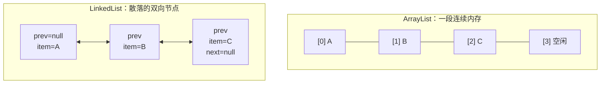

# ArrayList 与 LinkedList

## 思维链路速查

```chain
底层结构 | 连续数组 vs 双向节点 | 起点
时间复杂度 | 访问与增删的真实代价 | 核心
扩容与内存 | 1.5 倍搬迁 vs 节点开销 | 代价
落地：遍历与删除陷阱 | 代码与正确写法 | 实战
面试问答 | 高频考点 | 复盘
```

两者对外都实现 `List`，差别全在内存布局：ArrayList 是一段**连续数组**（下标直达，增删要搬家），LinkedList 是散落在堆里的**双向节点**（改指针即可插删，定位只能一步步走）。所谓「ArrayList 查询快、LinkedList 增删快」只是粗略口诀，真正的分界在于增删时**要不要先花 O(n) 找位置**。

## 底层结构：连续数组 vs 双向节点

| 维度 | ArrayList | LinkedList |
|---|---|---|
| 存储 | `Object[] elementData` | 双向节点 `Node` |
| 容量 | `size` 与容量分离 | 无容量概念 |
| 随机访问 | 实现 `RandomAccess` | 无，只能遍历 |
| 额外身份 | —— | 同时实现 `Deque` |

- `elementData` 是 `Object[]`：泛型擦除后元素统一按 `Object` 存（擦除细节见 [[Java 泛型]]），取用时由编译器插检查转型。
- `Node` 三件套：`item` 存值，`prev` / `next` 指前后；链表本身只记 `first` / `last` 两个端点。
- 数组尾部常有**空闲槽**（容量 > size），链表则每存一个元素就多一个对象。

<details>
<summary>展开两种内存布局</summary>



</details>

> [!note] `RandomAccess` 是标记接口
> 它没有任何方法，只用来告诉「按下标遍历更快」的通用算法可以放心用 `get(i)`；`Collections.binarySearch` 等工具就靠 `instanceof RandomAccess` 分派实现。

## 时间复杂度：别只看 O 符号

| 操作 | ArrayList | LinkedList | 说明 |
|---|---|---|---|
| `get(i)` | **O(1)** | O(n) | 链表靠 `node(i)` 折半走 |
| `add(e)` 尾插 | 摊还 **O(1)** | **O(1)** | 数组扩容那次 O(n) |
| `add(i, e)` | O(n) | O(n) | 数组搬家 vs 链表先定位 |
| `remove(i)` | O(n) | O(n) | 同上，都要先找到位置 |
| 迭代器位置插删 | O(n) | **O(1)** | 链表唯一真正的优势 |

> [!warning] 「LinkedList 插入 O(1)」有前提
> 只在**已经持有节点或迭代器游标**时成立：`add(index, e)` / `remove(index)` 都要先走 `node(index)`（下标小于 `size >> 1` 从头走、否则从尾走，最坏也要 n/2 步），整体仍是 O(n)。

> [!tip] O 符号相同的两笔账，常数差很多
> 数组搬家是 `System.arraycopy` 的**整块内存拷贝**，且连续内存命中 CPU 缓存行；链表每次增删虽只写几个指针，定位却要顺着引用**跳跃访问**，缓存命中率低。数据量上千时，ArrayList 的中间插入常常反超 LinkedList。

## 扩容与内存代价

```chain
首次 add | 空表扩到默认 10 | 懒初始化
容量不足 | newCap = old + old>>1 | 1.5 倍
搬迁 | Arrays.copyOf 整块拷 | O(n)
缩容 | trimToSize 回收空闲 | 手动
```

- **默认容量 10**：JDK 8 起 `new ArrayList<>()` 只给空数组，首次 `add` 才扩到 10（懒初始化，省下「建了不用」的数组）。
- **1.5 倍扩容**：`oldCapacity + (oldCapacity >> 1)`，再用 `Arrays.copyOf` 搬迁；不是 2 倍，是为了在「扩容次数」与「空闲浪费」之间折中。
- **不会自动缩容**：`remove` 只把尾槽置 `null`（帮助 GC）并 `size--`，数组不缩小；长期持有大列表要手动 `trimToSize()` 或 `ensureCapacity(n)` 预留。
- **内存账**：ArrayList 每元素占一个数组槽（压缩指针下约 4 字节），代价是尾部空闲槽；LinkedList 每元素多出一个 `Node` 对象（对象头 + `item` / `prev` / `next` 三个引用），存同样的数据通常要多出数倍内存。

## 落地：遍历与删除陷阱

> [!danger] `Arrays.asList` 的结果不能增删
> 它返回的是 `Arrays$ArrayList`——一个固定大小的视图，调 `add` / `remove` 抛 `UnsupportedOperationException`。要可变就 `new ArrayList<>(Arrays.asList(...))`。

```java
// ❌ LinkedList 按下标遍历：每次 get(i) 都重新折半走一遍，整体 O(n²)
for (int i = 0; i < list.size(); i++) { sum += list.get(i); }

// ✅ 迭代器 / for-each 一路走到底，O(n)
for (Integer v : list) { sum += v; }

// ❌ for-each 中直接删除：触发 fail-fast，抛 ConcurrentModificationException
for (String s : list) { if (s.isBlank()) list.remove(s); }

// ✅ 三种正确写法
list.removeIf(String::isBlank);                      // 内部走迭代器删除，最省事
Iterator<String> it = list.iterator();
while (it.hasNext()) if (it.next().isBlank()) it.remove();   // 用迭代器的 remove
for (int i = list.size() - 1; i >= 0; i--) list.remove(i);   // 倒序下标，仅 ArrayList
```

> [!note] fail-fast 只是预警，不是线程安全
> 两者都用 `modCount` 记结构性修改次数，迭代器创建时快照 `expectedModCount`，`next()` 时比对，不一致就抛 `ConcurrentModificationException`。它只能帮你**尽早发现**并发误用，不能保证线程安全。

> [!warning] 两处容易踩的 API 歧义
> - `List<Integer>` 上 `remove(1)` 删的是**下标 1**；按值删要写 `remove(Integer.valueOf(1))`。
> - `subList(a, b)` 返回的是原列表的**视图**（内部类 `SubList`）：改它写回原列表；原列表发生结构性修改后再用这个视图会抛 `ConcurrentModificationException`。要独立副本就 `new ArrayList<>(sub)`。

<details>
<summary>面试问答 (5题)</summary>

Q：ArrayList 和 LinkedList 怎么选？

A：默认选 ArrayList——随机访问 O(1)、内存紧凑、缓存友好，绝大多数增删场景（含批量 `removeIf`）都不输。LinkedList 只在「已持有节点/游标位置频繁插删」或「当双端队列且不苛求性能」时才占优；纯队列场景 `ArrayDeque`（循环数组）通常更快更省。

Q：LinkedList 中间插入不是 O(1) 吗，为什么说它 O(n)？

A：改指针本身 O(1)，但 `add(index, e)` 得先用 `node(index)` 走到位置（折半遍历，最坏 n/2），整体 O(n)。只有 `ListIterator` 定位好后再 `add` / `remove` 才是 O(1)。

Q：ArrayList 的初始容量和扩容规则？

A：默认容量 10，JDK 8 起是懒初始化（首次 `add` 才分配）；扩容为 `old + (old >> 1)` 即 1.5 倍，经 `Arrays.copyOf` 搬迁；`size` 达容量时触发，均摊下来尾插仍是 O(1)。

Q：为什么 LinkedList 又慢又占内存？

A：每个元素多一个 `Node` 对象（对象头 + 三个引用），且节点在堆里散落分布，遍历时指针跳跃、CPU 缓存命中率低；数组则是连续内存 + 批量拷贝。

Q：for-each 里删除为什么抛异常？

A：for-each 编译成迭代器，而 `list.remove` 只改 `modCount` 不改迭代器的 `expectedModCount`，下次 `next()` 校验失败抛 `ConcurrentModificationException`。正解是 `removeIf` 或迭代器的 `remove()`。

</details>

<details>
<summary>常见误区 (4条)</summary>

- 误区：增删多就该用 LinkedList。增删若带 `index` 检索仍是 O(n)，加上缓存不友好，实测常常更慢；先按 ArrayList 写，压测不过再换。
- 误区：`new ArrayList<>()` 立刻占 10 个槽。JDK 8 起是空数组懒初始化，首次 `add` 才扩到 10；传了初始容量则直接按该容量分配。
- 误区：`modCount` 检查能保证线程安全。它只是 fail-fast 预警；并发场景用 `Collections.synchronizedList`、`CopyOnWriteArrayList`（读多写少）或并发容器（并发容器的锁思路见 [[ConcurrentHashMap]]）。
- 误区：LinkedList 最适合当队列。`ArrayDeque` 用循环数组实现 `Deque`，无节点开销、内存连续，栈/队列场景优先选它。

</details>
