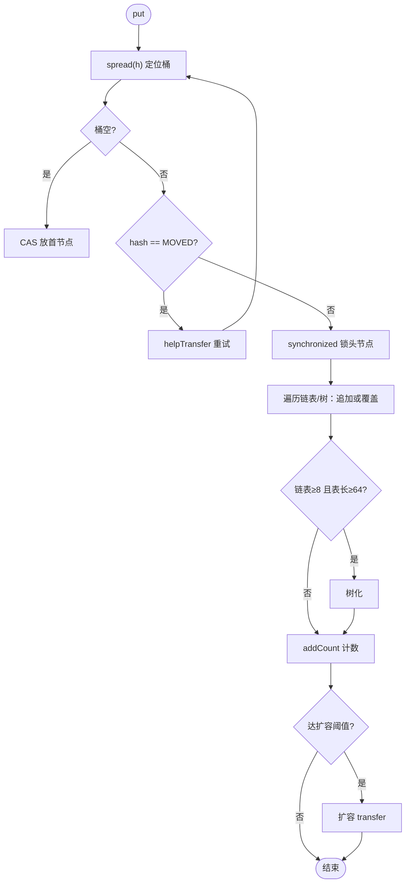

# ConcurrentHashMap

:::lede
ConcurrentHashMap 是支持检索全并发、更新高期望并发的线程安全哈希表。
读不加锁，写只锁单个桶，取代整表加锁的 Hashtable。
**分界：** 与 Hashtable 差在锁粒度 · 不保证复合操作原子
:::

## 思维链路速查

```chain
结构演进 | 1.7 分段锁 → 1.8 桶级锁 | 入口
写路径 put | CAS / 桶锁 / 协助扩容 | 核心
读路径 get | volatile 撑起的无锁读 | 对照
计数与迭代 | LongAdder 式计数 + 弱一致 | 细节
面试问答 | 高频考点 | 复盘
```

## 结构演进：1.7 分段锁 → 1.8 桶级锁

| 维度 | Java 7：Segment 分段锁 | Java 8：CAS + synchronized |
|---|---|---|
| 外层结构 | Segment 数组，每段一张小表 | Node 数组一张大表 + 链表/红黑树 |
| 锁实现 | Segment 继承 ReentrantLock（state 靠 CAS，见 [[AQS]]） | CAS 写空桶 + synchronized 锁桶头 |
| 锁粒度 | 一段（并发度 = 段数，默认 16） | 一个桶（并发度 ≈ 桶数） |
| 哈希定位 | 先定位段、再定位桶，两次哈希 | spread(h) 一次定位桶（结构同 [[HashMap]]） |

> [!tip] 为什么 1.8 弃用分段锁
> 锁已细到桶级、持锁极短，synchronized 锁升级后的低竞争路径足够轻（见 [[synchronized]]）；每段一把 ReentrantLock 还要多养一份 AQS 队列对象。

## 写路径：put 的五步决策

```chain
扰动寻址 | spread(h) 定位桶 | 无锁
空桶 | CAS 放入首节点 | 无锁
ForwardingNode | helpTransfer 协助迁移 | 扩容中
非空桶 | synchronized 锁头节点写入 | 桶级锁
写入后 | 树化判定 + addCount 触发扩容 | 收尾
```

<details>
<summary>展开 put 决策流程图</summary>



</details>

- **spread(h)**：`(h ^ (h >>> 16)) & 0x7fffffff`——高低 16 位异或让高位参与寻址，抹掉符号位保证 hash 非负，负数被挪作特殊标记。
- **ForwardingNode**：hash = MOVED(-1) 的占位节点，插在「已迁走」的桶头上，读它转发去新表、写它先帮忙迁移。
- **树化**：插入后链上已有 8 个节点（`binCount >= TREEIFY_THRESHOLD - 1`）才调 `treeifyBin`，且表长 ≥ 64，否则优先扩容——阈值依据同 [[HashMap]]（泊松分布，约千万分之六）。
- **扩容并发**：transfer 按步长（stride，最小 16 个桶）分段承包给线程；sizeCtl 负值编码参与线程数。

> [!note] sizeCtl 编码
> > 0：初始化前是初始容量建议、初始化后是扩容阈值（≈容量 × 0.75）；= -1：正在初始化（表只建一次）；< -1：正在扩容，负值编码参与迁移线程数。

## 读路径：get 为什么全程无锁

三个 volatile 兜住可见性，读线程不加锁也不 CAS 重试：

| 读线程要拿什么 | 靠什么保证可见 |
|---|---|
| 桶数组 table（扩容换表） | table 用 volatile 修饰 |
| 节点的值 Node.val | volatile 写 |
| 节点的后继 Node.next | volatile 写（链表追加/树化改链不丢节点） |

- volatile 写 happens-before 后续的 volatile 读（见 [[volatile]] 与 [[JMM]]）；扩容期间读到 ForwardingNode 就顺它去新表找，迁移中的桶读不丢、不挡。
- **树桶读的是 `TreeBin`**（hash = TREEBIN(-2)）：不存值，只持树根并维护一条遍历链表，写用 `lockState` 协调，读者不必阻塞。
- `get` 遇扩容只转发不等待，**写不是**：扩容中的写要先 `helpTransfer` 协助搬桶再重试，同桶写仍互斥。

> [!warning] 无锁读 = 弱一致读
> get 保证「写完成后一定能读到」，但不保证「遍历瞬间看到全局精确快照」——这是设计语义，不是 bug。

## 计数：size() 为什么是近似值

所有写都 CAS 同一个计数器，高并发会撞成热点（见 [[CAS 与原子类]]），CHM 因此改用 LongAdder 式分桶计数：

```chain
写入计数 | 先 CAS baseCount | 冲突
冲突分流 | 散到 CounterCell[] 各加各的 | 分桶
读取 size | baseCount + Σ cells 求和 | 近似
```

- **baseCount** 是基数，**CounterCell[]** 是分桶数组（`@Contended` 填充防伪共享），冲突越大、cell 越多。
- size() 是求和瞬间的近似值；防溢出用 mappingCount()，要精确计数需外部同步。

## null 禁令与弱一致迭代

- **key/value 都不许 null**：并发下 `get(k)` 返回 null 有二义性——分不清「键不存在」还是「存了 null」；单线程 HashMap 能补 containsKey，并发下是 check-then-act，中间键可能被改掉，干脆禁止。
- 迭代器是**弱一致**（weakly consistent）：保证遍历到「创建时刻已存在」的元素，之后的增删可能看到可能看不到，但**不抛** ConcurrentModificationException。

| 维度 | HashMap | Hashtable | ConcurrentHashMap |
|---|---|---|---|
| 线程安全 / 并发性能 | 否 / —— | 方法级 synchronized 锁全表，几乎串行 | 桶级锁 + CAS，写锁单桶、读无锁 |
| null key/value | 允许 | 禁止 | 禁止 |
| 迭代语义 | fail-fast | fail-fast | 弱一致 |

## 落地：复合操作的正确写法

put/get 各自原子，但「先 get 判断、再 put」是两步，中间可能被插队——计数、去重必须用锁同一桶头的整段原子方法。

> [!danger] computeIfAbsent 里禁止递归更新同一张表
> 计算函数内再改同一张表即递归更新：JDK 8 **不做检测**，两个 key 落在同一桶时可能改坏桶结构甚至死循环、跨桶循环依赖则可能死锁；JDK 9+ 会检测并直接抛 `IllegalStateException: Recursive update`。

```java
map.putIfAbsent(k, v);
map.computeIfAbsent(k, key -> expensiveLoad(key));
map.merge(k, 1, Integer::sum);          // 并发计数
```

<details>
<summary>面试问答 (3题)</summary>

Q：多线程怎么一起扩容？

A：transfer 按步长（最小 16 个桶）分段承包，迁完的桶头放 ForwardingNode，读到它则转发读或协助迁。

Q：size() 准确吗？

A：不保证，是 baseCount + Σ CounterCell 的瞬时求和（LongAdder 思路），并发写时只是近似值。

Q：ConcurrentHashMap 能替代 Hashtable 吗？

A：能。Hashtable 只为兼容旧 API 保留，`Collections.synchronizedMap` 同样是全对象锁，性能远不如桶级锁。

</details>

<details>
<summary>常见误区 (3条)</summary>

- 误区：默认并发度 16 是 1.8 的概念。16 是 1.7 的段数；1.8 并发度取决于桶数，构造参数只当初始容量提示。
- 误区：无并发也该用 ConcurrentHashMap。单线程下 volatile 读和 CAS 有额外成本，HashMap 更快。
- 误区：get 读到「旧一拍」的值是实现缺陷。弱一致是设计语义，可见性由 volatile 保证，写完成必可见。

</details>
