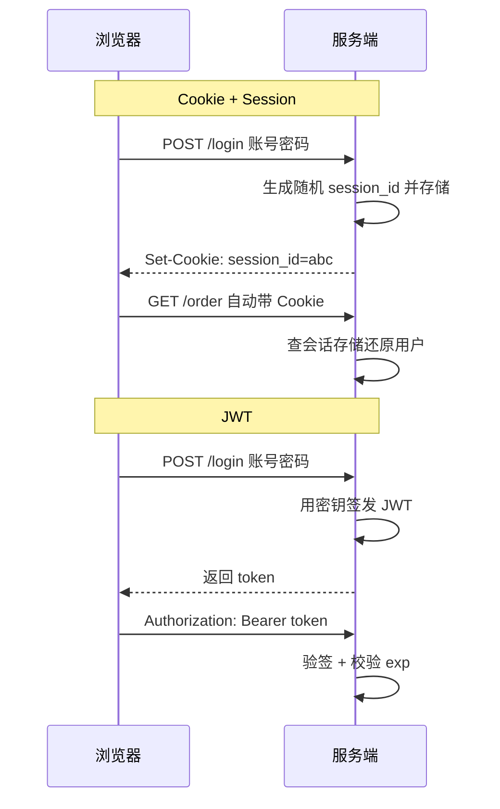

# Cookie、Session与Token

:::lede
Cookie 是服务端下发、浏览器自动回传的凭证载体。
Session 只发 ID、状态留服务端；Token 把声明与签名自包含进令牌。
**层级：** Cookie 管「怎么带回来」· Session / Token 管「状态放哪」
:::

## 思维链路速查

```chain
登录签发 | 校验通过后发凭证 | 起点
请求回传 | 浏览器自动带 / 前端手动挂 | 携带
服务端认账 | 查会话存储 / 验令牌签名 | 校验
失效登出 | 删服务端状态 / 等过期 | 收尾
```

[[HTTP]] 无状态，每个请求都得自证身份。

## 一次登录，两条链路

<details>
<summary>Cookie + Session 与 JWT 的请求时序</summary>



</details>

## Cookie：凭证怎么带回来

| 环节 | Cookie | Token |
|---|---|---|
| 怎么给 / 存哪 | `Set-Cookie` 响应头 → 浏览器 Cookie 存储 | 响应体字段 → 前端代码自选 |
| 谁带 / 挂哪 | 浏览器自动，挂 `Cookie` 头 | 前端每次手动，挂 `Authorization: Bearer …` |
| 跨域时 | 受 `SameSite` 与 CORS 限制 | 无额外限制 |

- 浏览器只在**同域且路径匹配**时自动附 Cookie（范围由 `Domain`/`Path` 定）；跨域携带需客户端 `credentials: 'include'`、服务端回 `Access-Control-Allow-Credentials: true` 且来源写具体值，详见 [[CORS]]。

## Cookie 的属性与安全

| 属性 | 作用 | 示例 |
|---|---|---|
| `Name=Value` | 键值对数据 | `session_id=abc123` |
| 范围 / 过期 | `Domain`/`Path` 限定回传，`Expires`/`Max-Age` 定过期 | `.example.com` / `Max-Age=3600` |
| `HttpOnly` | 禁止 JS 读取，防 XSS 窃取 | — |
| `Secure` | 仅 [[HTTPS]] 传输，防明文泄露 | — |

`Set-Cookie: session_id=abc123; HttpOnly; Secure; SameSite=Lax; Max-Age=3600`

| `SameSite` | 行为 | 代价 |
|---|---|---|
| `Strict` | 跨站请求一律不带 | 外链点进来丢登录态 |
| `Lax` | 顶级导航带，AJAX 不带 | Chrome 80+ 的默认值 |
| `None` | 跨站一律带，须配 `Secure` | 放弃 CSRF 防护 |

> [!warning] 自动携带正是 CSRF 的成因
> 请求只要发往匹配域就必然带上 Cookie，攻击者无需读到它，借用户浏览器发跨站请求即可冒充身份。

- 单个 Cookie 上限约 4KB，只装小凭证。

## Session：状态留在服务端

Cookie 存在用户机器上、可读可改，直接写用户信息等于让用户自填身份；Session 只在 Cookie 里放无业务含义的随机 ID。

| 存储位置 | 优点 | 缺点 |
|---|---|---|
| 服务端内存 | 读取最快 | 多节点不共享，需会话粘滞 |
| [[Redis]] | 高性能、自带过期 | 多一次网络往返 |
| 数据库 | 持久化 | 性能最低 |

- Session ID 必须是密码学安全随机数（≥128 bit），可猜的 ID 等于直接送登录。

> [!note] 登录成功后必须换 Session ID
> 不换则攻击者可预置已知 ID 诱导用户登录（会话固定攻击），登录态落入其手；校验通过后重新生成 ID 是标准动作。

## JWT：状态写进令牌

JWT 把用户信息写进令牌，服务端只验签即可确认没被改过、不必查库——代价是签发后不再持有可删副本。

| 部分 | 内容 | 示例 |
|---|---|---|
| Header | 算法 + 类型 | `{"alg":"HS256","typ":"JWT"}` |
| Payload | 声明：用户 ID、角色、过期时间 | `{"sub":"user123","exp":1700000000}` |
| Signature | 前两段的签名结果 | `HMAC-SHA256(前两段, secret)` |

- 签名覆盖 `base64url(Header) + "." + base64url(Payload)`：改任何一字节，验签都不过。

| 算法 | 密钥形态 | 适用 |
|---|---|---|
| HS256 | 对称，签验同一把密钥 | 单服务自签自验；密钥泄露即可伪造 |
| RS256 | 非对称，私钥签、公钥验 | 验签方多于签发方，公钥可公开分发 |

> [!warning] Payload 只是编码不是加密
> 任何人都能 Base64URL 解码读出内容，敏感信息不要放；防篡改靠签名而非「看不见」。

- 验签只证明令牌没被改过，不证明没过期、没被撤销：`exp` 必须校验，强制登出另需黑名单。

## 三者对比

| 维度 | Cookie + Session | Token / JWT |
|---|---|---|
| 状态 / 扩展 | 服务端存储，多节点需共享 Session | 令牌自包含，天然支持 |
| 即时失效 | 删 Session 即刻生效 | 到期前无法自然作废 |
| 跨域 / CSRF | 受 `SameSite` 与 CORS 限制，需 CSRF Token | 无额外限制，免疫（前提是不存 Cookie） |
| 体积 / 场景 | 几十字节随机 ID；同域服务端渲染 | 声明越多越大、每请求都带；前后端分离、微服务、多端 |

## Token 存哪：XSS 与 CSRF 的取舍

| 存放位置 | 面对 XSS | 面对 CSRF |
|---|---|---|
| `localStorage` | ❌ 任意脚本可读走 | ✅ 不会自动携带 |
| 内存变量 | ✅ 刷新即失，需重登 | ✅ 不会自动携带 |
| `HttpOnly` Cookie | ✅ JS 读不到 | ❌ 自动携带 |

- 主流做法：Access Token 放内存、Refresh Token 放 `HttpOnly + Secure + SameSite` Cookie——XSS 偷不走长期凭证，CSRF 只影响刷新接口（可校验 `Origin`）。
- 续期用双令牌：Access Token 5~15 分钟，Refresh Token 7~30 天存 [[Redis]] 可撤销，补上「JWT 无法主动失效」；刷新时轮换，旧的作废。

## 落地：Spring 拦截器校验 JWT

```java
public class JwtInterceptor implements HandlerInterceptor {
    @Override
    public boolean preHandle(HttpServletRequest req, HttpServletResponse resp, Object handler) {
        String h = req.getHeader("Authorization");              // "Bearer xxx"
        if (h == null || !h.startsWith("Bearer ")) return reject(resp);
        try {
            Claims c = Jwts.parserBuilder().setSigningKey(key).build()
                    .parseClaimsJws(h.substring(7)).getBody();
            UserContext.set(c.getSubject());
            return true;
        } catch (JwtException e) {
            return reject(resp);
        }
    }
}
```

- `parseClaimsJws` 一次完成验签与 `exp` 校验，任一不过都抛 `JwtException`；拦截器只管认证。

<details>
<summary>面试问答 (4题)</summary>

Q：Cookie 和 Session 的区别？

A：不同层——Cookie 是自动回传的载体，Session 是服务端状态，靠 Cookie 里的随机 ID 关联。

Q：JWT 如何实现即时失效？

A：签名令牌到期前无法自然作废，靠 [[Redis]] 黑名单存已注销的 `jti`，或短 Access Token + 可撤销 Refresh Token。

Q：HS256 和 RS256 怎么选？

A：单服务自签自验用 HS256（对称、快）；验签方多于签发方用 RS256，公钥可分发且泄露不影响签发。

Q：为什么说 JWT 天然免疫 CSRF？

A：CSRF 依赖浏览器自动携带凭证，而 JWT 要手动放进 `Authorization` 头；一旦存进 Cookie，免疫就没了。

</details>

<details>
<summary>常见误区 (3条)</summary>

- 误区：Cookie、Session、Token 是三个并列选项。Cookie 是载体，Session / Token 是状态方案，JWT 放 Cookie 里传完全合法。
- 误区：Token 完全不需要服务端存储。黑名单、Refresh Token 仍需存，消除的只是每连接的会话状态。
- 误区：JWT 的 Payload 是加密的。它只是 Base64URL，可被任意读取，防篡改靠签名。

</details>
