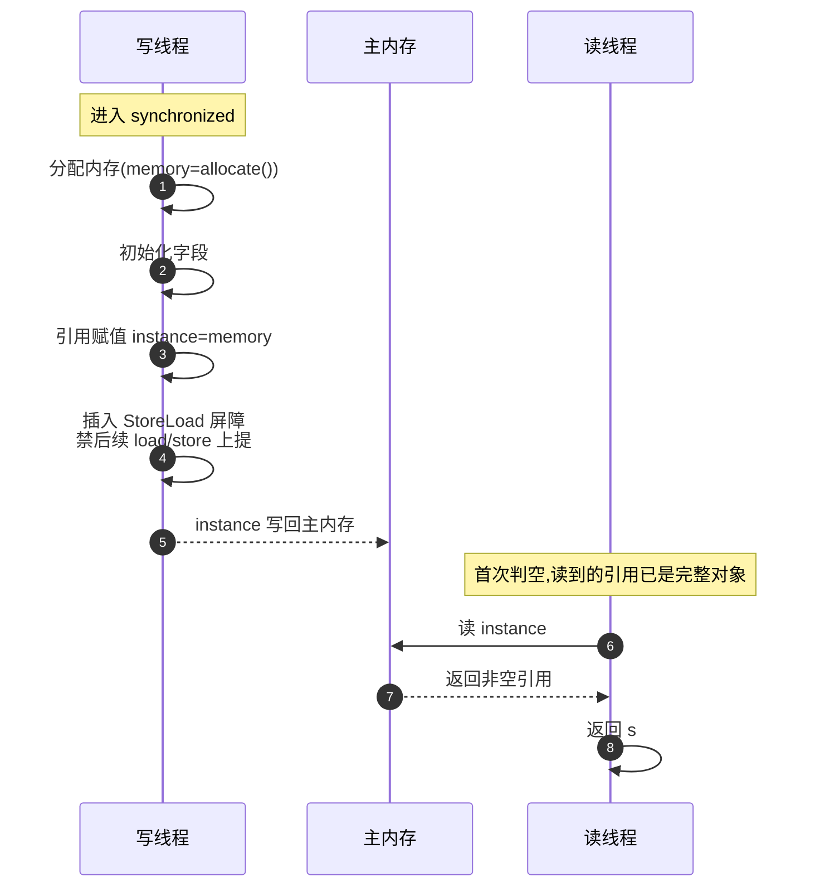

# DCL

## 思维链路速查

```chain
问题 | new 半初始化对象被发布 | 成因
屏障 | volatile 写插 StoreLoad | 核心
JDK 5 | JSR-133 之前不保 | 历史
落地 | volatile + 二次判空 | 实战
```

Double-Checked Locking(DCL)——单例懒加载的经典模式,核心靠 [[volatile]] 写后插入的 `StoreLoad` 屏障,**JDK 5 之前** volatile 不禁重排,DCL 会拿到「引用已赋值但对象未初始化」的半成品;JDK 5 起 `StoreLoad` 严格兜底,DCL 才安全。

## 它解决什么

| 问题 | 场景 |
|---|---|
| 半初始化对象发布 | `new Singleton()` 分「分配内存 → 初始化字段 → 引用赋值」三步,重排可让引用先于初始化对其他线程可见——对方拿到字段全是默认值的对象 |
| 重复加锁开销 | 首次判空跳过 `synchronized`,只有竞争时才进锁 |
| 正确性 vs 性能 | 单例同时要懒加载 + 高并发读 + 低延迟,DCL 两者都抓 |

## 屏障机制



> [!note] 为什么 volatile 写**后**插 `StoreLoad` 就够
> 重排风险只有一种形态:「`instance = s` 被重排到初始化之前」。`StoreLoad` 保证「写**之后**的所有读写都不能跨过该写上提」;普通写与 volatile 写之间的重排(`StoreStore`)靠程序次序规则天然建立 happens-before(8 条规则全表见 [[JMM]]),**不需要**额外屏障。

## JDK 5 前后的语义差异

| 版本 | volatile 写屏障 | DCL 安全性 |
|---|---|---|
| JDK 1.4 及以前 | 不强制禁重排 | ❌ 可能拿到半初始化对象 |
| JDK 5+(JSR-133) | 写后插 `StoreLoad`,严格禁重排 | ✅ 安全 |
| JDK 8+ | 同上,模式无变化 | ✅ 安全 |

## 落地：DCL 模板

```java
public class Singleton {
    private static volatile Singleton instance;  // volatile 写后插 StoreLoad

    private Singleton() {}

    public static Singleton getInstance() {
        Singleton s = instance;             // 1. 首次判空(无锁)
        if (s == null) {
            synchronized (Singleton.class) { // 2. 竞争时才进锁
                s = instance;              // 3. 二次判空(防并发期间其他线程已建好)
                if (s == null) {
                    s = new Singleton();    // 4. 分配 + 初始化
                    instance = s;           // 5. volatile 写,禁重排
                }
            }
        }
        return s;
    }
}
```

> [!warning] 三步校验
> 1. **JDK ≥ 5**——`StoreLoad` 兜底的前提。
> 2. **`instance` 必须 volatile**——普通变量写无屏障,DCL 必坏。
> 3. **二次判空不能省**——防「A 在等锁时 B 已建好实例」。

<details>
<summary>面试问答 (2题)</summary>

Q：双重检查单例为什么要 volatile？
A：`new` 的分配/初始化/赋值引用三步可能重排,volatile 写后的 `StoreLoad` 禁该重排,保证其他线程拿到完整对象(前提 JDK 5+)。

Q：DCL 能否用 `AtomicReference` 或 `synchronized` 完全替代？
A：`AtomicReference` + `compareAndSet` 可行但更绕,全用锁正确但慢;生产多用**饿汉 / 静态内部类 holder / 枚举**绕过 DCL。

</details>

<details>
<summary>常见误区 (2条)</summary>

- 误区：DCL 在任何 JDK 都安全。JDK 5 前 volatile 不禁重排,DCL 会拿到半初始化对象。
- 误区：`synchronized` 包整个方法就够了。锁只对**同一把锁**的线程互斥,首次判空走无锁路径,看不到锁内初始化结果;且比 DCL 慢。

</details>
