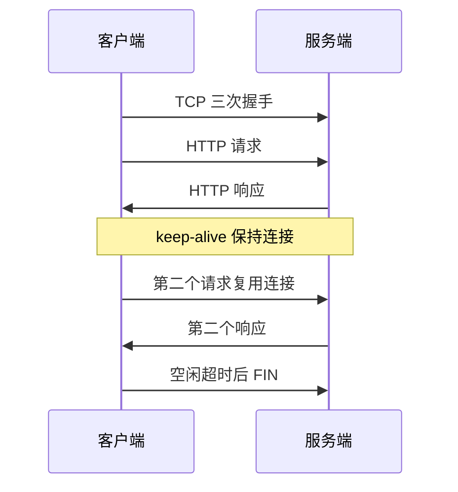
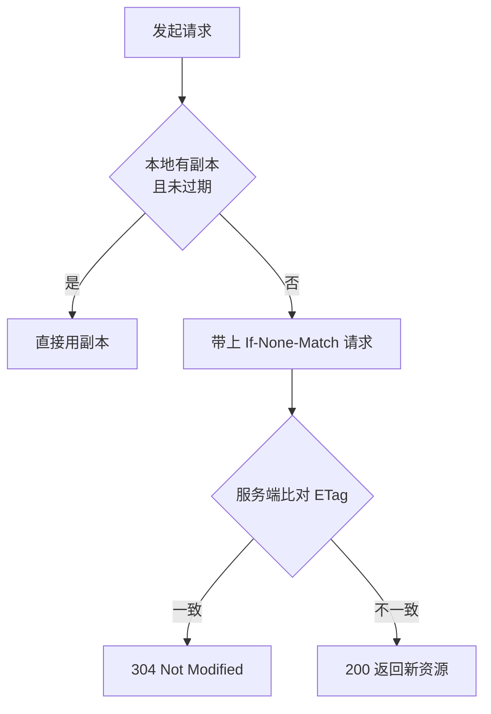

# HTTP

## 思维链路速查

```chain
协议定位与报文 | 请求-响应 · 行头体 | 骨架
方法与状态码 | 语义与结果 | 语义
连接与版本 | 长连接 · HTTP2 · HTTP3 | 演进
缓存与状态 | 强缓存 · Cookie | 加速
面试问答 | 高频考点 | 复盘
```

应用层「请求-响应」协议：先定报文骨架与语义（方法 / 状态码），再看连接与版本如何省 RTT，最后用缓存与 Cookie 补性能与状态。

## 协议定位

| 维度 | HTTP |
|---|---|
| 层次 | 应用层，默认跑在 [[TCP]] 80 端口上（HTTP/3 改跑 QUIC over [[UDP]]） |
| 模式 | 一问一答，客户端主动发起 |
| 状态 | 无状态，每次请求自带全部上下文 |
| 报文 | HTTP/1.x 为纯文本；HTTP/2 起改为二进制分帧 |
| 可靠传输 | 不负责，交给下层 [[TCP]] |
| 安全 | 不负责，明文传输，由 [[HTTPS]] 补上 |

> [!note] 定位
> HTTP 只定义「语义约定」——怎么描述请求、怎么表达结果。可靠、加密、寻址分别由 [[TCP]]、[[HTTPS]]、IP 承担，同属 [[计算机网络]] 分层模型的一环。

> [!tip] 无状态不是缺陷
> 无状态让服务端无需保存每连接上下文，天然易水平扩展。代价是每个请求都要重复携带身份与上下文，于是有了 Cookie / Token。

## 报文结构

| 组成 | 示例 | 说明 |
|---|---|---|
| 请求行 | `GET /api/user HTTP/1.1` | 方法 + 路径 + 版本 |
| 请求头 | `Host` / `Accept` / `Cookie` | 键值元数据，一行一个 |
| 空行 | CRLF | 头与体的分界 |
| 请求体 | JSON / 表单 | GET 通常为空 |

响应报文同构，首行换成状态行 `HTTP/1.1 200 OK`，头部换成 `Content-Type` / `Cache-Control` / `Set-Cookie`。

```http
POST /api/login HTTP/1.1
Host: example.com
Content-Type: application/json
Content-Length: 38

{"username":"ada","password":"••••"}
```

> [!note] 纯文本红利
> HTTP/1.x 报文肉眼可读，`telnet host 80` 手敲请求即可调试；HTTP/2 起改为二进制帧，语义不变但抓包必须用支持 HTTP/2 的解析器。

> [!warning] 定长与分块二选一
> 体长度靠 `Content-Length` 声明，或改用 `Transfer-Encoding: chunked` 分块；两者同时出现会让接收方解析错乱。

## 方法与状态码

| 方法 | 语义 | 安全 | 幂等 |
|---|---|---|---|
| GET | 获取资源 | 是 | 是 |
| HEAD | 只要响应头 | 是 | 是 |
| OPTIONS | 探测支持的方法 / 跨域预检 | 是 | 是 |
| POST | 创建 / 提交，语义由服务端定 | 否 | 否 |
| PUT | 整体替换 | 否 | 是 |
| PATCH | 局部修改 | 否 | 否 |
| DELETE | 删除资源 | 否 | 是 |

> [!note] 安全 ≠ 幂等
> 安全 = 不修改服务端资源；幂等 = 重复执行结果一致。PUT 改数据（不安全）但重复调用结果相同（幂等）；POST 两者都不满足。

| 类别 | 含义 | 高频码 |
|---|---|---|
| 1xx | 继续 / 协议切换 | 101 Switching Protocols（WebSocket 升级） |
| 2xx | 成功 | 200 / 201 Created / 204 No Content |
| 3xx | 重定向 | 301 / 302 / 304 Not Modified |
| 4xx | 客户端错 | 400 / 401 / 403 / 404 / 405 / 429 |
| 5xx | 服务端错 | 500 / 502 / 503 / 504 |

> [!warning] 重定向语义差异
> 301 永久（浏览器缓存跳转，后续直连新址）；302 临时且允许把 POST 降级成 GET；307 / 308 是「保持原方法」的严格版本。要保住 POST 用 307 / 308。

> [!danger] 502 与 504 别混
> 502 Bad Gateway = 网关收到上游的**非法响应**；504 Gateway Timeout = 等上游**超时**。前者查上游是否在重启 / 返回畸形头，后者查上游耗时与超时配置。

## 连接管理

| 形态 | 做法 | 代价 |
|---|---|---|
| 短连接 | 每请求建一次 [[TCP]] 连接 | 三次握手 + 慢启动，RTT 浪费严重 |
| 长连接 | `Connection: keep-alive`，连接复用 | 占服务端 fd，需空闲超时回收 |
| 管道化 | 不等响应连续发多个请求 | 响应须按序返回，队头阻塞，实际被禁用 |
| 多路复用 | HTTP/2 单连接并发多个流 | 传输层仍可能因丢包整体停等 |

> [!danger] 队头阻塞
> 管道化要求响应按请求顺序返回，前一个慢会堵死后面全部请求——这是 HTTP/1.1 管道化在浏览器默认关闭的原因，也是 HTTP/2 引入分帧多路复用的直接动因。

<details>
<summary>展开时序图</summary>



</details>

## 版本演进

| 版本 | 关键变化 | 解决了什么 |
|---|---|---|
| HTTP/1.0 | 每请求一连接，无 Host 头 | 从无到有 |
| HTTP/1.1 | 长连接默认开、Host 头、分块传输、`Cache-Control` | 省掉重复握手 |
| HTTP/2 | 二进制分帧、单连接多路复用、HPACK 头部压缩、服务端推送 | 应用层队头阻塞 |
| HTTP/3 | 跑在 QUIC over [[UDP]] 上，内置 TLS 1.3 | [[TCP]] 层队头阻塞 |

> [!warning] HTTP/2 没解决传输层队头阻塞
> HTTP/2 的多路复用在**一条 TCP 连接**上并行多个流，一旦丢包，[[TCP]] 的按序交付会让所有流一起等重传。HTTP/3 因此抛弃 TCP，改用 QUIC 在 [[UDP]] 上自建可靠与拥塞控制，实现流级独立。

> [!tip] 演进主线一句话
> 一切优化都在减少 RTT 与连接数：1.1 复用连接 → 2 连接内并行 → 3 消除传输层队头阻塞。语义（方法 / 状态码 / 头部）始终保持兼容。

## 缓存机制

| 类型 | 头部 | 是否发请求 |
|---|---|---|
| 强缓存 | `Cache-Control: max-age=...` / `Expires` | 不发，直接用本地副本 |
| 协商缓存 | `ETag` ↔ `If-None-Match`、`Last-Modified` ↔ `If-Modified-Since` | 发，命中返回 304 空体 |

<details>
<summary>展开流程图</summary>



</details>

> [!tip] ETag 优先于 Last-Modified
> `Last-Modified` 只到秒级，一秒内多次修改无法区分；内容未变但时间戳变了也会误判失效。ETag 按内容生成，精度更高。

> [!danger] no-cache ≠ no-store
> `no-cache` = 可以存，但每次必须向服务端校验；`no-store` = 禁止任何存储。涉及敏感信息的响应用 `no-store`，写错等于把隐私写进磁盘缓存。

## 状态管理

无状态协议要保持登录态，靠客户端每次回传凭证：

| 方案 | 凭证放在哪 | 特点 |
|---|---|---|
| Cookie + Session | 浏览器自动带 `Cookie`，服务端存 Session | 服务端有状态，需共享存储 |
| Token / JWT | `Authorization` 头，服务端无状态 | 签发后难即时失效 |

> [!danger] Cookie 三个安全属性
> `HttpOnly` 阻断 JS 读取（防 XSS 窃取）；`Secure` 仅 [[HTTPS]] 传输；`SameSite` 限制跨站携带（防 CSRF）。生产环境三者都要配。

> [!warning] 无状态不等于「服务端什么都不存」
> Token 方案只是把状态挪到了令牌里，黑名单 / 刷新令牌仍需存储。真正消除的是**每连接**状态，不是业务状态。

<details>
<summary>面试问答 (5题)</summary>

Q：HTTP 是无状态的，怎么保持登录？

A：靠客户端每次请求回传凭证。Cookie + Session 由浏览器自动携带 `Cookie`，服务端查 Session；Token / JWT 放在 `Authorization` 头，服务端验签即可，无需查库但难以即时失效。

Q：GET 和 POST 的区别？

A：语义上 GET 是安全且幂等的获取资源，POST 是提交 / 创建；实现上 GET 参数在 URL（长度受限、留在历史记录）、POST 参数在请求体。二者都不安全，明文传输，需要机密性得上 [[HTTPS]]。

Q：HTTP/1.1 和 HTTP/2 的核心差异？

A：HTTP/2 把报文拆成二进制帧，在单条 TCP 连接上并发多个流，解决了应用层队头阻塞；并用 HPACK 压缩头部。但 TCP 层的队头阻塞仍在，故有 HTTP/3 换 QUIC。

Q：301 和 302 的区别？

A：301 永久重定向，浏览器缓存跳转关系后直接访问新地址；302 临时重定向，且允许把 POST 降级为 GET。需要保留原方法时用 307 / 308。

Q：强缓存和协商缓存的区别？

A：强缓存命中不发请求（`Cache-Control: max-age`）；协商缓存必须发请求，服务端比对后返回 304 空体。强缓存优先级更高，过期后才进入协商缓存。

</details>

<details>
<summary>常见误区 (4条)</summary>

- 误区：HTTPS 是另一种协议。实为 HTTP over TLS，方法、状态码、头字段一字未改，只是传输时加密。
- 误区：GET 比 POST 安全。两者都是明文；GET 参数还在 URL 与浏览器历史里，暴露面更大。
- 误区：HTTP/2 彻底解决了队头阻塞。只解决了应用层，TCP 层按序交付导致的多流阻塞要 HTTP/3 才消除。
- 误区：`Cache-Control: no-cache` 等于不缓存。它只是要求每次校验，真正禁止存储的是 `no-store`。

</details>
