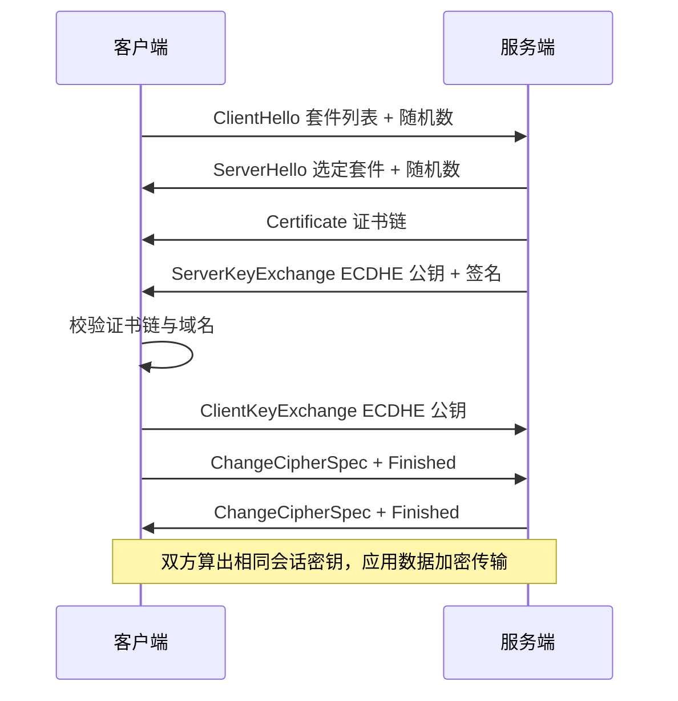

# HTTPS

## 思维链路速查

```chain
安全目标与威胁 | 窃听 · 篡改 · 冒充 | 动因
混合加密体系 | 对称 · 非对称 · 摘要 | 骨架
握手与 TLS 1.3 | 协商 · 密钥 · 省 RTT | 核心
证书与信任链 | 校验四道关 · 吊销 | 信任
性能与面试 | 会话复用 · 高频考点 | 复盘
```

HTTP over TLS：先用混合加密解决窃听与篡改，再用证书链解决冒充，最后用会话复用与 TLS 1.3 把多出来的 RTT 省回去。

## 安全目标与威胁模型

| 威胁 | [[HTTP]] 明文传输的后果 | HTTPS 对策 | 密码学工具 |
|---|---|---|---|
| 窃听 | 中间人直接读出密码、Cookie | 加密 | 对称加密（AES-GCM / ChaCha20-Poly1305） |
| 篡改 | 插入广告、改写金额 | 完整性校验 | AEAD 认证标签 / HMAC |
| 冒充 | 伪装成目标站骗取凭证 | 身份认证 | 证书 + CA 签名 |

> [!note] 定位
> HTTPS 不是新协议，而是 [[HTTP]] 跑在 TLS 之上：应用层语义一字未改，只在应用层与 [[TCP]] 之间插入 TLS 层做加密与认证。默认端口 443。

> [!danger] 只加密不认证 = 白加
> 少了证书校验，攻击者可以把自己伪装成服务端、分别与双方握手（中间人攻击），两端都「加密」却全被看光。身份认证与加密同等重要。

## 加密体系

| 类别 | 算法 | 用途 | 性能 |
|---|---|---|---|
| 对称加密 | AES-GCM、ChaCha20-Poly1305 | 加密应用数据 | 快，有 AES-NI 硬件加速 |
| 非对称加密 | RSA、ECDHE、ECDSA | 握手期身份认证与密钥协商 | 慢 2~3 个数量级 |
| 摘要 | SHA-256、SHA-384 | 证书签名、密钥派生 PRF | 快 |

> [!tip] 混合加密
> 非对称加密只用来「安全地约出一把对称会话密钥」，之后全部应用数据走对称加密。既避免非对称的性能灾难，又解决了对称密钥分发难题。

> [!warning] 为什么不全用非对称
> 一是慢，二是 RSA 密钥交换无前向安全：服务器私钥一旦泄露，历史抓包流量可被全部解密。现代套件只用 ECDHE。

## TLS 握手

以 TLS 1.2 + ECDHE 为准：

| 步骤 | 报文 | 内容 |
|---|---|---|
| 1 | ClientHello | 支持的 TLS 版本、密码套件列表、随机数、SNI |
| 2 | ServerHello | 选定的版本与套件、随机数 |
| 3 | Certificate | 服务器证书链 |
| 4 | ServerKeyExchange | ECDHE 临时公钥 + 签名 |
| 5 | ClientKeyExchange | 客户端 ECDHE 临时公钥 |
| 6 | ChangeCipherSpec / Finished | 双方切换密文并校验握手完整性 |

<details>
<summary>展开时序图</summary>



</details>

> [!note] 密钥怎么算出来的
> 双方各生成临时 ECDHE 密钥对，交换公钥后各自用「自己的私钥 + 对方公钥」算出同一个共享密钥，再混入两个随机数派生会话密钥。私钥从不上传，故有前向安全（PFS）。

> [!warning] 随机数防重放
> 客户端与服务端各出一个随机数参与密钥派生，保证每次会话密钥不同，录制的握手无法重放。

## TLS 1.3

| 差异 | TLS 1.2 | TLS 1.3 |
|---|---|---|
| 握手 RTT | 2-RTT | 1-RTT，会话复用 0-RTT |
| 密钥交换 | 支持 RSA、静态 DH | 只剩 (EC)DHE，强制前向安全 |
| 加密范围 | ServerHello 后部分明文 | 握手报文尽早加密，证书也加密 |
| 密码套件 | 含 CBC、SHA-1、RC4 等弱算法 | 只保留 AEAD 套件 |
| 协商方式 | 先协商再握手 | 首轮即带密钥共享，合并往返 |

> [!tip] RTT 怎么省掉的
> 1.3 让客户端在 ClientHello 里直接猜一个套件并附上密钥共享，服务端一次回包即可完成协商与认证，把 2-RTT 压到 1-RTT。猜错则用 HelloRetryRequest 纠正。

> [!danger] 0-RTT 不抗重放
> 0-RTT 数据在首个往返就发送，攻击者可截获后重放。只用于幂等请求（GET 静态资源），下单、转账类非幂等操作禁用。

## 证书与信任链

| 组成 | 内容 |
|---|---|
| 证书字段 | 域名、公钥、签发者、有效期、签名算法、签名值 |
| 信任链 | 根 CA（预置在系统/浏览器）→ 中间 CA → 服务器证书 |
| 吊销查询 | CRL、OCSP、OCSP Stapling |

```chain
有效期检查 | 是否过期 | 第一道
签发链回溯 | 逐层验签至根 CA | 第二道
域名匹配 | 证书 SAN 是否含访问域名 | 第三道
吊销状态 | CRL / OCSP 是否已被吊销 | 第四道
```

> [!note] 信任的根在哪
> 根 CA 证书预置在操作系统或浏览器里，是信任的锚点。自签证书不在信任库中，所以浏览器告警——它无法回溯到任何已知可信根。

> [!danger] 证书告警别乱点「继续访问」
> 域名不匹配、证书过期、链不完整都可能是真的在中间人攻击。点了继续就等于主动放弃身份认证，加密仍在但对面是谁已无从确认。

> [!tip] OCSP Stapling
> 由服务器定期取回 CA 的吊销响应并「订」在握手报文里一并返回，客户端不必自己去问 CA——既省一次外部请求，也避免 CA 被拖垮时的可用性问题。

## 性能优化

| 手段 | 省下什么 |
|---|---|
| 会话复用 Session ID / Session Ticket | 省掉完整握手，回到 1-RTT |
| TLS 1.3 + 0-RTT | 首个应用数据即随握手发出 |
| OCSP Stapling | 省一次 CA 查询往返 |
| HSTS | 省掉 80 → 443 的那次重定向 |
| ECC 证书 | 同等安全下密钥更短、签名更快、报文更小 |

> [!note] 开销到底在哪
> 现代 CPU 有 AES-NI，对称加密几乎免费；真正的成本是握手的 1~2 个 RTT 与非对称运算。所以优化方向是「少握手、快握手」，而非削弱加密强度。

> [!warning] HSTS 的单向门
> 一旦下发 `Strict-Transport-Security`，浏览器在 max-age 内强制走 HTTPS，此期间证书出问题用户无法跳过。上线前先确认证书与链路稳定，max-age 从小到大放。

## 抓包与调试

| 场景 | 手段 |
|---|---|
| 看握手过程 | Wireshark 过滤 `tls`，ClientHello / 证书 / 告警都可见 |
| 看明文内容 | 配置 `SSLKEYLOGFILE` 导出会话密钥，或用代理工具（Charles / mitmproxy）并安装其根证书 |
| 验证配置 | `openssl s_client -connect host:443`、SSL Labs 评级 |

> [!warning] 装了代理根证书 = 主动开后门
> 抓包工具能解密是因为你信任了它的根证书。调试完务必从系统信任库移除，长期留着等于给任意中间人发了通行证。

<details>
<summary>面试问答 (5题)</summary>

Q：HTTPS 是怎么保证安全的？

A：三个目标对应三套机制——对称加密保证机密性，AEAD / MAC 保证完整性，证书 + CA 签名保证身份认证。密钥通过非对称加密在握手期安全协商出来。

Q：为什么不全程用非对称加密？

A：非对称运算慢 2~3 个数量级，且 RSA 密钥交换无前向安全（私钥泄露后历史流量可被解密）。混合加密只在握手期用非对称，数据全走对称，兼顾安全与性能。

Q：TLS 握手里证书起什么作用？

A：证明「你连的服务器确实持有该域名的私钥」。客户端用预置的根 CA 公钥逐层验签回溯到根，并校验域名与有效期；任何一环不过就告警。

Q：中间人攻击如何发生，HTTPS 怎么防？

A：攻击者冒充服务端与客户端握手。HTTPS 靠证书链校验阻断——攻击者拿不到受信任 CA 签发的该域名证书，握手即失败，除非用户手动信任了伪造证书。

Q：TLS 1.3 相比 1.2 主要改了什么？

A：握手从 2-RTT 降到 1-RTT（会话复用 0-RTT），废除 RSA 与静态 DH 强制前向安全，删除 CBC / SHA-1 等弱算法只留 AEAD，并尽早加密握手报文。

</details>

<details>
<summary>常见误区 (4条)</summary>

- 误区：HTTPS 绝对安全。它防的是传输链路上的窃听、篡改与冒充；服务器被入侵、应用有 XSS / SQL 注入，HTTPS 一概不管。
- 误区：HTTPS 无法被抓包。装了抓包工具的根证书后就能解密——能解密的前提是「你信任了它」，而非协议有漏洞。
- 误区：有证书就等于身份认证通过。还要校验域名匹配、有效期、签发链与吊销状态；任一不过浏览器仍会告警。
- 误区：HTTPS 很慢。真正的开销是握手 RTT，加密本身的 CPU 成本在 AES-NI 下可忽略；会话复用与 TLS 1.3 已把 RTT 压到 1 甚至 0。

</details>
