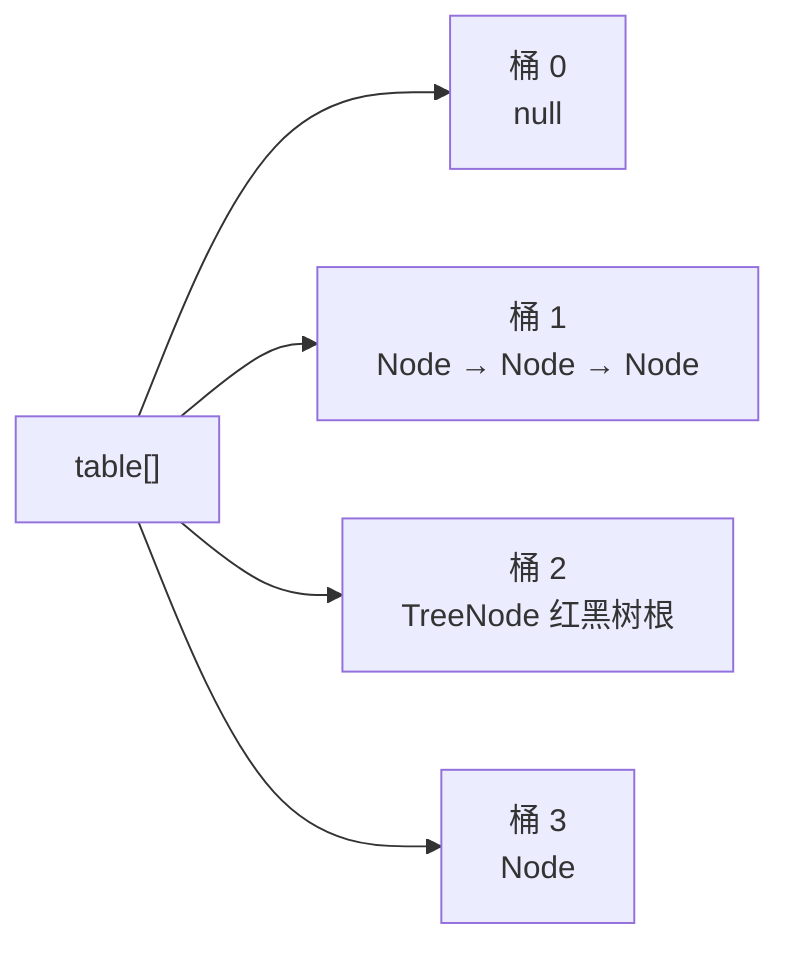

# HashMap

## 思维链路速查

```chain
底层结构 | 数组 + 链表 + 红黑树 | 起点
哈希与寻址 | 扰动与 (n-1) & hash | 定位
put 与树化 | 插入路径与阈值 | 核心
扩容与 1.7 成环 | 高位拆分 / 头插倒序 | 代价
落地：key 的约定 | hashCode/equals 与初始容量 | 实战
```

一张哈希表只回答三件事：键怎么变成下标（**哈希 + 寻址**）、撞车了怎么办（**拉链 → 树化**）、装不下了怎么办（**翻倍扩容**）。容量恒取 2 的幂、扰动函数、负载因子 0.75、树化阈值 8，每一处都是为这三件事压低最坏情况。其中树化、尾插、高位拆分都是 1.8 才有的；1.7 及之前是纯拉链版本（无树 + 头插 + 迁移时逐个重算下标），末尾单列一节对照两者。

## 底层结构：数组 + 链表 + 红黑树

| 组成 | 类型 | 解决什么 |
|---|---|---|
| 桶数组 | `Node<K,V>[] table` | 下标直达，定位 O(1) |
| 桶内链表 | 单向 `Node` | 拉链法化解哈希冲突 |
| 红黑树 | `TreeNode` | 冲突严重时查 O(log n) |

- `Node` 四件套：`hash` / `key` / `value` / `next`；桶里存的是**节点的引用**，冲突节点串成一条链。
- **1.7 及之前只有两件套**：数组 + 单向链表，没有红黑树；节点类型叫 `Entry`（1.8 才改名 `Node`，字段同样是 `hash/key/value/next`），所以老资料里的「Entry 数组」就是 1.8 的 `table`。
- `TreeNode` 继承 `LinkedHashMap.Entry` → `HashMap.Node`，树化的同时还保留 `next` 链，所以**树化后仍能按原链表顺序遍历**，退化也只需拆回链表。
- 默认：初始容量 **16**、负载因子 **0.75**（阈值 12）、树化阈值 **8**、退化阈值 **6**、最小树化容量 **64**。

<details>
<summary>展开桶结构图</summary>



</details>

> [!note] 树化不是替换掉链表
> `TreeNode` 同时是树节点和链表节点：红黑树用于查找，那条 `next` 链用于遍历与退化，两套结构并存。

## 哈希与寻址：容量为什么是 2 的幂

```java
static final int hash(Object key) {
    int h;
    return (key == null) ? 0 : (h = key.hashCode()) ^ (h >>> 16);   // 扰动
}
int i = (n - 1) & hash;                                            // 寻址，n = table.length
```

- **扰动**：把高 16 位异或进低 16 位。表长较小时 `(n-1) & hash` 只吃得下低位，不扰动的话高位差异全被截掉，冲突率飙升。
- **寻址**：`n` 是 2 的幂时，`(n-1) & hash` 与 `hash % n` 等价，而位运算快得多——这就是容量必须是 2 的幂的原因；不是 2 的幂时该等式不成立。
- **构造参数会被取整**：`new HashMap<>(1000)` 内部走 `tableSizeFor` 向上取到 ≥1000 的最小 2 的幂（1024），且首次 `put` 才真正建表。
- **null key**：`hash` 固定为 0，永远落在 0 号桶（1.7 走 `putForNullKey` 单独处理，同样落在 `table[0]`）。
- **1.7 的扰动更重**：要 XOR 上 `hashSeed` 再做四轮位移异或，1.8 简化成一次。

```java
// JDK 7：hashSeed 来自 alternative hashing（默认 0）；开启且 key 是 String 时走 stringHash32
final int hash(Object k) {
    int h = hashSeed;
    if (0 != h && k instanceof String) return sun.misc.Hashing.stringHash32((String) k);
    h ^= k.hashCode();
    h ^= (h >>> 20) ^ (h >>> 12);
    return h ^ (h >>> 7) ^ (h >>> 4);
}
static int indexFor(int h, int length) { return h & (length - 1); }   // 与 1.8 的寻址同形
```

> [!tip] 1.8 为什么只扰动一次
> 1.7 默认路径要 XOR 上 `hashSeed` 并做四轮位移异或；1.8 有红黑树兜住最坏冲突，而扰动是**每个 key 每次操作都要付**的成本，于是一次异或性价比最高。

## put 与树化

```chain
表未建 | 首次 put → resize 建 16 | 初始化
桶为空 | 直接放首节点 | 无冲突
桶非空 | 先比 hash 再 equals | 命中覆盖
未命中 | 尾插到链尾 | 1.8 尾插
插完 | 过长则树化 / 超限则扩容 | 收尾
```

- **判重顺序**：`e.hash == hash && (key == e.key || key.equals(e.key))`——hash 不同直接跳过 `equals`，省掉昂贵的比较。
- **尾插**：1.8 把 1.7 的头插改成尾插。头插把新节点放到链头，扩容迁移后**同一新桶内的相对顺序被反转**，并发 resize 时正是这一反转让链表首尾互指成环（见下节）。
- **树化判定**：插入后若链上已有 8 个节点（源码 `binCount >= TREEIFY_THRESHOLD - 1`，`binCount` 从头节点按 0 起算，即正在插入第 9 个）→ 调 `treeifyBin`；`treeifyBin` 里还要过一道：表长 < 64 就**只扩容不树化**。
- **退化阈值 6**：与树化的 8 之间留 2 的缓冲带（迟滞），避免在临界点反复互转；扩容拆分时子树 ≤ 6 也会退化成链表。
- **阈值 8 的依据**：源码注释按泊松分布（λ=0.5）估算，桶中元素数达到 8 的概率约 **0.00000006**（千万分之六）——正常散列几乎撞不出来，撞出来多半是哈希攻击。

> [!warning] 「链表长度 ≥ 8 就树化」是简化说法
> 精确看：一是**插入第 9 个节点时**才调 `treeifyBin`（`binCount` 从头节点按 0 计），二是**表长 ≥ 64** 才真的树，否则优先扩容把链表稀释。

## 扩容：翻倍与高位拆分

- 触发：`++size > threshold`（`threshold = 容量 × 负载因子`），1.8 是**先插入再判扩容**（1.7 是先扩容再插）。
- 翻倍：`newCap = oldCap << 1`；新阈值 = 新容量 × 0.75。
- **高位拆分**（1.8 的优化）：元素的新下标只有两种可能——**原下标**或**原下标 + oldCap**，判据是 `e.hash & oldCap`：结果为 0 留在原地，否则搬到 `原下标 + oldCap`。原理：容量翻倍后掩码 `(n-1)` 多出一位，那一位恰好是 `oldCap`，所以**不需要重新计算 hash**。
- 拆分时按 `lo` / `hi` 两条链拼接并保持**原有顺序**，链表不会被倒序。
- **1.7 的迁移（`transfer`）**：逐桶遍历，每个节点用 `indexFor(e.hash, newCapacity)` **重算下标**后头插进新桶——下标每个都要算一遍（不是重算 `hashCode`，`rehash=true` 只在开启 alternative hashing、`hashSeed` 变化时才成立），且同一新桶内顺序被反转。1.8 的高位拆分把这两笔代价都省了。
- 代价 O(n)：能预估规模就给初始容量，把扩容次数降到 0。

> [!note] 负载因子为什么是 0.75
> 时间与空间的折中：太小则频繁扩容、空闲槽多；太大则冲突加剧、链表变长。0.75 是官方按哈希分布实测取的平衡点，非特殊场景不建议改。

## 版本演进：1.7 与 1.8 的五处改动

1.8 几乎是一次重写，面试问「1.8 优化了什么」考的就是这张表：

| 维度 | 1.7 及之前 | 1.8 |
|---|---|---|
| 结构 | `Entry[]` + 单向链表 | `Node[]` + 链表 + 红黑树 |
| 扰动 | `hashSeed` + 四轮位移异或 | 一次 `h ^ (h >>> 16)` |
| 插入 | 头插（新节点进链头） | 尾插 |
| 扩容选址 | 每个节点 `indexFor` 重算下标 | 只判 `hash & oldCap` 一位 |
| 扩容时机 | 先扩容再插（`size >= threshold` 且目标桶非空） | 先插入再扩容（`++size > threshold`） |
| 最坏查找 | O(n)，能被碰撞攻击打爆 | O(log n) |

### 死链：头插遇上并发 transfer

```java
// JDK 7 HashMap#transfer：逐桶头插迁移
void transfer(Entry[] newTable, boolean rehash) {
    for (Entry<K,V> e : table) {
        while (null != e) {
            Entry<K,V> next = e.next;                    // ① 记住后继
            if (rehash) e.hash = null == e.key ? 0 : hash(e.key);
            int i = indexFor(e.hash, newCapacity);
            e.next = newTable[i];                        // ② 头插
            newTable[i] = e;
            e = next;
        }
    }
}
```

设某桶里是 `a → b → c`，两个线程同时 `resize`，且三者在新表仍落同一个桶：

1. T1 执行完 ①（`e = a`、`next = b`）后被挂起；
2. T2 跑完整个 transfer，头插让新桶变成 `c → b → a`；
3. T1 恢复，按自己记住的 `next` 继续头插：`a.next = c`，于是 `a → c → b → a` 首尾互指成环。此后 `get` 落进这个桶就沿环无限遍历，CPU 打到 100%（T1 的 `while` 也可能因为 `e` 在 a/b/c 之间打转而当场退不出去）。

> [!warning] 成环要两个条件同时成立
> 一是**多线程同时 resize**，二是**头插倒序**把已迁移节点的 `next` 指回前面的节点。1.8 改尾插后相对顺序不再反转，这一步不再成环。

> [!note] 1.7 还有一条缓解碰撞攻击的路子
> 没有红黑树时最坏查找是 O(n)，构造一堆同 hash 的 key 就能把服务端打爆（哈希碰撞 DoS）。1.7 因此加了 alternative hashing（`-Djdk.map.althashing.threshold`）：随机 `hashSeed` 参与所有 key 的哈希，String 另走 Murmur 版 `stringHash32`，让攻击者无法预判桶位；1.8 用红黑树把最坏情况压到 O(log n)，这套开关随之废弃。

### 线程不安全：1.7 死链与 1.8 丢数据

| 版本 | 插入法 | 并发扩容的后果 |
|---|---|---|
| 1.7 | 头插 | 链表倒序互指**成环**，`get` 死循环（CPU 打满） |
| 1.8 | 尾插 | 不成环，但并发 `put` 会**覆盖丢失**、`size` 计数不准 |

> [!danger] 尾插只治了死循环，没治线程安全
> HashMap 从头到尾都不保证并发安全：并发 `put` 相互覆盖、`size` 自增非原子，迭代中还改结构会触发 fail-fast（同 [[ArrayList 与 LinkedList]] 的 `modCount` 机制）。要并发就上 [[ConcurrentHashMap]]。

## 落地：key 的约定与初始容量

> [!danger] 作 key 的对象必须同时正确重写 `hashCode` 与 `equals`
> 两方法要用**同一组字段**，且这些字段**不可变**：put 之后改了参与哈希的字段，再 `get` 会算到另一个桶，原条目永远取不回来（等于内存泄漏）。

```java
// 预估 1000 条：给初始容量，避免多轮 resize（1000 / 0.75 + 1 ≈ 1335 → 内建表 2048）
Map<Long, Order> m = new HashMap<>(1335);

// 自定义 key：equals 与 hashCode 用同一组 final 字段
final class UserKey {
    private final long tenantId, userId;
    @Override public boolean equals(Object o) {
        if (this == o) return true;
        if (!(o instanceof UserKey)) return false;
        UserKey k = (UserKey) o;
        return tenantId == k.tenantId && userId == k.userId;
    }
    @Override public int hashCode() {
        return 31 * Long.hashCode(tenantId) + Long.hashCode(userId);
    }
}
```

> [!tip] 为什么 `String` 天然适合做 key
> 不可变（哈希值不会变），且内部缓存了 `hash` 字段，重复计算不花钱。

<details>
<summary>面试问答 (8题)</summary>

Q：HashMap 的底层结构？

A：数组 + 链表 + 红黑树（JDK 8+）。`Node<K,V>[] table` 作桶数组，`(n-1) & hash` 定位；冲突拉成链；链表过长且表长 ≥ 64 时树化为红黑树，把查找从 O(n) 降到 O(log n)。（1.7 及之前只有 `Entry[]` + 链表，没有树。）

Q：1.8 相比 1.7 改了什么？

A：五处——①结构引入红黑树；②扰动从 `hashSeed` + 四轮位移简化为一次 `h ^ (h >>> 16)`；③插入从头插改尾插，治掉并发扩容成环；④扩容不再逐节点重算下标，改判 `hash & oldCap` 一位；⑤扩容时机从「先扩容再插」改为「先插入再扩容」。

Q：1.7 并发扩容的死循环是怎么形成的？

A：`transfer` 头插迁移会把同一新桶内的顺序反转。T1 取完 `next` 后挂起，T2 跑完把链倒成 `c → b → a`；T1 恢复后按旧 `next` 继续头插，把 `a.next` 指向 `c`，链变成 `a → c → b → a` 首尾互指；此后 `get` 落进该桶就沿环无限遍历，CPU 打满。

Q：为什么容量必须是 2 的幂？

A：一是 `(n-1) & hash` 才能在数学上等价于 `hash % n`，用位运算替代取模；二是扩容时新增的掩码位就是 `oldCap` 那一位，元素新位置只可能是原位置或原位置 + oldCap，无需重算 hash。传进来的初始容量会被 `tableSizeFor` 向上取整到 2 的幂。

Q：为什么不一开始就用红黑树？

A：树节点比普通节点更大（要存父/左/右/颜色），维护也要旋转；按泊松分布，桶长到 8 的概率仅约千万分之六，为小概率事件长期付代价不划算——所以默认链表，冲突真的严重了才树化。

Q：扩容时元素怎么搬？

A：1.8 不重新 hash，而是按 `e.hash & oldCap` 把每个桶拆成低位链（留原下标）和高位链（下标 + oldCap），两条链一次接到位，且保持原有顺序。

Q：HashMap 为什么线程不安全？

A：1.7 头插并发扩容会让链表成环导致 `get` 死循环；1.8 改尾插不成环了，但并发 `put` 仍会互相覆盖、`size` 计数不准。要并发用 `ConcurrentHashMap`。

Q：hashCode 与 equals 的约定？

A：`equals` 相等则 `hashCode` 必须相等（否则同键存入不同桶，查不回来）；反过来不要求。两者要用同一组字段，且字段在放入后不可变。

</details>

<details>
<summary>常见误区 (7条)</summary>

- 误区：「HashMap 无序」= 随机序。顺序由 hash 与容量决定，同一批 key 在同一张表里顺序是**稳定**的，只是不按插入序；要插入序用 `LinkedHashMap`，要排序用 `TreeMap`。
- 误区：链表到 8 就一定树化。还要表长 ≥ 64，否则 `treeifyBin` 选择扩容来稀释冲突。
- 误区：传了初始容量 1000 就是 1000 个桶。会被 `tableSizeFor` 取整到 1024，且扩容阈值是 1024 × 0.75 = 768，不是 1000。
- 误区：扩容就是重新 hash 一遍。1.8 是高位拆分，只判一位、不重算 hash；1.7 也只是对每个节点**重算下标**（`indexFor`），`hashCode` 仅在 `rehash=true`（开了 alternative hashing 且 `hashSeed` 变化）时才重算。
- 误区：1.8 的 HashMap 并发下只是丢数据。丢数据是常态，1.7 还会链表成环把 CPU 跑到 100%。
- 误区：1.7 到 1.8 只是加了红黑树。一共五处改动：结构、扰动次数、头插变尾插、扩容选址、扩容时机，红黑树只是最容易想起来的那一处。

</details>
