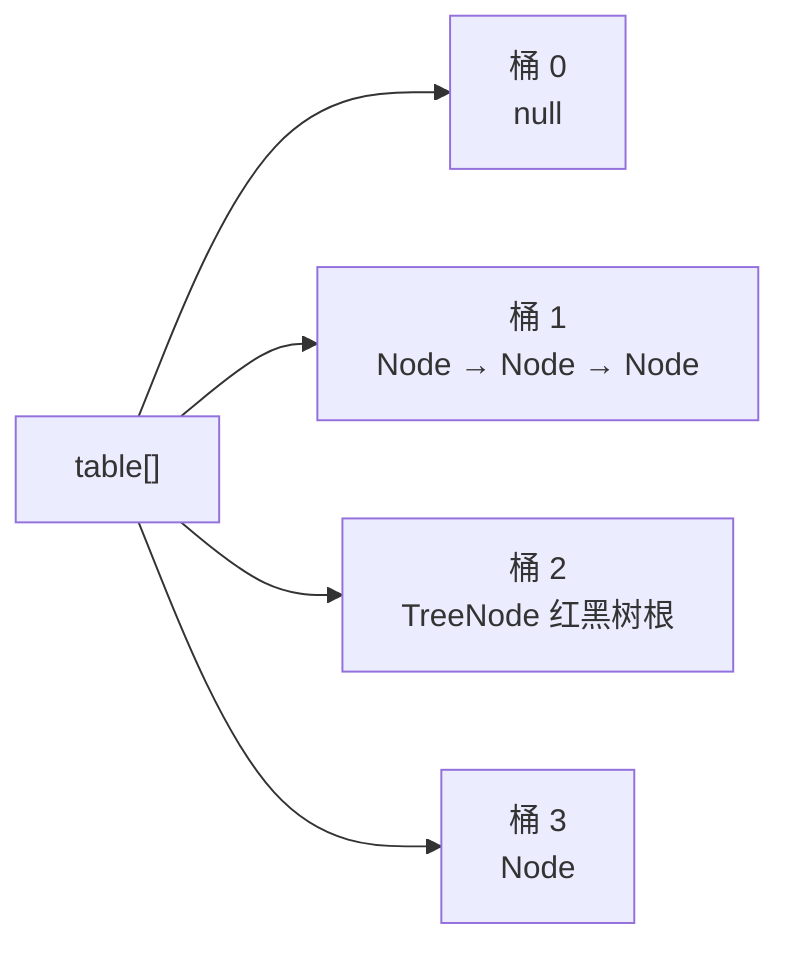

# HashMap

:::lede
HashMap 是基于哈希表的 `Map` 实现，允许 null 键与 null 值，不保证顺序、也不做同步。
它以 `hashCode` 定位桶、以 `equals` 判等，冲突链过长时树化。
**分界：** 顺序归 LinkedHashMap / TreeMap · 并发归 [[ConcurrentHashMap]]
:::

## 思维链路速查

```chain
底层结构 | 数组 + 链表 + 红黑树 | 起点
哈希与寻址 | 扰动与 (n-1) & hash | 定位
put 与树化 | 插入路径与阈值 | 核心
扩容与 1.7 成环 | 高位拆分 / 头插倒序 | 代价
落地：key 的约定 | hashCode/equals 与初始容量 | 实战
```

一张哈希表只回答三件事：键怎么变成下标、撞车了怎么办、装不下了怎么办——下面每处设计都在为这三件事压低最坏情况。

## 核心结论速查

| 问题 | 结论 | 关键数字 |
|---|---|---|
| 底层结构 | `Node[]` 桶数组 + 链表 + 红黑树 | 1.7 无树 |
| 键怎么定位 | `(n-1) & (h ^ (h>>>16))`，容量取 2 的幂才等价于取模 | 初始 16 |
| 撞车怎么办 | 拉链法；过长树化，否则扩容稀释 | 树化 8 / 退化 6 / 最小树化容量 64 |
| 装不下怎么办 | 容量翻倍，元素只可能留原下标或移到「原下标 + oldCap」 | 负载因子 0.75 |
| 复杂度 | 平均 O(1) | 最坏 O(log n)，1.7 最坏 O(n) |

<details>
<summary>展开结构与默认参数</summary>

- `Node` 四件套 `hash` / `key` / `value` / `next`；桶里存的是节点引用，冲突节点串成一条链。
- **1.7 及之前只有数组 + 单向链表**，节点类型叫 `Entry`（字段同为 `hash/key/value/next`），没有红黑树。
- `TreeNode` 继承 `LinkedHashMap.Entry` → `HashMap.Node`，树化后仍保留 `next` 链：查找走树，遍历与退化走链，两套结构并存。
- 默认：初始容量 **16**、负载因子 **0.75**（阈值 12）、树化阈值 **8**、退化阈值 **6**、最小树化容量 **64**。



</details>

## 哈希与寻址：容量为什么是 2 的幂

```java
static final int hash(Object key) {
    int h;
    return (key == null) ? 0 : (h = key.hashCode()) ^ (h >>> 16);   // 扰动
}
int i = (n - 1) & hash;                                            // 寻址，n = table.length
```

- **扰动**：把高 16 位异或进低 16 位——表长较小时 `(n-1) & hash` 只吃得下低位，不扰动则高位差异全被截掉，冲突率飙升。
- **寻址**：`n` 取 2 的幂，`(n-1) & hash` 才等价于 `hash % n`，位运算快得多；这就是容量必须取 2 的幂的原因。
- **构造参数会取整**：`new HashMap<>(1000)` 经 `tableSizeFor` 上取到 1024，阈值随之 768（不是 1000 × 0.75），首次 `put` 才建表；null key 的 `hash` 固定为 0，永远落 0 号桶。

## put 与树化

```chain
表未建 | 首次 put → resize 建 16 | 初始化
桶为空 | 直接放首节点 | 无冲突
桶非空 | 先比 hash 再 equals | 命中覆盖
未命中 | 尾插到链尾 | 1.8 尾插
插完 | 过长则树化 / 超限则扩容 | 收尾
```

- **判重顺序**：`e.hash == hash && (key == e.key || key.equals(e.key))`——hash 不同直接跳过 `equals`。
- **尾插**：1.8 把 1.7 的头插改成尾插；头插会让迁移后同一新桶内的相对顺序反转，并发 resize 正是这一反转让链首尾互指成环。
- **树化判定**：插入后链上已有 8 个节点（源码 `binCount >= TREEIFY_THRESHOLD - 1`，即正插第 9 个）才调 `treeifyBin`；表长 < 64 时只扩容、不树化。退化阈值 **6** 与 8 之间留 2 的缓冲带（迟滞），避免临界点反复互转，扩容拆分时子树 ≤ 6 也退化成链表。
- **阈值 8 的依据**：源码注释按泊松分布（λ=0.5）估算，桶中元素数达 8 的概率约 **0.00000006**（千万分之六）——正常散列几乎撞不出来，撞出来多半是哈希攻击。

## 扩容：翻倍与高位拆分

- 触发：`++size > threshold`（`threshold = 容量 × 负载因子`）；翻倍 `newCap = oldCap << 1`，新阈值 = 新容量 × 0.75。
- **高位拆分**：元素新下标只可能是原下标或原下标 + oldCap，判据 `e.hash & oldCap`——为 0 留原地，否则搬到 原下标 + oldCap。原理：容量翻倍后掩码 `(n-1)` 多出一位，那一位恰好是 `oldCap`，所以不需要重算 hash；拆分按 `lo` / `hi` 两条链拼接并保持原有顺序。
- **1.7 的迁移**：逐桶遍历，每个节点用 `indexFor(e.hash, newCapacity)` 重算下标（不是重算 `hashCode`）后头插进新桶，同一新桶内顺序被反转。1.8 的高位拆分把这两笔代价都省了。
- 代价 O(n)：能预估规模就给初始容量，把扩容次数降到 0。

> [!note] 负载因子为什么是 0.75
> 时间与空间的折中：太小则频繁扩容、空闲槽多，太大则冲突加剧、链表变长。0.75 是官方按哈希分布实测取的平衡点，非特殊场景不建议改。

## 版本对照：1.7 与 1.8

| 维度 | 1.7 及之前 | 1.8 |
|---|---|---|
| 结构 / 插入 | `Entry[]` + 单向链表，头插（新节点进链头） | `Node[]` + 链表 + 红黑树，尾插 |
| 扰动 | `hashSeed` + 四轮位移异或 | 一次 `h ^ (h >>> 16)` |
| 扩容 | 先扩容再插；每个节点 `indexFor` 重算下标 | 先插入再扩容；只判 `hash & oldCap` 一位 |
| 最坏查找 | O(n)，能被碰撞攻击打爆 | O(log n) |

<details>
<summary>展开 1.7 成环的三步推演</summary>

设某桶里是 `a → b → c`，两个线程同时 `resize`，且三个节点在新表仍落同一个桶：

1. T1 记下 `e = a`、`next = b` 后被挂起；
2. T2 跑完整个 transfer，头插让新桶变成 `c → b → a`；
3. T1 恢复后按自己记下的 `next` 继续头插：`a.next = c`，链变成 `a → c → b → a` 首尾互指；此后 `get` 落进这个桶就沿环无限遍历，CPU 打满。

</details>

> [!danger] 尾插只治了死循环，没治线程安全
> 成环要**多线程同时 resize**与**头插倒序**同时成立，1.8 改尾插后不再反转，也就不会成环；但并发 `put` 仍会相互覆盖、`size` 计数不准，迭代中改结构会触发 fail-fast（同 [[ArrayList 与 LinkedList]] 的 `modCount` 机制）。要并发就上 [[ConcurrentHashMap]]。

## 落地：key 的约定与初始容量

> [!danger] 作 key 的对象必须同时正确重写 `hashCode` 与 `equals`
> 两方法要用**同一组字段**，且这些字段**不可变**：put 之后改了参与哈希的字段，再 `get` 会算到另一个桶，原条目永远取不回来（等于内存泄漏）。

```java
// 预估 1000 条：给初始容量，避免多轮 resize（1000 / 0.75 + 1 ≈ 1335 → 内建表 2048）
Map<Long, Order> m = new HashMap<>(1335);
```

- 自定义 key 时，`equals` 与 `hashCode` 用同一组 `final` 字段；`String` 天然适合做 key——不可变（哈希值不会变），且内部缓存了 `hash` 字段，重复计算不花钱。

<details>
<summary>面试问答 (3题)</summary>

Q：为什么不一开始就用红黑树？

A：树节点比普通节点更大（要存父/左/右/颜色），维护也要旋转；而桶长到 8 的概率仅约千万分之六，为小概率事件长期付代价不划算。

Q：为什么容量必须是 2 的幂？

A：一是 `(n-1) & hash` 才能等价于 `hash % n`，用位运算替代取模；二是扩容时新增的掩码位就是 `oldCap`，元素新位置只可能是原位置或原位置 + oldCap，无需重算 hash。

Q：hashCode 与 equals 的约定？

A：`equals` 相等则 `hashCode` 必须相等（否则同键存入不同桶，查不回来）；反过来不要求。两者要用同一组字段，且字段放入后不可变。

</details>

<details>
<summary>常见误区 (3条)</summary>

- 误区：「HashMap 无序」= 随机序。顺序由 hash 与容量决定，同一批 key 在同一张表里顺序是**稳定**的，只是不按插入序；要插入序用 `LinkedHashMap`，要排序用 `TreeMap`。
- 误区：链表到 8 就一定树化。还要正插第 9 个节点且表长 ≥ 64，否则 `treeifyBin` 选择扩容来稀释冲突。
- 误区：扩容就是重新 hash 一遍。1.8 只判 `hash & oldCap` 一位，不重算 hash；1.7 也只是对每个节点重算下标，不重算 `hashCode`。

</details>
