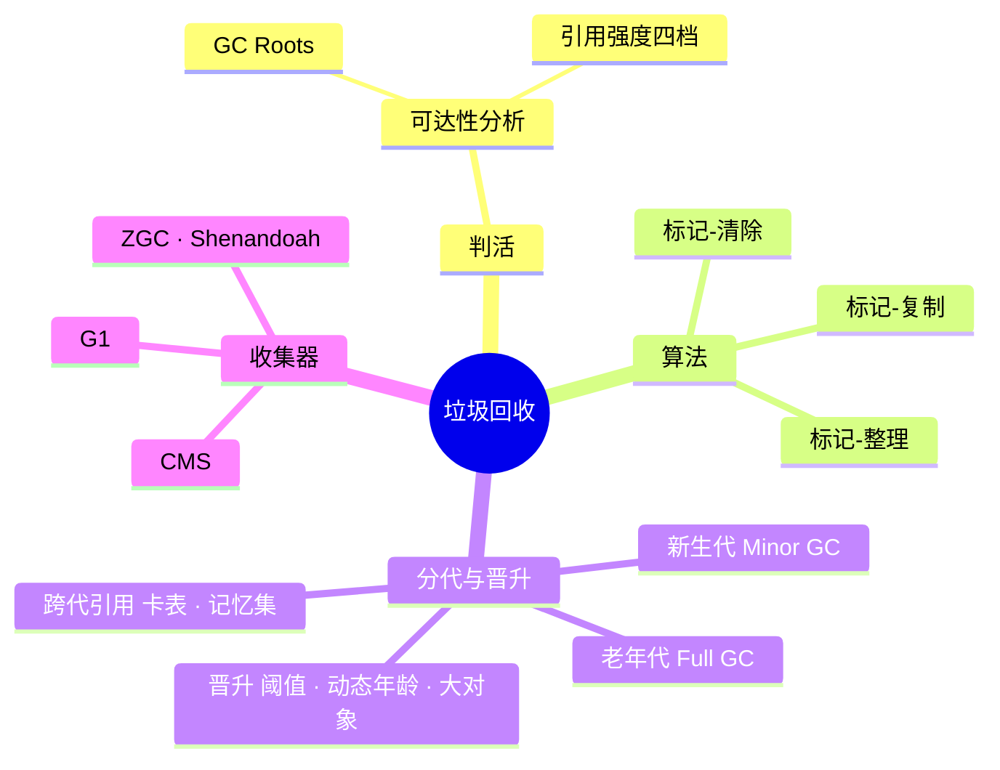
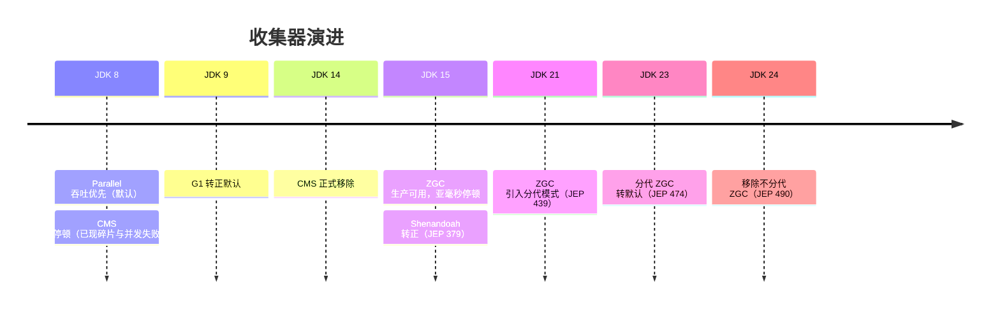

# JVM 垃圾回收

## 思维链路速查

```chain
判活 | 谁算垃圾 | 根基
回收算法 | 清除 · 复制 · 整理 | 手段
收集器演进 | 吞吐 → 低延迟 | 落地
调优与排障 | 日志 · 症状 | 收尾
面试问答 | 高频考点 | 复盘
```

先定「谁是垃圾」（GC Roots 可达性）→ 分代假设决定每代用哪种算法 → 收集器沿「吞吐优先 → 低延迟」一路演进 → 最后落到 GC 日志与症状排查。

## 判活：谁算垃圾

| 判活方案 | 原理 | 缺陷 | 采用方 |
|---|---|---|---|
| 引用计数 | 对象被引用 +1，引用断开 -1，为 0 即回收 | 循环引用永不归零；不能移动对象 | Python / COM 计数打底；[[JVM]] 不用，理由见 [[引用计数]] |
| 可达性分析 | 从 GC Roots 出发，不可达即垃圾 | 标记有成本，需 STW 起点 | HotSpot 及主流 JVM |

> [!danger] 不用引用计数，不只是因为循环引用
> 环只是导火索。真正的账是：每次引用赋值都要维护计数（写屏障摊到最高频操作上）、没有反向引用信息所以不能移动对象（复制 / 整理 / 分代全废）。完整对比见 [[引用计数]]。

GC Roots 的集合：

| 根 | 说明 |
|---|---|
| 虚拟机栈中的引用 | 各线程栈帧的局部变量表，正在执行的方法用到谁谁就是根 |
| 静态变量 | 方法区中类的 static 字段 |
| 常量引用 | 运行时常量池里的引用（如字符串常量） |
| JNI 引用 | native 代码持有的对象 |
| 其他 | 持锁对象、JMXBean、类加载器本身等 |

> [!note] 可达 ≠ 存活，不可达 ≠ 立即死
> 强引用链可达就绝对不回收；不可达对象还要经过「两次标记」——第一次标记后若重写了 `finalize()` 且未被调用过，会被 F-Queue 拖着做最后自救（重新挂上引用链），第二次标记才真正回收。`finalize()` 已被 JDK 9 废弃，自救机制不要依赖。

四种引用强度，强弱决定「什么时候才轮到它被回收」：

| 引用 | 语义 | 回收时机 | 典型用途 |
|---|---|---|---|
| 强引用 | 普通赋值 `Object o = x` | 只要可达就永不回收 | 绝大多数业务代码 |
| 软引用 SoftReference | 内存不足才让路 | 抛 OOM 前回收 | 内存敏感缓存 |
| 弱引用 WeakReference | 活到下次 GC 为止 | 一旦 GC 立即回收 | `ThreadLocalMap` 的 key、WeakHashMap |
| 虚引用 PhantomReference | 形同虚设，只管通知 | 随时可回收 | 堆外内存回收的 Cleaner 信号 |

> [!tip] ThreadLocal 泄漏的根源就在弱引用
> `ThreadLocalMap.Entry` 的 key 是弱引用（保证 ThreadLocal 本体可回收），但 **value 仍被 Entry 的强引用字段死死拉住**——只要线程存活、Entry 不被清理，value 就永远可达。弱引用救不了 value，`remove()` 才是正解。

## 回收算法

| 算法 | 流程 | 优点 | 缺点 | 适合 |
|---|---|---|---|---|
| 标记-清除 | 标记存活 → 直接清除死对象 | 简单，对象多死快时高效 | 内存碎片；效率随对象量下降 | CMS 老年代 |
| 标记-复制 | 存活者复制到另一半空间，整块清空 | 无碎片，分配快（指针碰撞） | 空间浪费一半；存活多则复制开销大 | 新生代（朝生夕死） |
| 标记-整理 | 标记存活 → 向一端移动 | 无碎片，不浪费空间 | 移动对象要停顿更新引用 | 老年代 |

> [!warning] 算法选择由分代假设决定
> 「绝大多数对象朝生夕死」→ 新生代用复制（存活者少，复制便宜）；「老对象大概率继续活」→ 老年代用标记-清除或标记-整理（复制 90% 存活对象不划算）。分代的前提见 [[JVM 运行时数据区]] 的堆内布局。

<details>
<summary>展开思维导图</summary>



</details>

## 对象晋升与跨代引用

Minor GC 只扫新生代，靠「晋升 + 卡表」兜住两件易漏的事：Survivor 放不下的对象去哪、老年代引用新生代的对象怎么不被误判为垃圾。

| 机制 | 说明 |
|---|---|
| 晋升阈值 | 熬过 `MaxTenuringThreshold`（默认 15）次 Minor GC 仍存活 → 移入老年代 |
| 动态年龄判断 | Survivor 中同龄对象之和超一半时，该年龄及以上整体晋升，不必等满 15 |
| 大对象直入 | 超阈值对象免复制直接进老年代；G1 里是 Humongous Region |
| 分配担保 | Minor GC 前评估老年代连续空间，不足则降级 / 触发 Full GC（担保失败） |
| 卡表 + 写屏障 | 老年代按 ~512B 分卡，引用赋值处写屏障标脏该卡；Minor GC 只遍历脏卡找跨代引用 |
| 记忆集 RSet | G1 每个 Region 维护「谁引用了我」的集合，回收前按 RSet 反查，不必扫全堆 |

> [!warning] Minor GC 为什么不用扫整个老年代？
> 老年代对象可能持有新生代引用，若每次 Minor GC 都从全部老年代对象出发遍历，等于把「只收新生代」的省时全部还回去。卡表（Card Table）把「老年代哪些卡块可能含跨代引用」记成位图，靠引用赋值处的写屏障实时标脏，Minor GC 只扫脏卡。答「Minor GC 是否关心老年代」别一刀切说「不关心」。

> [!danger] 晋升失败会连坐成 Full GC
> Minor GC 后存活对象要搬进老年代，若连续空间不足（分配担保失败），整场收集会退化成代价高得多的 Full GC。线上「Minor GC 频繁 + 伴随 Full GC 尖刺」时先查晋升量是否异常，而不是上来就调大堆。

## 并发标记与三色标记

主流收集器都要把标记与用户线程并发执行，靠三色抽象追踪进度：

| 颜色 | 含义 |
|---|---|
| 白 | 尚未访问，标记结束仍是白 → 回收 |
| 灰 | 自身已标，成员引用还没扫完 |
| 黑 | 自身与成员都已扫完，确认存活 |

并发期间用户线程改引用会产生两类漏标风险：**新增引用**（黑→白）与**删除引用**（灰→白断开）。两种修复思路：

| 方案 | 手段 | 代价 | 采用者 |
|---|---|---|---|
| 增量更新 | 黑新增指向白时，把黑记下来重扫 | 重新标记阶段 STW 更长 | CMS |
| 原始快照 SATB | 并发开始时拍快照，期间被删的白按快照存活 | 产生浮动垃圾 | G1 |

> [!note] 浮动垃圾不是错误
> SATB 宁可把「并发期间死了的对象」留到下一轮（浮动垃圾），也不漏标活对象——正确性优先于及时性，这个取舍是 G1 能并发标记的前提。

## 收集器演进

| 收集器 | 作用区 | 算法 | 目标 | 状态 |
|---|---|---|---|---|
| Serial | 新生代 | 复制 | 单线程，简单高效 | 客户端/小内存 |
| ParNew | 新生代 | 复制 | Serial 的多线程版 | 配 CMS 的搭档 |
| Parallel Scavenge | 新生代 | 复制 | 吞吐量优先 | JDK 8 默认（配 Parallel Old） |
| Serial Old | 老年代 | 标记-整理 | 单线程 | CMS 失败后备 |
| Parallel Old | 老年代 | 标记-整理 | 吞吐量优先 | 同上 |
| CMS | 老年代 | 标记-清除 | 最短停顿 | JDK 9 弃用，14 移除 |
| G1 | 全堆 | Region 化，整体标记-整理、局部复制 | 可预测停顿 | JDK 9+ 默认 |
| ZGC | 全堆 | 着色指针 + 读屏障 | 停顿 <1ms，TB 级堆 | JDK 15 转正；21 引入分代（JEP 439） |
| Shenandoah | 全堆 | 并发整理（转发指针 + 读屏障） | 停顿与堆大小无关 | JDK 15 转正（JEP 379） |

```chain
Serial | 单线程 STW | 起点
Parallel | 多线程换吞吐 | JDK 8 默认
CMS | 并发标记换低停顿 | 先驱
G1 | Region 分治 · 可预测停顿 | 现役默认
ZGC | 读屏障 · 停顿亚毫秒 | 大堆未来
```

> [!tip] ZGC vs Shenandoah：低延迟双雄怎么选
> 两者都靠「把标记与整理并发化」换停顿，停顿都不随堆增大而恶化。ZGC 用**着色指针**在指针上编码状态，Shenandoah 用**转发指针（Brooks Pointer）**做并发整理，实现更简单。版本线：ZGC 21 起分代、23 分代默认、24 移除非分代；Shenandoah 分代 24 引入、25 转正（默认仍单代）。选型看发行版与维护偏好，Oracle 系 ZGC 更亲，Red Hat 系 Shenandoah 更亲。

<details>
<summary>展开时间线</summary>



</details>

### CMS：为低停顿付出的代价

四阶段：初始标记（STW，只标 Roots 直连）→ 并发标记 → 重新标记（STW，增量更新修正）→ 并发清除。

> [!danger] 并发失败是 CMS 的死穴
> 并发阶段用户线程还在分配，老年代预留空间不足即 `Concurrent Mode Failure`，退化成 Serial Old 单线程整理，停顿反而远超平时。参数 `-XX:CMSInitiatingOccupancyFraction` 调的就是「多早开始回收」的赌注。

> [!warning] 标记-清除注定碎片化
> CMS 不移动对象，碎片积累到放不下大对象时提前触发 Full GC；JDK 9 起被 G1 取代的直接原因就在这。

### G1：Region 分治

| 机制 | 说明 |
|---|---|
| Region | 堆切成 2048 个左右等大 Region，Eden / Survivor / Old / Humongous 只是角色标签，不是物理连续区 |
| Humongous | ≥ Region 一半的对象独占连续 Region，直接进老年代区 |
| 回收价值优先 | 优先回收「垃圾占比高、回收收益大」的 Region 集（Garbage First 之名由此） |
| 停顿预测模型 | `-XX:MaxGCPauseMillis=200`，据此决定每轮收集多少 Region |

> [!tip] G1 的调优入口只有一个
> 先只设 `-Xms` / `-Xmx` 与 `MaxGCPauseMillis`，让自适应模型工作；Region 数量、并发线程等交给 JVM 推导，手动干预越多越难对齐停顿目标。

## 调优与排障

```bash
# GC 日志（JDK 9+ 统一日志）
java -Xms4g -Xmx4g -XX:+UseG1GC \
     -Xlog:gc*,gc+heap=debug:file=gc.log:time,uptime,level,tags:filecount=5,filesize=20m \
     -jar app.jar
```

| 症状 | 首查方向 |
|---|---|
| Minor GC 频繁且晋升量大 | 新生代偏小 / 存活对象被过早晋升，看 Survivor 使用率与年龄分布 |
| Full GC 频繁 | 老年代泄漏（`jmap -histo` / MAT 看支配树）或元空间涨（动态类生成） |
| 单次 Full GC 特别长 | 老年代过大堆上的整理停顿，考虑 G1 / ZGC 分而治之 |
| `Concurrent Mode Failure` | CMS 预留不足，调低触发阈值或换 G1 |
| 停顿尖刺与负载相关 | `Safepoint` 偏头（大对象遍历、计数循环），开 `-Xlog:safepoint` 看 |

> [!tip] 先定目标再选收集器
> 吞吐优先（批处理）→ Parallel；停顿可控（在线服务）→ G1；超大堆 + 亚毫秒延迟 → ZGC。目标定了，多数参数让自适应机制自己收敛。


<details>
<summary>面试问答 (7题)</summary>

Q：如何判断对象可以被回收？

A：可达性分析——从 GC Roots（栈帧局部变量、静态变量、常量、JNI 引用等）出发，引用链不可达的对象可回收。引用计数因循环引用问题不被 JVM 采用。

Q：Minor GC、Major GC、Full GC 的区别？

A：Minor GC 只收新生代，频繁且快；Major GC 通常指老年代收集（与 Full GC 常被混用）；Full GC 收整堆 + 方法区，最慢。盯 GC 问题先分清停顿来自哪一种。

Q：为什么新生代用复制、老年代用标记-整理？

A：分代假设下新生代存活率极低，复制少量存活者代价小且无碎片；老年代存活率高，复制 90% 对象不划算，标记-整理（或清除）只处理死对象更划算。

Q：CMS 和 G1 的区别？

A：CMS 基于标记-清除，并发清除但有碎片、有并发失败风险；G1 把堆切成 Region，按回收价值优先收集，整体标记-整理、局部复制，可用停顿目标建模，无内存碎片问题。JDK 9 起 G1 是默认。

Q：什么是三色标记？漏标怎么解决？

A：并发标记的进度抽象：白未扫、灰扫到一半、黑扫完。漏标源于「黑新增指向白」或「灰到白的引用被删」；CMS 用增量更新（重扫黑），G1 用原始快照 SATB（按快照保活，产生浮动垃圾）。

Q：对象一定会分配在堆上吗？

A：不一定。逃逸分析判定对象不出方法时可栈上分配甚至标量替换，压根不进堆；大对象直接进老年代（或 G1 的 Humongous Region）；TLAB 只决定堆内分配的线程私有通道，不改变「在堆上」这个事实。

Q：Minor GC 为什么要维护卡表（Card Table）？

A：老年代对象可能引用新生代对象，若 Minor GC 每次扫根都遍历整个老年代，省时全还回去。卡表把老年代切成 ~512B 的卡，引用赋值处的写屏障把含跨代引用的卡标脏；Minor GC 只扫脏卡就能找到老年代 → 新生代的引用，不必全堆扫描。G1 在此基础上为每个 Region 维护记忆集 RSet，记录「谁引用了本 Region 的对象」，支撑按 Region 回收。

</details>

<details>
<summary>常见误区 (7条)</summary>

- 误区：不可达的对象立刻被回收。还要经过二次标记 / finalize 自救流程，且 finalize 已废弃，别把清理逻辑挂在它上面。
- 误区：引用计数是 JVM 的回收方式。HotSpot 从未用过，循环引用是它的死穴，可达性分析才是标准答案。
- 误区：JVM 不用引用计数只是因为循环引用。环是导火索，成本大头是写屏障与「不能移动对象」，见 [[引用计数]]。
- 误区：Python 是纯引用计数。循环回收靠 `gc` 模块的分代 tracing 兜底，它是 RC + tracing 混合。
- 误区：Full GC 频繁就该加大堆。内存泄漏时堆越大死得越慢，先 `jmap` / MAT 找支配树里的泄漏源，而不是扩容续命。
- 误区：CMS 被 G1 取代是因为停顿不够低。主因是标记-清除的碎片 + 并发失败退化；G1 换 Region 分治后碎片与失败模式都被解决。
- 误区：GC 日志只有出问题才开。GC 日志开销极小，生产常开；出问题再开，事故窗口里可能已经拿不到证据了。

</details>
