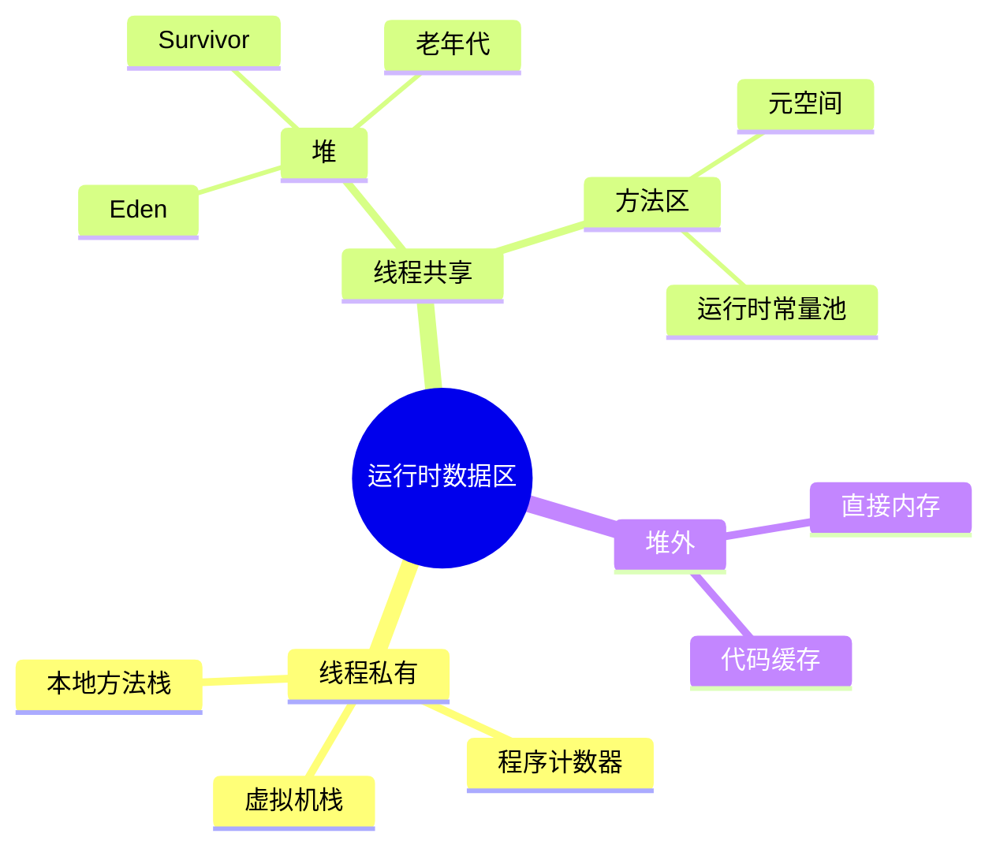

# JVM 运行时数据区

## 思维链路速查

```chain
区域全景 | 共享与私有两分 | 骨架
堆内布局 | 分代与对象流转 | 主体
栈与元空间 | 栈帧 · 类元数据 | 边界
堆外与排障 | 直接内存 · OOM 信号 | 收尾
面试问答 | 高频考点 | 复盘
```

以「随线程生灭 / 随进程生灭」为界切开整块内存 → 堆的分代与对象流转 → 栈帧与类元数据各自的归宿 → 堆外那块不受 GC 管的地，最后落到参数与 OOM 排障。

## 区域全景

| 区域 | 归属 | 存放内容 | 溢出信号 |
|---|---|---|---|
| 程序计数器 | 线程私有 | 当前字节码指令地址（native 方法时为空） | 唯一未规定 OOM 的区域 |
| 虚拟机栈 | 线程私有 | 栈帧：局部变量表 / 操作数栈 / 动态连接 / 返回地址 | `StackOverflowError`；扩栈失败转 OOM |
| 本地方法栈 | 线程私有 | native 方法调用栈（HotSpot 与虚拟机栈合一） | 同上 |
| 堆 | 线程共享 | 对象实例、数组、字符串常量池、静态变量（JDK 7+） | `OOM: Java heap space` |
| 方法区（元空间） | 线程共享 | 类型信息、字段与方法字节码、运行时常量池 | `OOM: Metaspace` |
| 直接内存 | 堆外 | NIO `DirectByteBuffer`、`Unsafe` 分配 | `OOM: Direct buffer memory` |

> [!note] 划分依据是生命周期，不是体积
> 判据是「这块内存随线程生灭还是随进程生灭」：堆虽大却共享，程序计数器只有一个字长却是私有。此视角是 [[JVM]] 内存问题的第一刀，线程维度与 [[进程与线程]] 互补，类元数据的来源见 [[类加载过程]]。

> [!warning] HotSpot 两栈合一
> 虚拟机栈与本地方法栈在 HotSpot 里是同一块内存，`-Xss` 同时决定两者大小，调它等于同时调 native 调用深度。

<details>
<summary>展开思维导图</summary>



</details>

## 堆内布局

| 分区 | 默认占比 | 作用 | 参数 |
|---|---|---|---|
| 新生代 | 堆的 1/3 | 对象出生与快速回收 | `-Xmn` / `-XX:NewRatio=2` |
| Eden | 新生代 8/10 | 绝大多数对象在此分配 | `-XX:SurvivorRatio=8` |
| Survivor From / To | 各 1/10 | 复制算法的中转，永远空一块 | 同上 |
| 老年代 | 堆的 2/3 | 长寿对象、大对象 | `-XX:NewRatio=2` |

对象从分配到晋升的完整路径：

```chain
栈上分配 | 逃逸分析判定不出方法 | 免入堆
TLAB | Eden 内线程私有缓冲 | 无锁分配
Eden | 分配起点 | 朝生夕死
Survivor | Minor GC 后复制存活者 | 年龄 +1
老年代 | 阈值 15 / 动态年龄 / 大对象 | 长驻
```

> [!tip] TLAB 消除分配竞争
> 每线程先在 Eden 里占一小块（Thread Local Allocation Buffer），分配只挪指针、不加锁；`-XX:+UseTLAB` 默认开启，耗尽才走带锁的 CAS 分配。

> [!warning] 年龄阈值不是唯一出口
> 对象熬过 15 次 GC 才晋升（`-XX:MaxTenuringThreshold`），但 Survivor 中同龄对象占比过半时会触发动态年龄判定，整批提前进老年代。

> [!danger] 短命大对象是 Full GC 常客
> 超过 `G1HeapRegionSize` 一半（`PretenureSizeThreshold` 对 Serial / ParNew）的对象直接进老年代，躲开 Survivor 间反复复制。若这类对象其实很短命，老年代会被迅速填满。

## 元空间取代永久代

| 维度 | 永久代（≤ JDK 7） | 元空间（JDK 8+） |
|---|---|---|
| 位置 | JVM 堆内 | 本地内存 |
| 上限 | `-XX:MaxPermSize` 固定 | 默认受物理内存限制，靠 `-XX:MaxMetaspaceSize` 封顶 |
| 内容 | 类元数据 + 字符串常量池 + 静态变量 | 仅类元数据（另含运行时常量池） |
| 回收时机 | 随 Full GC | 类加载器死亡即回收，独立于堆 GC |

> [!note] 「PermGen 消失」的真实含义
> JDK 7 起字符串常量池与静态变量已搬到堆，JDK 8 的元空间只留类元数据——搬走的比留下的多，这也是永久代 OOM 大幅减少的原因。

> [!danger] 不封顶不等于安全
> CGLib、反射、热部署会持续生成新类，元空间不设 `-XX:MaxMetaspaceSize` 就会静默吃光本地内存，拖垮的不只 JVM 还有同机其他进程。

## String.intern() 与字符串驻留

| 维度 | JDK 6（池在永久代） | JDK 7+（池在堆） |
|---|---|---|
| 首次遇到池中没有的内容 | 复制一份进池 | 把堆中该对象的引用记入池 |
| 对 new 出的串调用后拿到 | 池中副本 | 池中引用，即原对象本身 |
| `new String(x).intern() == 原串` | 恒 false | 池中此前无此内容时为 true |

> [!note] 判据只有一条
> 内容已驻池 → 返回池中引用；未驻池 → 入池后返回。入池是**惰性**的：字面量首次被 `ldc` 解析才进池，与 [[类加载过程]] 的解析时机同源，不是类加载即入。编译期可折叠的拼接（`"a"+"b"`、`final` 常量）直接就成字面量、天然驻池，运行期拼出来的串则不会。

```java
// JDK 7+ → true：引用入池，池与堆是同一对象；JDK 6 → false：入池的是副本
String s = new StringBuilder("计算机").append("软件").toString();
System.out.println(s.intern() == s);

// 任何版本都 → false："java" 在 HotSpot 启动阶段就已驻池
String j = new StringBuilder("ja").append("va").toString();
System.out.println(j.intern() == j);
```

> [!warning] 两题互为对照组
> 前者验证「引用入池」，后者验证「已驻池的内容不会被替换」。连起来回答，正好把字符串常量池从永久代搬进堆的实际影响讲全。

> [!danger] 驻留是笔慢账
> 字符串池本质是张哈希表（默认 60013 桶，JDK 7u40 起），只能变大不许缩小，intern 进去的字符串活到进程结束。拿它做大批量缓存：JDK 6 直接 `PermGen OOM`，JDK 7+ 拖慢驻留查找本身。G1 的 `-XX:+UseStringDeduplication` 能在 GC 时自动去重堆内重复串，不碰这张表。

> [!warning] 锁对象陷阱的根因
> 字面量驻池意味着 `"x"` 在任何模块、任何库里写出都是同一引用——这正是 [[synchronized]] 不能拿字符串字面量当锁对象的底层原因:锁它等于把锁作用域交到全局共享表,触发根本不知在哪的互斥或性能串扰。锁必须 `new Object()` 私有常量。

## 栈帧结构

| 组成 | 内容 | 要点 |
|---|---|---|
| 局部变量表 | 方法参数 + 局部变量，以 slot 为单位 | `long` / `double` 占 2 个 slot；实例方法 slot 0 是 `this` |
| 操作数栈 | 字节码的运算现场 | `iadd` 弹两个、压一个 |
| 动态连接 | 指向运行时常量池的方法引用 | 支撑多态分派 |
| 返回地址 | 正常返回 / 异常出口 | 异常走异常表，不走返回地址 |

> [!note] 编译期定长
> 局部变量表与操作数栈的最大深度在编译期就已写进 Code 属性的 `max_locals` / `max_stack`，运行时不再伸缩。

> [!warning] -Xss 乘以线程数才是真实开销
> 1 MB 栈 × 1000 线程 ≈ 1 GB 虚拟内存。报 `unable to create native thread` 时，多半不是 CPU 不够，而是栈把地址空间吃完了——降 `-Xss` 或换线程池，别加内存。

## 直接内存

| 维度 | 堆内 `ByteBuffer` | 直接内存 `DirectByteBuffer` |
|---|---|---|
| 分配 | `ByteBuffer.allocate` | `allocateDirect` / `Unsafe.allocateMemory` |
| 位置 | 堆（GC 直接管） | 本地内存（GC 只管得着那个引用壳） |
| IO 拷贝 | 写 socket 多一次到内核缓冲的复制 | 零拷贝，省一次复制 |
| 回收 | 随 GC 一起走 | Cleaner（虚引用）触发 `Unsafe.freeMemory` |
| 上限 | `-Xmx` | `-XX:MaxDirectMemorySize` |

> [!tip] 池化摊薄两笔成本
> 直接内存分配慢、回收不即时，只适合长期复用的大缓冲。Netty 的 `PooledByteBufAllocator` 就是为摊薄这两笔成本而存在。

> [!danger] 堆还很空也能 OOM
> `DirectByteBuffer` 对象本身只有几十字节，撑爆的是它背后的本地内存；而 Cleaner 只在老年代承压时才被触发——堆使用率 30% 时照样可能 `OOM: Direct buffer memory`。

## 参数与排障

```bash
java -Xms2g -Xmx2g -Xmn768m \
     -XX:MetaspaceSize=256m -XX:MaxMetaspaceSize=256m \
     -Xss512k -XX:MaxDirectMemorySize=256m \
     -XX:+HeapDumpOnOutOfMemoryError -XX:HeapDumpPath=/data/dump \
     -jar app.jar
```

> [!tip] -Xms 与 -Xmx 取同值
> 两者不等时，堆会在运行中按负载伸缩，每次扩容都可能伴随 Full GC。生产环境设成同值，把抖动留在启动时一次性付掉。

| 报错 | 出错区域 | 首查方向 |
|---|---|---|
| `Java heap space` | 堆 | 内存泄漏：`jmap` 导出后用 MAT 看 dominator tree |
| `Metaspace` | 元空间 | 类加载器泄漏、动态代理与热部署 |
| `Direct buffer memory` | 直接内存 | NIO 缓冲未池化、`MaxDirectMemorySize` 过小 |
| `unable to create native thread` | 栈 / 线程 | `-Xss` 过大、系统 `ulimit -u` |
| `GC overhead limit exceeded` | 堆 | 回收量极少却不停 GC，接近死循环而非单纯内存不足 |
| `StackOverflowError` | 虚拟机栈 | 递归无出口、JSON / ORM 的循环引用自解析 |

<details>
<summary>面试问答 (5题)</summary>

Q：哪些区域线程共享，哪些私有？

A：共享 = 堆 + 方法区（元空间）；私有 = 程序计数器、虚拟机栈、本地方法栈。判据是随进程还是随线程生灭。

Q：一个对象从创建到进入老年代经历了什么？

A：先由逃逸分析判断是否可栈上分配（甚至标量替换）→ 否则在 Eden 的 TLAB 里分配 → 熬过 Minor GC 被复制到 Survivor 且年龄 +1 → 年龄达 15、或触发动态年龄判定、或本身是大对象，才晋升老年代。

Q：为什么用元空间取代永久代？

A：永久代在堆内、大小固定，容易 `PermGen space` OOM，且类回收依赖 Full GC。元空间改在本地内存，按类加载器生命周期独立回收，默认只受物理内存约束。代价是必须显式设 `-XX:MaxMetaspaceSize`，否则可能吃光机器内存。

Q：字符串常量池在哪个区？

A：JDK 6 在永久代，JDK 7 随静态变量一起移到堆，JDK 8 起永久代整体变元空间后，字符串常量池仍留在堆。`String.intern()` 操作的就是这张表。

Q：直接内存会被 GC 回收吗？

A：会被"间接"回收：`DirectByteBuffer` 这个壳对象被 GC 时，其 Cleaner（虚引用）触发 `Unsafe.freeMemory` 释放本地内存。壳对象很小，老年代不承压就不触发，所以堆很空也可能 OOM。

</details>

<details>
<summary>常见误区 (5条)</summary>

- 误区：堆就是 JVM 的全部内存。元空间、直接内存、代码缓存、线程栈都在堆外，`jstat` 看不到全貌，得用 NMT（`NativeMemoryTracking`）才能对齐进程 RSS。
- 误区：元空间无限大所以不用管。默认只受物理内存限制，类加载器泄漏会把机器拖垮。
- 误区：只要不 new 大对象就不会 OOM。逃逸分析没跟上时对象照样进堆；反过来，经标量替换后一个对象可能压根没被分配，只留下若干独立字段。
- 误区：Minor GC 频繁就是有问题。新生代本就小而对象朝生夕死，Minor GC 又快又频繁是分代设计的预期，盯的是单次耗时与晋升量。
- 误区：`-Xss` 越大越稳。它是每线程固定开销，栈越大能开的线程越少，高并发服务通常往下调。

</details>
