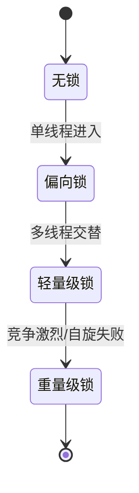

# Java 锁对比

:::lede
Java 锁对比是把 synchronized、volatile、ReentrantLock、读写锁、StampedLock 与 CAS 原子类放到同一组维度下的选型横评，回答的是「这个场景该挑哪一个」而非「某个锁怎么实现」。
:::

内置锁([[synchronized]])与可见性([[volatile]])打底 → 显式锁([[ReentrantLock]])补足中断/超时/公平 → 读写锁与乐观锁优化并发读 → 底层由 [[CAS 与原子类]]/[[AQS]] 支撑 → 按场景选型。

## 一图横评

| 维度 | synchronized | volatile | ReentrantLock | ReentrantReadWriteLock | StampedLock | CAS / 原子类 |
|---|---|---|---|---|---|---|
| 本质 | 内置互斥锁(管程) | 可见性原语(非锁) | 显式互斥锁 | 读写锁(读共享/写独占) | 戳记锁(乐观读) | 无锁原子操作 |
| 实现层 | JVM(对象头 Mark Word) | JVM(内存屏障) | JDK([[AQS]]) | JDK([[AQS]]) | JDK(自有队列,非 AQS) | CPU(LOCK CMPXCHG)+VarHandle |
| 可重入 | ✅ | — | ✅ | ✅(读/写各自) | ❌ 不可重入 | — |
| 公平性 | 非公平 | — | 可选(构造器) | 可选(构造器) | 非公平 | — |
| 可中断 | ❌ | — | ✅ lockInterruptibly | ✅ read/writeLockInterruptibly | ✅ read/writeLockInterruptibly | — |
| 超时获取 | ❌ | — | ✅ tryLock(t) | ✅ tryLock(t)(读/写) | ✅ tryReadLock(t)/tryWriteLock(t) | ✅ 自旋重试 |
| 多 Condition | ❌ 单等待集 | ❌ | ✅ 多等待队列 | ✅(仅写锁) | ❌(asReadLock 适配) | ❌ |
| 读写并发 | 互斥 | 仅可见性 | 互斥 | 读读并发/读写互斥 | 乐观读无锁 | 无锁 |
| 锁降级 | ❌ | — | ❌ | ✅ 写→读 | ✅ tryConvertToReadLock | — |
| 性能特点 | 升级后阻塞,低开销起步 | 极轻量 | 灵活,略重 | 读多写少优 | 极读多写少最优 | 高并发读优,竞争自旋耗 CPU |
| 典型场景 | 简单互斥,临界区小 | 状态标志,双重检查 | 需中断/超时/公平 | 缓存,读多写少 | 极读多写少,读短 | 计数器,原子更新 |

> [!warning] 常见误用
> `volatile` 不保证复合操作原子性(`i++` 仍会丢更新);`StampedLock` 不可重入,重入会死锁;`ReentrantLock` 必须 `finally{ unlock() }`,否则持有线程异常会永久卡死。

## 选型决策

```branch
01: 同步需求
02: 按场景分流
- 仅需可见性 | 一写多读的状态标志 | volatile
- 简单互斥 | 临界区小,无特殊要求 | synchronized
- 灵活控制 | 要中断/超时/公平/多等待队列 | ReentrantLock
- 读多写少 | 缓存类,读远大于写 | ReentrantReadWriteLock
- 极端读多 | 读极多写极少且读短 | StampedLock(乐观读)
- 单变量原子 | 计数器/标志位自增 | CAS 原子类
```

## 锁升级状态

<details>
<summary>展开锁升级状态图</summary>



</details>

> [!note] 锁升级仅适用于 synchronized
> 偏向锁(省 CAS)→轻量级锁(自旋 CAS)→重量级锁(OS 互斥,线程 park);`ReentrantLock` 等基于 [[AQS]],无此升级路径,直接竞争入 CLH 队列 park。
> 注:偏向锁在 JDK 15 起默认禁用、JDK 18 起实质移除,新版本 `synchronized` 直接进入轻量级→重量级路径。

## 类族结构

> [!note] 类族关系
> `ReentrantLock` 与 `ReentrantReadWriteLock` 均实现 `Lock`/`ReadWriteLock` 并基于 [[AQS]];`StampedLock` **不实现 `Lock` 接口**,走独立的戳记(stamp)API,因此无 `Condition`、不可重入(需要 `Lock` 视图时用 `asReadLock()` / `asWriteLock()`)。

## 共享同步器：Semaphore vs CountDownLatch vs CyclicBarrier

> 三者都基于 [[AQS]] 共享同步,共用 `state` 计数 + CLH 队列 park;差别只在 **state 怎么解释、何时放行、能否重置**。

| 维度 | Semaphore | CountDownLatch | CyclicBarrier |
|---|---|---|---|
| 语义 | 许可计数(可借可还) | 倒计时门闩(只减不增) | 循环栅栏(可重置) |
| `state` 含义 | 剩余许可数 | 剩余计数值 | **未到位**线程数 |
| 放行条件 | 拿到许可即放 | 计数归零即全部放 | 所有线程都到位才放 |
| 释放者 | 任意线程可 `release`(无所有权) | 任意线程可 `countDown` | 线程自己 `await` 即到位 |
| 能否重置 | 许可可加可减,事实可"重置" | ❌ 一次性,归零即失效 | ✅ 一代用完自动重置,可循环 |
| 复用 | 长期持有 | 单次编排 | 重复同步(如多轮迭代) |
| 线程数关系 | 准入 ≤ 许可数 | 等待方 ≥ 计数方 | 参与方彼此数量已知 |
| 典型场景 | 限流、资源池准入 | 等 N 个任务完成、起跑线 | 多线程分阶段汇合、迭代计算 |

```branch
限流 / 资源池准入 | 同时最多 N 个进 | Semaphore
等一批事情做完 | N 个任务 countDown 后主线程放行 | CountDownLatch
线程分阶段汇合 | 多轮迭代,每轮所有线程到位才进入下一阶段 | CyclicBarrier
```

### 常见误区

- 误区：Semaphore 是轻量锁。许可数 1 时像互斥量,但**无所有权、不可重入、任意线程可 release 凭空加许可**;要互斥用 [[ReentrantLock]]。
- 误区：`countDown` 漏写会永久挂起等待方。任务异常没 countDown → 计数归不了零;用 `await(timeout, unit)` 兜底。
- 误区：CyclicBarrier 只能等固定 N 个线程,CountDownLatch 可用 `join()` 替代。动态参与方用 `Phaser`;`join()` 只等线程结束,门闩等的是「事件」。

<details>
<summary>面试问答 (2题)</summary>

Q：synchronized 和 ReentrantLock 怎么选？
A：简单互斥用 synchronized;要中断/超时/公平/多 Condition 才上 ReentrantLock,代价是手动 unlock。

Q：volatile 为什么不能保证 `i++` 原子？
A：`i++` 是读-改-写三步,volatile 只保可见性与单次读写原子,三步之间仍可被插空,要用 [[CAS 与原子类]]。

</details>

<details>
<summary>常见误区 (3条)</summary>

- 误区：volatile 是轻量锁。它不是锁,只保可见性/有序性,复合操作原子性不保。
- 误区：读多写少一定快。读写锁仍可能饥饿,写稍多时不如普通互斥锁;极端读多才上 StampedLock。
- 误区：CAS 无锁就无坑。有 ABA 问题与自旋开销,高竞争可用 LongAdder 缓解。

</details>
