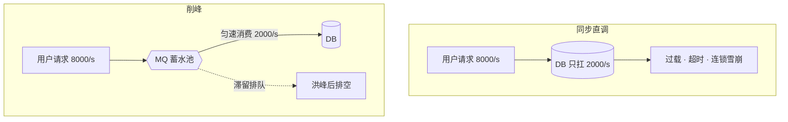

# MQ 的主要应用场景

MQ（Message Queue，消息队列）是夹在生产者与消费者之间的中间件：上游把消息投进队列即可返回，下游按自己的节奏拉取，把「同步等待」换成「异步托付」；它不保证立刻拿到结果，只保证消息最终被处理。

## 思维链路速查

```chain
同步直调的问题 | 为什么要 MQ | 起点
三大核心场景 | 异步 · 解耦 · 削峰 | 主线
衍生场景 | 同一本质的变体 | 延伸
代价与边界 | 什么不该用 MQ | 冷静
面试问答 | 高频追问 | 复盘
```

同步调用的一切麻烦都来自「上游必须等下游做完才能走」——MQ 把「等」换成「托付」：消息进队即返回，收益落在等得少（异步）、不认识（解耦）、扛得住（削峰）三处，代价是只保最终一致、还要多养一套中间件。

## 同步直调的问题

下单链路里，订单服务落库扣库存之外还要发短信、加积分、写推荐；同步直调意味着逐个调用下游并等每个都返回：

| 环节 | 耗时 | 用户要立刻拿到结果吗 |
|---|---|---|
| 下单落库 | 50ms | 是（要返回订单号） |
| 扣库存 | 30ms | 是（结果影响后续流程） |
| 发短信 | 150ms | 否 |
| 加积分 | 100ms | 否 |
| 推荐写入 | 200ms | 否 |
| 合计 | 530ms | 其中 450ms 不必等 |

| 罪 | 机制 | 后果 |
|---|---|---|
| 长尾串联 | 总耗时 = 各下游之和，最慢的拖住全体 | 响应越来越慢 |
| 强耦合 | 上游代码认识每一个下游，增删下游都要改上游、发版 | 改不动 |
| 直面洪峰 | 流量峰值原样传导到每个下游 | 下游被打挂 |

## 场景一：异步提速

异步 = 上游把「这件事要做」投进队列就立刻返回，前提是该步骤不需要立刻拿到结果。改造后落库、扣库存照旧同步（80ms），短信/积分/推荐改为发一条「订单已创建」消息即返回：

```chain
订单服务 | 落库扣库存后发消息即返回 | 主流程 80ms
下游订阅 | 短信 · 积分 · 推荐各自消费 | 并行
失败隔离 | 某下游挂了只堵自己的队列 | 不拖垮下单
```

530ms → 80ms，不是 MQ 变快了，而是把不必等的 450ms 挪出了用户等待的关键路径。

> [!warning] 异步的资格
> 只有「用户不需要立刻知道结果」的步骤才能异步（短信、积分、推荐、日志）；扣库存、支付这类结果影响后续流程的必须同步，扔进队列等于用户看到成功而货实际没扣。

## 场景二：服务解耦

解耦 = 上游不再直接调用下游接口，只往队列发布一条「订单已创建」事件，谁关心谁自己订阅消费——生产者不认识任何一个消费者，这就是发布-订阅模式。

| 变化 | 同步直调 | 发布订阅 |
|---|---|---|
| 上游知道谁在消费 | 是（逐个调用） | 否（只发事件） |
| 新增下游（如营销发券） | 改上游代码 + 联调发版 | 下游自行接入，上游零改动 |
| 某下游故障 | 异常沿调用链上抛，波及下单 | 只堵自己的消费进度 |

> [!note] 解耦不解约
> 「不认识」不等于「没约定」：消息的字段与语义仍是生产者和消费者的契约，改消息结构照样是破坏性变更，只是这份契约比代码级依赖松得多。

## 场景三：流量削峰

削峰 = 把队列当蓄水池：洪峰期上游把请求全部投进队列（入队本身极快），消费端按自己的处理能力匀速拉取，下游永远只见到扛得住的流量。可跟读的数字：秒杀瞬时 8000 请求/s 进来，DB 只扛得住 2000/s。

```chain
洪峰进队 | 请求全部先入队等待 | 入队 QPS 远超 DB 承受
匀速消费 | 消费端按 DB 能力恒定拉取 | 稳定 2000/s
排队缓冲 | 溢出的部分滞留队列 | 洪峰过后逐渐排空
```

<details>
<summary>同步直调与削峰对照</summary>



</details>

总处理能力没变，只是把「挤爆下游」换成「排队晚点处理」：队列容量有上限，超出仍要限流拒绝，用户侧靠「已受理回执 + 出结果后推送」兜住。单机内同一套思想就是线程池 + [[阻塞队列]]，跨进程把队列换成独立中间件即是 MQ。

## 衍生场景：同一本质的变体

| 衍生场景 | 套的是哪个本质 | 典型例子 |
|---|---|---|
| 延迟任务 | 异步 + 定时投递 | 订单 30 分钟未支付自动取消、失败重试退避 |
| 事件广播 | 解耦（一对多） | 配置刷新、多级缓存失效通知 |
| 日志 / 数据流转 | 解耦 + 削峰 | 埋点日志先进 Kafka，再分流进数仓 |
| 最终一致事务 | 解耦 + 重试 | 本地消息表 / 事务消息，与 [[缓存与数据库一致性]] 的补偿队列同思路 |

## 代价与边界：什么不该用 MQ

| 代价 | 具体表现 |
|---|---|
| 一致性降级 | 上游成功 ≠ 全链路完成，只剩最终一致；要强一致就别走消息 |
| 可靠性新题 | 消息丢失、重复消费、顺序错乱、堆积，每一项都要单独设计 |
| 排查变长 | 从一个调用栈变成「生产端—Broker—消费端」三段，定位成本上升 |
| 运维成本 | Broker 集群本身是要养的高可用组件 |

> [!tip] 边界判断
> 上游「不想等、不认识、扛不住」任占其一才值得引入 MQ；三个都不占——下一步必须拿上一步的结果、流量低、下游只有一两个——直接调用加失败重试就够了。

<details>
<summary>面试问答 (4题)</summary>

Q：为什么要用 MQ？说说它的作用。

A：异步把不必等的步骤挪出关键路径（530ms → 80ms）、解耦让上游只发事件不认识消费者、削峰用队列把洪峰摊成匀速消费；代价是只保最终一致，且引入丢失、重复、顺序等新问题。

Q：哪些业务步骤适合异步化，哪些不适合？

A：判断标准是「调用方是否需要立刻拿到结果」。短信、积分、推荐、日志适合；扣库存、支付、风控这类结果影响后续流程的必须同步。

Q：用了 MQ 之后会带来哪些新问题？

A：可用性多一层依赖（MQ 集群要高可用）、一致性只剩最终一致、可靠性要自己兜（丢失靠持久化与确认，重复靠消费端幂等，顺序靠分区内串行），排查链路也变成三段。

Q：削峰削掉的流量去哪了？

A：滞留在队列里排队，消费端按恒定速率慢慢消化——队列容量有上限、极端超量仍要前置限流，用户侧要有「已受理」的反馈。

</details>

<details>
<summary>常见误区 (3条)</summary>

- 误区：MQ 一定能提速。异步只对可延迟的步骤成立；把必须同步的环节扔进队列，只是把超时藏进队列。
- 误区：解耦 = 没有契约。生产者与消费者仍需约定消息结构与语义，改字段照样是破坏性变更。
- 误区：削峰 = 处理能力变强。总吞吐不变，只是把洪峰摊平成排队；队列打满照样拒绝或丢。

</details>
