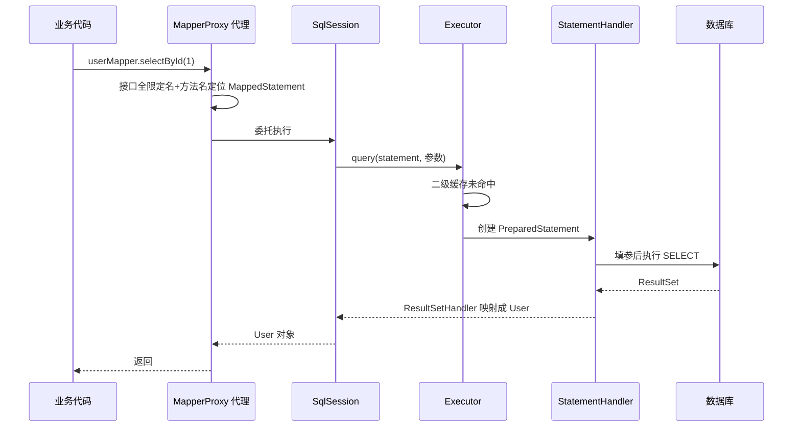

# MyBatis

## 思维链路速查

```chain
动机与定位 | JDBC 模板代码的解药 | 入口
执行流程 | 一次查询穿到 JDBC 的四层 | 主线
Mapper 接口原理 | 无实现类靠动态代理 | 核心
#{} 与 ${} | 预编译与拼接的分界 | 防注入
缓存与延迟加载 | 两级缓存取舍 + N+1 | 考点
```

MyBatis 的取舍是「半自动」：SQL 仍由开发者手写、声明在 XML 里，连接、参数装配、结果映射、缓存全交给框架——于是一条没有实现类的 Mapper 接口调用，运行期被 [[动态代理]] 翻译成 SQL 执行。看懂这条主线，#{} 与 ${}、两级缓存、N+1 全是从它长出来的分叉。

## 动机：JDBC 的模板代码

裸写 JDBC 的痛点是「每个查询都重复一套与业务无关的样板」：

| JDBC 手写的样板 | MyBatis 接管为 |
|---|---|
| 建连接、关连接、异常处理 | SqlSession 会话统一管理 |
| SQL 硬编码在 Java 字符串里 | SQL 搬进 XML，与代码解耦 |
| 手动逐个 set 参数 | #{} 占位符 + PreparedStatement |
| 手动遍历 ResultSet 封装对象 | resultType / resultMap 自动映射 |
| 缓存自己实现 | 内置两级缓存 |

先立术语：**ORM**（对象关系映射）指数据库表与 Java 对象互转。全自动 ORM（Hibernate）按注解生成 SQL——省心但 SQL 不可控，复杂查询难调优；MyBatis 只把「参数装配 + 结果映射」自动化、SQL 自己写，所以叫**半自动**。互联网业务 SQL 复杂、依赖精细调优（配合 [[MySQL 索引]]），可控的 MyBatis 成为主流。

## 执行流程：一次查询穿到 JDBC

| 组件 | 角色 | 生命周期 |
|---|---|---|
| SqlSessionFactoryBuilder | 读配置建工厂 | 用完即弃 |
| SqlSessionFactory | 生产 SqlSession | 应用级单例（重量级） |
| SqlSession | CRUD 的会话入口 | 请求级，**线程不安全**，用完即关 |
| Executor | SqlSession 背后的执行器 | 每会话一个 |
| MappedStatement | 一条 SQL 的完整封装 | 启动时解析 XML 生成，全局共享 |

> [!note] Executor 下游的三大 Handler
> StatementHandler 创建 PreparedStatement 并执行，ParameterHandler 负责填参，ResultSetHandler 负责把行映射成对象——三者是 JDBC 三步的框架化分工。

```chain
getMapper | 拿接口的代理对象 | 入口
MapperProxy | 接口名+方法名定位 MappedStatement | 找 SQL
Executor | 查缓存，未命中放行 | 执行
StatementHandler | 填参、发 PreparedStatement | 落 JDBC
ResultSetHandler | 行映射成对象返回 | 回填
```

<details>
<summary>展开执行时序图</summary>



</details>

> [!tip] 插件机制一句话
> 四大对象（Executor、StatementHandler、ParameterHandler、ResultSetHandler）都会被拦截器链用动态代理包一层——PageHelper 分页插件就是在这一层把 SQL 改写进 LIMIT。原理见 [[动态代理]]。

## Mapper 接口原理：无实现类怎么跑 SQL

接口没有实现类，Spring 却能注入、方法能查出结果——因为注入的是**动态代理**：`@MapperScan` 扫描包下接口 → 每个接口注册成 MapperFactoryBean → 注入时 `getObject()` 返回 JDK Proxy（MapperProxy 实现 InvocationHandler）。

```java
@Mapper
public interface UserMapper {
    User selectById(@Param("id") Long id);
}
```

```xml
<mapper namespace="com.demo.mapper.UserMapper">             <!-- namespace = 接口全限定名 -->
  <select id="selectById" resultType="com.demo.entity.User"> <!-- id = 方法名，二者拼出全局唯一 key -->
    SELECT id, name FROM user WHERE id = #{id}               <!-- #{} = 预编译占位，见下节 -->
  </select>
</mapper>
```

调用代理方法时，MapperProxy 的 invoke 按「接口全限定名 + 方法名」找到 MappedStatement，随后走上一节的执行流程。由这条唯一 key 推出三个约束：

| 推论 | 原因 |
|---|---|
| 接口方法不能重载 | 重载的两个方法撞同一个 key，映射不出两条 SQL |
| 多参数用 @Param 起名 | 参数名编译后丢失，默认只能按 param1、param2… 序号取 |
| 参数是 POJO/Map 时属性直取 | 整个对象作为一个参数传入，#{} 里写属性路径 |

> [!note] 代理不转发 target
> MapperProxy 的 invoke 不转发给任何 target——它根本没有真实对象，直接把方法调用翻译成 SQL。这是 [[动态代理]] 里「handler 可以不碰 target」的极端案例。

## #{} 与 ${}：预编译与拼接的分界

```java
#{id}   // SQL 里的 ?：先编译模板，参数在编译后作为 JDBC 参数填入 → 永不参与语法解析
${col}  // 把值原样拼进 SQL 文本再编译 → 入参能改写 SQL 结构
```

注入对照（可跟读）：

```sql
-- ${id}，用户传 "1 OR 1=1"：值拼进语法层，条件恒真，全表泄露
SELECT * FROM user WHERE id = 1 OR 1=1
-- #{id}，同一输入：参数整体当一个值，匹配不到 id 恰好等于该串的行
SELECT * FROM user WHERE id = ?
```

| | #{} | ${} |
|---|---|---|
| 底层 | PreparedStatement 的 ? | 字符串拼接 |
| 时机 | 先编译后填参 | 值先进文本再编译 |
| 注入 | 安全 | 危险 |
| 适用 | 一切「值」 | 表名/列名/排序字段等「语法位」 |

> [!danger] ${} 的边界
> ? 只能占「值」，占不了表名、列名、ORDER BY 字段这类语法位置——动态表列名才用 ${}，且值必须白名单校验。LIKE 模糊别写 `'%${kw}%'`（注入），也别写 `'%#{kw}%'`（? 落在引号里成了字面量，永远查不到），正确写法 `LIKE CONCAT('%', #{kw}, '%')`。

## 缓存与延迟加载

| | 一级缓存 | 二级缓存 |
|---|---|---|
| 作用域 | SqlSession 会话内 | namespace（一个 Mapper）内 |
| 默认 | 开启（localCacheScope=SESSION） | 不生效，需 `<cache/>` 开启 |
| 共享 | 同一会话内复用 | 跨 SqlSession |
| 清空 | 同会话执行增删改即清 | 该 namespace 任意增删改整区清空 |
| 写入时机 | 查询后立即 | 事务提交后（防未提交脏读） |

> [!warning] 二级缓存的两个坑
> 跨 namespace 多表查询：A 的缓存存了 B 表数据，B namespace 的增删改只清 B，A 命中旧关联数据 → 脏读；分布式下各实例本地缓存互不可见 → 不一致。生产一般不开，缓存责任交给 Redis 等外部层（一致性展开见 [[EasyOrange 缓存一致性]]）。

> [!note] 一级缓存为什么生产感知弱
> Spring 整合下每个请求拿的是新 SqlSession（SqlSessionTemplate），方法结束即关——跨请求没有共享会话；只有同一事务（@Transactional）内共享一个 SqlSession 时一级缓存才真正生效。

| 机制 | 一句话 | 关键点 |
|---|---|---|
| 延迟加载 | 关联对象（association/collection + select 子查询）不随主查询立即加载，首次访问属性才发 SQL | 返回对象是 Javassist/CGLIB 代理，拦 getter 触发（`lazyLoadingEnabled=true`） |
| N+1 问题 | 主查询查回 N 行，每行各发一次子查询 = 1+N 次 SQL | 解法：JOIN 一次查回（resultMap 嵌套映射），或改一次 IN 批量 |

<details>
<summary>面试问答 (6题)</summary>

Q：MyBatis 为什么叫半自动 ORM？和 Hibernate 的区别？

A：MyBatis 只自动化「参数装配 + 结果映射」，SQL 由开发者手写，可控可调优；Hibernate 按对象关系注解生成 SQL，全自动但不可控。复杂查询多、依赖索引调优的场景选 MyBatis。

Q：Mapper 接口没有实现类，为什么能注入并执行 SQL？

A：@MapperScan 把接口注册成 MapperFactoryBean，注入时返回 JDK 动态代理（MapperProxy）。代理的 invoke 按「接口全限定名 + 方法名」定位 MappedStatement，再走 SqlSession → Executor → StatementHandler → JDBC 的执行流程。

Q：#{} 和 ${} 的区别？${} 什么场景不得不用？

A：#{} 是 PreparedStatement 预编译占位，参数不参与语法解析，防注入；${} 是字符串拼接，有注入风险。表名、列名、ORDER BY 字段这类「语法位」占位符表达不了，只能 ${}，且值必须白名单校验。

Q：一级、二级缓存的区别？二级缓存为什么生产一般不开？

A：一级缓存 SqlSession 作用域默认开启，同会话同查询复用；二级缓存 namespace 作用域，跨 SqlSession 共享，需 `<cache/>` 开启。二级缓存两个坑：跨 namespace 多表查询脏读（B 表更新清不掉 A 的缓存）、分布式实例间不同步；生产交给 Redis 等外部缓存。Spring 下每请求新 SqlSession，一级缓存只在同一事务内生效。

Q：一次 select 的完整执行流程？

A：getMapper 拿代理 → MapperProxy 按接口名+方法名定位 MappedStatement → SqlSession 委托 Executor（先查二级缓存）→ StatementHandler 创建 PreparedStatement → ParameterHandler 填参 → 执行 → ResultSetHandler 映射返回。

Q：N+1 问题是什么？怎么解决？

A：嵌套子查询下主查询查回 N 行，每行触发一次关联子查询，共 1+N 次 SQL。解法：改成 JOIN 一次查回配 resultMap 嵌套映射，或把子查询改为一次 IN 批量查询。

</details>

<details>
<summary>常见误区 (4条)</summary>

- 误区：MyBatis 能防注入是框架自带的安全能力。防注入只来自 #{} 走的 PreparedStatement 预编译；${} 拼接照样注入，混用一个就全盘失守。
- 误区：一级缓存跨请求有效。Spring 整合下每个请求都是新 SqlSession，方法结束即关；跨请求共享的是二级缓存，而它一般被关掉。
- 误区：Mapper 接口可以像普通接口一样重载。「接口全限定名 + 方法名」是 SQL 的唯一 key，重载的两个方法会撞同一条 SQL。
- 误区：延迟加载返回的是完整对象。返回的是 Javassist/CGLIB 代理，首次访问关联属性才真正发子查询——对象转 JSON/序列化时会因读属性提前触发子查询。

</details>
