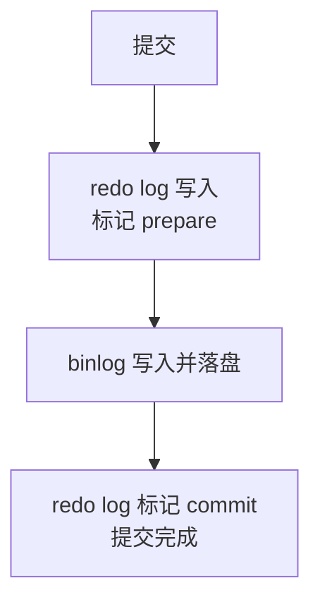

# MySQL 日志

## 思维链路速查

```chain
为什么有日志 | 随机整页写太贵·宕机要交代 | 起点
三大日志全景 | undo·redo·binlog 对比表 | 全景
undo log | 反向操作：回滚与 MVCC 版本链 | 基础
redo log | WAL 小账本：循环写与刷盘策略 | 核心
binlog | 归档账本：复制与备份恢复 | 核心
两阶段提交 | 让两份账本对上号 | 关键
落地 | 一条 UPDATE 的日志全流程 | 演示
复盘 | 面试问答与常见误区 | 收尾
```

直接改内存页最省事，但两件事必须交代清楚：**未提交的改动要能撤销**（原子性），**已提交的改动宕机不能丢**（持久性）。InnoDB 的解法是 WAL——改动先以小条日志顺序落盘，整页刷盘挪到后台：undo log 记「怎么撤销」，redo log 记「怎么重做」；Server 层的 binlog 记「改了什么」，供复制与归档。redo 与 binlog 谁先落盘都各留一个不一致的坑，于是提交时用两阶段提交把两份账本对齐。

## 为什么有日志

InnoDB 按 **16KB 页**为最小读写单位（页结构见 [[MySQL索引为什么用B+树]]）。改一行如果立刻把所在页刷盘：

| 痛点 | 原因 |
|---|---|
| 写放大 | 只改几十字节，却要写整页 16KB |
| 随机 IO | 页散在磁盘各处，寻址慢 |
| 提交慢 | 「持久」被绑定在昂贵的整页落盘上 |

日志把这笔账换了个算法：事务路径上只做**小条日志的顺序写**（便宜），数据页攒成脏页（内存里改过、还没写回磁盘的页）由后台线程慢慢批量刷。日志就回答三个问题：

| 问题 | 回答者 |
|---|---|
| 怎么撤销一个事务 | undo log |
| 宕机后怎么找回已提交的改动 | redo log |
| 改动怎么复制给从库、怎么按时间点恢复 | binlog |

## 三大日志全景

| | undo log | redo log | binlog |
|---|---|---|---|
| 归属 | InnoDB 引擎层 | InnoDB 引擎层 | Server 层（所有引擎共用） |
| 内容 | **逻辑日志**：反向操作 | **物理日志**：某页某处的字节改动 | **逻辑日志**：SQL 或行变更（看格式） |
| 写法 | 挂进版本链，随事务增长 | 循环写，写满从头覆盖 | 追加写，写满换下一个文件 |
| 解决 | 原子性（回滚）+ MVCC | 持久性（崩溃恢复） | 复制、备份恢复 |
| 与提交的关系 | 执行中随写随记 | 提交时按策略刷盘 | 提交时一次写入 |

> [!note] 逻辑日志 vs 物理日志
> 逻辑日志记「操作」：这句话反着做就能撤销、原样重放就能复现；物理日志记「结果」：哪个页哪个偏移改成了什么。undo / binlog 面向操作与数据，redo 面向页，所以只有 redo 能做页级崩溃恢复。

## undo log：记「怎么撤销」

undo log（回滚日志）在改动发生**之前**记下反向操作：

| 场景 | undo 里记什么 | 回滚动作 |
|---|---|---|
| INSERT | 新行的主键 | 按主键 DELETE |
| DELETE | 被删行的旧值 | 旧值插回去 |
| UPDATE | 修改前的旧值 | 反向 UPDATE 恢复旧值 |

一份旧值，两个用途：

1. **事务回滚**（原子性）：ROLLBACK 或崩溃后，未提交事务的改动按 undo 逐条撤销。
2. **MVCC 版本链**：DB_ROLL_PTR 指向的旧版本就存在 undo 里，快照读沿链回溯靠它（见 [[MVCC]]）。

按能否立刻删分两类：

| 类型 | 覆盖 | 提交后 |
|---|---|---|
| insert undo | INSERT 产生的反向记录 | 可立即删——新行没有旧版本，未提交的 INSERT 本来就对别人不可见 |
| update undo | DELETE / UPDATE 记的旧值 | 必须留给版本链，等 purge（InnoDB 后台清理线程）确认没有 ReadView 可能引用后才删 |

> [!note] undo 自己也怕丢
> undo 的载体是回滚段里的 undo 页，也是数据页——改 undo 页同样要记 redo。崩溃恢复时先靠 redo 把所有页（含 undo 页）追平，再用 undo 回滚未提交事务：**先重放，后回滚**。

## redo log：记「怎么重做」

redo log（重做日志）用 WAL（Write-Ahead Logging，先写日志）：**改动先顺序写入 redo 并落盘，数据页的落盘延后**。代价对比：

| 路径 | 写什么 | IO 特征 |
|---|---|---|
| 数据页立刻刷盘 | 整页 16KB | 随机、放大 |
| WAL | 一条 redo（几十字节：页号 + 偏移 + 改动） | 顺序、微小 |

提交时保证的正是 redo 落盘，而不是数据页落盘——这样崩溃后才有「怎么重做」可查。

### 循环写

redo 文件是一组固定个数的文件（如 ib_logfile0/1）从 tail 追着写：**write pos**（下一个写入位置）与 **checkpoint**（当前已刷脏到哪的边界）之间是已写入、还没刷脏的部分，崩溃恢复要用；checkpoint 之前的段落对应脏页已落盘，可以覆盖。

<details>
<summary>展开循环写示意</summary>


</details>

write pos 追上 checkpoint 就得停下来刷脏页腾地方——redo 太小会周期性卡顿，这就是「redo 别配太小」的原因。

### 刷盘策略：innodb_flush_log_at_trx_commit

fsync（把操作系统文件缓存强制刷进磁盘的系统调用）是真正「落铁盘」的一步，策略控制它在事务路径上的频率：

| 值 | 提交时做什么 | 谁来 fsync | 宕机丢什么 |
|---|---|---|---|
| 0 | 只写 redo log buffer | 后台线程每秒 | 最多约 1 秒 |
| **1（默认）** | 写 buffer 并 fsync | 每次提交 | 不丢已提交事务 |
| 2 | 写到 OS 文件缓存 | 每秒一次 | MySQL 进程挂不丢；OS/整机挂丢约 1 秒 |

> [!tip] 组提交
> 并发事务提交时凑一批共用一次 fsync——「每事务一次刷盘」摊薄成「每批一次」，这是值 = 1 时性能仍可用的关键。

## binlog：记「改了什么」

binlog（归档日志）在 Server 层，任何引擎都有一份；**追加写、永不覆盖**，所以能从头重放。三种格式：

| 格式 | 记什么 | 优点 | 坑 |
|---|---|---|---|
| statement | SQL 原文 | 体积小 | NOW() / UUID() / 无排序 LIMIT 的结果不确定，从库重放与主库执行结果不同 → 主从不一致 |
| **row（默认）** | 行变更的前后镜像 | 精确，能当变更流订阅 | 体积大：一条 UPDATE 命中十万行就是十万条 |
| mixed | 平时 statement，遇不确定函数切 row | 折中 | 切换判断是黑盒，难排查 |

写入流程：事务执行中先写**本线程私有的 binlog cache**，提交时一次写入 binlog 文件——单个事务的 binlog 连续完整，从库要么看到整个事务、要么看不到。落盘时机由 sync_binlog 控制：1（默认）每次提交 fsync；0 交给 OS；N 攒 N 个事务刷一次。

三个用途：

1. **主从复制**：主库写 binlog → 从库 IO 线程拉取存成 relay log（中继日志）→ 从库 SQL 线程重放。
2. **备份恢复**：全量备份打底，再重放指定时刻之前的 binlog（point-in-time recovery，按时间点恢复）。
3. **变更订阅**：canal 等组件伪装成从库拉 binlog 当变更流，驱动缓存失效、搜索索引更新。

## 两阶段提交：让两份账本对上号

一条 UPDATE 提交要同时写 redo 和 binlog，两者独立落盘。若不做协调，先写谁都有缝：

| 假设的写序 | 崩溃在两步之间 | 主库恢复 | 从库回放 | 后果 |
|---|---|---|---|---|
| 先 redo 后 binlog | redo 有·binlog 无 | 有该事务 | 没这条 | 主多从少 |
| 先 binlog 后 redo | binlog 有·redo 无 | 没该事务 | 回放出这条 | 从多主少 |

两个都错——问题不在顺序，在「两个日志系统各自独立、互不知晓」。解法是把 redo 的提交拆成两半，binlog 卡在中间：



崩溃恢复按 redo 的状态分三种情形判定（redo 与 binlog 靠共同的事务 XID 对账）：

| 崩溃在 | redo 状态 | binlog | 恢复动作 | 结果 |
|---|---|---|---|---|
| ① prepare 后，binlog 前 | prepare | 没有该事务 | 按 undo 回滚 | 两边都没有，一致 |
| ② binlog 落盘后，commit 前 | prepare | 完整 | 补提交该事务 | 两边都有，一致 |
| ③ commit 后 | commit | 完整 | 直接恢复 | 一致 |

判定规则一句话：恢复时 redo 处于 prepare，就按 XID 去 binlog 查——**binlog 完整则提交，否则回滚**。以 binlog 为准，因为 binlog 是复制与备份恢复的唯一依据，主从一致优先。

> [!warning] 双 1 配置
> 严格不丢 = innodb_flush_log_at_trx_commit=1 **且** sync_binlog=1，代价是每次提交最多两次 fsync（靠组提交扛吞吐）。放宽任何一侧，「不丢」就退化成「丢一秒 / 丢 N 笔」——订单、账务场景不要放。

## 落地：一条 UPDATE 的日志全流程

```sql
UPDATE accounts SET balance = balance - 100 WHERE id = 1;
```

| 步 | 位置 | 动作 |
|---|---|---|
| ① | buffer pool | id=1 所在数据页读进内存（已在则跳过） |
| ② | undo log | 记下 balance 旧值，挂进版本链 |
| ③ | buffer pool | 内存中改 balance=900，该页成为脏页 |
| ④ | redo log buffer | 记「某页某处 balance 由 1000 改 900」的物理改动 |
| ⑤ | binlog cache | 记这条行变更（row 格式的前后镜像） |
| ⑥ | 提交 | redo 刷盘标 prepare → binlog 写入并落盘 → redo 标 commit（两阶段提交） |
| ⑦ | 后台 | 某刻脏页刷盘；刷盘前该页的改动始终有 redo 兜底 |

> [!note] WAL 的先后承诺
> redo 落盘**先于**数据页落盘。于是崩溃时数据页无论是旧的还是半新半旧，都能被 redo 追平到「最后一次提交」的状态——持久性只依赖 redo，不依赖脏页何时刷。

## 引擎之外：运维侧日志

| 日志 | 用途 |
|---|---|
| error log | 启动失败、运行错误排查的第一现场 |
| slow query log | 慢查询定位，治理入口在 [[MySQL 索引]] |
| relay log | 从库侧的 binlog 中转站（见上文复制） |

<details>
<summary>面试问答 (5题)</summary>

Q：MySQL 有哪些日志，各自干什么？

A：InnoDB 层两份：undo log 记反向操作，负责回滚（原子性）和 MVCC 版本链；redo log 记页级物理改动，用 WAL 保证已提交事务崩溃不丢（持久性）。Server 层一份 binlog，记 SQL 或行变更，负责主从复制和备份恢复。运维侧还有 error log、slow query log。

Q：redo log 和 binlog 的区别？

A：四个维度：层次（InnoDB / Server，所以所有引擎都有 binlog）；内容（物理的页改动 / 逻辑的语句或行变更）；写法（固定文件组循环写、会被覆盖 / 追加写、永不覆盖）；用途（页级崩溃恢复 / 复制与按时间点恢复）。一句对照：redo 答「某页某处怎么改的」，binlog 答「这行数据变成了什么」。

Q：两阶段提交解决什么问题，崩溃恢复怎么判？

A：redo 和 binlog 独立落盘，先后顺序都有崩溃缝，会造成主库与从库数据不一致。提交时 redo 先标 prepare，再写 binlog，最后 redo 标 commit。恢复时 redo 处于 prepare 就按事务 XID 查 binlog：完整则补提交，不完整则按 undo 回滚——以 binlog 为准，因为复制和恢复都以 binlog 为依据。

Q：innodb_flush_log_at_trx_commit 和 sync_binlog 怎么选？

A：双 1（redo=1 + binlog=1）每次提交两次 fsync，不丢已提交事务，订单账务类默认；redo=2 是写到 OS 文件缓存、每秒 fsync，MySQL 挂不丢、整机挂丢一秒；binlog=0 或 N 攒批，宕机丢对应窗口。性能靠组提交兜底，不要用放宽刷盘换吞吐。

Q：undo log 会一直留着吗？

A：不会。insert undo 提交即删；update undo 提交后要挂在版本链上供 ReadView 回溯，purge 线程确认没有活跃 ReadView 可能引用后才清理。长事务会把旧版本拖住，undo 膨胀、沿链回溯变慢——这也是「别让事务空挂」的原因。

</details>

<details>
<summary>常见误区 (5条)</summary>

- 误区：提交成功 = 数据已在磁盘上。提交保证的是 redo 落盘，数据页还是内存脏页，由后台延后刷；崩溃恢复靠 redo 重放补齐。
- 误区：有 redo log 就不需要 binlog（或反过来）。redo 是物理日志且循环写会覆盖，只能崩溃恢复，撑不起复制与归档；binlog 是逻辑日志，做不了页级恢复。两份各司其职，靠两阶段提交对齐。
- 误区：undo log 只用于回滚。它同时是 MVCC 版本链的载体，快照读沿链回溯全靠它。
- 误区：binlog 一定记 SQL。只有 statement 格式记 SQL 原文；row 记行前后镜像，mixed 按语句自动切换。statement 遇不确定性函数会造成主从不一致。
- 误区：两阶段提交保证 redo 和 binlog 同时落盘。它保证的是「要么都有效、要么都无效」，不是同时——binlog 已落盘而 redo 还在 prepare（情形②）是正常中间态，恢复时补提交。

</details>
