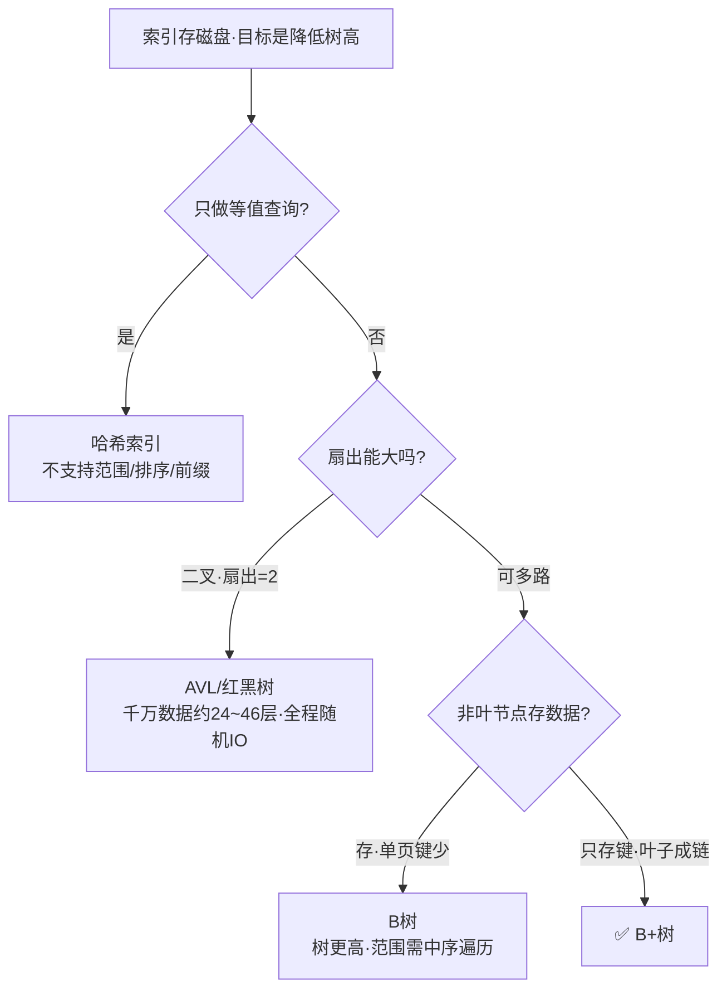

# MySQL索引为什么用B+树

## 思维链路速查

```chain
磁盘IO是瓶颈 | 1节点=1磁盘页=1次IO | 前提
目标压低树高 | 提高扇出 fan-out | 设计目标
逐一排除候选 | 哈希 / 二叉 / 红黑 / B树 | 选型
B+树胜出 | 非叶只存键·叶子成链 | 结论
```

磁盘随机 IO 比内存慢约 10⁵ 倍，所以索引优化的第一目标不是「比较次数」而是「树高 = 查询需要的 IO 次数」。B+ 树正是为「磁盘 + 范围查询」这一组合量身设计的结构。

索引服务于上层数据访问，DAO 层设计见 [[经典三层架构]]，读写一致性见 [[缓存与数据库一致性]]。

## 前提：索引在磁盘，瓶颈是 IO

> [!note] 关键前提
> 索引是常驻磁盘的数据结构。访问一个节点 = 读一页（InnoDB 默认 16KB）= 一次磁盘 IO。
> 比较发生在内存里几乎免费，真正贵的是把页从磁盘搬到内存的那一次 IO。于是衡量结构好坏的指标从「比较次数」变成「树高」。

## 为什么不用其他结构

| 候选结构 | 致命短板 | 结论 |
|---|---|---|
| 哈希索引 | 只支持等值，不支持范围 / 排序 / 最左前缀；有哈希冲突 | 仅 Memory 引擎 / InnoDB 自适应哈希辅助用 |
| 二叉搜索树 BST | 极端情况退化为链表，查找退化为 O(n) | 不稳定 |
| AVL / 红黑树 | 二叉 → 扇出恒为 2，千万级数据树高约 24~46 层（理想 2²³≈8.4×10⁶，最坏 2·log₂n≈46）→ 每层一次随机 IO | 树太高 |
| B 树 | 非叶节点通常也存储数据行（或完整记录指针），导致单页能容纳的键数量变少，树更高；范围查询需中序遍历整棵树，无法像 B+ 树那样沿叶子链顺序扫描 | 次优 |
| **B+ 树** | — | ✅ 选它 |

> [!warning] 为什么不选红黑树
> 红黑树扇出只有 2，1000 万行树高约 24~46 层（理想 24，最坏 2·log₂n≈46），每次查找就是对应次数的随机 IO；而 B+ 树三层就能覆盖十亿行。扇出差距决定树高差距。

## 选型收敛



## B+ 树的四点优势

| 优势 | 机制 | 收益 |
|---|---|---|
| 高扇出 · 低树高 | 非叶节点只放「键 + 指针」，不放数据行 | 单页能放约 1170 个键，3 层即可覆盖 10 亿行，查找 ≤ 3~4 次 IO |
| 叶子成链表 | 所有叶子节点用双向指针串成有序链表 | 范围查询 / ORDER BY 顺链扫描，不必回溯树结构；叶子按 (a,b,c) 顺序排列，跳过 a 直接查 b 时无法利用有序性——这正是「最左前缀」原理的根源 |
| 查询深度恒定 | 任何查找都走到同一层叶子 | 主键查询耗时一致、可预测，便于性能评估 |
| 数据有序聚集 | 叶子按主键顺序存放 | 范围、排序、分组天然友好，局部性更好；但顺序主键（如自增）使页分裂点集中在右端，易引发写放大，UUID 类随机主键则导致频繁页分裂与碎片化 |

> [!tip] 扇出测算
> InnoDB 页 16KB，以 BIGINT 主键（8B）+ 指针（6B）为例，单索引项 14B → 单节点约 1170 个键；若用 INT 主键（4B），扇出会更高。3 层 B+ 树 ≈ 1170³ ≈ 1.6×10⁹ 行，任意主键查找最多 3 次磁盘 IO。

## 延伸：InnoDB 的两种 B+ 树

> [!important] 聚簇 vs 二级索引
> 聚簇索引：叶子直接存整行数据（按主键排序），表数据即索引，主键查询一次到位。（大字段如 BLOB/TEXT 可能存溢出页，但逻辑上可视为整行）
> 二级索引：叶子存主键值，查到后需拿主键回表再查聚簇索引（最多多一次树高）。
> 两者都是 B+ 树，差别只在叶子装的是「整行」还是「主键」。

## 延伸：B+ 树 vs LSM 树

> [!note] 为什么 OLTP 用 B+ 树，OLAP / 日志常用 LSM
> B+ 树每次写入都要定位到叶子页并就地更新，写多读少时写放大明显（一次逻辑写可能触发多次页 IO）。
> LSM 树（如 LevelDB / RocksDB）把写入先落内存、再批量顺序落盘为不可变 SSTable，通过后台 compaction 合并，把随机写变成顺序写，写吞吐更高；代价是读需合并多层 SSTable，读放大更重。一句话：B+ 树读友好、LSM 写友好，按读写比选型。

<details>
<summary>面试问答 (4题)</summary>

Q：为什么 MySQL 索引用 B+ 树而不是红黑树？

A：因为索引在磁盘上，衡量标准是树高（= IO 次数）而非比较次数。红黑树扇出恒为 2，千万行树高约 24~46 层 → 每层一次随机 IO；B+ 树单节点能放上千个键，3 层就覆盖十亿行，查找最多 3~4 次 IO。

Q：B 树和 B+ 树的核心区别是什么？

A：两点。一是 B+ 树非叶节点只存键不存数据，单页容纳的键更多，扇出更大、树更矮；二是 B+ 树所有叶子用链表串起来，范围查询沿链顺序扫描即可，B 树则要中序遍历整棵树。

Q：为什么说索引优化是在减少 IO？

A：访问一个索引节点 = 读一页（InnoDB 默认 16KB）= 一次磁盘 IO，而磁盘随机 IO 比内存慢约 10⁵ 倍。比较发生在内存里几乎免费，所以结构设计的目标是压低树高，而不是减少比较次数。

Q：自增主键和 UUID 主键哪个好？

A：各有权衡。自增主键顺序写入，页分裂集中在右端、局部性好，但高并发下右端成为争用热点；UUID 随机写入导致频繁页分裂与碎片化，且二级索引叶子要存主键，主键过长会撑大所有二级索引。一般 OLTP 用自增，分库分表等需要全局唯一且避免自增泄露业务量的场景才用雪花 / UUID。

</details>

<details>
<summary>常见误区 (3条)</summary>

- 误区：B 树和 B+ 树差不多。B+ 树非叶不存数据、叶子成链，扇出更大，专为磁盘 + 范围查询设计。
- 误区：索引越多查询越快。索引拖慢写入、占用空间，需按查询模式权衡，写多场景反而成负担。
- 误区：哈希一定比 B+ 树快。仅等值场景成立；范围 / 排序 / 最左前缀全部失效，覆盖不了业务查询主体。

</details>
