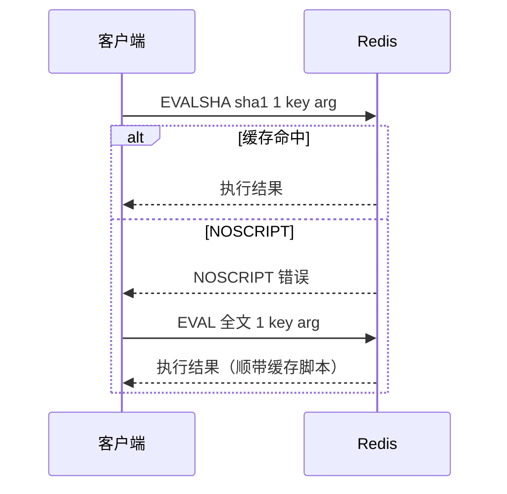

# Redis Lua 脚本

## 思维链路速查

```chain
EVAL 语法 | KEYS 与 ARGV | 入口
原子性 | 与 MULTI/EXEC 的差异 | 核心
脚本缓存 | EVALSHA 与回退 | 优化
落地：解锁脚本 | 判断与删除打包 | 实战
超时与限制 | 阻塞与类型陷阱 | 避坑
```

原子性不是 Lua 赋予的，是 Redis 单线程执行模型赋予的 —— 脚本执行期间其他命令插不进来，所以「读—判断—写」能放心打包；代价是脚本堵的是整个 Redis，必须短小。

## EVAL 与 KEYS/ARGV

语法：`EVAL script numkeys [key ...] [arg ...]`

| 段 | 例 | 说明 |
|---|---|---|
| script | "return redis.call(...)" | 脚本全文，一个字符串 |
| numkeys | 1 | 声明后面跟几个 key |
| key... | stock:1001 | 脚本内以 KEYS[n] 访问，下标从 1 起（[[Lua 类型与语法]] 的 table 惯例） |
| arg... | 300 | 普通参数，脚本内以 ARGV[n] 访问，下标从 1 起 |

```bash
EVAL "return redis.call('get', KEYS[1])" 1 stock:1001
```

> [!note] key 为什么必须走 KEYS 传
> Redis（尤其 Cluster）靠显式声明的 key 做槽位路由与副本重放；把 key 拼进脚本文本 = 路由不可知，是官方明令的反模式。同理，业务值嵌进脚本会让每次调用都生成新脚本、缓存只增不减，值一律走 ARGV。

脚本内用 redis.call 执行命令，出错行为有两种：

| | redis.call | redis.pcall |
|---|---|---|
| 命令出错 | 立即中止脚本，错误抛回客户端 | 不抛，返回 {err="..."}，由脚本决定怎么处理 |
| 用途 | 默认 | 需要兜底 / 吞错误时 |

脚本 return 的类型转换，两条高频规则：

| Lua 返回 | Redis 回复 | 备注 |
|---|---|---|
| number | 整数回复 | **小数被截断** —— 要返回 float 就转成 string 返回 |
| string | bulk 字符串 | |
| table（数组部分） | 数组 | 遇到 nil 即截断 |
| true / false | 1 / null | |
| {ok="..."} / {err="..."} | 状态 / 错误回复 | |

> [!note] 反方向同样有坑
> redis.call 拿回的 GET 未命中（null bulk）在 Lua 里是 false 而非 nil —— 判「不存在」要 == false，写 == nil 永远不成立。

## 原子性：与 MULTI/EXEC 的差异

执行期独占是唯一保证：

```chain
收到 EVAL | 排队等单线程空闲 | 排队
独占执行 | 其余命令全部阻塞 | 核心
执行完毕 | 回传结果才放行 | 出口
```

| | Lua 脚本 | MULTI/EXEC |
|---|---|---|
| 中间结果决策 | 能读值再分支、循环 | 不能，入队时看不见结果 |
| 执行期独占 | 有 | 有 |
| 出错回滚 | 无 | 无 |
| 网络往返 | 1 次 | N 条入队 + 1 次 EXEC |

> [!danger] 没有回滚
> 脚本中途报错，之前已执行的写不撤销 ——「原子」指不被打断，不是「要么全做要么不做」。把可能失败的读判断放脚本前半段，写操作压到判断全过之后。

## 脚本缓存：EVALSHA

Redis 按脚本内容的 sha1（40 位十六进制哈希）缓存脚本，EVALSHA 只传哈希不传全文：

| 命令 | 作用 |
|---|---|
| EVAL | 传全文执行，顺带写入缓存 |
| EVALSHA | 传 sha1 执行，缓存未命中报 NOSCRIPT |
| SCRIPT LOAD | 只缓存不执行，返回 sha1 |
| SCRIPT EXISTS | 查 sha1 是否已缓存 |
| SCRIPT FLUSH | 清空脚本缓存 |

<details>
<summary>展开时序图</summary>



</details>

缓存会丢（重启、SCRIPT FLUSH，Redis 7.4 起缓存过大还按 LRU 逐出），所以客户端必须保留 EVAL 回退路径 —— Spring Data Redis 的 DefaultRedisScript 就是自动「先 EVALSHA、NOSCRIPT 再 EVAL」，限流器这类高频小脚本都靠它省带宽。

## 落地：分布式锁解锁脚本

竞态现场：A 持锁 → 租期到点自动过期 → B 抢到锁 → A 回来删锁。若「校验持有者」和「删除」分两条命令发，两步之间会插进别人的加锁；打包成脚本，两步之间插不进任何命令：

```lua
-- KEYS[1] = 锁的 key；ARGV[1] = 加锁时写入的持有者标识
if redis.call('get', KEYS[1]) == ARGV[1] then   -- 校验：锁还是不是我的
    return redis.call('del', KEYS[1])            -- 删除：与校验之间无命令可插
else
    return 0                                     -- 锁不存在或已易主：不动
end
```

Java 侧一行调用（DefaultRedisScript 预编译一次、反复执行）：

```java
Long released = redis.execute(UNLOCK_SCRIPT, List.of(lockKey), holderId);
```

> [!warning] ARGV 传来的永远是字符串
> Java 传 300，脚本拿到的是 "300"，算术前先 tonumber。若 value 被 GenericJackson 序列化过（带 @class 类型头），脚本里的 tonumber / 比较全失灵 —— 序列化统一是前置条件，见 [[EasyOrange 缓存一致性]]。

同一个「打包消竞态」的思路也撑着限流器的 INCR + EXPIRE 补期判断。

## 超时与限制

| 限制 | 行为 | 应对 |
|---|---|---|
| 阻塞单线程 | 脚本跑多久，全体命令排多久 | 循环等待 / 重活放脚本外，脚本逻辑尽量薄 |
| 超时阈值 | lua-time-limit（默认 5s）后其他客户端开始收到 BUSY，但脚本还在跑 | 未写过数据可 SCRIPT KILL；写过只能 SHUTDOWN NOSAVE |
| 禁阻塞命令 | BLPOP / BRPOP 等在脚本内直接报错 | 等待逻辑放客户端 |
| 复制模式 | Redis 7 起只按效果复制（向副本与 AOF 重放脚本触发的写命令），不再整段传播脚本 | 老版本「脚本必须确定性」的要求已成历史 |
| 可用库 | string / table / math / cjson（encode / decode 处理 JSON）/ struct / bit | 不支持 require 加载模块 |

Redis 7 起另有 FUNCTION 命令把脚本注册成服务器端函数（管理更规范），EVAL 仍是当下主流用法。

<details>
<summary>面试问答 (5题)</summary>

Q：Lua 脚本在 Redis 里为什么是原子的？

A：原子性来自执行模型而非语言：Redis 单线程执行命令，脚本作为一条命令独占执行，期间不会插入其他客户端的命令。

Q：Lua 脚本和 MULTI/EXEC 事务怎么选？

A：需要基于中间结果做判断 / 循环时只能 Lua（事务看不见入队命令的结果）；两者都无回滚；纯命令打包 MULTI 也够。

Q：EVALSHA 的意义？NOSCRIPT 怎么处理？

A：脚本按 sha1 缓存，EVALSHA 只传 40 位哈希省带宽；收到 NOSCRIPT（缓存丢失：重启 / FLUSH / LRU 逐出）回退 EVAL 重发全文。Spring Data Redis 的 DefaultRedisScript 自动处理。

Q：为什么 key 必须走 KEYS 传入而不能拼在脚本里？

A：Cluster 按显式 key 计算槽路由、副本按 key 重放；key 拼进脚本字符串 = 路由不可知，是官方明令的反模式。

Q：脚本里能不能 sleep 或循环等锁？

A：不能。脚本阻塞整个 Redis（单线程），超时（默认 5s）后其他客户端收到 BUSY；未写过数据可 SCRIPT KILL，写过只能 SHUTDOWN NOSAVE。

</details>

<details>
<summary>常见误区 (4条)</summary>

- 误区：Lua 脚本 = 事务，出错回滚。无回滚，中途报错时已执行的写不撤销。
- 误区：ARGV 传来的是数字。客户端参数全是字符串，算术前先 tonumber。
- 误区：脚本里用 BLPOP 等锁。可能阻塞的命令在脚本内直接报错。
- 误区：把业务值嵌进脚本文本。脚本按内容缓存，值一变就是新脚本，缓存只增不减；值应走 ARGV。

</details>
