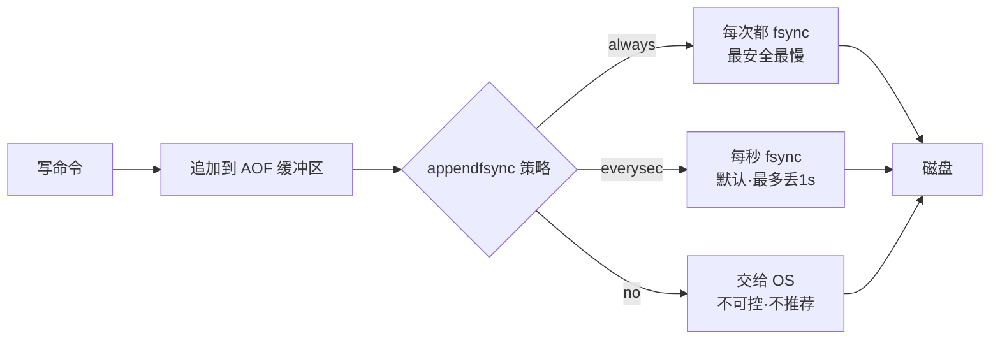

# Redis持久化机制

Redis 持久化机制是 Redis 把内存数据落到磁盘、供重启后重建的方案，包含打全量快照的 RDB 与记写命令的 AOF，以及把两者拼起来的混合持久化；它解决的是宕机后的数据丢失，不解决单机故障时服务不中断。

## 思维链路速查

```chain
为什么需要持久化 | 内存数据会丢 | 动机
RDB 与 AOF | 全量快照 + 命令追加 | 两大机制
混合持久化 | RDB骨架 + AOF尾巴 | 组合
RDB vs AOF | 数据安全与性能的取舍 | 对比
选型问答 | 丢多少·多快·多大 | 落地
```

核心问题只有一个：**内存里的数据重启就丢**，剩下都是「丢多少 / 恢复多快 / 体积多大」的取舍——RDB 打全量快照、AOF 记每条写命令、混合是两者合体。本篇属 [[Redis]] 内存数据库范畴，缓存一致性问题见 [[缓存与数据库一致性]]。

## 为什么需要持久化

| 场景 | 是否需要持久化 |
|---|---|
| 纯缓存，丢失可从 DB 回填 | 可关，但关后 BGSAVE/BGWRITEAOF 也会停 |
| 业务唯一数据源（锁/计数器/Session） | 必须开，且 RPO 容忍决定选 RDB / AOF / 混合 |

**进程重启、机器掉电、容器迁移**都会让内存数据归零——是否持久化，取决于丢了能不能重建。

## RDB 快照

把某一时刻的全量内存数据**序列化**为二进制 dump 文件 `dump.rdb`。

| 维度 | 表现 |
|---|---|
| 文件体积 | 紧凑，二进制压缩 |
| 恢复速度 | 快，直接把 RDB 读回内存 |
| 数据安全 | 丢「最后一次快照到宕机之间」的全部写入 |
| 持久化开销 | `BGSAVE` fork 子进程 + 写时复制（COW），瞬间内存翻倍风险 |
| 触发方式 | 满足 `save` 规则 / `bgsave` 命令 / 主从全量同步 / 正常关服 |

触发规则（默认）：`save 3600 1`（1h 内 1 次写）、`save 300 100`（5min 内 100 次写）、`save 60 10000`（1min 内 10000 次写），任一满足就 BGSAVE。

> [!warning] fork 的隐藏成本
> `BGSAVE` 用 `fork()` 复制父进程页表实现 COW，数据量大时 `fork` 本身可能阻塞数十到数百毫秒；**内存中每写入一页都会触发缺页中断复制**，写入爆炸场景下内存峰值 ≈ 2× 数据集。

## AOF 日志

把每条**改变数据集的命令**（`SET` / `HSET` / `LPUSH` 等）以 RESP 协议文本追加写入 `appendonly.aof`，重启时回放命令重建数据。

| 维度 | 表现 |
|---|---|
| 文件体积 | 大，记录每条写命令 |
| 恢复速度 | 慢，按顺序回放命令 |
| 数据安全 | 默认每秒 fsync 一次，最多丢 1 秒（`appendfsync everysec`）；`always` 模式丢 0 条但 IO 代价高 |
| 持久化开销 | 写命令追加 + 后台 `BGREWRITEAOF` 压缩 |
| 触发方式 | 配置 `appendonly yes` 即启用 |

`appendfsync` 三档：`always` 每条命令 fsync（丢 0 条、最慢，IO 开销是 `everysec` 的几十到上百倍）、`everysec` 每秒一次（默认，最多丢 1 秒）、`no` 交给 OS（丢多少不可控，不推荐）。



> [!danger] AOF 重写的必要性
> AOF 文件会随时间膨胀（同一 key 改 1000 次会记 1000 条），`BGREWRITEAOF` 把它重写成「当前数据集的最小命令集」，触发条件：`auto-aof-rewrite-percentage 100`（上次重写后文件涨 100%）+ `auto-aof-rewrite-min-size 64mb`。**重写不读旧 AOF，而是直接遍历当前内存生成新 AOF**，所以文件大小只取决于数据集，与历史写入次数无关。

## 混合持久化（Redis 4.0+）

`aof-use-rdb-preamble yes` 启用后，BGREWRITEAOF 生成的 AOF 文件 = **RDB 格式的全量数据 + 之后 AOF 格式的增量命令**：重启时先按 RDB 快速加载骨架，再回放 AOF 增量，兼顾恢复速度与数据安全。Redis 7.x 推荐的默认生产配置就是 `appendonly yes` + `aof-use-rdb-preamble yes` + `appendfsync everysec`。

## RDB vs AOF 对比

| 维度 | RDB | AOF | 混合(推荐) |
|---|---|---|---|
| 数据安全 | 丢窗口期数据 | 最多丢 1 秒 | 最多丢 1 秒 |
| 恢复速度 | 最快 | 慢(回放命令) | 快(RDB 骨架 + 增量回放) |
| 文件体积 | 小 | 大 | 中等 |
| 写性能影响 | fork 阻塞 + COW | `everysec` 几乎无感 | 同 AOF |
| 适用场景 | 备份 / 容灾 / 主从 | 数据不能丢 | **生产首选** |
| 版本要求 | 全版本 | 全版本 | Redis 4.0+ |

选型按 RPO 容忍度：要求秒级 + 大实例 → RDB 够用；要求近零丢 → AOF `everysec` + 混合；金融/订单/账务 → 再叠加主从哨兵/集群 + 异地备份，单持久化只是兜底。

## 落地：选型问答

<details>
<summary>面试问答 (3题)</summary>

Q：BGSAVE 会阻塞主线程吗？

A：阻塞点在 `fork` 那一瞬间（复制页表，数据量大时数十到数百毫秒）；子进程写 RDB 期间父进程继续服务，COW 保证父子共享只读页。

Q：混合持久化为什么比纯 AOF 恢复快？

A：重启时先按 RDB 反序列化全量骨架，再回放之后的 AOF 增量，要执行的命令数大幅减少；纯 AOF 得按文件顺序逐条回放，数据量大时是分钟级。

Q：RDB 和 AOF 怎么选？

A：看 RPO 容忍度——秒级够用选 RDB，要近零丢用 AOF `everysec` + 混合；机器级故障仍需主从哨兵/集群 + 异地备份兜底。

</details>

<details>
<summary>常见误区 (3条)</summary>

- 误区：只开 RDB 就够安全。RDB 是窗口期快照，丢数据量 = 两次快照之间的写入，生产必须叠加 AOF 或主从。
- 误区：关服会自动持久化。`SHUTDOWN` 默认触发 `BGSAVE`，但 `kill -9` 或断电不会——容器编排里强杀 pod 必须靠 `appendonly` + `everysec` 兜底。
- 误区：持久化开了就万事大吉。单实例持久化只防进程崩溃，机器级/数据中心级故障仍靠主从 + 哨兵/集群 + 异地备份。

</details>
