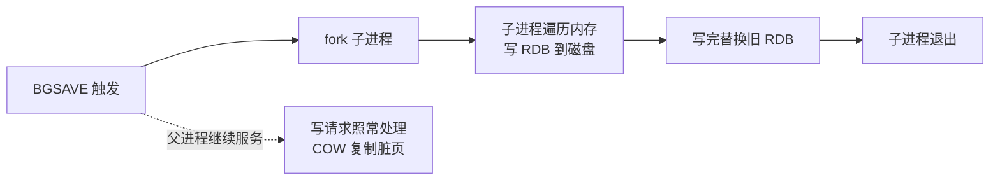
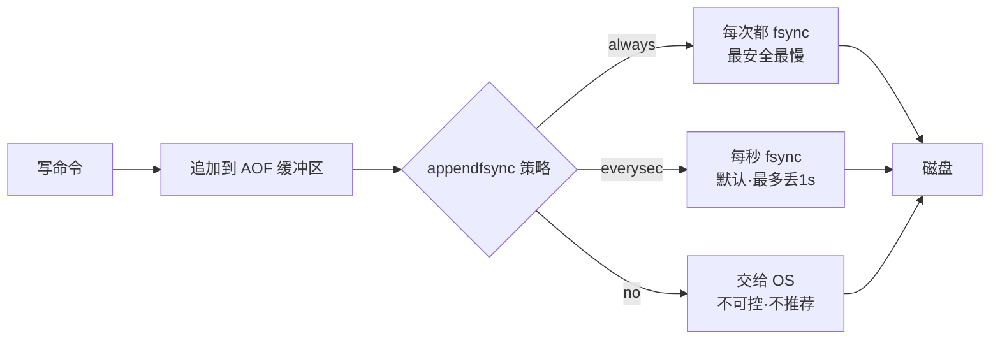
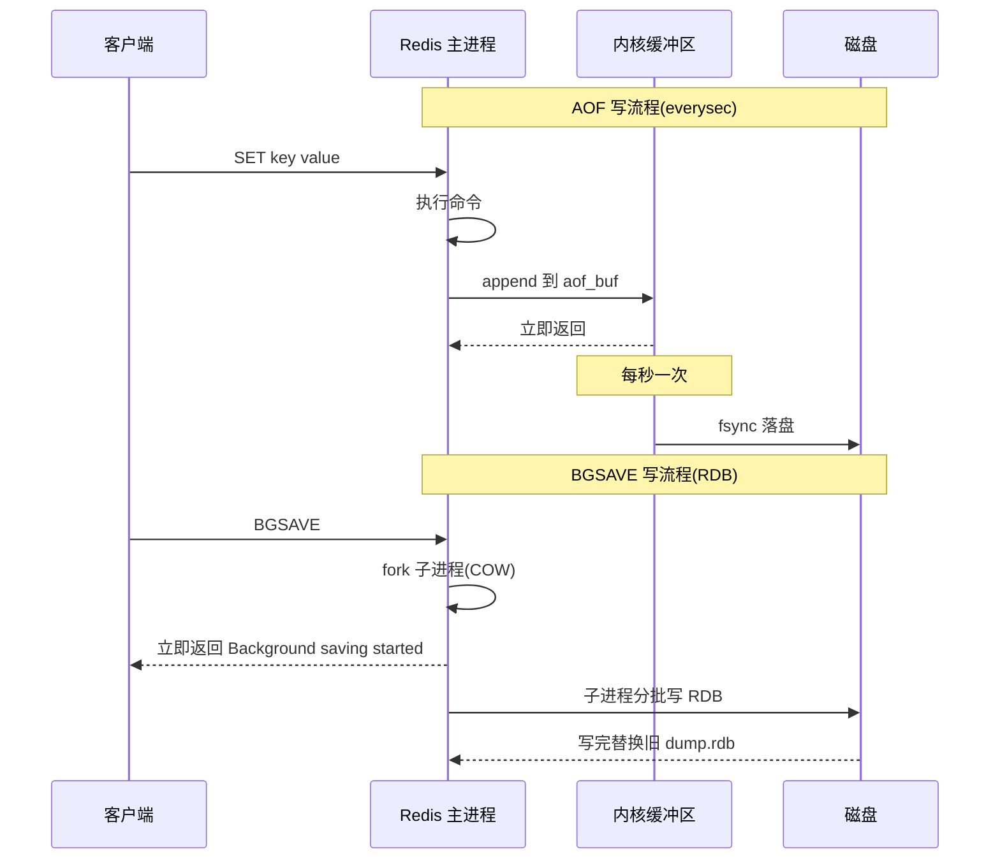

# Redis持久化机制

## 思维链路速查

```chain
为什么需要持久化 | 内存数据会丢 | 动机
RDB 与 AOF | 全量快照 + 命令追加 | 两大机制
混合持久化 | RDB骨架 + AOF尾巴 | 组合
RDB vs AOF | 数据安全与性能的取舍 | 对比
选型问答 | 丢多少·多快·多大 | 落地
```

核心问题只有一个：**内存里的数据重启就丢**，剩下都是「丢多少 / 恢复多快 / 体积多大」的取舍。RDB 是「全量打快照」、AOF 是「记下每条写命令」、混合是两者合体 —— 三条路走通后,选型只看业务对 RPO 的容忍度。

本笔记属于 [[Redis]] 内存数据库范畴,缓存一致性问题见 [[缓存与数据库一致性]]。

## 为什么需要持久化

> [!note] 核心矛盾
> Redis 把数据放在内存里以追求极致性能,但**进程重启、机器掉电、容器迁移**都会让内存数据归零。如果只用 Redis 做缓存,丢了从 DB 重读即可;如果 Redis **同时承担持久化主库的角色**(如分布式锁、计数器、排行榜、Session),丢了就是业务事故。

| 场景 | 是否需要持久化 |
|---|---|
| 纯缓存,丢失可从 DB 回填 | 可关,但关后 BGSAVE/BGWRITEAOF 也会停 |
| 业务唯一数据源(锁/计数器/Session) | 必须开,且 RPO 容忍决定选 RDB / AOF / 混合 |

## RDB 快照

把某一时刻的全量内存数据**序列化**为二进制 dump 文件 `dump.rdb`,默认配置下重启就靠它恢复。

| 维度 | 表现 |
|---|---|
| 文件体积 | 紧凑,二进制压缩 |
| 恢复速度 | 快,直接把 RDB 读回内存 |
| 数据安全 | 丢「最后一次快照到宕机之间」的全部写入 |
| 持久化开销 | `BGSAVE` fork 子进程 + 写时复制(COW),瞬间内存翻倍风险 |
| 触发方式 | 满足 `save` 规则 / `bgsave` 命令 / 主从全量同步 / 正常关服 |

> [!tip] 触发规则(默认)
> `save 3600 1`(1h 内 1 次写)、`save 300 100`(5min 内 100 次写)、`save 60 10000`(1min 内 10000 次写)——任一满足就 BGSAVE。规则按「时间窗口」统计,改阈值要结合业务写量。

> [!warning] fork 的隐藏成本
> `BGSAVE` 用 `fork()` 复制父进程页表实现 COW,数据量大时 `fork` 本身可能阻塞数十到数百毫秒;Linux 优化后用 `copy-on-write` 把开销压到「复制页表」级别,但**内存中每写入一页都会触发缺页中断复制**,写入爆炸场景下内存峰值 ≈ 2× 数据集。



## AOF 日志

把每条**改变数据集的命令**(`SET` / `HSET` / `LPUSH` 等)以 RESP 协议文本追加写入 `appendonly.aof`,重启时回放命令重建数据。

| 维度 | 表现 |
|---|---|
| 文件体积 | 大,记录每条写命令 |
| 恢复速度 | 慢,按顺序回放命令 |
| 数据安全 | 默认每秒 fsync 一次,最多丢 1 秒(`appendfsync everysec`);`always` 模式丢 0 条但 IO 代价高 |
| 持久化开销 | 写命令追加 + 后台 `BGREWRITEAOF` 压缩 |
| 触发方式 | 配置 `appendonly yes` 即启用 |

> [!danger] AOF 重写的必要性
> AOF 文件会随时间膨胀(同一 key 改 1000 次会记 1000 条),Redis 用 `BGREWRITEAOF` 把 AOF 重写成「当前数据集的最小命令集」,触发条件:`auto-aof-rewrite-percentage 100`(上次重写后文件涨 100%)、`auto-aof-rewrite-min-size 64mb`。**重写不读取旧 AOF,而是直接遍历当前内存生成新 AOF**,所以 AOF 文件大小最终只取决于数据集,与历史写入次数无关。



## 混合持久化(Redis 4.0+)

> [!note] 核心设计
> `aof-use-rdb-preamble yes` 启用后,Redis 触发 BGREWRITEAOF 时生成的 AOF 文件 = **RDB 格式的全量数据 + 之后 AOF 格式的增量命令**。重启时先按 RDB 快速加载骨架,再按 AOF 回放增量,兼顾恢复速度与数据安全。

| 优势 | 原因 |
|---|---|
| 恢复速度比纯 AOF 快 | 大头数据走 RDB 直接反序列化,不再按命令逐条执行 |
| 数据安全比纯 RDB 好 | RDB 之后还有 AOF 增量 |
| 文件体积可控 | 重写机制控制,不会无限膨胀 |

这是 **Redis 7.x 推荐的默认生产配置**:`appendonly yes` + `aof-use-rdb-preamble yes` + `appendfsync everysec`。

## RDB vs AOF 对比

| 维度 | RDB | AOF | 混合(推荐) |
|---|---|---|---|
| 数据安全 | 丢窗口期数据 | 最多丢 1 秒 | 最多丢 1 秒 |
| 恢复速度 | 最快 | 慢(回放命令) | 快(RDB 骨架 + 增量回放) |
| 文件体积 | 小 | 大 | 中等 |
| 写性能影响 | fork 阻塞 + COW | `everysec` 几乎无感 | 同 AOF |
| 适用场景 | 备份 / 容灾 / 主从 | 数据不能丢 | **生产首选** |
| 版本要求 | 全版本 | 全版本 | Redis 4.0+ |

> [!tip] 选型决策
>
> - **RPO 要求秒级 + 大实例** → RDB,够用就够用。
> - **RPO 要求近零丢** → AOF + `everysec`,再叠加混合持久化。
> - **金融/订单/账务类** → AOF + `everysec` + 混合 + 主从哨兵/集群 + 异地备份,单持久化只是兜底。

<details>
<summary>展开执行时序图</summary>



</details>

## 落地：选型问答

<details>
<summary>面试问答 (5题)</summary>

Q：Redis 有几种持久化方式?

A:两种独立机制(RDB 快照 + AOF 日志),以及 Redis 4.0+ 的混合持久化(RDB 骨架 + AOF 增量)。

Q：AOF 文件会无限膨胀吗?

A:不会。`BGREWRITEAOF` 触发时直接遍历**当前内存数据集**生成最小命令集,与历史写入次数无关,所以 AOF 大小最终只取决于数据集。

Q：BGSAVE 会阻塞主线程吗?

A:`fork` 子进程那一瞬间会(复制页表),但子进程写 RDB 期间父进程继续服务,COW 机制保证父子共享只读页。真正的阻塞点是 `fork` 本身,数据量大时可能数十到数百毫秒。

Q：`appendfsync always` 为什么生产不用?

A:每次写都触发 `fsync` 系统调用,IO 开销是 `everysec` 的几十到上百倍,会把 Redis 的写吞吐压到磁盘速度。代价远超收益,只有极少数对丢零条都不可接受的场景才考虑。

Q：混合持久化为什么比纯 AOF 恢复快?

A:重启加载时,先按 RDB 格式反序列化全量数据(直接读二进制结构,毫秒级),再回放 RDB 之后的 AOF 增量(命令数量大幅减少);纯 AOF 要按文件顺序逐条回放所有命令,数据量大时是分钟级。

</details>

<details>
<summary>常见误区 (4条)</summary>

- 误区：只开 RDB 就够安全。RDB 是「窗口期快照」,丢数据量 = 两次快照之间的写入,**生产环境必须叠加 AOF 或主从**。
- 误区：AOF 文件越大越安全。AOF 大不代表丢得少,只代表写入频繁;关键看 `appendfsync` 策略和 `BGREWRITEAOF` 是否在工作。
- 误区：关服会自动持久化。`SHUTDOWN` 默认会触发 `BGSAVE`,但 `kill -9` 或断电不会 —— 容器编排里强杀 pod 的场景必须靠 `appendonly` + `everysec` 兜底。
- 误区：持久化开了就万事大吉。单实例持久化只防进程崩溃,**机器级 / 数据中心级故障仍靠主从 + 哨兵 / 集群 + 异地备份**,持久化是底线不是全部。

</details>