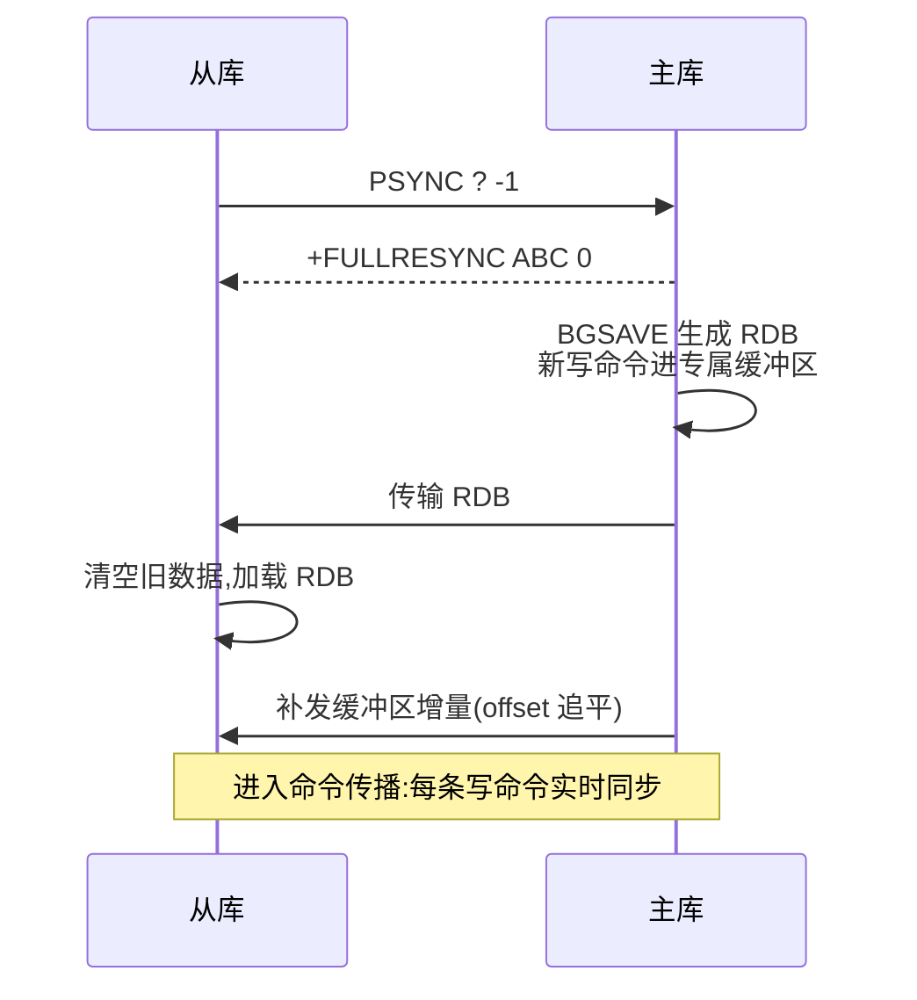
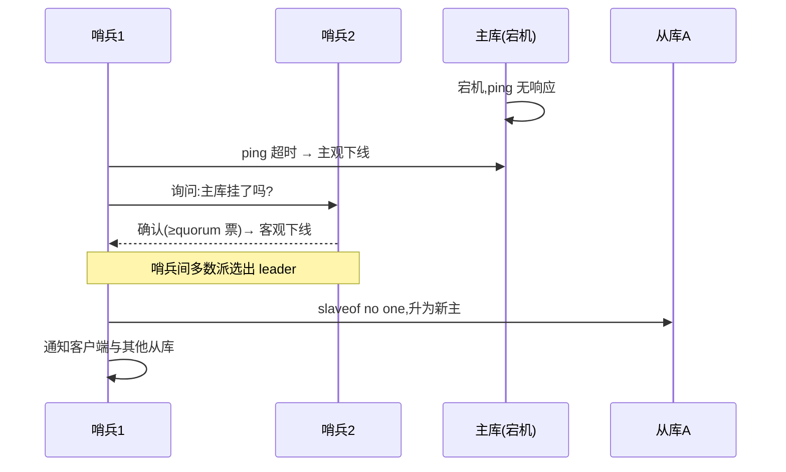
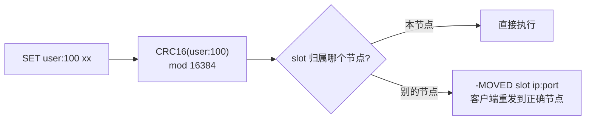

# Redis高可用

## 思维链路速查

```chain
单点风险 | 为什么一台机器撑不住 | 动机
主从复制 | 复制出数据副本 | 冗余
哨兵 | 主库挂了自动换人 | 转移
集群 | 分片摊容量与写压力 | 扩展
面试问答 | 三方案选型 | 复盘
```

高可用不靠「让单机更可靠」，靠冗余：先用主从复制把数据抄到多台机器（副本从哪来、断线怎么追），再让哨兵把「主库挂了换从库」变成自动动作，最后数据量大到单机装不下时用集群分片摊开——可用性每升一级，都叠在前一级的副本之上。持久化（见 [[Redis持久化机制]]）解决「机器全灭后数据还在」，本文解决「单机故障时服务不断」。

## 为什么单机不叫高可用

> [!note] 先立定义：可用性
> 可用性 = 无故障服务时长 ÷ 总时长，用「几个 9」衡量。9 越多，一年允许的停机时间越少：

| 目标 | 一年停机上限 | 俗称 |
|---|---|---|
| 99.9% | 8.8 小时 | 3 个 9 |
| 99.99% | 52.6 分钟 | 4 个 9 |
| 99.999% | 5.3 分钟 | 5 个 9 |

单机 Redis 挡不住的故障：

| 故障 | 后果 | 需要的能力 |
|---|---|---|
| 进程崩溃 | 服务中断，重启靠 RDB/AOF 恢复 | 数据副本 + 自动拉起 |
| 机器宕机/磁盘损坏 | 数据与服务一起消失 | 数据在**别的机器**上有副本 |
| 数据量超出单机内存 | 淘汰频繁、性能塌方 | 水平分片 |
| 写吞吐超出单机上限 | 主库成瓶颈 | 写压力分摊 |

前两行靠「主从 + 哨兵」，后两行靠「集群」——这也是三种方案的因果顺序。

## 主从复制：冗余是高可用的原料

> [!note] 先立结构
> **主库**受理写请求，**从库**保存主库数据的实时副本并受理读请求（读写分离）。一台主库可挂多个从库，从库默认只读。「复制」= 从库重放主库的写命令流，追到与主库一致。

### 两个进度坐标

- **replication id（replid）**：主库的身份标识，从库靠它确认「我们说的是同一个数据集」。
- **offset（偏移量）**：主从之间已同步的写命令字节数，双方各自维护，像「同步进度条」。

### 首次同步：全量 RDB + 增量补发

```chain
从库上线 | 发 PSYNC 请求同步 | 握手
主库确认 | 回 FULLRESYNC + 自身 replid | 应答
生成快照 | BGSAVE 出 RDB,新写暂存缓冲区 | 打包
传输加载 | 发 RDB,从库清库后加载 | 全量
补发增量 | 缓冲区里的命令补发给从库 | 追平
```

按数字走一遍（RDB = [[Redis持久化机制]] 的全量快照，这里被复用）：

| 步骤 | 动作 | 进度坐标（replid / offset） |
|---|---|---|
| ① 从库上线 | 发 `PSYNC ? -1`：`?` 表示不知道主库的 replid，`-1` 表示从头同步 | ? / -1 |
| ② 主库应答 | 回 `+FULLRESYNC ABC 0`，附上自己的 replid=ABC | ABC / 0 |
| ③ 生成快照 | BGSAVE 出 RDB；期间的写命令（如 `SET k1 v1`，25 字节）暂存**专属缓冲区**，offset 涨到 25 | ABC / 25 |
| ④ 传输加载 | 发送 RDB，从库清空旧数据后加载 | ABC / 25 |
| ⑤ 补发增量 | 把缓冲区里积压的 25 字节补发，从库回放到 offset 25 | ABC / 25 |
| ⑥ 稳态 | 之后每条写命令执行完立刻传播给所有从库，offset 同步增长 | ABC / 持续增长 |

<details>
<summary>展开时序图</summary>



</details>

### 断线重连：增量还是全量

主库还维护一块 **repl_backlog（复制积压缓冲区）**：固定大小的环形缓冲区（默认 1MB），记录最近的写命令流，写满后从头部覆盖。它是断线重连的判断依据：

| 场景 | 从库缺口 | backlog 里还在吗 | 结果 |
|---|---|---|---|
| 断网 10 秒 | offset 87 → 1500 的 1413 字节 | 在 | `PSYNC ABC 87` → `+CONTINUE`，只补 1413 字节 |
| 断网数小时 | 早期命令已被环形覆盖 | 不在 | 退化成全量同步 |

> [!tip] repl-backlog-size 要按写入量调
> 默认 1MB 只够扛秒级闪断。经验值 = 平均写速率 × 预计最长断线时长，写密集场景放大到几十 MB，避免断线动辄全量同步（fork + COW 的代价见 [[Redis持久化机制]]）。

> [!warning] 复制是异步的
> 主库不等从库确认就回复客户端成功，主库突然宕机时，最后一批还没传播出去的写命令**必然丢失**。这是主从架构下「高可用 ≠ 不丢数据」的根源，兜底手段见文末落地节。

## 哨兵：让换主自动发生

> [!note] 先立结构
> **哨兵（Sentinel）** 是独立于 Redis 的监控进程，自己组成 ≥3 个节点（必须奇数）的集群，与数据节点分开部署。三个职责：**监控**（持续 ping 主从库）、**选主**（主库挂了挑一个从库升主）、**通知**（把新主地址告诉客户端与其他从库）。

判定与切换的完整链条：

```chain
持续监控 | 定期 ping 主库 | 巡检
主观下线 | 单个哨兵 ping 超时,自判主库挂 | 疑似
客观下线 | 询问其他哨兵,quorum 票确认 | 坐实
选出 leader | 哨兵间多数派投票 | 授权
执行切换 | 从库升主,通知客户端与从库 | 转移
```

- **主观下线（SDOWN）**：一个哨兵自己 ping 超时，只是「我个人觉得主库挂了」——可能是它自己的网络抖动。
- **客观下线（ODOWN）**：它去问其他哨兵，票数 ≥ `quorum`（配置值，如 2）才坐实，防止单个哨兵误判就切主。
- **leader 哨兵**：确认下线后，哨兵之间按多数派选出一个执行者去完成切换——这就是哨兵要 ≥3 且奇数的原因：2 个节点挂掉 1 个就凑不出多数派，永远选不出 leader。

### 选哪个从库当新主

| 优先级 | 规则 | 理由 |
|---|---|---|
| 1 | `slave-priority` 小者胜（配 0 直接出局） | 运维显式指定机器优劣 |
| 2 | offset 最大者胜 | 数据最接近原主，丢得最少 |
| 3 | runid 最小者胜 | 兜底出确定次序，避免平票 |

选出后：升主 → 通知其余从库改跟新主 → 通知客户端新主地址 → 旧主恢复后自动降级为新主的从库。

<details>
<summary>展开时序图</summary>



</details>

> [!danger] 脑裂与 min-replicas 兜底
> 主库被网络分区隔离成孤岛但仍受理写入（客户端连的是它），哨兵切了新主后旧主降级从库、孤岛期间的数据全部丢弃——旧主和新主同时存在过，故名「脑裂」。兜底：`min-replicas-to-write 1` + `min-replicas-max-lag 10`，主库必须至少有 1 个从库 10 秒内同步过才受理写，孤岛主库因此拒绝写入，丢的只剩这 10 秒。

## 集群：分片摊开容量与写压力

主从和哨兵回答「挂了怎么办」，没回答「一台装不下」——主从方案下容量与写吞吐仍是单机上限。**集群（Cluster）** 把数据**分片**（partition）：数据不按机器分，而是先映射到 **16384 个虚拟槽（slot）**，每个槽归属某个节点。

- 路由：`slot = CRC16(key) mod 16384`（CRC16 对 key 内容算出一个整数），客户端向任意节点发请求，key 不归它管时会收到 `MOVED` 重定向去正确的节点。
- 为什么是 16384：节点间心跳包要携带自己负责的槽位表，用 bitmap 表示——16384 槽 = 2KB；若用 65536 槽 = 8KB，心跳体积白涨，而集群规模上限约 1000 节点，16384 够用。
- 多 key 操作（`MGET`、事务、Lua）要求 key 全在同一槽：用 **hash tag** 强制——key 中 `{}` 里的部分参与算槽，如 `{user1000}.name` 与 `{user1000}.age` 必同槽。

<details>
<summary>展开路由流程图</summary>



</details>

集群的高可用是**内置**的：每个主库配从库，节点间靠 **gossip 协议**（节点间随机互传状态消息，最终全网知晓）互相感知；主库挂了，其余主节点投票把它的从库升主——不需要额外部署哨兵进程。

## 落地：三方案选型与丢数据窗口

| 维度 | 主从 | 主从 + 哨兵 | 集群 |
|---|---|---|---|
| 数据副本 | 有 | 有 | 有（每主配从） |
| 故障转移 | 手动 | 自动 | 自动（内置） |
| 额外组件 | 无 | 哨兵进程 ≥3 | 无（gossip 内置） |
| 容量上限 | 单机内存 | 单机内存 | 16384 槽分摊，可扩节点 |
| 写吞吐 | 单机上限 | 单机上限 | 多主分摊 |
| 运维复杂度 | 低 | 中 | 高 |
| 适用 | 读扩展/测试环境 | 中小规模生产标配 | 数据量或写入超单机 |

```branch
01: 单机装得下、写得住
02: 按可用性要求分流
- 纯主从 | 有副本但换主要人工 | 测试/读扩展
- 主从+哨兵 | 自动换主,容量仍单机 | 中小规模生产标配
- 集群 | 分片扩容量+写,运维最重 | 数据量/写入超单机
```

> [!danger] 高可用 ≠ 不丢数据
> 丢数据有三个窗口，高可用架构只收窄、不消除：① 异步复制窗口——主库应答后、命令传播前宕机；② 脑裂窗口——`min-replicas` 参数能把丢失收敛到 10 秒内；③ 机房级故障——哨兵和集群都救不了整个机房，只能靠持久化恢复（AOF `everysec` 仍丢 1 秒，见 [[Redis持久化机制]]）+ 异地多活。

<details>
<summary>面试问答 (6题)</summary>

Q：主从首次全量同步的过程？

A：从库发 `PSYNC ? -1` → 主库回 `FULLRESYNC` 附 replid → BGSAVE 生成 RDB（期间写命令进缓冲区）→ 传 RDB、从库加载 → 补发缓冲区增量 → 进入命令传播稳态。

Q：从库断线重连，怎么决定增量还是全量？

A：看断线期间的命令是否还在 repl_backlog（环形缓冲区）里：从库带着 offset 重连，缺口仍在 backlog 范围内就 `CONTINUE` 只补增量；被环形覆盖了就退化为全量同步。所以 `repl-backlog-size` 要按「写速率 × 最长可容忍断线时长」调大。

Q：哨兵怎么判断主库挂了？

A：两级确认。单个哨兵 ping 超时 = 主观下线；它询问其他哨兵，票数达到配置的 `quorum` = 客观下线。之后哨兵间按多数派选出 leader 执行切换。

Q：为什么哨兵至少 3 个且是奇数？

A：切换的执行者由哨兵间多数派投票选出。3 个节点容忍 1 个故障还剩多数派；2 个节点挂 1 个就凑不出多数派，永远选不出 leader，监控等于失效。奇数才能在容忍同等故障的前提下用最少节点构成多数派。

Q：主从切换会丢数据吗？

A：会。复制是异步的，主库挂机时未传播的写命令丢失；脑裂场景孤岛主库的写入也会丢。用 `min-replicas-to-write 1` + `min-replicas-max-lag 10` 收敛：从库掉线过多时拒绝写，把丢失窗口压到秒级。

Q：集群为什么是 16384 个槽？

A：心跳包携带槽位 bitmap 决定了槽不能太多——16384 槽 = 2KB/心跳，65536 槽 = 8KB；而集群规模上限约 1000 节点，16384 个槽足够均匀分摊。再多是心跳开销，再少不够分。

</details>

<details>
<summary>常见误区 (5条)</summary>

- 误区：配了主从就是高可用。主从只提供副本，切换靠人工；「主库挂了从库自动上位」是哨兵的职责。
- 误区：上了哨兵/集群就不丢数据。复制是异步的，脑裂与宕机窗口仍会丢写，参数只能收窄不能消除。
- 误区：有高可用就不用持久化。哨兵和集群防的是「单机故障」；机房掉电全节点重启，数据只能从 RDB/AOF 恢复。
- 误区：哨兵越多越可靠。3-5 个足够，更多只增加 gossip 开销；关键在奇数与 quorum 配置合理。
- 误区：从库读到的永远是最新数据。主从复制有毫秒到秒级延迟，写后立即读从库可能读到旧值，敏感读要回主库。

</details>
