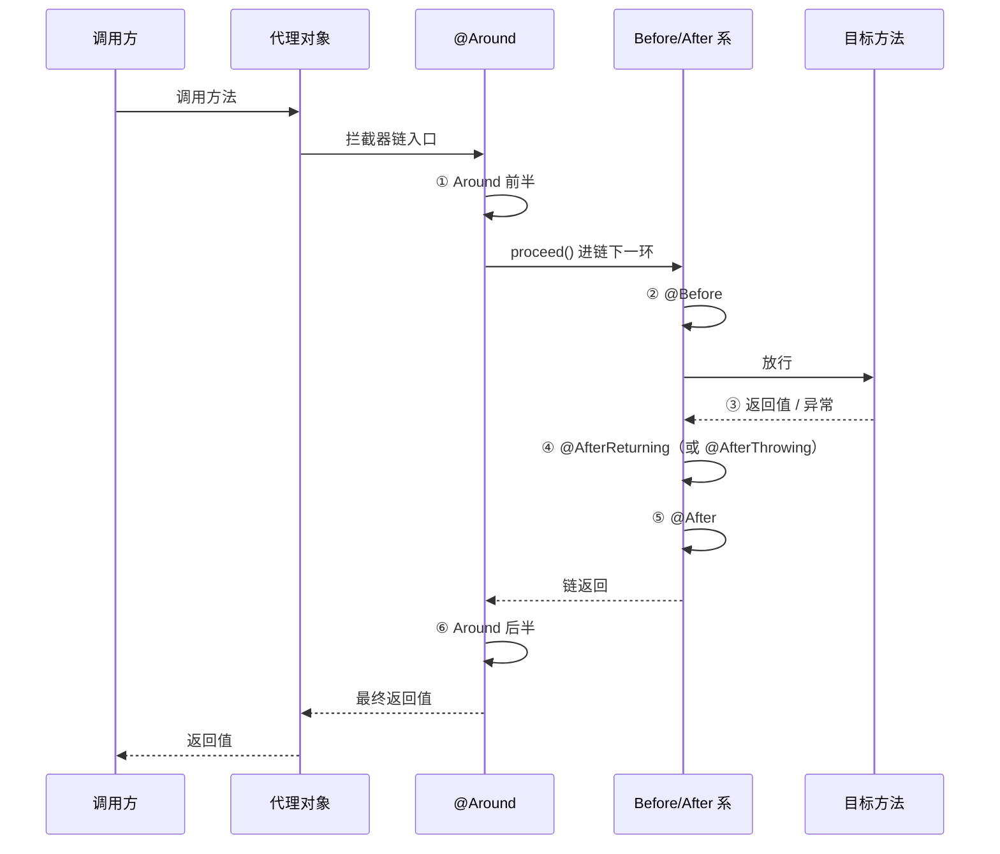

# Spring AOP

## 思维链路速查

```chain
动机与五术语 | 横切逻辑抽走、由代理织回 | 入口
五种通知与顺序 | Around 独控全程，其余只能观察 | API
切点表达式 | execution 六段式 + 指示器组合 | 语法
织入原理 | 动态代理的应用层封装 | 核心
失效边界 | 没走代理就没增强 + 面试 | 陷阱
```

全篇主心骨只有一个：**增强全挂在代理对象上**——切点决定拦谁，通知决定拦住后干什么，而任何没经过代理的调用都拿不到增强。

## 动机：横切关注点

先立术语：**横切关注点**（cross-cutting concern）指事务、日志、权限、限流这类逻辑——它们不属于任何单一业务方法，却以几乎相同的形态散布在大量业务方法里。

```java
// 抽离前：每个业务方法都背一份事务模板
public void transfer(TransferDto dto) {
    try {
        begin();               // 与业务无关，却处处重复
        doTransfer(dto);       // ← 真正的业务只有这一行
        commit();              // 与业务无关
    } catch (Exception e) {
        rollback();            // 与业务无关
        throw e;
    }
}

// 抽离后：业务方法只写业务，事务整段搬进切面，由框架运行期「织回」
public void transfer(TransferDto dto) {
    doTransfer(dto);
}
```

抽离后 `transfer` 看似丢了事务，但调用方拿到的其实是**代理对象**——事务逻辑在代理层被织回。织回这事手写 [[静态代理]] 也做得到，但一套增强 × N 个目标类就得手写 N 个代理类；运行期自动生成代理（机制见 [[动态代理]]）才让切面一次声明、处处生效。

## 概念五术语

> [!note] 一句话机制
> 把横切逻辑写进**切面**，容器运行期生成**代理**；调用方调代理 → 代理按**切点**判断拦不拦 → 拦住就插入**通知**。

| 术语 | 定义（先立结构再讲机制） | 在日志切面里对应 |
|---|---|---|
| JoinPoint 连接点 | 程序执行中**可被拦截的时机**。Spring AOP 里只有「方法调用」一种 | 每一次 service 方法调用 |
| Pointcut 切点 | 用表达式**筛出一组 JoinPoint**，回答「拦哪些」 | `execution(* com.demo.service..*.*(..))` 命中的方法 |
| Advice 通知 | 拦截后执行的**横切逻辑本身**，回答「拦住后做什么」 | 记录入参、耗时 |
| Aspect 切面 | Pointcut + Advice 的**组装单位**，回答「在哪拦 + 做什么」 | `@Aspect` 类 |
| Weaving 织入 | 把切面**套到目标上生成代理**的过程 | 容器启动时生成代理 bean |

> [!warning] Spring AOP 是方法级拦截
> 能拦的时机只有方法调用——因为底层是动态代理，代理类只能重写方法（见 [[动态代理]]）；字段读写、构造器、`static` 方法都拦不住。字段/构造器级织入是 AspectJ（编译期改字节码）的能力。

## 五种通知

```java
@Aspect          // 声明切面类；它自己仍须是 Spring bean（配套 @Component）
@Component
public class LogAspect {

    // 切点起名复用：表达式挂在无方法体的方法上，其他通知按名引用
    @Pointcut("execution(* com.demo.service..*.*(..))")
    public void logPointcut() {}

    @Before("logPointcut()")                       // 目标方法执行【前】
    public void before(JoinPoint jp) {
        // jp.getArgs() 入参；jp.getSignature() 方法签名
    }

    // 正常返回【后】；returning 把返回值绑定进参数
    @AfterReturning(value = "logPointcut()", returning = "ret")
    public void afterReturn(JoinPoint jp, Object ret) { /* ret 只读，改引用不生效 */ }

    // 抛异常【后】；throwing 把异常绑定进参数
    @AfterThrowing(value = "logPointcut()", throwing = "ex")
    public void afterThrow(JoinPoint jp, Exception ex) { /* 只观察，吞不掉 */ }

    @After("logPointcut()")                        // 出口处必到（finally 语义）
    public void after(JoinPoint jp) { /* 释放资源类 */ }

    @Around("logPointcut()")                       // 包裹全程，唯一能控制流程的
    public Object around(ProceedingJoinPoint pjp) throws Throwable {
        long t = System.nanoTime();
        try {
            // proceed() = 放行进拦截器链下一环；不调它目标方法不执行
            // proceed(newArgs) 可换入参；返回前可改写返回值、可 catch 吞/转异常
            Object ret = pjp.proceed();
            return ret;
        } finally {
            System.out.println("cost " + (System.nanoTime() - t) + "ns");
        }
    }
}
```

| 通知 | 时机 | 能拿到 | 对异常/返回值的控制权 | 典型用途 |
|---|---|---|---|---|
| `@Around` | 包裹全程 | 全部（`ProceedingJoinPoint`） | 改入参、改返回值、吞/转异常、跳过执行 | 事务、耗时、缓存、限流 |
| `@Before` | 目标前 | 入参、签名 | 无，只能观察 | 权限、参数校验 |
| `@AfterReturning` | 正常返回后 | 返回值 | 读返回值；改引用不生效 | 结果审计 |
| `@AfterThrowing` | 抛异常后 | 异常对象 | 只观察，异常照常外抛 | 异常上报 |
| `@After` | 出口（finally） | 入参、签名 | 无，正常/异常都必到 | 释放资源 |

> [!danger] proceed() 不调用，目标方法不执行
> `@Around` 里忘写 `pjp.proceed()` → 业务方法静默不跑，也不报错。这是 `@Around` 最常见的翻车点；反过来，缓存命中时「不 proceed、直接 return」恰恰是它的正确用法。

## 切点表达式

`execution` 六段式逐段标注（可跟读示例）：

```java
execution(* com.demo.service..*.find*(..))
//       │  │               │   │    │
//       │  │               │   │    └ 参数：.. = 任意个、任意类型
//       │  │               │   └ 方法名：find 开头（* = 任意）
//       │  │               └ 类：包下任意类（* = 任意类）
//       │  └ 包：com.demo.service 及其所有子包（.. = 跨任意层级）
//       └ 返回值：* = 任意（修饰符与异常段可省略）
```

常用指示器只留高频五个：

| 指示器 | 匹配什么 | 示例 |
|---|---|---|
| `execution` | 方法签名（主力） | 见上 |
| `within` | 某类/某包内所有方法 | `within(com.demo.service..*)` |
| `@annotation` | **方法上**带某注解 | `@annotation(org.springframework.transaction.annotation.Transactional)` |
| `@within` | **类上**带某注解 | `@within(org.springframework.stereotype.Service)` |
| `bean` | bean 名（Spring 扩展） | `bean(*ServiceImpl)` |

指示器可用 `&&`、`||`、`!` 组合。最实用的一招——注解值直接绑进通知参数：

```java
// 方法上标了 @Log 才生效，注解实例整体绑进 log 参数
@Before("@annotation(log)")
public void before(JoinPoint jp, Log log) { /* 直接读 log.value() */ }
```

## 执行顺序

同一 Aspect 内（Spring 5.2.7 / Boot 2.3 起固定序）：

```chain
@Around 前半 | proceed() 之前的代码 | 1
@Before | 进场的最后关卡 | 2
目标方法 | 真正的业务逻辑 | 3
@AfterReturning | 拿到返回值（或 @AfterThrowing 拿到异常） | 4
@After | finally 语义，兜底必到 | 5
@Around 后半 | proceed() 之后的代码 | 6
```

异常路径把第 3 步换成「抛出」：`@AfterThrowing` → `@After` → 异常继续向外抛（`@Around` 不 catch 就跟着外抛）。

<details>
<summary>展开时序图</summary>



</details>

> [!danger] 报顺序先报版本
> 5.2.7 起（Boot 2.3+）才保证 `@AfterReturning`/`@AfterThrowing` 先于 `@After`（官方 #25186；此前同切面 after 类通知的相对顺序依赖 `getDeclaredMethods()` 的返回序，Java 7 起无保证，不可靠）。老资料给出的顺序五花八门，皆因版本不同。

跨切面的先后由 `@Order` 控制：**值小的切面优先级高，包在外层**——先进后出：

```chain
@Order(1) 切面 | 先进入、后退出 | 外层
@Order(2) 切面 | 后进入、先退出，贴近目标 | 内层
```

## 织入原理：动态代理的应用层封装

> [!note] 一句话机制
> Spring AOP 没有发明新拦截技术——容器用 [[动态代理]] 生成代理 bean，把命中的通知按序编成**拦截器链**挂进代理。调用代理方法 = 依次过链；`pjp.proceed()` 就是链上「调用下一环」，链尽头才是 `method.invoke(target, args)`。

代理选型那边已有结论，这里只对位概念：

| AOP 概念 | 落到动态代理上是 |
|---|---|
| 通知方法 | handler / `MethodInterceptor` 里的一段增强逻辑 |
| 拦截器链 | handler 内按序执行的增强序列 |
| `@Around` 的 `proceed()` | `method.invoke(target, args)`（JDK）/ `proxy.invokeSuper(obj, args)`（CGLIB） |
| 织入 | `Proxy.newProxyInstance` / `Enhancer.create` 的框架化调用 |

代理选型速记：纯 Spring Framework 有接口默认 JDK Proxy，无接口退 CGLIB；**Boot 2.0+ 默认 `proxyTargetClass=true`，一律 CGLIB**。

## 失效边界

根因只有一句：**增强全挂在代理对象上，没走代理就没增强**。

| 场景 | 为什么失效 |
|---|---|
| 同类自调用 `this.methodB()` | `this` 是原始对象，不是代理；拦截器链根本没被触发 |
| `private` / `final` / `static` 方法 | 代理的字节码覆盖不了它们（边界详见 [[动态代理]]） |
| `new` 出来的对象 | 不归容器管，压根没有代理 |
| 目标类为 `final` | CGLIB 生成不了子类，代理都建不出来 |

修法（对自调用）：拆到另一个类，或注入自身代理，或 `AopContext.currentProxy()`（需开启 `exposeProxy = true`）。`@Transactional` 的自调用失效正是这一条的头号案例。

<details>
<summary>面试问答 (5题)</summary>

Q：Spring AOP 和 AspectJ 的区别？

A：Spring AOP 运行期动态代理织入，只能拦方法调用，零额外编译成本；AspectJ 编译期/类加载期改字节码，能拦字段、构造器、static 方法，功能更全但要 ajc 编译器。Spring 的 @AspectJ 风格只借用了注解语法，底层仍是动态代理。

Q：五种通知的执行顺序？

A：Spring 5.2.7 / Boot 2.3+ 同一切面内：Around 前半 → Before → 目标方法 → AfterReturning → After → Around 后半；异常时 AfterReturning 换成 AfterThrowing，且异常继续外抛。跨切面看 @Order，值小的在外层。5.2.7 之前 after 类通知间顺序不可靠，面试先报版本。

Q：@Around 相比 @Before + @After 的不可替代点？

A：@Around 能控制流程：proceed() 决定目标执不执行、proceed(newArgs) 换入参、返回前改写返回值、catch 后吞/转异常；四个时机型通知全部只能观察。事务提交回滚、缓存命中跳过执行、限流拒绝都必须 @Around。

Q：Spring AOP 为什么基于动态代理，自调用为什么失效？

A：织入发生在运行期，唯一手段就是把目标包进代理对象，增强全挂在代理上。同类里 this.methodB() 的 this 是原始对象，调用没经过代理，拦截器链自然不触发。修法：拆类、注入自身代理、AopContext.currentProxy()。

Q：execution(* com.demo.service..*.*(..)) 各段什么含义？

A：返回值任意；service 包及其所有子包（.. 跨层）；任意类、任意方法；任意个任意类型参数。

</details>

<details>
<summary>常见误区 (4条)</summary>

- 误区：@AfterThrowing 捕获异常后异常就没了。它只是旁路观察者，异常照常向外传播；想吞掉或转成别的异常只能在 @Around 里 try/catch proceed()。
- 误区：@AfterReturning 里给返回值参数重新赋值能改结果。改的是绑定副本的指向，调用方拿到的还是原返回值；改返回值只能 @Around。但若返回值是可变对象，改它的字段会反映到调用方（同一引用）。
- 误区：写了 @Aspect 注解切面就生效。切面类还必须是 Spring bean（@Component 或 @Bean 注册）；纯 Spring Framework 还要 @EnableAspectJAutoProxy，Boot 已自动开启。
- 误区：@Around 方法体最后必须 return proceed()。return 什么由业务定（缓存命中可提前 return 缓存值），铁律只有一条：想让目标执行就必须调用 proceed()。

</details>
