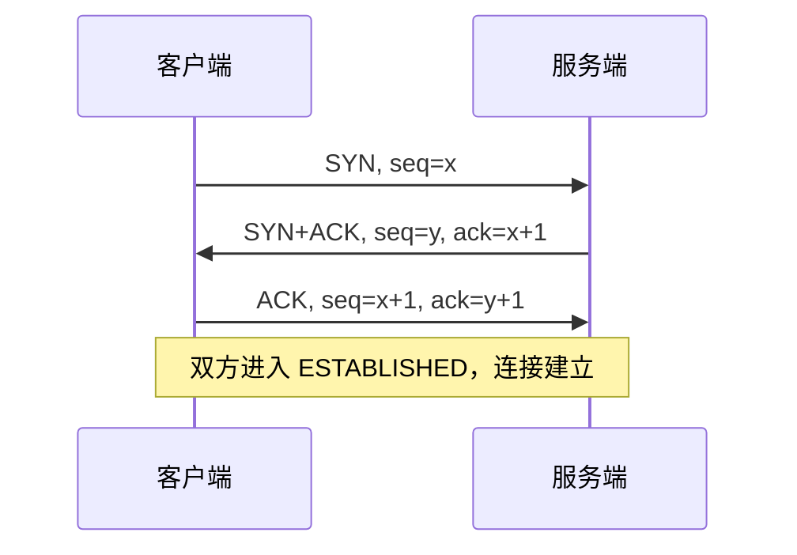
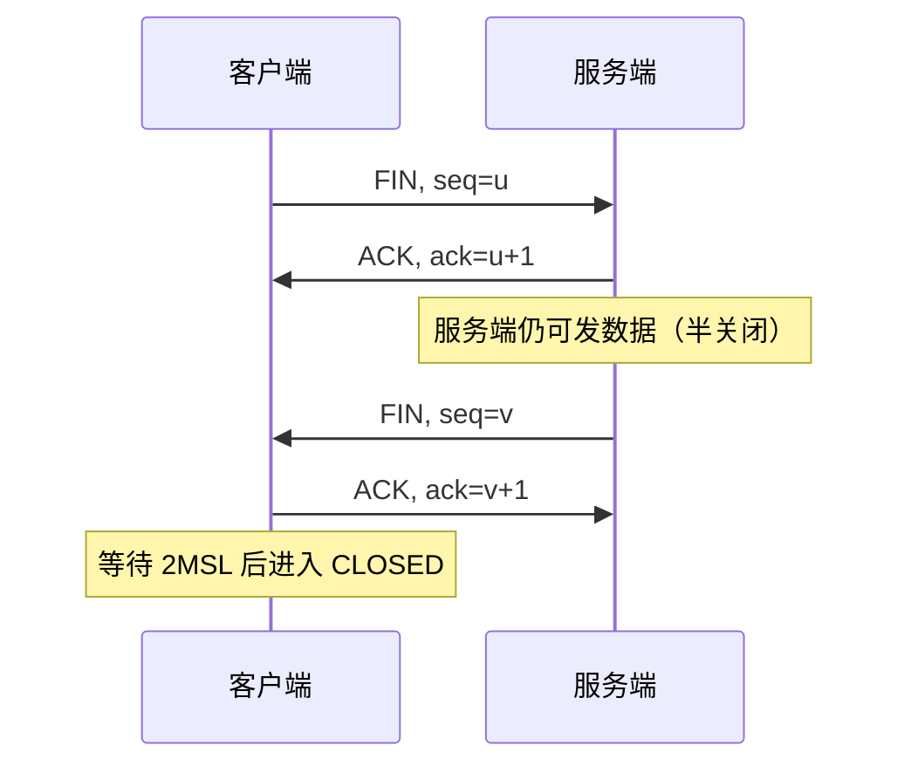

# TCP

## 思维链路速查

```chain
协议定位 | 与 UDP 的分野 | 前提
建连与断连 | 三次握手 · 四次挥手 | 连接
可靠与效率 | 重传 · 滑动窗口 | 传输
流量与拥塞 | rwnd 与 cwnd 取小 | 控制
面试问答 | 高频考点 | 复盘
```

三次握手建连、四次挥手断连 → 序列号 / 确认 / 重传保证可靠 → 滑动窗口同时承载流量与拥塞控制，发送窗口取二者最小值。[[HTTP]]、[[HTTPS]] 等应用层协议均承载于 TCP 之上。

## 协议定位与对比

| 维度 | TCP | UDP |
|---|---|---|
| 连接 | 面向连接（握手建连） | 无连接 |
| 可靠性 | 不丢、不重、按序 | 尽力交付，不保证 |
| 传输单位 | 字节流 | 数据报 |
| 流量 / 拥塞控制 | 有 | 无 |
| 首部开销 | 20 字节起 | 8 字节 |
| 校验和 | 必选（覆盖伪首部） | IPv4 可选（可置 0 跳过，现代实现默认开启）；IPv6 强制 |
| 适用场景 | 文件、网页、邮件 | 实时音视频、DNS、游戏 |

> [!note] 定位
> TCP 在 IP 之上提供端到端的可靠字节流；同属 [[计算机网络]] 传输层，[[UDP]] 走另一条路线。

## 三次握手

三次握手本质不是为了「确认对方在线」，而是**协商初始序列号并同步窗口信息**，为后续可靠传输与流量控制铺路。

```chain
客户端 SYN | seq=x | 第一次
服务端 SYN+ACK | seq=y, ack=x+1 | 第二次
客户端 ACK | seq=x+1, ack=y+1 | 第三次
```

<details>
<summary>展开三次握手时序图</summary>



</details>

> [!warning] 为什么是三次
> 两次不够：服务端无法确认客户端能收；三次让双方都确认「自己能发、对方能收」。第三次可携带数据。

> [!note] 初始序列号 ISN 为何随机
> 不从 0 开始：① 防历史连接旧报文被误认成新连接的合法数据（防序列号缠绕）；② 可预测 ISN 易被伪造 RST 包强制断连（RST 攻击）。

> [!danger] SYN 泛洪
> 攻击方只发 SYN 不回 ACK，撑爆服务端半连接队列 → 资源耗尽。

> [!tip] 防护
> SYN Cookie、调大 `listen` backlog、限速。

## 四次挥手

<details>
<summary>展开四次挥手时序图</summary>



</details>

> [!note] 为什么是四次
> TCP 全双工，关闭需双向各发 FIN/ACK。服务端收到 FIN 先回 ACK，待自身数据发完再发 FIN，故 ACK 与 FIN 分开 → 四次。

> [!tip] TIME_WAIT 与 2MSL
> 主动关闭方保持 2MSL：确保最后 ACK 抵达，并让旧报文消亡避免新连接误收。

> [!warning] TIME_WAIT 堆积
> 主动关闭方端口耗尽 → 调 `tcp_tw_reuse` / `SO_REUSEADDR` 或改长连接。

> [!warning] CLOSE_WAIT 堆积
> 服务端未调 `close()` → 查应用代码，非调内核。

## 可靠传输机制

| 机制 | 作用 |
|---|---|
| 序列号 / 确认号 | 保证字节有序、去重 |
| 超时重传 RTO | 未收到 ACK 则重发，RTO 随 RTT 动态估算 |
| 累积确认 | ACK=n 表示 n 之前全部收到 |
| 滑动窗口 | 批量发送、流水线，提高吞吐 |

> [!warning] 丢包判定
> 超时 或 连续 3 个重复 ACK（快重传触发点）→ 判定丢包并重传，无需等待超时。

> [!note] 线上丢包排查
> `ss -ti` 看重传率 / RTT；`tcpdump` 抓重复 ACK 判断丢包；`netstat -s` 看全局重传统计。一行命令即可定位是否重传、RTT 是否异常。

## 流量控制

接收方通过 **窗口字段** 通告剩余缓冲区。

> [!tip] 核心公式
> 发送窗口 = min(接收窗口 rwnd, 拥塞窗口 cwnd)。rwnd 防压垮接收方（流量控制），cwnd 防压垮网络（拥塞控制），二者独立、取小生效。

> [!danger] 糊涂窗口综合征
> 接收方腾出极小窗口、发送方发极小报文 → 信道利用率骤降。解法：接收方凑够空间再通告（Clark 算法）、发送方用 Nagle 算法攒批。

> [!note] 零窗口
> 接收方缓冲区满 → 通告窗口=0，发送方停止发送并启动持续探测（零窗口探测报文）待窗口恢复。

## 拥塞控制

以「网络不超载」为目标，发送方维护拥塞窗口 cwnd：

| 阶段 | 行为 | 触发 |
|---|---|---|
| 慢启动 | cwnd 指数增长（每 RTT 翻倍） | 连接初 / 超时后 |
| 拥塞避免 | cwnd 线性增长（+1 MSS/RTT） | cwnd ≥ ssthresh |
| 快重传 | 收 3 个重复 ACK 即重传 | 丢包（未超时） |
| 快恢复 | ssthresh=cwnd/2，cwnd=ssthresh，线性增长 | 快重传后 |

> [!tip] 超时 vs 快重传
> 超时 = 网络可能重度拥塞 → 重置 cwnd=1 回到慢启动；3 重复 ACK = 轻度丢包 → 快恢复，不归零。两者均将 ssthresh 减半。

> [!note] Reno / Tahoe 差异
> 快重传后是否进快恢复看实现：TCP Reno 进快恢复（ssthresh=cwnd/2 后线性增长）；TCP Tahoe 仍回慢启动（cwnd=1）。现代 Linux 多为 Reno / CUBIC 变体（CUBIC 在拥塞避免段改用立方函数而非线性）。

<details>
<summary>面试问答 (3题)</summary>

Q：TCP 如何保证可靠传输？

A：序列号 + 确认号保证有序去重；超时重传与快重传补丢包；滑动窗口提升吞吐；校验和丢弃坏包。

Q：TIME_WAIT 为什么需要 2MSL？

A：确保最后 ACK 抵达对端；让本连接残余报文在网络中消亡，避免被新连接误收。

Q：拥塞控制与流量控制区别？

A：流量控制是接收方能力约束（窗口匹配接收缓冲）；拥塞控制是网络整体负载约束（避免网络过载）。发送窗口取二者最小值。

</details>

<details>
<summary>常见误区 (3条)</summary>

- 误区：握手 / 挥手次数可随意减少。三次握手与四次挥手由全双工与确认必要性决定，少一次都无法双向确认。
- 误区：流量控制 = 拥塞控制。前者防压垮接收方，后者防压垮网络，二者独立。
- 误区：UDP 不可靠就没用。实时音视频、DNS 等场景要低延迟，丢一两包优于等待重传，UDP 更合适。

</details>
