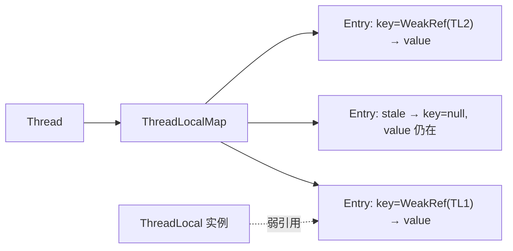

# ThreadLocal

## 思维链路速查

```chain
线程封闭 | 为什么不用共享 | 起因
ThreadLocalMap | 副本存哪、key 是谁 | 结构
弱引用与泄漏 | 为什么 remove 不可省 | 陷阱
落地：用法 | 代码与线程池场景 | 实战
面试问答 | 高频考点 | 复盘
```

ThreadLocal 给每个线程一份独立变量副本，用「不共享」绕开同步；副本存在线程自己的 ThreadLocalMap 里，key 是弱引用的 ThreadLocal 本体、value 是强引用——线程池复用线程又不 remove，副本就跟着线程一直活。

## 线程封闭：解决什么

| 场景 | 共享写法 | ThreadLocal 写法 |
|---|---|---|
| 上下文透传（traceId / 用户） | 每层方法加参数 | 存副本，任意层直接取 |
| 非线程安全工具类 | 每次 new / 加锁 | 每线程一份 SimpleDateFormat |
| 事务连接绑定 | 连接池加锁分配 | 线程与连接一对一 |

> [!note] 它不做同步，只做隔离
> 副本之间互不可见，天然没有竞争；但对象本身若被多线程共享（如把副本里的引用传出去），该加锁还得加锁——[[synchronized]]、[[Java 锁]] 的领地不受影响。

## ThreadLocalMap：副本存在哪

```chain
Thread | 持有 threadLocals 字段 | 宿主
ThreadLocalMap | 首次 set 才创建 | 容器
Entry[] | 开放地址法存 KV | 结构
key / value | 弱引用 TL 本体 / 强引用副本 | 泄漏源头
```

| 组件 | 职责 | 边界 |
|---|---|---|
| ThreadLocal | 提供 set / get / remove 入口 | 本身不存值，只当 key |
| ThreadLocalMap | 每线程一张，存该线程全部副本 | 挂在 Thread 上，不在 ThreadLocal 上 |
| Entry | key 弱引用 + value 强引用 | key 被回收后成 stale entry |

- 哈希按黄金分割增量 `0x61c88647` 分配 threadLocalHashCode，冲突走**线性探测**（开放地址法），与 [[HashMap]] 的链地址 + 红黑树不同。
- 初始容量 16，扩容阈值 `len × 2/3`；触发时先清 stale entry，剩余 size ≥ 阈值的 3/4 才真正扩容两倍。

<details>
<summary>展开结构图</summary>



</details>

## 弱引用 key 与内存泄漏

```chain
线程复用 | 线程池核心线程常驻 | 前提①
副本残留 | 任务结束未 remove | 前提②
强引用链 | Thread → Map → Entry → value | 前提③
内存泄漏 | 过期副本堆在老年代 | 结果
```

- key 弱引用：外部对 ThreadLocal 的强引用断开后，GC 即可回收本体、key 变 null，Entry 才有机会被清。
- value 强引用：value 的可达链是 `Thread → threadLocals → Entry → value`，线程不死，value 就不释放。

> [!danger] 两处必须 remove
> ① 线程池任务结束：`finally { tl.remove(); }`，否则副本随线程回池，下个任务读到脏数据；
> ② `static final ThreadLocal` 常量：key 永远强引用，Entry 永远不会 stale，value 泄漏更彻底——加 static 不等于安全。

- set / get / remove 会顺手清掉沿途 stale entry（启发式清理），**不保证及时**，不能当兜底。
- 泄漏还有副产品：脏数据串任务，前一个任务的用户上下文被后一个任务读到。

## 落地：用法与线程池场景

```java
private static final ThreadLocal<SimpleDateFormat> FMT =
        ThreadLocal.withInitial(() -> new SimpleDateFormat("yyyy-MM-dd"));

void handle() {
    try {
        FMT.get().parse("2026-09-18");
    } finally {
        FMT.remove();     // 池化线程必须清，否则副本跟着线程活
    }
}
```

- `withInitial` 是懒初始化：首次 get 才创建副本，省掉无谓的对象。
- 线程池场景成对写：入口设值、出口 remove；上下文透传交给过滤器 / 拦截器统一收口。

## 派生：子线程怎么传

| 方式 | 传递时机 | 线程池下 |
|---|---|---|
| InheritableThreadLocal | `new Thread()` 时从父线程拷一份 | 失效：线程复用，拷贝只发生一次 |
| TransmittableThreadLocal（阿里 TTL） | 提交任务时抓取、执行前回放 | 可用：把 Runnable 包一层 |
| ScopedValue | 作用域内只读，出作用域自动失效 | JDK 25 转正（JEP 506），虚拟线程首选 |

> [!tip] 虚拟线程别硬套 ThreadLocal
> 虚拟线程支持 ThreadLocal，但百万级线程 × 每线程一份副本 = 内存放大；JDK 25 起改用不可变、有作用域的 ScopedValue（详见 [[虚拟线程]]）。

<details>
<summary>面试问答 (4题)</summary>

Q：ThreadLocal 的实现原理？

A：每个 Thread 持有一张 ThreadLocalMap，key 是 ThreadLocal 的弱引用、value 是副本；set / get 都以当前线程为入口查自己的表，所以线程间互不可见。

Q：为什么 key 要设计成弱引用？

A：ThreadLocal 本体没人用时，弱引用让它被 GC 回收、key 变 null，Entry 才有机会被清理；强引用的话 Map 一直持有本体，连本体一起泄漏。

Q：ThreadLocal 为什么还会内存泄漏？

A：value 是强引用，可达链 `Thread → ThreadLocalMap → Entry → value`；线程池线程常驻且未 remove，value 就一直可达。弱引用只保住 key，救不了 value。

Q：父子线程怎么传递 ThreadLocal？线程池里为什么不灵？

A：用 InheritableThreadLocal，它在 `new Thread()` 时从父线程拷贝副本；线程池的线程是复用的，拷贝只在建线程时发生一次，所以读到旧值——须用 TTL 这类在提交任务时抓取的方案。

</details>

<details>
<summary>常见误区 (3条)</summary>

- 误区：ThreadLocal 能替代锁保证并发安全。它只做线程隔离；共享对象仍需 [[Java 锁]]，副本里的引用也可能被逸出。
- 误区：有弱引用就不用 remove。弱引用只作用于 key，value 仍强引用可达（判定见 [[JVM 垃圾回收]]）。
- 误区：副本存在 ThreadLocal 里。副本存在 Thread 的 threadLocals 字段上，ThreadLocal 只是取用的 key。

</details>
