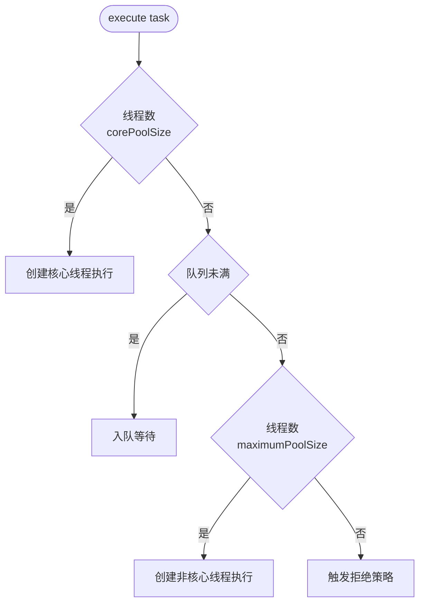
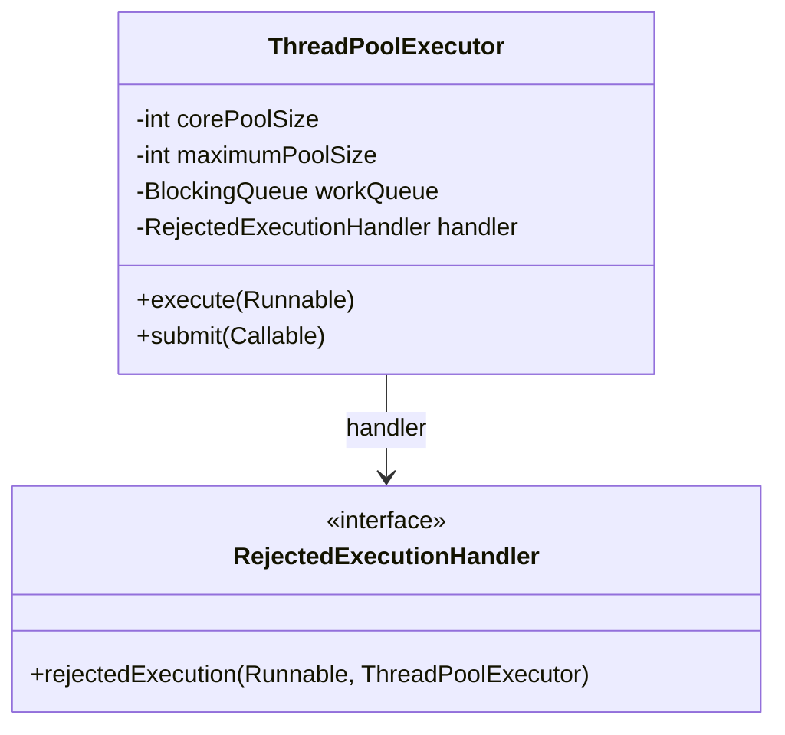

# ThreadPoolExecutor

## 思维链路速查

```chain
七大参数 | 7 个旋钮 | 配置
执行路径决策 | 任务如何路由 | 核心
落地：构造示例 | 代码与陷阱 | 实战
面试问答 | 高频考点 | 复盘
常见误区 | 避坑清单 | 收尾
```

七个参数是旋钮，执行路径才是主线：核心线程 → 队列缓冲 → 扩容 → 拒绝，一条路串起每个旋钮的生效时机 —— 最后落到代码陷阱与常见误区复盘。

## 七大参数

| 参数 | 作用 | 注意 |
|---|---|---|
| corePoolSize | 常驻核心线程数 | 默认不会被回收 |
| maximumPoolSize | 队列满后扩容上限 | 须 ≥ corePoolSize |
| keepAliveTime | 空闲线程存活时间 | 仅作用于超出核心的线程 |
| workQueue | 任务缓冲队列 | 容量决定何时触发扩容 |
| threadFactory | 线程创建工厂 | 可定制名称 / 守护属性 |
| handler | 拒绝策略 | 默认 AbortPolicy 抛异常，详见 [[拒绝策略]] |
| allowCoreThreadTimeOut | 核心线程是否超时回收 | 默认 false |

> [!warning] 关键提醒
> 默认 AbortPolicy 直接抛异常；高吞吐场景用 CallerRunsPolicy 让调用方自己跑，避免雪崩。行为差异见 [[拒绝策略]]。

> [!note] 容量公式
> 合理容量 ≈ 峰值 QPS × 平均耗时。队列过短易触发拒绝，过长易 OOM；队列选型见 [[阻塞队列]]。

> [!tip] 调参顺序
> 先压测得峰值 QPS 与平均耗时 → 估算队列容量 → corePoolSize 按任务类型估算（CPU 密集 ≈ N_cpu+1，IO 密集 ≈ N_cpu×U×(1+W/C)，粗略 2N）→ 压测验证。公式详见 [[阻塞队列]]。

## 执行路径决策

任务提交后的路由顺序：

```chain
提交任务 | execute / submit | 入口
核心线程 | 直接执行 | 满
工作队列 | 入队缓冲 | 满
最大线程 | 扩容执行 | 满
拒绝策略 | handler 兜底 | 全满
```

<details>
<summary>展开决策流程图</summary>



</details>

> [!note] 与流程图的差异
> 上面的流程图回答「走哪条路」，调用方关心的是「谁来跑」：直接执行与扩容执行都落到工作线程，入队与拒绝则根本没出线程池边界。

## 落地：构造示例

> [!note] 关键前提
> 合理设置队列容量与拒绝策略，防止资源耗尽。属于 [[JUC]] 并发工具包的核心能力。

```java
ThreadPoolExecutor ex = new ThreadPoolExecutor(
    4, 8, 60, TimeUnit.SECONDS,
    new LinkedBlockingQueue<>(100));
```

<details>
<summary>展开核心类图</summary>



</details>

> [!danger] 工厂方法陷阱
> 避免使用 Executors.newFixedThreadPool / newSingleThreadExecutor 等工厂方法创建的线程池，底层使用无界 [[阻塞队列]]，任务持续堆积可能撑爆内存。

<details>
<summary>面试问答 (2题)</summary>

Q：为什么不建议用 Executors.newFixedThreadPool？

A：它使用无界 LinkedBlockingQueue，任务堆积可能撑爆内存；应手动指定队列容量与拒绝策略。

Q：核心线程会被回收吗？

A：默认不会；设 allowCoreThreadTimeOut(true) 后，核心线程也会按 keepAliveTime 回收。

</details>

<details>
<summary>常见误区 (3条)</summary>

- 误区：线程数越多越好。实际受 CPU 核数与任务类型（CPU/IO 密集）约束。
- 误区：队列越大越安全。无界队列隐藏反压，任务堆积终致 OOM。
- 误区：拒绝策略 = 异常 = 故障。CallerRunsPolicy 是合法的兜底，会形成天然背压。

</details>
