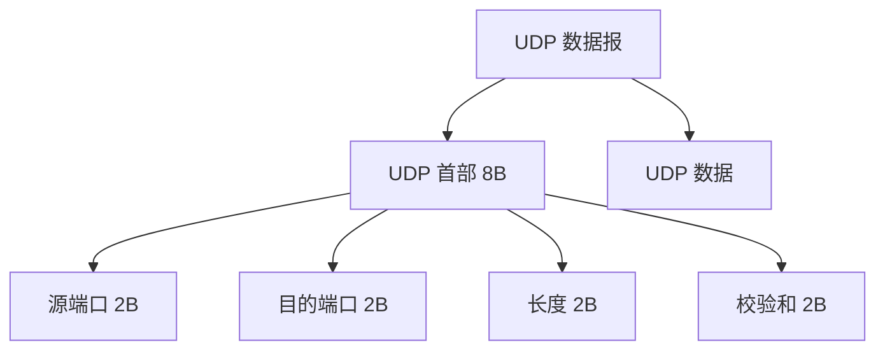

# UDP

## 思维链路速查

```chain
协议定位 | 与 TCP 的分野 | 前提
首部与特点 | 8 字节 · 数据报边界 | 骨架
校验和 | 伪首部差错检测 | 检测
工程陷阱 | MTU · 截断 · 放大 | 避坑
选型与面试 | 何时选 UDP | 复盘
```

UDP 是传输层无连接的「尽力交付」协议：8 字节极简首部、无握手无重传，以数据报为单位发送，适合实时与查询类低延迟场景，对照 [[TCP]] 走另一条路线。

## 协议定位与对比

| 维度 | UDP | TCP |
|---|---|---|
| 连接 | 无连接 | 面向连接（握手建连） |
| 可靠性 | 尽力交付，不保证到达 / 不重 / 有序 | 不丢、不重、按序 |
| 数据有序性 | 不保证，乱序到达需应用层排序 | 严格按序交付 |
| 传输单位 | 数据报（保留消息边界） | 字节流（无边界） |
| 全双工 | 支持对称收发，但无连接状态 | 面向连接的全双工 |
| 流量 / 拥塞控制 | 无 | 有 |
| 首部开销 | 8 字节固定 | 20 字节起 |
| 校验和 | 标准强制（现代实现默认开启），IPv4 允许置 0 但生产极少关闭；IPv6 强制 | 必选（覆盖伪首部） |
| 广播 / 多播 | 支持 | 不支持 |
| 适用场景 | 实时音视频、DNS、游戏 | 文件、网页、邮件 |

> [!note] 定位
> UDP 在 IP 之上仅提供「多路复用 + 差错检测」，把可靠、顺序、拥塞全交给应用层；同属 [[计算机网络]] 传输层，与 [[TCP]] 互补而非劣化版。

## 首部格式

UDP 首部固定 8 字节，无变长选项：

| 字段 | 字节 | 作用 |
|---|---|---|
| 源端口 | 2 | 可选，不需回包可置 0 |
| 目的端口 | 2 | 必填，接收方多路复用依据 |
| 长度 | 2 | 首部 + 数据总长，最小 8；**不表示 IP 层总长度** |
| 校验和 | 2 | 标准强制（现代 OS 默认开启）；失败直接丢弃 |

> [!tip] 极简即优势
> 无序列号、确认、窗口字段 → 首部零协商开销；发方拼好首部即转发，单包延迟仅由链路决定。

> [!warning] 长度字段与 IP 分片
> UDP「长度」是原始数据报长度；若 IP 层分片，每个分片里的 IP 总长会小于 UDP 长度，不可混为一谈。

<details>
<summary>展开首部封装图</summary>



</details>

## 核心特点

| 特点 | 含义 | 影响 |
|---|---|---|
| 无连接 | 发前不握手、不维护连接状态 | 单包独立、延迟最低 |
| 尽力交付 | 不保证到达 / 不重 / 有序 | 无重传、无确认，丢包静默 |
| 数据报边界 | send 一次 ≈ recv 一次 | 应用层按消息收发，不像 TCP 需自己拆流 |
| 无拥塞控制 | 发送速率不随网络状况收敛 | 网络拥塞时可能批量丢包，需应用层限速 |
| 无状态 | 服务端无需保存每连接上下文 | 易做高并发、可水平扩展，但也易成反射放大源 |

> [!warning] 数据报边界 ≠ 可靠
> UDP 保留消息边界，但单次 send 超过 MTU 会被 IP 分片；任一片丢失整包作废。大数据走 UDP 仍要应用层做分片 / 确认。

> [!danger] 接收缓冲区截断
> `recvfrom` 传入缓冲区小于实际数据报长度时，**剩余字节被内核静默丢弃**（Linux / macOS 不报错）。建议缓冲区 ≥ 65535 或用 `MSG_TRUNC` 探测实际长度。

## 校验和

- 覆盖 **伪首部 + UDP 首部 + 数据**；伪首部含源 / 目的 IP、协议号（17）、UDP 长度 → 防错投到错误主机 / 端口。
- **标准强制**：几乎所有现代操作系统默认开启；IPv4 首部虽允许置 0，生产环境极少关闭；**IPv6 强制**，为 0 则收端丢弃。
- 检测到差错直接丢弃，不通知发送方（无重传机制）。

> [!note] 伪首部不参与传输
> 伪首部是临时构造、仅用于校验计算，不会真的出现在网络上；它的存在是为了让传输层能验证「IP 层没把包送错地方」。

## 工程陷阱

| 陷阱 | 后果 | 工程应对 |
|---|---|---|
| IP 分片 | 任一分片丢失整包作废；中间设备易丢大包 | 应用层控制单包 < MTU（常用 1400B），或自研分片 |
| 接收缓冲区满 | 无流量控制，新包直接丢弃 | 加大 `rmem`、应用层 ACK 反馈、限速 |
| 反射放大攻击 | 无状态 + 小请求大响应 → 被利用做 DDoS | 源 IP 限速、请求验证、QUIC Retry / Cookie |
| sendto 成功 ≠ 送达 | 仅进入内核发送队列 | 应用层回包确认或 QUIC 化 |

> [!tip] 大包策略
> DNS 响应 > 512B、游戏快照、日志上报等大 UDP 包，优先在应用层拆成 ≤ 1400B；宁可多发几小包，也别触发 IP 分片。

> [!danger] 无状态双刃剑
> 无状态让服务端高并发扩展容易，也让 NTP / DNS / SSDP 等协议成为反射放大攻击重灾区。对外暴露 UDP 服务必须做源验证与限速。

## 适用场景

| 场景 | 选 UDP 的原因 |
|---|---|
| 实时音视频 / 通话 | 偶发丢包 < 重传等待，宁可丢帧保流畅 |
| DNS / DHCP / SNMP | 单请求单响应、报文短小，握手开销不划算 |
| 多人在线游戏 | 高频小包、可容忍少量丢；关键帧重传 + 非关键帧丢弃 + FEC |
| 广播 / 多播 | TCP 仅点对点，UDP 天然支持一对多 |
| QUIC / HTTP3 / RTP | 在 UDP 之上自建可靠 / 加密 / 多路复用，见 [[HTTP]] |
| VPN / 隧道（WireGuard / IPSec） | 基于 UDP 承载加密隧道，规避 TCP 头阻塞，性能优于 TCP 隧道 |

> [!tip] 现代趋势
> QUIC 把 [[TCP]] 的可靠、拥塞、TLS 搬进用户态跑在 UDP 上，规避内核协议栈改造成本，是 HTTP/3 的承载层（见 [[HTTP]] / [[HTTPS]]）；游戏常用 RUDP / FEC（前向纠错）只在关键帧做重传，是「UDP 不可靠但好用」的典型反证。

<details>
<summary>面试问答 (4题)</summary>

Q：UDP 如何实现可靠传输？

A：UDP 本身不保证可靠；需可靠时由应用层在 UDP 上自建序列号、确认、重传与超时（如 QUIC、RTP+RTCP、游戏自研协议）。

Q：UDP 有粘包问题吗？

A：没有。UDP 保留数据报边界，recvfrom 一次取到完整一个数据报；「粘包」是 TCP 字节流无边界引发的，需应用层自己定界。

Q：为什么 DNS 用 UDP 而不是 TCP？

A：DNS 查询多为单请求单响应、报文 < 512 字节，走 UDP 免握手、延迟低；仅在响应超 512 字节（或区域传送）时回落 TCP。

Q：UDP Client 一直高速发包，Server 处理不过来会怎样？

A：UDP 没有流量控制 / 背压，Server 内核接收缓冲区（`rmem`）满后，后续数据报被**直接丢弃**，Client 完全不知 Server 已过载——除非应用层有 ACK 反馈或限速机制。

</details>

<details>
<summary>常见误区 (4条)</summary>

- 误区：UDP 不可靠 = 没用。实时音视频、DNS、游戏等要低延迟，丢一两包优于等重传，UDP 更合适。
- 误区：UDP 校验和保证可靠。校验和仅检测差错并丢弃，不重传不通知，与可靠性无关。
- 误区：UDP 一定比 TCP 快。小数据单连接时 UDP 省握手确实快；但要做可靠 + 拥塞控制，应用层重写一遍未必比 TCP 高效。
- 误区：UDP `sendto` 成功 = 对端收到。成功只说明数据进入内核发送队列；网络拥堵时中间路由器直接丢弃，发送端无感。

</details>
