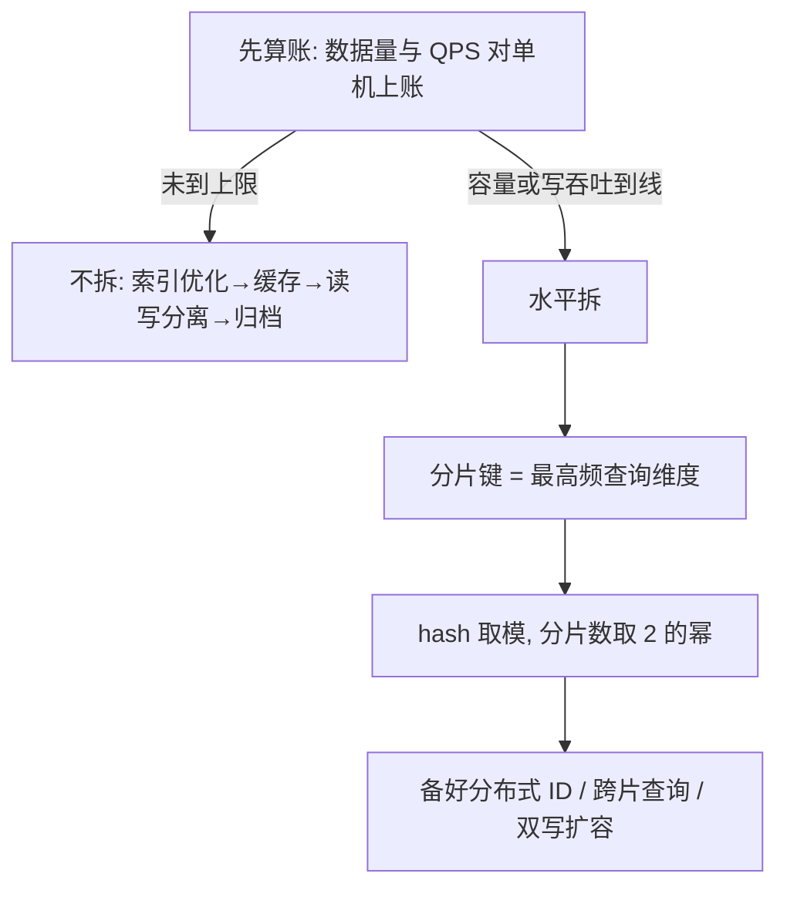

# 分库分表

## 思维链路速查

```chain
先算账 | 容量与吞吐对账单 | 前提
演进阶梯 | 不拆时的替代手段 | 缓兵
四种拆法 | 垂直/水平 × 库/表 | 选型
水平拆决策 | 分片键·算法与数量·代价 | 核心
复盘 | 面试问答与误区 | 收尾
```

拆不拆不由数据量单方面决定：分库分表只为「单机容量」与「单机吞吐」两个上限兜底，先用对账单证明 1000 万 × 1KB ≈ 10GB、QPS 1000 都没碰到；真要拆时，路由跟着最高频查询走，分片数按预期峰值取 2 的幂，代价是分布式 ID、跨片查询与扩容迁移全套跟上来。

> [!important] 心法
> 给数字先算账：数据量对容量、QPS 对吞吐，两项都超线才拆。拆不是升级，是换一套约束——跨片查询、分布式 ID、扩容迁移从上线起长期相伴。

## 先算账：这组数字该不该拆

分库分表只解决两个物理上限：**单机磁盘装不下**、**单机 CPU/IO 扛不住**。逐项对账：

| 维度 | 本题数值 | 单机 MySQL 参考量级 | 结论 |
|---|---|---|---|
| 数据量 | 1000 万行 × 1KB ≈ **10GB** | 经验线：单表 500 万行 / 2GB 后性能渐降 | 略超经验线，离单机上限很远 |
| 索引高度 | 1000 万行 → B+ 树 3~4 层 | 一次主键点查 3~4 次页访问 | 结构未恶化，见 [[MySQL索引为什么用B+树]] |
| QPS | 1000 | 有索引的简单读单机数千 QPS，写约千级 | 未达瓶颈；按峰值评估而非均值 |

> [!note] 为什么 10GB 不算大
> InnoDB 按 16KB 页读写，1KB 的行一页装十几行，千万行树高才 3~4 层；10GB 数据配 16GB 内存机器，buffer pool（InnoDB 的内存数据页缓存）能基本装下热数据，磁盘 IO 很少发生。

> [!warning] 手册原文的警告
> 《阿里巴巴 Java 开发手册》：单表超 500 万行或 2GB 才「推荐」分库分表，并明说「如果预计三年后的数据量根本达不到，请不要分库分表」。经验线不是物理极限，判断依据是查询性能是否仍达标。

<details>
<summary>展开决策流程图</summary>



</details>

## 演进阶梯：不拆先上什么

```chain
索引与 SQL 优化 | 慢查询治理 | 成本最低
缓存 | Redis 把热读挡在 DB 前 | 抗读
读写分离 | 主从复制扩读 | 写仍单点
冷热分离 | 历史数据归档出主表 | 控增速
分库分表 | 拆容量与写吞吐 | 最后手段
```

> [!note] 读写分离救不了写
> 主从复制：主库写 binlog（变更日志），从库回放同步并分担读。它只水平扩「读」，写永远压在主库一台机器上——写瓶颈只能靠分库解决。

> [!warning] 必须拆的触发线
> 单表持续涨破 500万~1000万行且查询明显变慢；或写 QPS 单机顶不住；或单库故障影响面、备份恢复时长已不可接受。中招其一才启动拆分。

## 四种拆法

> [!note] 先立两个词
> 垂直 = 按「列/业务」切，水平 = 按「行」切；库 = 跨实例（机器），表 = 单实例内。

| | 分库（跨实例） | 分表（实例内） |
|---|---|---|
| **垂直**（按业务/列） | 按业务域拆：订单库、用户库、商品库 | 大字段外拆：商品详情 longtext 拆进附表，主表变窄 |
| **水平**（按行） | 同一张表的数据按行分散到多个实例 | 同一张表按行分成 order_0 ~ order_N |

| 拆法 | 解决什么 |
|---|---|
| 垂直分库 | 业务解耦、故障隔离（随微服务走） |
| 垂直分表 | 行变窄 → 单页装更多行 → 树更矮 |
| 水平分库/分表 | 同时顶开容量上限与写吞吐 —— 题目的「1000 万条」指向它 |

单表场景要拆就是水平拆：水平分表打底，写压力涨上来再水平分库。

## 分片键：数据去哪的路由字段

分片键 = 按它的值计算「这条数据落在哪张表」的字段。原则只有一条：**选最高频的查询条件**。订单场景选 user_id，不选订单号：

| 选择 | 路由效果 |
|---|---|
| user_id ✅ | 同一用户的订单 hash 恒定 → 永远同表，「查我的订单」一次只打一个分片 |
| 订单号 ❌ | 同一用户的订单散落全部分片 → 每次查询全分片广播再聚合 |

> [!tip] 按订单号查怎么办：基因法
> 生成订单号时把 user_id 哈希的低几位嵌进订单号固定位置——订单号自带「分片基因」，按订单号也能算出同一分片。多维长尾查询则同步一份到 ES（Elasticsearch 搜索引擎）宽表或建「订单号 → 分片」异构索引表。

## 分片算法与数量

| 算法 | 路由方式 | 优点 | 缺点 |
|---|---|---|---|
| hash 取模 | hash(分片键) % N | 数据均匀，路由一次算出 | 扩容要迁大量数据 |
| range 区间 | 按区间：1~1000 万 → 表 0，依此递增 | 扩容只加新表不迁旧数据 | 新数据永远写最后一片（热点） |
| 一致性 hash | hash 环上顺时针找片 | 扩容迁移少 | 实现复杂，分库场景少用 |

跟读示例（hash 取模，8 张表）：

```
user_id = 12345 → 12345 % 8 = 1 → 落 order_1
user_id = 12346 → 12346 % 8 = 2 → 落 order_2
user_id = 12353 → 12353 % 8 = 1 → 也落 order_1（不同用户可同表；同一用户恒定落同表）
```

> [!note] 分片数公式
> 分片数 ≥ 预期峰值数据量 ÷ 单表舒适容量（500 万行），向上取 2 的幂；库数按写 QPS 定（单实例写约千级）。跟读：当前 1000 万、预期涨到 1 亿 → 1 亿 ÷ 500 万 = 20 → 取 32 张表；峰值写 3000 → 至少 3 库 → 4 库 × 8 表。

> [!tip] 为什么取 2 的幂
> 翻倍扩容时（如 2 库 → 4 库），每条数据按新模值要么留在原库、要么落到唯一确定的新库：老库一半数据原地不动，只迁一半，无需全量重分。

> [!tip] 更稳的路径：逻辑分片一步到位
> 直接设计 1024 个逻辑分片，初期全部映射到 1 个物理库（此刻＝只分表）；数据涨了把一半逻辑分片整块搬去新机器——只搬表、不改路由，即「先分表、后分库」的平滑路径。

## 拆完才出现的新问题

| 新问题 | 是什么 | 解法 |
|---|---|---|
| 分布式 ID | 自增主键各分片内重复，全局不再唯一 | 雪花算法：64bit = 时间戳 + 机器 ID + 序列号；或号段模式：每次从 DB 领一段 id 在内存分配 |
| 跨分片查询 | 查询条件不含分片键 → 全分片广播再聚合 | 基因法 / 异构索引表 / ES 宽表（见分片键节） |
| 跨库分页 | 各分片各取 limit n 再合并，深翻页性能崩 | 业务上只许逐页翻；要搜索进 ES |
| 跨库事务 | 一次写多个库，本地事务失效 | 分片键设计优先规避跨片写；避不开用消息最终一致或 TCC（Try-Confirm-Cancel 补偿型事务），不强求 XA（数据库级两阶段强一致，吞吐低） |
| 扩容迁移 | 改分片数 = 搬数据 | 翻倍扩容 + 双写迁移（下） |

双写迁移（不停机换库的标准流程）：

```chain
上线双写 | 新旧库同时写 | 不停机
全量迁移 | 存量数据搬入新库 | 后台跑
对账校验 | 比对新旧库差异并修复 | 保证一致
灰度切读 | 流量逐步读新库 | 可回滚
停写旧库 | 摘除旧库下线 | 完成
```

> [!warning] 代价意识
> 上面五类新问题每一类都要真金白银的工程投入。能靠演进阶梯前四层解决就别拆——这正是本题「先算账」的意义。

<details>
<summary>面试问答 (3题)</summary>

Q：1000 万条数据、每条 1KB、QPS 1000，要不要分库分表？

A：不用。数据量 ≈ 10GB、B+ 树 3~4 层、QPS 1000 都没到单机 MySQL 上限。演进顺序是索引优化 → 缓存 → 读写分离 → 归档，都不够再拆。

Q：分片键为什么选 user_id 而不是订单号？

A：路由跟着最高频查询走。用户端全是「查我的订单」，按 user_id 拆同一用户的订单永远同表，一次只打一个分片；按订单号拆则每次查询全分片广播。按订单号查的长尾需求用基因法或异构索引表补。

Q：hash 取模以后扩容怎么办？

A：分片数取 2 的幂，翻倍扩容：每条数据按新模值要么不动、要么落到唯一的新库，只迁一半数据。更稳的是一开始就定 1024 个逻辑分片，扩容只搬逻辑分片不改路由，配合双写、对账、灰度切读平滑迁移。

</details>

<details>
<summary>常见误区 (3条)</summary>

- 误区：给数字就拆。先对账容量与吞吐，单机没顶住就拆是过度设计，手册明文警告。
- 误区：分库分表提升读性能。它主要解决容量与写吞吐；读瓶颈先用缓存与读写分离，便宜得多。
- 误区：一步到位拆得越细越好。粒度直接决定跨片查询与事务的复杂度，按预期峰值取 2 的幂即可。

</details>
