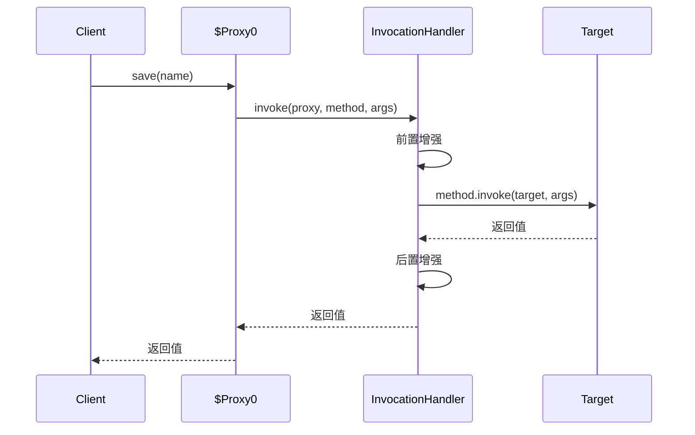
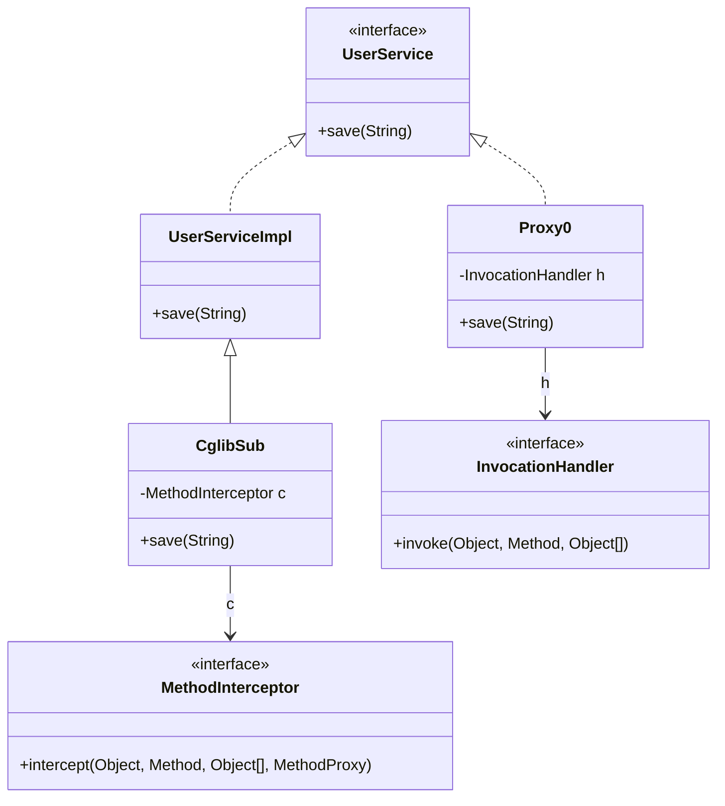

# 动态代理

## 思维链路速查

```chain
两条实现路线 | JDK Proxy vs CGLIB 对比 | 选型
JDK Proxy 机制 | 运行期生成接口实现类 | 原理
CGLIB 机制 | 子类化重写方法 | 原理
代理失效边界 | 哪些调用织不进去 | 陷阱
落地场景 | Spring / MyBatis 里谁用谁 | 实战
面试问答 | 高频考点 | 复盘
```

全篇主心骨只有一个：目标**有没有接口**——它决定走 JDK Proxy 还是 CGLIB，机制、边界与框架落地都围着它转。

## 两条实现路线

运行期**现场生成代理类的字节码**并加载，增强逻辑由统一的回调接口承载，一个回调可服务任意多个目标。

| 维度 | JDK Proxy | CGLIB / Byte Buddy |
|---|---|---|
| 依赖 | JDK 自带 `java.lang.reflect` | 第三方（Spring 内已 repackage） |
| 前提 | 目标**必须实现接口** | 目标可继承即可，无需接口 |
| 手法 | 生成「实现指定接口」的代理类 | 生成目标的**子类**，重写非 final 方法 |
| 回调 | `InvocationHandler.invoke` | `MethodInterceptor.intercept` |
| 分发 | 反射 `method.invoke` | FastClass 索引直调（绕开反射） |
| 不能代理 | 无接口的类 | `final` 类 / `final` / `private` / `static` 方法 |

> [!tip] 选型口诀
> 有接口用 JDK Proxy，无接口只能 CGLIB；**现代 JDK（9+）下两者性能差距已可忽略**，选型只看有没有接口。[[静态代理]] 则是编译期手写，规模一大就不可维护。

## JDK Proxy 机制

> [!note] 一句话机制
> 动态代理 = 运行期现拼一个**接口实现类** `$Proxy0` 并加载（机制见 [[类加载过程]]），它的每个方法体**只做一件事：转调 handler**。此后你调任何接口方法，真正执行的其实是 `invoke` 里的代码。

这个类没法手写，但拼出来的字节码 ≈ 下面这段源码（示意，非 JDK 真实产物）：

```java
public final class $Proxy0 extends Proxy implements UserService {
    // extends Proxy：父类里就存着 handler（protected InvocationHandler h）
    //   → 单继承被占死：JDK Proxy 只能代理接口，代理不了类
    // 类名 com.sun.proxy.$Proxy0 按序递增，现拼产物勿硬依赖

    public void save(String name) {
        Method m = 构造期从接口反射出的 save 方法;   // 示意略去异常处理
        h.invoke(this, m, new Object[]{ name });     // 唯一动作：转调统一回调
    }
    // equals / hashCode / toString 也走同一套转调，全进 handler
}
```

看清 `$Proxy0` **只认 handler、不认任何业务对象**之后，`newProxyInstance` 的三个参数就各归其位——注意参数里并没有 target：

```java
UserServiceImpl target = new UserServiceImpl();              // target 与参数无关
UserService proxy = (UserService) Proxy.newProxyInstance(
        target.getClass().getClassLoader(),  // ① 用哪个 ClassLoader 定义 $Proxy0
        new Class<?>[]{ UserService.class }, // ② 实现哪些接口 → 决定 $Proxy0 长啥样
        (p, method, args) -> {               // ③ 统一回调：所有方法都进这里
            // p = 代理对象本身（$Proxy0 的 this，当转发目标会无限递归）
            // method = 正在被调的接口方法；args = 实参
            return method.invoke(target, args);  // 想转发 target 才调这行
        });
```

> [!tip] 转发 target 不是必须的
> handler 完全可以不碰 target——MyBatis Mapper 连实现类都没有，`invoke` 里直接按方法名拼 SQL 执行。「代理必然转发给真实对象」是常见误解，转不转由 handler 自己决定。

| 参数 | 边界坑速查 |
|---|---|
| `ClassLoader` | 看不见目标接口 → 定义代理类时报错 |
| `interfaces` | 上限 65535；重复接口报错 |
| `InvocationHandler` | `toString`/`equals`/`hashCode` 一并被代理 |
| `invoke` 的 `proxy` 参数 | 是代理对象自身；误当 target 转发 → 无限递归 |

```chain
newProxyInstance | 拼字节码并加载 | 生成
客户端调用接口方法 | 命中代理类 | 入口
转发 InvocationHandler | 统一拦截点 | 分发
method.invoke(target, args) | 委派真实对象 | 执行
返回 Object | 原路回客户端 | 出口
```

<details>
<summary>展开时序图</summary>



</details>

> [!danger] 无限递归
> `invoke` 里写成 `method.invoke(proxy, args)` 会再次进入代理对象 → 再次触发 `invoke` → `StackOverflowError`。必须传 **target**，不是 proxy。

## CGLIB 机制

> [!note] 一句话机制
> CGLIB = 运行期用 `Enhancer` 生成目标类的**子类**，重写所有非 `final` 方法，方法体**只做一件事：转调 `MethodInterceptor`**。无需接口即可代理，代价是 `final`/`private`/`static` 拦不住。

Enhancer 现拼的子类 ≈ 下面这段源码（示意，类名形如 `UserServiceImpl$$EnhancerByCGLIB$$xxxx`）：

```java
public class UserServiceImpl$$EnhancerByCGLIB$$1 extends UserServiceImpl {
    private MethodInterceptor interceptor;   // 回调就存在子类实例自己身上

    public void save(String name) {
        // 每个非 final 方法体同构：转调统一拦截点（m / mp 构造期已缓存）
        interceptor.intercept(this, m, new Object[]{ name }, mp);
    }
    // final 方法无法被重写、private 方法对子类不可见
    //   → 它们的调用落不到这里，增强自然失效
}
```

`intercept` 比 JDK Proxy 的 `invoke` 多一个 `MethodProxy` 参数——它承载 CGLIB 提速的核心（FastClass），也直接对位到上一节的 JDK 心智：

| CGLIB 概念 | 对位 JDK Proxy | 作用 |
|---|---|---|
| `intercept(obj, method, args, proxy)` | `invoke(proxy, method, args)` | 统一拦截点；`obj` = 被代理的子类实例 |
| `proxy.invokeSuper(obj, args)` | `method.invoke(target, args)` | 直调**父类**实现，不会再进 intercept |
| `MethodProxy` + FastClass 索引 | 反射 `Method.invoke` | 方法签名 → 整数下标，switch 直调，省掉反射 |

> [!warning] invokeSuper 与 invoke 差一个字母，语义相反
> `invokeSuper` 走 FastClass 索引直调**父类**实现（正确）；`invoke` 调**子类**方法 → 方法体又转调 intercept → 无限递归。对应 JDK 侧的 `method.invoke(proxy)`。

> [!note] JDK 9 模块化的后续收紧
> JDK 9 起进入模块化（JEP 261），JDK 16 强封装（JEP 396）后，CGLIB 在 `java.*` 包下定义子类会被拦，需 `--add-opens java.base/java.lang=ALL-UNNAMED`。这也是新项目倾向 Byte Buddy 的原因之一。

## 代理失效边界

| 场景 | 后果 | 说明 |
|---|---|---|
| 同类方法自调用 `this.inner()` | 增强不生效 | `this` 是原始对象，不是代理对象 |
| `final` 方法 | CGLIB 无法重写 | JDK Proxy 不受影响（接口方法本身可重写） |
| `private` / `static` 方法 | 两者都拦不住 | 不参与多态分发 |
| 字段访问 | 拦不住 | 字节码层面只重写方法 |
| 目标类为 `final` | CGLIB 直接失败（无法生成子类） | 有接口可退 JDK Proxy（接口代理不涉及目标子类）；无接口则无法代理，换 Byte Buddy 或改设计 |

> [!danger] 自调用是 Spring 事务失效的头号原因
> `@Transactional` 走 AOP 代理，同一个类里 `this.methodB()` 绕过了代理，事务、缓存、异步注解**全部失效**。修法：注入自身代理、拆到另一个类、或用 `AopContext.currentProxy()`。

## 落地场景

| 场景 | 用什么 | 原因 |
|---|---|---|
| MyBatis Mapper | JDK Proxy | 接口本就没有实现类，代理负责把方法映射成 SQL |
| Spring Boot AOP / 声明式事务 | CGLIB | Boot 2.0+ 默认 `proxyTargetClass=true`，见下方策略说明 |
| 纯 Spring Framework（有接口时） | JDK Proxy | Framework 层默认面向接口，无接口才退回 CGLIB |
| RPC 客户端 Stub | JDK Proxy | 面向接口契约，天然匹配 |

> [!tip] Spring 用谁，取决于你跑在哪个环境
> 纯 Spring Framework：目标**有接口 → 默认 JDK Proxy**，无接口才 CGLIB。**Spring Boot 2.0 起 `proxyTargetClass` 默认 `true`，有接口也优先 CGLIB**——代理对象是目标类的子类，按实现类注入也不会类型不匹配。老资料「有接口用 JDK Proxy」只在纯 Framework 成立，Boot 项目里已不适用。

## 详节

> [!note] 关键前提
> 运行期织入的前提是「拿到代理对象」。调用方拿到的是原始对象时，再强的代理也是摆设。

```java
// 1. JDK Proxy：目标必须有接口
UserService proxy = (UserService) Proxy.newProxyInstance(
        target.getClass().getClassLoader(),
        new Class<?>[]{ UserService.class },
        (p, method, args) -> {
            long t = System.nanoTime();
            try {
                return method.invoke(target, args);   // 注意：target，不是 p
            } finally {
                System.out.println("cost " + (System.nanoTime() - t) + "ns");
            }
        });

// 2. CGLIB：目标无需接口
Enhancer enhancer = new Enhancer();
enhancer.setSuperclass(UserService.class);
enhancer.setCallback((MethodInterceptor) (obj, method, args, p) -> {
    long t = System.nanoTime();
    try {
        return p.invokeSuper(obj, args);              // 注意：invokeSuper
    } finally {
        System.out.println("cost " + (System.nanoTime() - t) + "ns");
    }
});
UserService cglibProxy = (UserService) enhancer.create();
```

<details>
<summary>展开类图</summary>



</details>

<details>
<summary>面试问答 (4题)</summary>

Q：JDK 动态代理和 CGLIB 的区别？

A：JDK Proxy 只能代理接口，运行期生成接口实现类，靠反射分发；CGLIB 生成目标子类、重写方法，靠 FastClass 索引分发，能代理无接口的类但拦不住 final。

Q：为什么 JDK 9 之后两者性能差距变小？

A：早期 JDK Proxy 每次调用走反射 `Method.invoke`，而 CGLIB 用 FastClass 索引直调；现代 JDK（9+）的 JIT 已能优化反射调用，且 JDK Proxy 创建代理类的开销更小，两者调用耗时已在同一量级。

Q：CGLIB 为什么不能代理 final 方法？

A：它的机制是生成子类并重写方法，final 方法在字节码层面禁止重写，子类根本无法覆盖，调用会直接落到父类实现，增强被跳过。

Q：Spring 事务在同一个类里调用为什么失效？

A：事务增强挂在代理对象上，`this.xxx()` 拿到的是原始对象引用，调用根本没经过代理，事务拦截器不会触发。

</details>

<details>
<summary>常见误区 (4条)</summary>

- 误区：动态代理性能很差。字节码只生成一次并缓存，调用开销主要是反射分发，且 JDK 9+ 已被 JIT 优化；真实业务里毫秒级 IO 面前可以忽略。
- 误区：CGLIB 一定比 JDK Proxy 快。JDK 8 时代成立，现在不再成立；反而 CGLIB 创建成本高、还受模块封装限制。
- 误区：动态代理能代理任何方法。字段访问、`private`、`static`、`final` 方法以及同类自调用，全都拦不住。
- 误区：Spring 有接口就用 JDK Proxy。纯 Spring Framework 成立；**Spring Boot 2.0+ 默认 `proxyTargetClass=true`，优先 CGLIB**。

</details>
