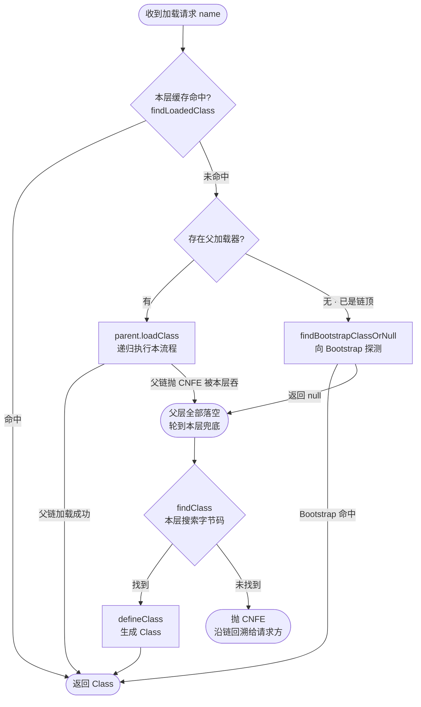

# 双亲委派模型

## 思维链路速查

```chain
委派规则 | 请求如何向上传递 | 规则
源码实现 | loadClass 三步 | 原理
收益 | 为什么必须这样设计 | 价值
面试问答 | 高频考点 | 复盘
常见误区 | 认知纠偏 | 收尾
```

一张加载请求先"向上问"、逐层落空才"向下装"——先立规则，再对照源码印证，随后回答为什么非这样设计不可，最后用高频问答与常见误区收尾复盘。

## 委派规则

核心一句话：**先问父、再问己** —— 收到加载请求先向上委派给父加载器，父层全部落空，加载器才自己读取字节码。

| 步骤 | 动作 | 结果 |
|---|---|---|
| 1 | `findLoadedClass` 查本加载器缓存 | 命中直接返回 |
| 2 | 委派 `parent.loadClass`，逐层上抛至 Bootstrap | 父层失败抛 `ClassNotFoundException` → 被吞掉，继续下一步 |
| 3 | 自己 `findClass` 读字节码 → `defineClass` | 仍失败，才由本层抛出 `ClassNotFoundException` |

> [!warning] 术语纠正
> 「双亲」是 parent 的翻译，**不是两个父加载器**。除 Bootstrap 外每个加载器只有一个父加载器，链路是单链。

## 源码实现

```java
protected Class<?> loadClass(String name, boolean resolve) throws ClassNotFoundException {
    synchronized (getClassLoadingLock(name)) {
        Class<?> c = findLoadedClass(name);          // 1. 查缓存
        if (c == null) {
            try {
                if (parent != null)
                    c = parent.loadClass(name, false); // 2. 委派父加载器
                else
                    c = findBootstrapClassOrNull(name);// 3. 到达 Bootstrap
            } catch (ClassNotFoundException e) {
                // 父加载器加载失败，不处理，往下走自己加载
            }
            if (c == null)
                c = findClass(name);                  // 4. 自己加载
        }
        if (resolve) resolveClass(c);                 // 链接（解析）
        return c;
    }
}
```

> [!tip] 自定义加载器的正确姿势
> 重写 `findClass`，**不要**重写 `loadClass`。重写 `loadClass` 会绕过委派逻辑，等于主动破坏模型 —— 除非你就是要破坏它，见 [[破坏双亲委派]]。

<details>
<summary>展开流程图</summary>



> [!note] 读图提示
> 本图是**某一层**加载器的完整流程：`parent.loadClass` 会递归重复同一套逻辑（父级先查自己缓存，再继续向上），任一级失败抛出的 CNFE 沿链回溯、被各级吞掉后轮到各自 `findClass` 兜底；链顶（parent 为空的 Platform / Ext）才负责向 Bootstrap 探测。JDK 9+ 会先判模块归属，见上文收益区。

</details>

## 收益

| 收益 | 机制 | 反例后果 |
|---|---|---|
| 类的唯一性 | 委派让同一个类总由同一个加载器加载 | 不同加载器加载的同名类是**不同类型**，`instanceof` 与强转全失败 |
| 沙箱安全 | 核心库只认 Bootstrap 的搜索范围 | 自定义 `java.lang.String` 永远轮不到被加载，核心 API 无法被替换 |
| 避免重复加载 | 父层缓存命中即返回 | 内存中多份同名 Class 对象，静态字段各存一份 |

> [!danger] 同名类 ≠ 同一个类
> 类的唯一性由 **加载器 + 全限定名** 共同决定。两个不同加载器加载同一个 `com.x.User`，`equals` 为 false，互相赋值抛 `ClassCastException`。这是 [[类加载器]] 命名空间隔离的直接后果。

> [!note] 委派是「约定」不是「强制」
> JDK 9 引入模块系统后，Bootstrap 加载器的职责被 Platform 加载器分走一部分；委派顺序在模块化场景下会先按模块归属判断，不再是纯父子链。


<details>
<summary>面试问答 (4题)</summary>

Q：双亲委派的工作过程？

A：收到加载请求先查缓存，未命中则委派给父加载器，逐层上抛到 Bootstrap；父层全部无法完成时，才由自身 `findClass` 加载并 `defineClass`。

Q：为什么设计双亲委派？

A：两点。一是保证类的唯一性，避免同一类被重复加载产生多份 Class 对象；二是沙箱安全，防止用户自定义类替换 JDK 核心类。

Q：如何破坏双亲委派？

A：三种典型方式 —— 重写 `loadClass`、用线程上下文类加载器（TCCL）、自定义加载器做隔离。详见 [[破坏双亲委派]]。

Q：可以用自定义类加载器加载 `java.lang.Object` 吗？

A：不行。包名以 `java.` 开头会触发安全校验，`defineClass` 抛 `SecurityException`；即使绕过，「先父后子」的委派顺序也会让 Bootstrap 优先返回官方版本。

</details>

<details>
<summary>常见误区 (3条)</summary>

- 误区：双亲委派是 JVM 规范强制的。实际是 JDK 1.2 引入的**代码实现约定**，`ClassLoader` 是普通 Java 类，能被覆盖。
- 误区：「父加载器」是继承关系。实际是**组合**（`parent` 字段），不是 `extends`。
- 误区：委派失败会立刻抛异常。`loadClass` 捕获父层的 `ClassNotFoundException` 后继续自己加载，异常只在自身也找不到时才抛出。

</details>
