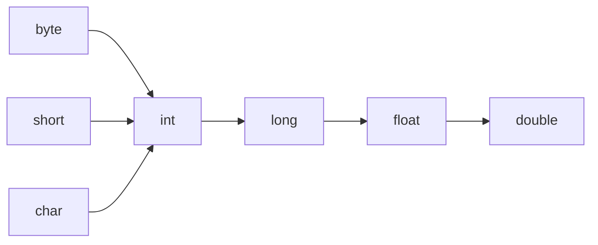

# 基本数据类型

## 思维链路速查

```chain
八种类型全表 | 位宽与取值 | 速查
整数溢出与浮点精度 | 两个精度陷阱 | 核心
字面量与转换 | 后缀与提升 | 规则
装箱与缓存 | 包装类 | 分野
面试问答 | 高频考点 | 复盘
```

八种类型先混个脸熟，坑全藏在「边界」里：整数溢出与浮点精度是数字的坑，后缀与类型提升是表达式的坑，装箱缓存让 `==` 也成了坑。

## 八种类型全表

| 类型 | 位数 | 字节 | 默认值 | 取值范围 | 包装类 |
|---|---|---|---|---|---|
| byte | 8 | 1 | 0 | -128 ~ 127 | Byte |
| short | 16 | 2 | 0 | -32768 ~ 32767 | Short |
| int | 32 | 4 | 0 | -2³¹ ~ 2³¹-1 | Integer |
| long | 64 | 8 | 0L | -2⁶³ ~ 2⁶³-1 | Long |
| float | 32 | 4 | 0.0f | 约 ±3.4e38，7 位有效数字 | Float |
| double | 64 | 8 | 0.0d | 约 ±1.8e308，15 位有效数字 | Double |
| char | 16 | 2 | '\u0000' | 0 ~ 65535（无符号） | Character |
| boolean | 未规定 | 未规定 | false | true / false | Boolean |

> [!note] 默认值只属于字段
> 上表默认值是**成员变量**才有的待遇；局部变量不赋初值就读取，直接编译报错。数组元素是例外，new 出来的数组自动填默认值，与字段一致。

> [!tip] char 是唯一的无符号整型
> `char` 存的是 UTF-16 码元，能直接当 16 位无符号整数参与运算，赋值用单引号 `'A'` 或码值 `65`，二者等价。

> [!warning] boolean 的位宽没有标准答案
> JVM 规范没规定 boolean 占几位：单独使用时通常按 int 处理（4 字节），放进 `boolean[]` 时多数虚拟机按 byte 处理（1 字节）。答题说"1 位"或"1 字节"都不严谨，正确说法是**未明确规定、由虚拟机实现决定**。

## 整数溢出

> [!danger] 溢出不报错，静默绕圈
> `Integer.MAX_VALUE + 1 == Integer.MIN_VALUE`。整数运算溢出**不抛异常**，按二进制补码绕回，是线上金额/计数类 bug 的经典来源。

| 场景 | 写法 | 结果 |
|---|---|---|
| int 越界 | `2147483647 + 1` | -2147483648 |
| 大数相乘再转型 | `long t = 24 * 60 * 60 * 1000 * 1000` | 先按 int 算，已溢出才转 long |
| 求中间值 | `(l + r) / 2` | l+r 可能溢出 |
| 取绝对值 | `Math.abs(Integer.MIN_VALUE)` | 仍是负数 -2147483648 |

> [!tip] 三个修法
> 常量先带 `L` 后缀把运算抬到 long：`24L * 60 * 60 * 1000 * 1000`；求中点写 `l + (r - l) / 2`；JDK 8 起可用 `Math.addExact / multiplyExact`，溢出直接抛 `ArithmeticException`，把静默错误变成显式失败。

## 浮点精度

```branch
01: 浮点比较
02: 按写法分流
- a == b | 位模式严格相等 | 0.1+0.2 != 0.3
- Math.abs(a-b) < 1e-6 | 允许误差 | 一般工程够用
- BigDecimal.compareTo | 精确十进制 | 金额必用
- Double.compare | 处理 NaN 与 ±0.0 | 排序场景
```

> [!danger] 0.1 + 0.2 != 0.3
> 二进制浮点无法精确表示 0.1，`0.1 + 0.2` 得到 `0.30000000000000004`。**任何金额计算都不要用 float / double**，一律 `BigDecimal`。

> [!warning] float 的有效位只有 7 位
> `float` 常被称为"单精度"，但它的有效数字只有约 7 位，整数部分一大，小数就不保真。字面量必须带 `f` 后缀，写 `float x = 0.1;` 编译不过——因为 `0.1` 默认 double，大转小要强转。

> [!tip] 特殊值也是正常值
> `NaN` 与任何值比较都是 false（包括 `NaN != NaN` 为 true）；`1.0/0.0` 得 `Infinity` 而不抛异常。判空与校验要显式用 `Double.isNaN` / `isInfinite`。

## 字面量与类型提升

| 字面量 | 默认类型 | 说明 |
|---|---|---|
| `100` | int | 整数字面量默认 int |
| `100L` | long | 后缀 L/l，建议大写 |
| `0.1` | double | 小数字面量默认 double |
| `0.1f` | float | 后缀 F/f |
| `0x1F` / `0b101` | int | 十六 / 二进制，JDK 7 起支持 |
| `1_000_000` | int | 下划线仅分隔，编译期丢弃 |
| `'A'` | char | 单引号 |

> [!note] 运算前一律先升到 int
> `byte`、`short`、`char` 参与算术运算时**先整体提升为 int** 再算，所以 `byte b = 1; b = b + 1;` 编译报错（int 不能赋回 byte），而 `b += 1;` 能过——复合赋值运算符自带隐式强转。

<details>
<summary>展开类型提升图</summary>



> [!warning] 三条路都直接到 int
> byte / short / char 是**各自独立**提升为 int，不存在 `byte → short` 这一跳。图里画成汇聚而非串联，正是为了避免误以为 byte 会先经过 short。

</details>

> [!danger] long 转 float 会丢精度
> 自动转换方向是 `long → float → double`，因为 float 的**取值范围**比 long 大。但 float 只有 24 位有效位，long 有 63 位，`long` 转 `float` 高位数值会被截断。大 → 小看范围，范围大不代表精度高。

## 装箱与缓存

| 包装类 | 缓存区间 | 说明 |
|---|---|---|
| Byte / Short / Integer / Long | -128 ~ 127 | `valueOf` 复用对象 |
| Character | 0 ~ 127 | |
| Boolean | true / false | 全部缓存 |
| Float / Double | 无 | 浮点区间内取值无限，无法缓存 |

> [!danger] 127 与 128 的分水岭
> `Integer a = 127, b = 127; a == b` 为 **true**（同一缓存对象）；换成 `128` 则为 **false**（各自 new）。包装类比较值**一律用 `equals`**，不要用 `==`。

> [!warning] 自动拆箱会 NPE
> `Integer` 字段为 null 时参与运算或赋给 int，触发拆箱抛 `NullPointerException`；三目运算符 `flag ? integerObj : 0` 也会因类型对齐把对象拆箱。数据库可空列映射成包装类时尤其容易踩。

> [!note] 存储位置分两处
> 基本类型局部变量占栈帧的局部变量表，包装类对象是堆里的对象（字段另存 value）。为什么数组与对象的布局长这样，见 [[JVM 运行时数据区]]。

## 详节

> [!note] 落地四条
> 金额用 `BigDecimal(String)` 构造（不用 double 构造）；状态、金额、计数类字段优先包装类以表达 null；循环里的装箱是隐形开销，热路径用基本类型；集合只能装对象，装箱发生的时机见 [[Java Collection]]。

```java
// 1. 溢出：不报错，绕回
int max = Integer.MAX_VALUE;
System.out.println(max + 1);              // -2147483648
System.out.println(Math.abs(Integer.MIN_VALUE)); // -2147483648
Math.addExact(max, 1);                    // ArithmeticException，显式失败

// 2. 常量先抬类型，别让 int 先溢出
long wrong = 24 * 60 * 60 * 1000 * 1000;  // 500654080，已溢出
long right = 24L * 60 * 60 * 1000 * 1000; // 86400000000

// 3. 浮点：金额别用 double
System.out.println(0.1 + 0.2);            // 0.30000000000000004
new BigDecimal("0.1").add(new BigDecimal("0.2")); // 0.3，构造用字符串
new BigDecimal(0.1);                      // 0.1000000000000000055511151231257827

// 4. 转换(byte/short/char 运算前先升 int)
byte b = 1;
// b = b + 1;                             // 编译错：int 赋回 byte
b += 1;                                   // 复合赋值自带强转，能过
long big = 1L << 62; float f = big;       // long → float 丢精度

// 5. 装箱缓存：常量池复用
Integer a = 127, c = 127; System.out.println(a == c);       // true
Integer d = 128, e = 128; System.out.println(d == e);       // false
System.out.println(d.equals(e));                            // true，一律用 equals
Integer nullable = null; int n = nullable;                  // NPE
```

<details>
<summary>面试问答 (5题)</summary>

Q：Java 有几种基本数据类型，分别占多少字节？

A：八种。byte 1、short 2、int 4、long 8、float 4、double 8、char 2，boolean 由 JVM 实现决定、规范未规定。boolean 单独使用时通常按 int 处理，数组中常按 byte 处理。

Q：`Integer a = 127, b = 127; a == b` 为什么是 true，换成 128 就是 false？

A：因为 `Integer.valueOf` 对 -128~127 做了缓存，装箱时复用同一对象，所以 `==` 也为 true；128 超出缓存区间，各自 new 出新对象，`==` 比的是引用地址故为 false。包装类比大小一律用 `equals`。

Q：`0.1 + 0.2` 为什么不等于 0.3？

A：float / double 是二进制浮点，无法精确表示十进制的 0.1，累加后误差暴露，结果是 `0.30000000000000004`。金融场景改用 `BigDecimal`，且必须用字符串构造，用 double 构造会把误差原样带进去。

Q：`byte b = 1; b = b + 1;` 报错，而 `b += 1;` 不报错？

A：byte、short、char 参与算术运算会先提升为 int，`b + 1` 结果是 int，赋回 byte 属大转小，需强转；`+=` 这类复合赋值运算符自带隐式强制转换，等价于 `b = (byte)(b + 1)`，所以能编译通过。

Q：`short s = 1; s = s + 1;` 和 `long` 转 `float` 有什么共同点？

A：都考"自动转换"的方向。`s + 1` 提升成 int 不能自动赋回 short；而 `long → float` 反而是自动的，因为自动转换看**取值范围**而非精度，float 范围大于 long，但有效位只有 24 位，转换会丢精度。

</details>

<details>
<summary>常见误区 (4条)</summary>

- 误区：boolean 占 1 字节。规范根本没规定位数，只规定了取值；数组与单独字段在 HotSpot 里的实现宽度都不一样。
- 误区：包装类 == 比的是值。`==` 永远比引用，只是缓存区间内恰好命中同一对象，换个数就翻车。
- 误区：long 转 float 更安全。自动转换成立只因范围够大，精度反而从 63 位有效位掉到 24 位。
- 误区：`new BigDecimal(0.1)` 能精确表示 0.1。double 本身的误差会被 BigDecimal 完整保留，必须用 `new BigDecimal("0.1")` 或 `BigDecimal.valueOf(0.1)`。

</details>
