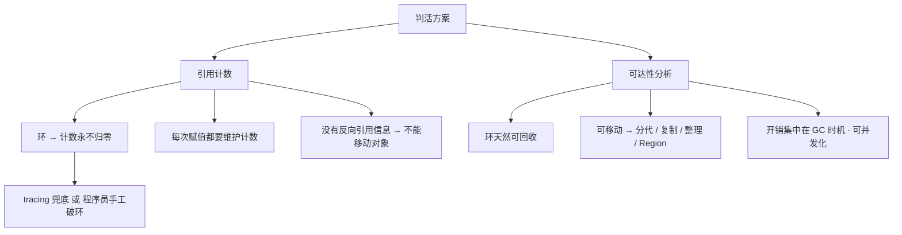

# 引用计数

## 思维链路速查

```chain
机制 | 加减计数与即时回收 | 起点
死穴 | 循环引用永不归零 | 根因
代价 | 计数税 · 并发 · 不可移动 | 权衡
破环者 | Python · COM · Swift | 对照
JVM 的选择 | 可达性分析 | 结论
```

加减计数、即时回收看似干净，循环引用却让计数永远归不了零；补丁能救个别语言，结构性代价却躲不掉 —— 这正是 JVM 绕开它、改选可达性分析的理由。

## 机制：计数怎么工作

| 操作 | 计数变化 | 结果 |
|---|---|---|
| `a = b` | b +1，a 的旧值 -1 | 赋值即维护 |
| 离开作用域 / 字段被覆盖 | -1 | 断开即扣减 |
| 计数归零 | 立即释放 | 回收时机确定 |
| 释放一个对象 | 它引用的每个字段 -1 | 可能触发级联释放 |

> [!tip] 引用计数的优点是真实的
> 即时回收（引用断开那一刻就释放，析构时机可预测）、无集中 STW、堆占用低。面试只答「循环引用」一条是半个答案——它的优点同样明确，JVM 是算过账才放弃的。

## 死穴：循环引用

两个对象互相持有，外部引用断开后各自计数仍是 1，谁都不会归零：

```python
a = []; a.append(a); del a   # 计数 2 → 1，永不归零
```

```java
class Node { Node next; }
x.next = y; y.next = x;
x = y = null;   // 可达性分析下两者皆不可达 → 正常回收
```

> [!danger] 环不是边界情况，是对象图的常态
> 双向链表、父子节点互指、观察者注册、闭包捕获 `self`、模块与顶层函数互指——全是环。语言若把破环责任交还程序员，「自动内存管理」就只剩一半。

## 代价：不是「补个环检测」就完事

| 代价 | 痛点 | 对照 JVM |
|---|---|---|
| 赋值计数税 | 引用赋值最热，每次都要增减 | 平时赋值零记账 |
| 并发计数税 | 计数增减必须线程安全 | GIL 白嫖；去 GIL 得偏置计数硬扛 |
| 移动税 | 无反向信息，移动要修全堆 | 分代 · 复制 · 整理全靠能移动 |
| 头部开销 | 计数字段人人付账 | 对象头不带计数 |
| 零散释放 | 写指针即结账，成本 ∝ 写操作数 | 成本 ∝ 存活集，GC 期一次清算 |

> [!note] 前两项能削，第三项机制自带
> **计数税** → 延迟计数 / 合并计数把加减挪到 GC 期批算，削掉大头。
> **并发税** → free-threaded CPython（PEP 703：3.13 实验性 → 3.14 起受支持选项，GIL 仍默认）上偏置计数 + 不朽对象 + 延迟计数三件套；账单是 AMD64 对象头从 16B 涨到约 32B（ob_tid + 本地/共享双计数 + per-object 锁）。
> **移动税** → 无解：复制、整理、分代复制直接出局。对照看，tracing 的写屏障只在跨代 / 并发标记时插一段固定代码，平时赋值真不记账。

## 破环：三种破环方案

| 采用者 | 主机制 | 谁负责破环 | 兜底 |
|---|---|---|---|
| CPython | RC 打底 + 分代 tracing（`gc` 模块只跟踪可能成环的容器对象） | 循环检测自动兜底 | 环只能等 gc 跑，不再即时回收 |
| COM | `AddRef` / `Release` 手工计数 | 程序员 | 无；漏一次 Release 就泄漏，环自己拆（弱引用 / 显式 Shutdown） |
| Swift ARC | 编译器插桩计数 | 程序员（`weak` / `unowned` 标注） | 无 tracing 兜底，标错就泄漏 |
| JVM | 可达性分析 | 无人 | 环天然被吃掉 |

> [!warning] 「Python 用引用计数」只是半句
> 真正的循环回收靠 `gc` 模块的分代 tracing 兜底。所以 CPython 是 RC + tracing 的混合体——问题从来不是「RC 还是 tracing」，而是「要不要为即时回收付两份机制的价钱」。

## JVM 的选择

```chain
正确性零负担 | 环天然被吃 · 程序员不用想谁持强引用 | 首要
mutator 近零成本 | 平时赋值不带计数税 | 吞吐
能移动对象 | 分代 · 复制 · 整理 · Region 全可用 | 算法空间
缺点可工程化 | 并发标记 · 分代 · 读屏障压停顿 | 收尾
```

> [!tip] 一句话版
> tracing 的缺点是「可以优化掉的成本」（集中停顿 → 并发标记、分代、Region 一步步压）；RC 的缺点是「机制自带的税」（环、计数税、不可移动）——压不下去。

## Java 里还有引用计数吗

有，但**只在 GC 管不到的地方**：

| 场景 | 做法 | 为什么还得计数 |
|---|---|---|
| Netty `ByteBuf` | `refCnt` 手工 `retain` / `release` | 堆外内存不在堆里，tracing 扫不到 |
| `DirectByteBuffer` | `Cleaner`（虚引用）发信号触发释放 | 同上：靠 GC 通知，不是靠计数判活 |

> [!note] 一条规律
> 引用计数在 Java 世界里只作为「GC 管辖范围之外」的手工手段出现，从不是堆内对象的判活方式。判活统统交给 [[JVM 垃圾回收]] 里的可达性分析。

<details>
<summary>展开流程图</summary>



</details>

## 详节

<details>
<summary>面试问答 (5题)</summary>

Q：JVM 为什么不用引用计数？

A：三条账——循环引用（双向链表、父子互指、闭包捕获 self 都是环，计数永不归零）；每次引用赋值都要维护计数，这笔税摊在最高频操作上，多线程下还得原子或偏置计数；没有反向引用信息所以不能移动对象，复制 / 整理 / 分代算法全废。tracing 的集中停顿能用并发标记、分代、Region 工程化压下去，RC 的缺点是机制自带的。

Q：Python 用引用计数，它怎么解决循环引用？

A：靠 `gc` 模块的分代循环检测兜底，只跟踪可能成环的容器对象（list / dict / 类实例等）。所以 CPython 是 RC + tracing 的混合，不是纯 RC；成环对象也不再即时回收，要等 gc 跑。（3.14 曾把 gc 改成增量式以压停顿，因生产内存压力在 3.14.5 回滚为分代。）

Q：引用计数相比可达性分析有什么优点？

A：回收时机确定（引用断开即释放，析构可预测）、无集中 STW、堆占用较低。代价是吞吐、破环责任，以及算法工具箱被砍掉一半。

Q：引用计数能不能配合压缩算法？

A：几乎不能。移动对象要更新所有指向它的引用，而 RC 只记录「我引用了谁」，没有「谁引用了我」，也没有统一的引用枚举机制——复制、整理、分代都用不了。

Q：那 Java 里还见得到引用计数吗？

A：见得到，但只在 GC 管不到的地方：Netty `ByteBuf` 的 `refCnt` 手工 `retain` / `release` 管堆外内存，`DirectByteBuffer` 用 `Cleaner`（虚引用）发信号触发释放。堆内对象的判活一律走可达性分析。

</details>

<details>
<summary>常见误区 (4条)</summary>

- 误区：不用引用计数只是因为循环引用。环是导火索，真正的账是每次赋值的计数税 + 不能移动对象。
- 误区：引用计数没有停顿。单次释放很分散，但一条长引用链的根断开会引发级联 Release，可能长停顿甚至爆栈（CPython 用 trashcan 机制缓解）。
- 误区：RC 一定更省内存。计数器本身占对象头，free-threaded CPython 为线程安全把头从 16B 撑到约 32B；tracing 则需要额外空闲堆做周转，两者方向不同，不是简单的谁更省。
- 误区：Python 是纯引用计数。循环回收靠 `gc` 模块的分代 tracing，本质仍是 RC + tracing 混合。

</details>
