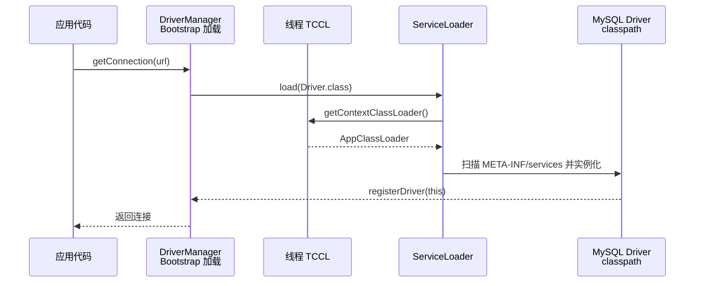
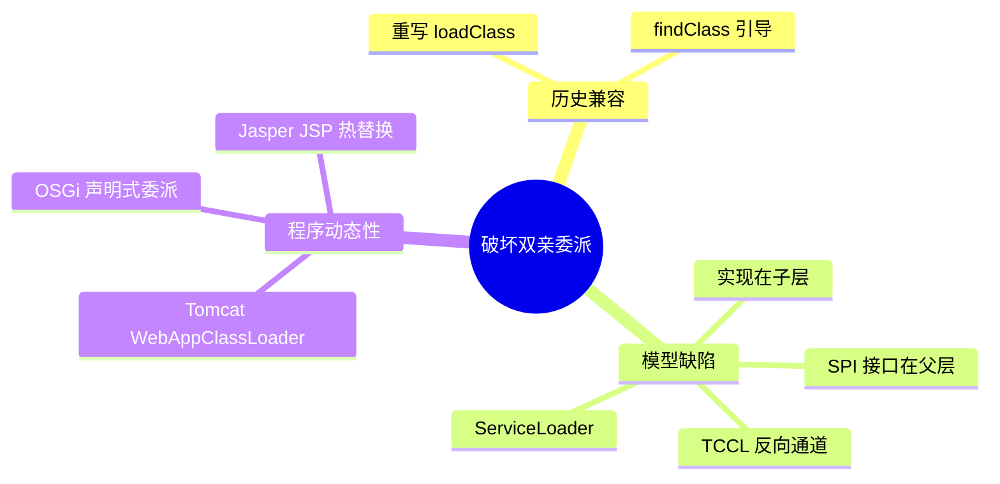

# 破坏双亲委派

## 思维链路速查

```chain
三次破坏 | 历史兼容 SPI 动态性 | 全景
线程上下文加载器 | 父向子反向请求 | 核心
容器隔离案例 | Tomcat 与热部署 | 实战
面试问答 | 高频考点 | 复盘
```

委派链被打破过三次：为兼容旧代码、为 SPI 反向请求、为容器动态性 —— 线程上下文类加载器是其中最标准的「父借子力」通道，Tomcat 则把「先己后父」做成了工程样本。

## 三次破坏

| 次序 | 原因 | 手段 | 代表场景 |
|---|---|---|---|
| 第一次 | 委派模型是 JDK 1.2 才写进 `loadClass` 默认实现的；此前自定义加载器习惯重写 `loadClass` 直接自己加载 | 新增 `findClass` 钩子引导新代码走委派，已重写 `loadClass` 的旧加载器**不做强制迁移** | 历史遗留加载器（仍「先自己后父」） |
| 第二次 | 模型自身缺陷：**父加载器需要请求子加载器** | 线程上下文类加载器 TCCL | JDBC、JNDI、JCE、JAXB |
| 第三次 | 程序动态性：模块化多版本共存、热替换 | 重排委派顺序（Tomcat 本地优先、OSGi 按声明委派），或整体丢弃重建（热部署） | Tomcat、OSGi、JSP 热替换、Spring Boot devtools |

> [!danger] 第二次破坏是「设计缺陷」，不是「用错了」
> SPI 接口（`java.sql.Driver`）由 Bootstrap 加载，但实现类（MySQL 驱动 jar）在 `classpath` 下只能由 Application 加载。按 [[双亲委派模型]]，Bootstrap **根本看不到**子层加载的类 —— 委派链是单向的，模型在这里无解。

## 线程上下文类加载器

让父层加载器可以通过线程上的一个变量，「借」子层加载器去加载类 —— 本质上是在单向委派链上开了一个反向通道。

| API | 作用 |
|---|---|
| `Thread.currentThread().getContextClassLoader()` | 读取当前线程绑定的加载器 |
| `Thread.currentThread().setContextClassLoader(cl)` | 绑定加载器到当前线程 |
| `ServiceLoader.load(Xxx.class)` | 内部即使用 TCCL 查找 `META-INF/services` 实现 |

> [!tip] TCCL 的初值从哪来
> main 线程的 TCCL 默认是 `AppClassLoader`；每个新线程会**继承创建它的线程的 TCCL**。这正是「改了不还原 = 污染线程池」的放大机制：一个池化线程被改动后，后续所有复用它的任务都拿到错误加载器。

```java
// ServiceLoader 的简化核心逻辑
ClassLoader cl = Thread.currentThread().getContextClassLoader(); // 取 TCCL
Enumeration<URL> resources = cl.getResources("META-INF/services/" + service.getName());
```

```java
// JNDI / SPI 的标准写法：用 TCCL 临时替换，用完必须还原
ClassLoader origin = Thread.currentThread().getContextClassLoader();
try {
    Thread.currentThread().setContextClassLoader(myClassLoader);
    ServiceLoader<Driver> loader = ServiceLoader.load(Driver.class);
} finally {
    Thread.currentThread().setContextClassLoader(origin); // 必须还原，否则污染线程
}
```

> [!warning] TCCL 污染
> 改完不还原，这个线程会被后续所有任务复用，表现为类找不到或加载到错误版本。`finally` 里还原是硬性要求。

> [!tip] 为什么 JDBC 不再需要 `Class.forName`
> JDBC 4.0 起，`DriverManager` 的静态块通过 `ServiceLoader` + TCCL 扫描 `META-INF/services/java.sql.Driver`，自动加载驱动实现。`Class.forName` 那条路依赖静态块注册，属于早期写法。对比可见 [[类加载过程]]。

<details>
<summary>展开时序图</summary>



</details>

## 容器隔离案例

Tomcat 在委派链里给 Web 应用插入了「本地优先、再委派」的反向顺序 —— 与默认模型的分叉点只在 WebApp 这一级：

| 加载器 | 职责 | 委派顺序 |
|---|---|---|
| Common | Tomcat 自身 + 所有 Web 应用共享的库（`lib/`，含 `servlet-api.jar`） | 标准委派 |
| WebApp | 单个应用 `/WEB-INF/classes` + `/WEB-INF/lib` | **本地优先**，找不到才委派（例外见下） |
| Jasper | JSP 编译后的类，挂在 WebApp 之下 | JSP 改动即丢弃重建 |

> [!note] 老「四层共享」说法已过时
> 老资料常画 Common → Catalina → Shared → WebApp 四层；现代 Tomcat 默认只有 Common 一个共享层（`catalina.jar` 也在其中），Catalina / Shared 只是可选的高级配置（`server.loader` / `shared.loader`），层级树为 Bootstrap → System → Common → WebApp。

> [!warning] 「本地优先」有强制例外
> 两类类永远父优先：JRE 基础类（`java.*`，沙箱保护）与 Jakarta EE API（Servlet / JSP / EL，来自 Common 的 `servlet-api.jar`）——否则每个 WebApp 各带一份同名 API，类型互不兼容；想整体切回父优先可配 `<Loader delegate="true"/>`。

```java
// WebAppClassLoader 的简化示意（省略父缓存命中检查，例外类永远父优先见上）
Class<?> c = findLoadedClass(name);
if (c == null) {
    try {
        c = findClass(name);                    // 1. 先自己找 WEB-INF
    } catch (ClassNotFoundException e) {
        c = super.loadClass(name);              // 2. 失败才委派给父
    }
}
```

> [!note] 各自隔离靠命名空间
> 每个 Web 应用一个 `WebAppClassLoader`，同名的 Spring 5 与 Spring 4 在不同命名空间下互不干扰 —— 底层判据见 [[类加载器]] 的唯一性规则。

> [!danger] 热部署的本质是「换加载器」不是「换类」
> JVM 无法卸载单个类，只能连加载器一起回收。热部署 = 丢弃旧 `WebAppClassLoader`，让它的类与实例整体不可达，再新建一个。代价：静态状态全部丢失，且**类加载器泄漏**（某处仍持有旧加载器的引用）是 `OutOfMemoryError: Metaspace` 的头号成因。

<details>
<summary>展开思维导图</summary>



</details>

## 详节

<details>
<summary>面试问答 (4题)</summary>

Q：为什么要破坏双亲委派？

A：三个场景 —— 兼容 JDK 1.2 前的旧加载器；SPI 中父层接口需要加载子层实现（TCCL）；容器需要多版本隔离与热部署。

Q：线程上下文类加载器解决了什么问题？

A：父加载器无法访问子加载器加载的类。TCCL 把子层加载器挂在线程上，`ServiceLoader` 取它来加载 SPI 实现，绕开单向委派。

Q：Tomcat 为什么要自定义加载器？

A：一是隔离，各 Web 应用可依赖同一库的不同版本；二是热部署，换加载器即可整体替换应用的类；三是共享，Common 层避免重复加载公共库。

Q：JDK 9 模块化后委派模型变了吗？

A：变了。加载前先判断类归属哪个模块，若模块已定义给某个加载器则直接由它加载，不再从 Application 一路往上问；Extension 加载器也改名为 Platform。

</details>

<details>
<summary>常见误区 (3条)</summary>

- 误区：破坏双亲委派是错误做法。它是**有明确收益的设计选择**，隔离与热部署都建立在此之上。
- 误区：TCCL 是加载器继承链的反向指针。它只是 `Thread` 上的一个字段，与 `parent` 链无关，且默认由创建线程继承。
- 误区：热部署能卸载单个类。JVM 只支持「连加载器一起卸载」，静态字段与已实例化对象不会保留。

</details>
