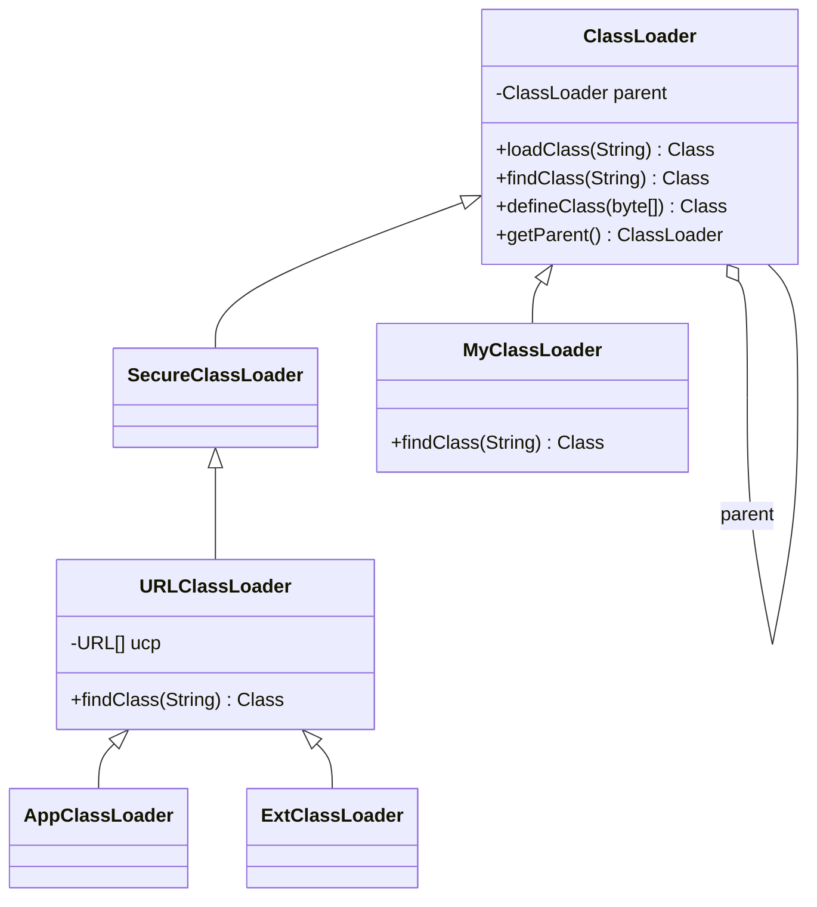

# 类加载器

## 思维链路速查

```chain
四层加载器 | 分层职责与加载范围 | 全景
命名空间 | 类的唯一性判据 | 核心
数组类 | 不由加载器创建 | 边界
自定义加载器 | 覆写 findClass 的实践 | 落地
面试问答 | 高频考点 | 复盘
```

四个加载器各管一块地盘，而「加载器 + 全限定名」才是类的真正身份；数组类是这条规则的豁免项，自定义加载器则把规则变成可编程的能力。

## 四层加载器

| 加载器 | 实现 | 加载范围 | `getParent()` |
|---|---|---|---|
| Bootstrap | C++ / JVM 原生（不是 Java 对象） | 核心库：JDK8 的 `rt.jar`（`jre/lib`）→ JDK9+ 的 `lib/modules` 运行时镜像 | `null` |
| Platform（JDK8: Extension） | Java；JDK8 实现类 `sun.misc.Launcher$ExtClassLoader`，JDK9+ `ClassLoaders$PlatformClassLoader` | JDK8 的 `lib/ext` → JDK9+ 平台模块（`java.sql` 等） | Bootstrap（`null`） |
| Application（System） | Java；JDK8 实现类 `sun.misc.Launcher$AppClassLoader`，JDK9+ `ClassLoaders$AppClassLoader` | classpath（JDK9+ 含模块路径） | Platform |
| 自定义 | 继承 `ClassLoader` | 网络、加密字节码、热部署目录等任意来源 | Application |

> [!warning] Bootstrap 不是 Java 对象
> 调 `String.class.getClassLoader()` 返回 `null`，不是「没有加载器」，而是它用 C++ 实现、不在 Java 堆里。写 `cl.getParent()` 时必须先判 null。

```java
public class LoaderDemo {
    public static void main(String[] args) {
        ClassLoader app = LoaderDemo.class.getClassLoader();
        System.out.println(app);            // JDK 8: sun.misc.Launcher$AppClassLoader
                                            // JDK 9+: jdk.internal.loader.ClassLoaders$AppClassLoader
        System.out.println(app.getParent()); // JDK 8: sun.misc.Launcher$ExtClassLoader（JDK 9+ 为 PlatformClassLoader）
        System.out.println(app.getParent().getParent()); // null（Bootstrap）
        System.out.println(String.class.getClassLoader()); // null

        // 三种获取方式
        ClassLoader a = Thread.currentThread().getContextClassLoader(); // TCCL
        ClassLoader b = ClassLoader.getSystemClassLoader();             // App
        ClassLoader c = LoaderDemo.class.getClassLoader();              // 本类的加载器
    }
}
```

## 命名空间

> [!danger] 唯一性 = 加载器 + 全限定名
> 同一个全限定名被两个不同加载器加载，得到的是**两个互不兼容的类型**：`equals` 为 false，互转抛 `ClassCastException`，`instanceof` 为 false。

| 判据 | 说明 |
|---|---|
| `Class.getClassLoader()` | 决定该类属于哪个命名空间 |
| 父加载器可见子？ | **不可见**。父看不到子加载器加载的类（这是 [[双亲委派模型]] 的副作用） |
| 子加载器可见父？ | **可见**。子可以通过委派链拿到父加载的类 |

```java
// 同一份 class 文件，两个自定义加载器各加载一次
DiskClassLoader la = new DiskClassLoader("/tmp/v1");
DiskClassLoader lb = new DiskClassLoader("/tmp/v2"); // 假设 v2 = 同名字节码
Class<?> ca = la.loadClass("com.x.User");
Class<?> cb = lb.loadClass("com.x.User");
System.out.println(ca == cb);                       // false
System.out.println(ca.isAssignableFrom(cb));        // false
// 强转抛 ClassCastException：com.x.User cannot be cast to com.x.User
```

> [!note] 这正是隔离的基础
> Tomcat 让每个 Web 应用持有独立 `WebAppClassLoader`，同名不同版本的库互不干扰，靠的就是命名空间隔离。实现细节见 [[破坏双亲委派]]。

<details>
<summary>展开类图</summary>



> [!note] 此图为 JDK 8 经典结构
> JDK 9+ 的 App/Platform 不再继承 `URLClassLoader`，继承树收进 `jdk.internal.loader.ClassLoaders`，图意不变。

</details>

## 数组类

数组类**不由类加载器创建**，由 JVM 在运行时直接构造：没有对应的 `.class` 文件，也走不到加载流程，因此不存在「加载数组的加载器」。

| 数组类型 | 运行时归属的加载器 |
|---|---|
| `User[]`（元素是引用类型） | 元素类型的加载器，即 `User.class.getClassLoader()` |
| `int[]`（元素是基本类型） | `null`（等同 Bootstrap） |

> [!tip] 只造数组，不碰元素类
> `new User[10]` 只构造数组对象，**不触发** `User` 的加载与初始化 —— 属被动引用，见 [[类加载过程]]。

## 自定义加载器

```java
public class DiskClassLoader extends ClassLoader {
    private final Path dir;
    public DiskClassLoader(Path dir) { this.dir = dir; }

    @Override                                   // 只重写 findClass，保留委派
    protected Class<?> findClass(String name) throws ClassNotFoundException {
        try {
            byte[] bytes = Files.readAllBytes(dir.resolve(name.replace('.', '/') + ".class"));
            return defineClass(name, bytes, 0, bytes.length);
        } catch (IOException e) {
            throw new ClassNotFoundException(name, e);
        }
    }
}
```

| 方法 | 是否重写 | 作用 |
|---|---|---|
| `findClass` | **是** | 定义「去哪里取字节码」，保留委派逻辑 |
| `defineClass` | 否 | 字节数组 → `Class` 对象的落点；protected，由 `findClass` 内部调用，一般不重写 |
| `loadClass` | 否（刻意[[破坏双亲委派]]时除外） | 委派主流程，重写即破坏模型 |

## 详节

<details>
<summary>面试问答 (4题)</summary>

Q：JDK 中有哪些类加载器？

A：Bootstrap（C++，核心库，JDK9+ 为运行时镜像）、Platform/Extension（`lib/ext` → 平台模块）、Application（`classpath`），外加用户自定义加载器。

Q：如何判断两个类是否「同一个类」？

A：全限定名相同 **且** 由同一个类加载器加载。二者缺一不可。

Q：自定义类加载器要重写哪个方法？

A：`findClass`。重写 `loadClass` 会绕过 [[双亲委派模型]]。

Q：`getParent()` 返回 null 意味着什么？

A：两种可能 —— 父是 Bootstrap（如 Extension 的父），或自己就是 Bootstrap（根本没有 Java 对象）。

</details>

<details>
<summary>常见误区 (3条)</summary>

- 误区：加载器之间可以互相访问。父加载器无法访问子加载器加载的类，只有单向可见性。
- 误区：`ExtClassLoader` 在 JDK 9 后仍是「扩展」。已改名 Platform 加载器，配合模块系统，加载平台模块而非 `lib/ext`。
- 误区：数组类也有对应的加载器文件。数组类由 JVM 动态生成，没有对应的 `.class` 文件。

</details>
