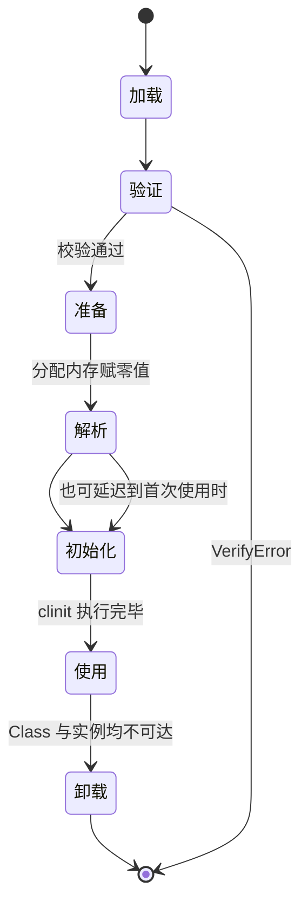

# 类加载过程

## 思维链路速查

```chain
生命周期全景 | 七个阶段 | 概览
连接三阶段 | 验证准备解析 | 拆解
初始化时机 | 何时触发 clinit | 关键
被动引用反例 | 不触发的反面 | 辨析
面试问答 | 高频考点 | 复盘
```

七个阶段里真正藏坑的是连接与初始化：验证 / 准备 / 解析各干什么、`clinit` 何时才被触发 —— 被动引用反例恰好把「加载 ≠ 初始化」钉死。

## 生命周期全景

```chain
加载 | 读字节码生成 Class | 起点
连接 | 验证 · 准备 · 解析 | 衔接
初始化 | 执行 clinit 赋真值 | 激活
使用 | 实例化与调用 | 运行
卸载 | 类型被回收 | 终点
```

| 阶段 | 做什么 | 产物 / 副作用 |
|---|---|---|
| 加载 | 按全限定名读二进制字节流，转方法区运行时数据结构，堆上生成 `Class` 对象 | 方法区类型数据 + 堆上 `Class` 实例 |
| 验证 | 文件格式 / 元数据 / 字节码 / 符号引用四轮校验 | 非法类文件抛 `VerifyError` / `ClassFormatError` |
| 准备 | 为静态变量分配内存并赋**零值** | `static int a` → 0 |
| 解析 | 常量池符号引用替换为直接引用 | 指向目标的具体指针 / 偏移量 |
| 初始化 | 执行编译器生成的 `<clinit>()` | 静态变量赋真值 + 静态块执行 |
| 卸载 | 类型不可达，方法区回收 | 需该类的 `Class` 与所有实例均不可达 |

> [!note] 解析：符号引用 → 直接引用
> 常量池里存的是**符号引用**——类全限定名、字段名 + 描述符这类「字符串描述」。解析把真正用到的符号替换成**直接引用**：方法区里的内存地址、字段偏移或方法句柄，此后指令直接寻址、不再查常量池。
> 时机上，规范只要求 `anewarray` / `checkcast` / `getfield` / `invokestatic` 等 17 条指令在执行**之前**完成解析。所以解析既可在初始化前，也可在首次用到时（**动态解析**），这是运行时多态与动态语言支持的基础。

## 连接三阶段

> [!warning] 准备阶段 ≠ 赋真值
> 准备阶段只做「分配内存 + 零值」。`static int value = 123` 在准备后是 **0**，`123` 要等初始化阶段的 `<clinit>` 才写入。

| 写法 | 准备阶段的值 | 原因 |
|---|---|---|
| `static int a = 123` | 0 | 普通静态变量，真值在 `<clinit>` 中赋 |
| `static final int b = 123` | 123 | 有 `ConstantValue` 属性，准备阶段直接写入 |
| `static final String s = "x"` | `"x"` | 同上，字面量编译期入常量池 |
| `static final int c = new Random().nextInt()` | 0 | 非编译期常量，无 `ConstantValue`，走 `<clinit>` |

> [!danger] `<clinit>` 会被加锁
> JVM 保证一个类的 `<clinit>` 在多线程下只执行一次，其余线程阻塞等待。若 `<clinit>` 内出现耗时操作或死锁，会直接造成**类加载死锁**，表现为线程卡在 `Class.forName` 或首次类访问处，无异常输出。

## 初始化时机

以下六种**主动引用**会触发初始化，规范严格限定为这几种：

| 场景 | 示例 |
|---|---|
| `new` 实例化 | `new User()` |
| 访问静态变量 / 静态方法 | `User.count` / `User.init()` |
| 反射调用 | `Class.forName("com.x.User")` |
| 初始化子类 | 子类初始化前父类必先初始化 |
| 启动类 | 含 `main` 方法的类 |
| 接口默认方法 | 实现类初始化前，定义了 `default` 方法的接口先初始化 |

> [!tip] 接口特例
> 接口也有 `<clinit>`，但**初始化接口时不要求父接口全部初始化**，只有真正用到父接口的常量或默认方法时才触发。

## 被动引用反例

| 写法 | 是否触发 | 说明 |
|---|---|---|
| `Sub.value`（`value` 定义在 `Parent`） | 只初始化 `Parent` | 静态字段只认**声明它的类** |
| `User[] arr = new User[10]` | 不触发 | 数组类由 JVM 直接生成，元素类不触发初始化（加载器归属见 [[类加载器]]） |
| `System.out.println(Const.COUNT)`（`static final` 字面量） | 不触发 | 编译期常量被内联进调用方常量池 |
| `ClassLoader.loadClass("com.x.User")` | 不触发 | 只到加载；`Class.forName` 默认才初始化 |

> [!danger] `Class.forName` vs `loadClass`
> `Class.forName(name)` 默认 `initialize=true`，会执行 `<clinit>`；`ClassLoader.loadClass(name)` 只走加载。**JDBC 之所以能靠 `Class.forName("com.mysql.cj.jdbc.Driver")` 注册驱动**，靠的正是 Driver 静态块里的 `DriverManager.registerDriver`。JDBC 4.0 后改走 SPI，见 [[破坏双亲委派]]。

<details>
<summary>展开状态图</summary>



</details>


<details>
<summary>面试问答 (4题)</summary>

Q：类初始化的触发条件？

A：六种主动引用 —— `new` 实例化、访问静态字段 / 调用静态方法、反射调用、初始化子类（父类先初始化）、含 `main` 的启动类、实现类初始化前先初始化定义了 `default` 方法的接口。

Q：`static int a = 1` 在准备阶段后 a 的值？

A：0。准备阶段只赋零值，`1` 在初始化阶段的 `<clinit>` 中写入。若声明为 `static final` 且是编译期常量，准备阶段即为 1。

Q：父类和子类的初始化顺序？

A：父类先于子类。父 `<clinit>` 执行完毕后才执行子 `<clinit>`；父类的静态块、静态变量先于子类就绪。

Q：类的卸载条件？

A：该类的 `Class` 对象不可达，且不存在任何该类的实例，且加载它的 [[类加载器]] 本身可回收。Bootstrap 加载的类基本不可卸载。

</details>

<details>
<summary>常见误区 (3条)</summary>

- 误区：加载完就初始化。实际中间隔了验证、准备、解析三步，`loadClass` 只到加载阶段。
- 误区：常量传播让 `Const.COUNT` 触发 `Const` 初始化。编译期内联后运行期与 `Const` 已无字节码联系，改常量值必须重新编译引用方。
- 误区：`<clinit>` 里能安全起线程。`<clinit>` 持有类初始化锁，子线程若再访问同一类会死锁。

</details>
