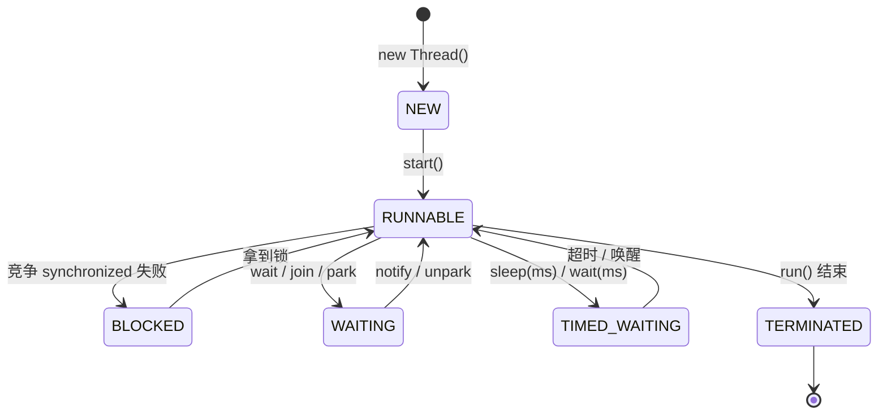

# 线程创建

## 思维链路速查

```chain
四种方式对比 | 谁写任务体 | 选型
任务体接口 | Runnable 与 Callable | 分野
start 与 run | 启动真相 | 陷阱
落地：四种创建 | 代码与命名 | 实战
面试问答 | 高频考点 | 复盘
```

四种创建方式只争一件事：任务体由谁提供 —— Runnable / Callable 决定任务体形态，start 与 run 决定跑在哪个线程；最后是落地代码与命名规范。

## 四种方式对比

| 方式 | 写法要点 | 返回值 | 局限 |
|---|---|---|---|
| 继承 Thread | 重写 `run()`，`new MyThread().start()` | 无 | 单继承被占用，任务与线程绑定 |
| 实现 Runnable | 实现 `run()`，丢进 `new Thread(r)` | 无 | 不能抛受检异常 |
| 实现 Callable + FutureTask | 实现 `call()`，包 `FutureTask` 再丢进 Thread | 有，`get()` 拿 | 写法绕，需多包一层 |
| 线程池提交 | `execute(Runnable)` / `submit(Callable)` | submit 有 Future | 需管理池生命周期 |

> [!note] 线程到底是什么
> 上表说的「线程」是 [[进程与线程]] 里那个 CPU 调度的最小单位——同进程内共享堆、各自私有栈。先分清进程与线程，再看创建方式才不会混淆「任务体」与「执行体」。

> [!note] 虚拟线程是另一条路线
> 上表四种都是**平台线程**（每任务占一个 OS 线程 + 约 1MB 栈）。JDK 21 起的虚拟线程按「任务」记账、海量 IO 场景可扛几十万任务，是并行的另一条路线，单开一篇：[[虚拟线程]]。

> [!note] 只有一种本质
> 平台线程真正生出来永远只有 `new Thread(...)` 这一条路。其余方式改的都是**任务体怎么表达**，不是线程怎么生出来。线程池见 [[线程池创建]]。

> [!tip] 生产选型
> 不需要返回值用 `Runnable`，需要返回值或抛受检异常用 `Callable`；批量任务一律交给池，别 `new Thread` 裸跑。

## 任务体接口

| 对比项 | Runnable | Callable&lt;V&gt; |
|---|---|---|
| 方法 | `void run()` | `V call()` |
| 返回值 | 无 | 有，`Future.get()` 取 |
| 受检异常 | 不能抛 | 可以抛 |
| 来历 | JDK 1.0 | JDK 1.5，配合 Future / 线程池 |
| 直接喂 Thread | 可以 | 不行，须包 FutureTask |

> [!warning] FutureTask 只跑一次
> `FutureTask` 有终止态，同一个实例交给多个线程也只执行一遍 `call()`，结果被缓存复用。要重跑就 new 一个新的。

> [!danger] get() 阻塞
> `future.get()` 会一直阻塞到任务结束；用 `get(timeout, unit)` 设上限，否则一个卡死的任务能挂住整个调用线程。

## start 与 run

```branch
01: 调用方法
02: 按语义分流
- start() | 新建线程执行 run | 正确启动
- run() | 当前线程串行跑一遍 | 不会开线程
- start() 调两次 | IllegalThreadStateException | 线程不可重启
```

> [!danger] 直接调 run() 不是多线程
> `run()` 只是个普通方法，直接调等于在主线程里顺序执行一次，**没有任何并发效果**，这是最经典的手滑。

> [!warning] 线程不能复活
> 线程进入 `TERMINATED` 后不可再 `start()`，第二次调用抛 `IllegalThreadStateException`。要重跑就新建 Thread 实例，或把任务交给池。

<details>
<summary>展开线程状态迁移</summary>



</details>

## 落地：四种创建代码

> [!note] 本节能对应到上文四种
> 继承（耦合）→ Runnable（解耦）→ Callable（带结果）→ 池（批量），代码逐一落地；命名与超时是其中最容易漏的两处。

```java
// 1. 继承 Thread：任务与线程耦合，仅 demo 用
class MyThread extends Thread {
    @Override public void run() { System.out.println("by Thread"); }
}

// 2. 实现 Runnable：无返回值首选
Thread t1 = new Thread(() -> System.out.println("by Runnable"), "biz-a");

// 3. Callable + FutureTask：要返回值 / 抛受检异常
FutureTask<Integer> task = new FutureTask<>(() -> 42);
new Thread(task, "calc").start();
Integer r = task.get(3, TimeUnit.SECONDS);   // 设超时，别死等

// 4. 线程池：批量任务的归宿
pool.execute(() -> doSomething());
Future<Integer> f = pool.submit(() -> 42);
```

> [!tip] 为什么要命名
> 默认 `Thread-0` 在几十个线程的 jstack 里等于没信息。命名后线程 dump 与日志能直接定位到业务模块；池化场景靠 `ThreadFactory` 统一命名，写法见 [[线程池创建]]。

<details>
<summary>面试问答 (4题)</summary>

Q：Java 有几种创建线程的方式？

A：本质上只有 `new Thread()` 一种。常说的三种/四种（继承 Thread、实现 Runnable、Callable + FutureTask、线程池）区别在于任务体的表达与是否有返回值，底层仍然由 Thread 承载。

Q：start() 和 run() 的区别？

A：`start()` 向 JVM 申请新线程，由新线程回调 `run()`，实现并发；直接调 `run()` 只是在当前线程顺序执行一次普通方法，不开新线程。且 `start()` 对一个线程实例只能调一次，重复调抛 `IllegalThreadStateException`。

Q：Runnable 和 Callable 有什么区别？

A：Runnable 的 `run()` 无返回值、不能抛受检异常，JDK 1.0 就有；Callable 的 `call()` 有返回值、可抛受检异常，JDK 1.5 引入，需配合 FutureTask 或线程池 `submit` 使用。

Q：为什么不建议直接 new Thread？

A：频繁创建销毁开销大、无上限、无法复用、故障难定位。交给线程池统一管理，参数可控、可监控，选型见 [[线程池创建]]。

</details>

<details>
<summary>常见误区 (3条)</summary>

- 误区：继承 Thread 才算"真正的"线程。Runnable 只是把任务体解耦出来，线程本身仍是 Thread，且更灵活、可复用。
- 误区：Callable 一定要配 FutureTask。交给线程池时直接 `submit(Callable)` 即可拿到 Future，FutureTask 只在手写 `new Thread` 时才需要。
- 误区：调了 `run()` 就算并发。不开新线程，代码再像线程也是串行，压测 QPS 上不去的常见元凶。

</details>
