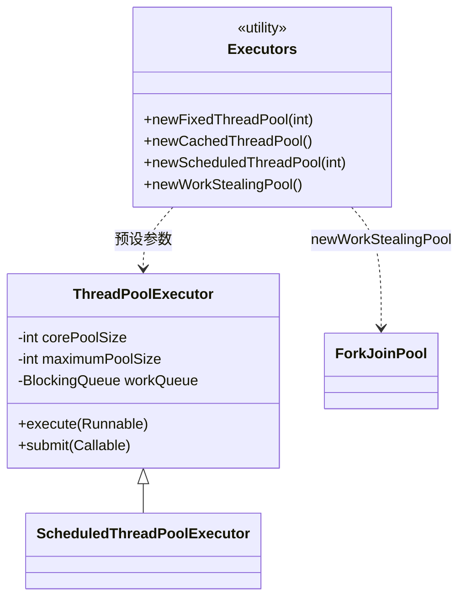

# 线程池创建

## 思维链路速查

```chain
创建方式对比 | 工厂 / 手动 / Spring | 选型
Executors 工厂方法 | 六种快捷方式 | 风险
手动构造 | 显式七参 | 推荐
提交任务 | execute 与 submit | 落地
面试问答 | 高频考点 | 复盘
```

Executors 图省事，风险藏在无界队列与默认拒绝策略里；要可控就手动构造显式七参 —— 提交任务时还得分清 execute 与 submit 谁带回执。

## 创建方式对比

| 方式 | 写法 | 参数可见性 | 适用 |
|---|---|---|---|
| Executors 工厂方法 | `Executors.newFixedThreadPool(n)` | 隐藏，队列多无界 | 演示 / 低负载内部工具 |
| 手动 new | `new ThreadPoolExecutor(...)` | 全显式 | 生产默认 |
| Spring 封装 | `ThreadPoolTaskExecutor` | 全显式 + Bean 生命周期 | Spring 项目 |

> [!danger] 强制约束
> 《Java 开发手册》禁止用 `Executors` 创建线程池：`newFixedThreadPool` / `newSingleThreadExecutor` 用无界 `LinkedBlockingQueue`，`newCachedThreadPool` / `newScheduledThreadPool` 的最大线程数是 `Integer.MAX_VALUE`，两条路都通向 OOM。

> [!tip] 唯一推荐
> 生产一律手动 `new ThreadPoolExecutor(...)`，显式给队列容量与 [[拒绝策略]]；Spring 项目用 `ThreadPoolTaskExecutor` 的等价写法。队列选型见 [[阻塞队列]]。

## Executors 六种工厂方法

| 方法 | corePoolSize | maximumPoolSize | 队列 | 主要风险 |
|---|---|---|---|---|
| newFixedThreadPool(n) | n | n | 无界 LinkedBlockingQueue | 任务堆积 OOM |
| newSingleThreadExecutor() | 1 | 1 | 无界 LinkedBlockingQueue | 任务堆积 OOM |
| newCachedThreadPool() | 0 | Integer.MAX_VALUE | SynchronousQueue | 线程数爆炸 |
| newScheduledThreadPool(n) | n | Integer.MAX_VALUE | DelayedWorkQueue | 线程数爆炸 |
| newSingleThreadScheduledExecutor() | 1 | Integer.MAX_VALUE | DelayedWorkQueue | 线程数爆炸 |
| newWorkStealingPool() | CPU 核数 | 按并行度动态管理 | 每线程自带队列 | 无界、不保序 |

> [!note] 共同点
> 除 newWorkStealingPool（返回 ForkJoinPool）外，其余五个都是 `new ThreadPoolExecutor(...)` 的预设参数包，没有特权，只是替你把危险默认值填好。

> [!warning] newWorkStealingPool
> 底层是 `ForkJoinPool`，任务被分到各线程的工作队列并行执行，**不保证提交顺序**，只适合彼此无依赖的并行计算。

## 按场景选型

```branch
01: 选创建方式
02: 按场景分流
- 生产服务 | new ThreadPoolExecutor + 有界队列 | 默认
- Spring 项目 | ThreadPoolTaskExecutor Bean | 等价写法
- 定时与延时 | new ScheduledThreadPoolExecutor(n) 显式上限 | 禁 Executors 版
- 一次性并行计算 | newWorkStealingPool / parallelStream | 不保序
- 本地演示 | Executors.* | 限 demo
```

## 落地：手动创建代码

> [!note] 三个必填项
> 手动创建至少显式给三样：有界队列、可辨识的 `ThreadFactory`、明确 [[拒绝策略]]。core / max / keepAlive 按任务类型估算，公式见 [[ThreadPoolExecutor]]。

```java
ThreadFactory named = new ThreadFactory() {
    private final AtomicInteger i = new AtomicInteger(1);
    public Thread newThread(Runnable r) {
        return new Thread(r, "biz-pool-" + i.getAndIncrement());
    }
};

ThreadPoolExecutor pool = new ThreadPoolExecutor(
    4,                              // corePoolSize
    8,                              // maximumPoolSize
    60, TimeUnit.SECONDS,           // 非核心线程空闲存活
    new ArrayBlockingQueue<>(200),  // 有界队列
    named,                          // 线程命名，排障时能定位
    new ThreadPoolExecutor.CallerRunsPolicy());
```

> [!tip] 为什么要给线程命名
> 默认的 `pool-1-thread-1` 在有几十个池的进程里等于没有信息。命名后 jstack 与日志能直接指出是哪个业务池打满。

<details>
<summary>展开类图</summary>



</details>

## 提交任务

| 方法 | 入参 | 返回 | 异常处理 |
|---|---|---|---|
| execute | Runnable | void | 异常抛到工作线程，该线程终止并由池补建 |
| submit | Runnable / Callable | Future | 异常封进 Future，调 `get()` 才抛出 |

> [!danger] submit 吞异常
> `submit` 把异常封进 `Future`，不调 `get()` 就永远看不到失败，任务静默消失。需要感知结果就 `get()`，或统一加 `UncaughtExceptionHandler`。

```java
pool.execute(() -> doSomething());          // 不关心结果
Future<Integer> f = pool.submit(() -> 42);  // 关心结果 / 需要取消
```

<details>
<summary>Spring 写法</summary>

```java
@Bean
public ThreadPoolTaskExecutor bizExecutor() {
    ThreadPoolTaskExecutor t = new ThreadPoolTaskExecutor();
    t.setCorePoolSize(4);
    t.setMaxPoolSize(8);
    t.setQueueCapacity(200);
    t.setThreadNamePrefix("biz-");
    t.setRejectedExecutionHandler(new ThreadPoolExecutor.CallerRunsPolicy());
    t.initialize();
    return t;
}
```

- 底层仍委托 `ThreadPoolExecutor`，只是多了 Bean 生命周期与 `shutdown` 钩子。
- `@Async("bizExecutor")` 按 Bean 名指定，不指定则用默认的 `applicationTaskExecutor`。

</details>

<details>
<summary>面试问答 (4题)</summary>

Q：为什么禁止用 Executors 创建线程池？

A：固定/单线程版用无界 LinkedBlockingQueue，任务堆积耗尽堆内存；缓存/定时版最大线程数为 Integer.MAX_VALUE，可创建海量线程。两者都能 OOM，且参数不可控、出事定位不到是哪个池。

Q：手动创建最少要指定哪些东西？

A：有界队列容量、ThreadFactory（线程命名）、拒绝策略，外加 core / max / keepAlive。

Q：execute 与 submit 有什么区别？

A：execute 只收 Runnable、无返回值，异常直接在工作线程抛出；submit 返回 Future，异常被封装，必须 `get()` 才能拿到，否则静默失败。

Q：Spring 里怎么建线程池？

A：定义 ThreadPoolTaskExecutor Bean，设 core/max/queueCapacity/RejectedExecutionHandler 并调 initialize()，用 `@Async("beanName")` 绑定。

</details>

<details>
<summary>常见误区 (3条)</summary>

- 误区：Executors 只是语法糖，用用无妨。它填的是危险默认值，把 OOM 风险藏到调用方看不见的地方。
- 误区：corePoolSize 越大越好。超出 CPU 承载力只是增加上下文切换，估算公式见 [[ThreadPoolExecutor]]。
- 误区：配了有界队列就安全。队列打满后的行为由 [[拒绝策略]] 决定，默认 AbortPolicy 会直接抛异常打断调用方。

</details>
