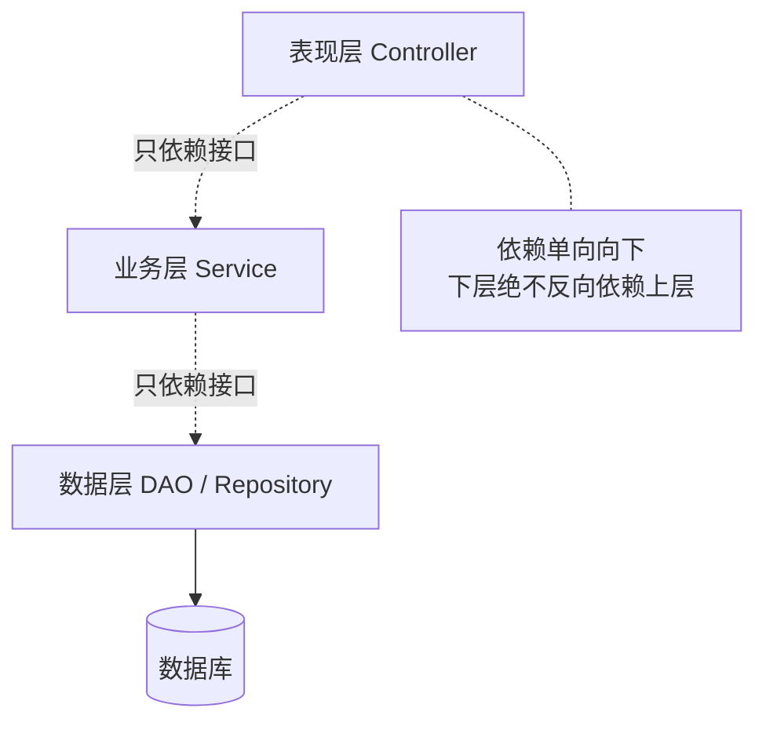

# 经典三层架构

## 思维链路速查

```chain
三层定义 | 各层职责边界 | 概览
依赖方向 | 上层依赖下层与解耦 | 核心
与 MVC 辨析 | 架构分层 vs 表现层模式 | 厘清
详节 | 落地与代码骨架 | 实战
面试问答 | 高频考点 | 复盘
```

三层的本质是「职责分区 + 单向依赖」：上层调下层、靠接口解耦；最常被混为一谈的是它与 MVC 的分工 —— MVC 只是表现层内部的组织方式。

## 三层定义

| 层 | 别名 | 职责 | 典型组件 |
|---|---|---|---|
| 表现层 | 表示层 / UI / Web | 接收请求、参数校验、组装响应 | Controller、View、DTO |
| 业务逻辑层 | 服务层 / Service | 业务规则、事务编排、领域计算 | Service、Manager、Domain |
| 数据访问层 | 持久层 / DAO | 数据增删改查、与 DB / 外部存储交互 | DAO、Mapper、Repository |

> [!note] 跨层模型
> 实体 / 模型（DO / POJO / DTO）在层间传输。贫血模型（仅字段 + getter/setter）最常见；充血模型把行为放进实体，归属领域驱动设计（DDD）讨论范畴。

> [!tip] 分层动机
> 单一职责、解耦、下层可替换（换数据库）、上层可独立单测（mock 下层）。小脚本 / 极简 CRUD 可不分层，业务复杂后不分则耦合失控。

## 依赖方向

依赖单向向下：表现层 → 业务层 → 数据层；下层**绝不**反向依赖上层。数据层之下的存储与索引设计见 [[MySQL索引为什么用B+树]]。



- **面向接口编程**：上层持有下层接口，不持有具体实现。
- **依赖倒置（DIP）**：上层定义接口，下层实现，运行时注入（如 Spring `@Autowired`）。
- **收益**：换下层实现零改上层；单测用 mock 桩替换下层，隔离验证业务逻辑。

> [!tip] 面向接口正是 AOP 的土壤
> 上层的「接口 + 运行时注入」让容器有机会塞进代理对象——Spring 的声明式事务、缓存注解全都挂在 [[动态代理]] 之上。所以业务层一旦脱离接口、改用 `this.xxx()` 自调用，事务与缓存注解会集体失效。

> [!warning] 反向依赖即破层
> 数据层 / 业务层回调表现层（如 DAO 里拼界面文案）会破坏分层、诱发循环依赖，必须禁止。

## 与 MVC 辨析

| 维度 | 经典三层架构 | MVC |
|---|---|---|
| 视角 | 系统级纵向职责分层 | 表现层内部设计模式 |
| 覆盖范围 | 表现 + 业务 + 数据 | 仅表现层（Model-View-Controller） |
| 关系 | MVC 的 Controller 属于三层中的表现层 | 解决「界面与交互如何组织」 |

> [!danger] 高频混淆
> 把 MVC 当三层架构：误以为 M=数据层、V/C=表现层。实际 MVC 的 Model 常是领域模型，归属业务 / 表现，并不等于数据访问层。三层解决"系统怎么切分职责"，MVC 解决"表现层怎么组织"。

## 详节

Spring 风格骨架，依赖全部通过构造函数注入。为省篇幅下层直接给出实现类；生产中业务层 / 数据层建议抽接口 + Impl，面向接口的收益见上文：

```java
// 表现层
@RestController
@RequestMapping("/orders")
public class OrderController {
    private final OrderService service;          // 依赖业务层
    public OrderController(OrderService s) { this.service = s; }
    @PostMapping
    public OrderDTO create(@RequestBody OrderDTO dto) {
        return service.create(dto);
    }
}

// 业务层
@Service
public class OrderService {
    private final OrderRepository repo;          // 依赖数据层
    public OrderService(OrderRepository r) { this.repo = r; }
    @Transactional
    public OrderDTO create(OrderDTO dto) {       // 业务规则 + 事务
        return repo.save(dto);
    }
}

// 数据层
@Repository
public class OrderRepository {
    public OrderDTO save(OrderDTO dto) {         // JDBC / MyBatis / JPA
        return dto;
    }
}
```

> [!note] 演进方向
> 贫血三层在复杂域会膨胀为「事务脚本」；领域驱动设计（DDD）、六边形架构、微服务是更进一步的切分思路，按需引入，勿过早。

<details>
<summary>面试问答 (3题)</summary>

Q：三层架构和 MVC 有什么区别？

A：三层是系统级职责分层（表现 / 业务 / 数据），MVC 是表现层内部的模式；Controller 属于三层中的表现层，二者不互斥。

Q：为什么要分层，不分不行吗？

A：分层为解耦、单一职责、下层可替换、上层可独立单测；极简 CRUD 或脚本可不分层，但业务复杂后不分则耦合失控、难以维护。

Q：层与层之间如何解耦？

A：面向接口编程 + 依赖倒置（上层定义接口、下层实现、依赖注入），下层不反向依赖上层。

</details>

<details>
<summary>常见误区 (4条)</summary>

- 误区：MVC = 三层架构。实际 MVC 仅覆盖表现层，二者视角不同。
- 误区：每层都必须有。简单 CRUD 硬套三层是过度设计，应按复杂度取舍。
- 误区：下层可以调用上层。依赖必须单向向下，反向会破坏分层、形成循环依赖。
- 误区：业务逻辑写在 Controller 里。这把表现层变成业务层，丧失可测试性与复用。

</details>
