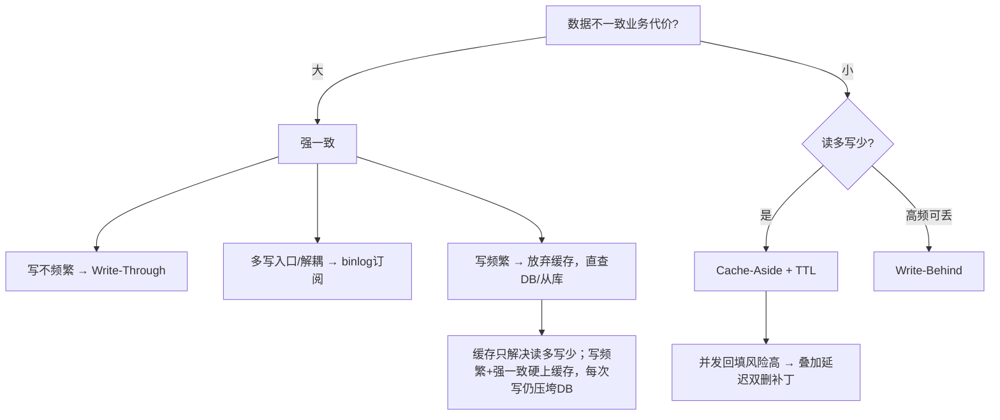

# 缓存与数据库一致性

:::lede
缓存与数据库一致性是指缓存与 DB 两份数据在读写路径上出现偏差的问题域，目标不是消灭不一致，而是把不一致窗口收敛到可接受的范围之内。
:::

## 思维链路速查

```chain
不一致是常态 | 接受窗口而非消灭 | 前提
四种策略全景 | 谁代理读写 | 选型
Cache-Aside 落地 | 删不更 · 提交后删 | 核心
兜底与选型 | TTL · 补偿 · 分级 | 收尾
```

缓存与 DB 之间必然存在不一致窗口，目标不是消灭它——缓存只是可丢弃、会过期的加速层，靠读回源、写失效、短 TTL 把窗口收敛住。

## 策略全景

| 策略 | 常见名称 | 思路 | 一致性 | 写延迟 | 适用 |
|---|---|---|---|---|---|
| Cache-Aside | 旁路缓存 | 读 miss 回源；写更新 DB + 删缓存 | 最终 | 低 | 读多写少 |
| Read/Write-Through | 读写穿透 / 直写直读 | 缓存层代理读写，写同步落 DB | 同步阻塞（代码层强依赖） | 高 | 强一致、写少 |
| Write-Behind | 异步回写 / Write-Back | 写只落缓存，异步批量落库 | 最终 | 极低 | 高频计数、可丢 |
| binlog 订阅 | Canal / Maxwell | 监听 binlog 异步删/更新缓存 | 近强 | 低 | 多写入口、解耦失效 |

## Cache-Aside

```
读: 命中→返回 / 未命中→查DB→回填→返回
写: 更新DB → 删缓存(不是改)
```

- **删除而非更新**：更新要组装完整缓存对象、代价高且易失败，且「写 DB 成功 → 更新缓存失败」会留下永久脏数据；删除则下次读自然回填，失败最多一次 cache miss。
- **正确顺序**：先提交事务（afterCommit）再删缓存；必须提前删时用 1s TTL 兜底，否则回滚会留下脏缓存。
- **残留风险**：更新 DB 后、删缓存前并发读仍可能回填旧值 → 叠加延迟双删或 TTL 兜底。

> [!warning] ❌ 反模式：先删缓存再更新 DB
> 删后、提交前如有并发读会回填旧值；DB 虽已更新，缓存却长期为旧。严禁使用。

## 延迟双删（Cache-Aside 的并发补丁）

不是独立策略，只是 Cache-Aside 的并发回填补丁：更新 DB 后延时再删一次，清掉并发读回填的旧值。

```chain
首次删除 | 更新 DB 后立刻删 | 清当前值
延时等待 | P99 读耗时 + 主从延迟 | 让并发读落地
二次删除 | 异步再删一次 | 清回填旧值
```

| 项 | 做法 |
|---|---|
| 延时 T | `P99 读耗时 + 主从延迟 + 100ms` |
| 二次删除 | 异步执行（MQ 延迟消息），不阻塞主流程 |
| ⚠️ 二次仍失败 | 不阻塞主线程，回退短 TTL + 补偿队列补删 |

## Read / Write-Through

| 模式 | 行为 | 职责归属 | 关键注意 |
|---|---|---|---|
| Read-Through | 读 miss 由缓存层自动回源回填 | 缓存层代理 | 业务无感知 |
| Write-Through | 写同步写缓存 + DB | 缓存层代理 | 代码层强依赖，但 ≠ 分布式线性一致 |
| Cache-Aside | 读 miss 业务回源；写更新 DB + 删缓存 | 业务代码 | 灵活、代码侵入 |

> [!warning] 同步阻塞 ≠ 线性一致
> Write-Through 若不在同一本地事务（如单机 JTA），缓存与 DB 间仍有提交时序 / 写失败窗口；真要分布式强一致需 TCC 等，代价极高，不建议让缓存参与。

## Write-Behind

```chain
写请求 | 只更缓存并记变更日志 | 立即返回
定时 flush | 批量拉取并合并落库 | 异步
清缓冲 | 落库成功才删 pending | 失败下轮重放
```

| 要点 | 说明 |
|---|---|
| 一致性 | 最终一致 |
| 性能来源 | 写路径不同步落库，只记缓存/日志 |
| 幂等 | 落库必须幂等，失败日志可下轮重放 |
| 风险 | 宕机可能丢未落库数据，仅用于可丢失场景 |
| 多实例 | 分布式锁防重复 flush |

## binlog 订阅

```chain
DB 变更 | binlog 落盘 | 源头
解析投递 | Canal / Maxwell 转消息 | 解耦
消费失效 | 异步删或更新缓存 | 落地
```

| 特性 | 说明 |
|---|---|
| 优势 | 与业务解耦，多写入口统一保证，近强一致 |
| 代价 | 引入中间件与消息链路，需处理丢失 / 乱序 / 延迟 |

## 兜底机制

失效遗漏与删除失败最终都靠下表兜底；三类缓存异常见 [[缓存击穿]]、[[缓存穿透]]、[[缓存雪崩]]。

| 机制 | 作用 |
|---|---|
| 短 TTL | 遗漏失效 / 失败最终靠过期重建，窗口收敛到 TTL |
| 失效失败重试 / 补偿 | 删缓存失败 → 重试 3 次（指数退避）→ 仍失败投递补偿队列（MQ）或记失败日志，定时任务扫表补偿；极端情况靠短 TTL，不无限重试阻塞主线程 |
| fail-open 降级 | 缓存异常不抛业务异常：读降级直查 DB、写放弃缓存 |
| 防穿透 | 空值缓存与布隆过滤器，详见 [[缓存穿透]] |

## 一致性级别与选型



<details>
<summary>面试问答 (2题)</summary>

Q：先删缓存还是先更新 DB？

A：先更新 DB 再删缓存，更稳是事务提交后（afterCommit）再删；反过来先删缓存后更 DB，删完到提交前的并发读会把旧值回填。

Q：Write-Through 能保证强一致吗？

A：不能，除非「写缓存 + 写 DB」在同一本地事务里；真强一致需 TCC 等，不建议让缓存参与。

</details>

<details>
<summary>常见误区 (3条)</summary>

- 误区：分布式锁防超卖 = 缓存一致性。锁解决 DB 并发写，与缓存失效正交。
- 误区：缓存必须永远等于 DB。接受短暂不一致 + TTL 兜底，比追求瞬时一致稳健。
- 误区：只删缓存就够了。必须配合 TTL / 延迟双删 / 失败重试，单次删除兜不住并发回填。

</details>
