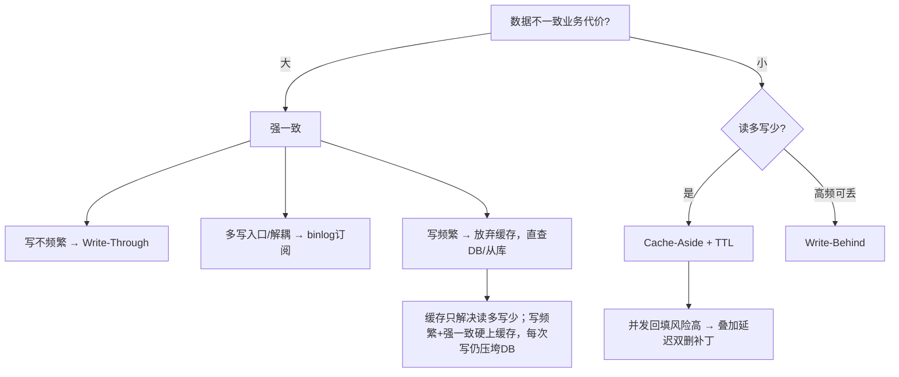

# 缓存与数据库一致性

:::lede
**缓存与数据库一致性**是指缓存这份副本与 DB 这份权威数据源之间出现偏差的问题域；目标不是消灭不一致，而是把不一致窗口收敛到业务可接受的范围。
**权威源：** DB 是唯一写入源 · 缓存 = 可丢弃副本
:::

## 思维链路速查

```chain
不一致是常态 | 接受窗口而非消灭 | 前提
四种策略全景 | 谁代理读写 | 选型
读写路径 | 读回源 · 写删缓存 | 核心
兜底与选型 | TTL · 补偿 · 分级 | 收尾
```

所有策略都立在一条前提上：缓存是副本，DB 才是权威源——写只打 DB，缓存不接收新值，只能被读回源或被写失效。窗口消灭不了，靠读回源、写失效、短 TTL 收敛。

## 策略全景

| 策略 | 常见名称 | 思路 | 一致性 | 写延迟 | 适用 |
|---|---|---|---|---|---|
| Cache-Aside | 旁路缓存 | 读 miss 回源；写更新 DB + 删缓存 | 最终 | 低 | 读多写少 |
| Read/Write-Through | 读写穿透 / 直写直读 | 缓存层代理读写，写同步落 DB | 同步阻塞（代码层强依赖） | 高 | 强一致、写少 |
| Write-Behind | 异步回写 / Write-Back | 写只落缓存，异步批量落库 | 最终 | 极低 | 高频计数、可丢 |
| binlog 订阅 | Canal / Maxwell | 监听 binlog 异步删/更新缓存 | 近强 | 低 | 多写入口、解耦失效 |

## 读写路径：读走缓存，写旁路缓存

Cache-Aside 的「旁路」落在写路径：应用直接写 DB，缓存既不代理写、也不接收新值，写完只被失效。

| 路径 | 步骤 | 缓存角色 |
|---|---|---|
| 读 | 命中返回；miss 查 DB → 回填 → 返回 | 加速层，miss 才回源 |
| 写 | 更新 DB → 删缓存 | 只被失效，不被写入 |

> [!note] 副本不许有第二个写入源
> 缓存值只能由「读回源回填」或「写后失效」产生。写完 DB 顺手更新缓存，等于给副本开了独立写入源，两条源的时序必然错位。

## 写路径：删而非更新

写后失效而不是就地更新，四条理由：

| 理由 | 机制 |
|---|---|
| 并发写乱序覆盖 | 缓存写入序 ≠ DB 提交序，留旧值 |
| 组装成本高 | 缓存常是多表富化结果，重算易失败 |
| 失败留永久脏 | DB 成功 + 改缓存失败 → 旧值长驻 |
| 冷数据白写 | 写多读少的 key 改完无人读 |

乱序覆盖时序（A 写 v1、B 写 v2；DB 序 A→B，缓存更新序 B→A）：

| 时刻 | 动作 | DB | 缓存 |
|---|---|---|---|
| t1 | A 更新 DB=1 | 1 | — |
| t2 | B 更新 DB=2 | 2 | — |
| t3 | B 更新缓存=2 | 2 | 2 |
| t4 | A 更新缓存=1 | 2 | 1 ❌ |

改成删除则 t3/t4 都只是删空，下次读回填 DB 里的 2；删除失败最坏是一次 cache miss，读会自愈。

## 写顺序：先 DB 后删

顺序只有一个正确解：先更新 DB（最好事务提交后）再删缓存。反过来「先删缓存再更新 DB」的失败时序：

| 时刻 | 动作 | DB | 缓存 |
|---|---|---|---|
| t1 | 写：删缓存 | 1 | 空 |
| t2 | 读：miss → 查 DB 得 1 | 1 | 空 |
| t3 | 读：回填缓存=1 | 1 | 1 |
| t4 | 写：更新 DB=2 提交 | 2 | 1 ❌ |

旧值被回填且此后无人再删，脏到 TTL 过期为止——这就是把「删」放到「写 DB」之前的核心代价。

> [!warning] ❌ 反模式：先删缓存再更新 DB
> 删后、提交前如有并发读会回填旧值；DB 虽已更新，缓存却长期为旧。严禁使用。

正序也有残留窗口：读在 DB 提交前 miss 并取到旧值、回填又落在删除之后 → 旧值盖回。要同时满足「读 miss + 读到提交前的值 + 回填晚于删除」，概率低，交给延迟双删或短 TTL。必须提前删（提交前）时，用 1s TTL 兜住回滚场景。

## 延迟双删（Cache-Aside 的并发补丁）

不是独立策略，只是 Cache-Aside 的并发回填补丁：更新 DB 后延时再删一次，清掉并发读回填的旧值。

```chain
首次删除 | 更新 DB 后立刻删 | 清当前值
延时等待 | P99 读耗时 + 主从延迟 | 让并发读落地
二次删除 | 异步再删一次 | 清回填旧值
```

| 项 | 做法 |
|---|---|
| 延时 T | `P99 读耗时 + 主从延迟 + 100ms` |
| 二次删除 | 异步执行（MQ 延迟消息），不阻塞主流程 |
| ⚠️ 二次仍失败 | 不阻塞主线程，回退短 TTL + 补偿队列补删 |

## Read / Write-Through

两者与 Cache-Aside 的分界在「谁代理读写」：穿透模式由缓存层代理，业务不感知回源与失效——代价是缓存层成了强依赖。

| 模式 | 行为 | 关键注意 |
|---|---|---|
| Read-Through | 读 miss 由缓存层自动回源回填 | 业务无感知 |
| Write-Through | 写同步写缓存 + DB | 缓存层强依赖，且 ≠ 分布式线性一致 |

> [!warning] 同步阻塞 ≠ 线性一致
> Write-Through 若不在同一本地事务（如单机 JTA），缓存与 DB 间仍有提交时序 / 写失败窗口；真要分布式强一致需 TCC 等，代价极高，不建议让缓存参与。

## Write-Behind

```chain
写请求 | 只更缓存并记变更日志 | 立即返回
定时 flush | 批量拉取并合并落库 | 异步
清缓冲 | 落库成功才删 pending | 失败下轮重放
```

| 要点 | 说明 |
|---|---|
| 一致性 | 最终一致 |
| 性能来源 | 写路径不同步落库，只记缓存/日志 |
| 幂等 | 落库必须幂等，失败日志可下轮重放 |
| 风险 | 宕机可能丢未落库数据，仅用于可丢失场景 |
| 多实例 | 分布式锁防重复 flush |

## binlog 订阅

```chain
DB 变更 | binlog 落盘 | 源头
解析投递 | Canal / Maxwell 转消息 | 解耦
消费失效 | 异步删或更新缓存 | 落地
```

| 特性 | 说明 |
|---|---|
| 优势 | 与业务解耦，多写入口统一保证，近强一致 |
| 代价 | 引入中间件与消息链路，需处理丢失 / 乱序 / 延迟 |

## 兜底机制

失效遗漏与删除失败最终都靠下表兜底；三类缓存异常见 [[缓存击穿]]、[[缓存穿透]]、[[缓存雪崩]]。

| 机制 | 作用 |
|---|---|
| 短 TTL | 遗漏失效 / 失败最终靠过期重建，窗口收敛到 TTL |
| 失效失败重试 / 补偿 | 删缓存失败 → 重试 3 次（指数退避）→ 仍失败投递补偿队列（MQ）或记失败日志，定时任务扫表补偿；极端情况靠短 TTL，不无限重试阻塞主线程 |
| fail-open 降级 | 缓存异常不抛业务异常：读降级直查 DB、写放弃缓存 |
| 防穿透 | 空值缓存与布隆过滤器，详见 [[缓存穿透]] |

## 一致性级别与选型



<details>
<summary>面试问答 (4题)</summary>

Q：先删缓存还是先更新 DB？

A：先更新 DB 再删，最稳是 afterCommit 后再删；反过来删完到提交前的并发读会把旧值回填，且此后无人再删。

Q：写后为什么删缓存而不是更新缓存？

A：更新会让并发写乱序覆盖（缓存最终值 ≠ DB 最终值），且富化对象重算成本高、失败留永久脏数据；删除只是置空，下次读回源自愈。

Q：缓存能当写入源吗？

A：不能。缓存是 DB 的只读副本，写只打 DB，缓存值只能来自读回源回填或写后失效。

Q：Write-Through 能保证强一致吗？

A：不能，除非「写缓存 + 写 DB」在同一本地事务里；真强一致需 TCC 等，不建议让缓存参与。

</details>

<details>
<summary>常见误区 (3条)</summary>

- 误区：写完 DB 顺手更新缓存更快。副本多了写入源，并发下必然乱序覆盖，且失败无自愈路径。
- 误区：先删缓存再更新 DB 更安全。删后并发读回填旧值，脏到 TTL 过期。
- 误区：只删缓存就够了。必须配合 TTL / 延迟双删 / 失败重试，单次删除兜不住并发回填。

</details>
