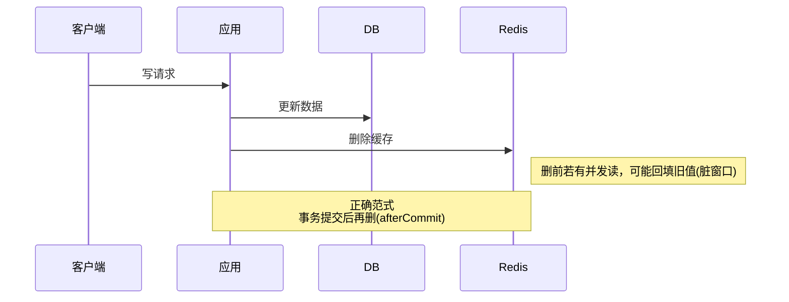
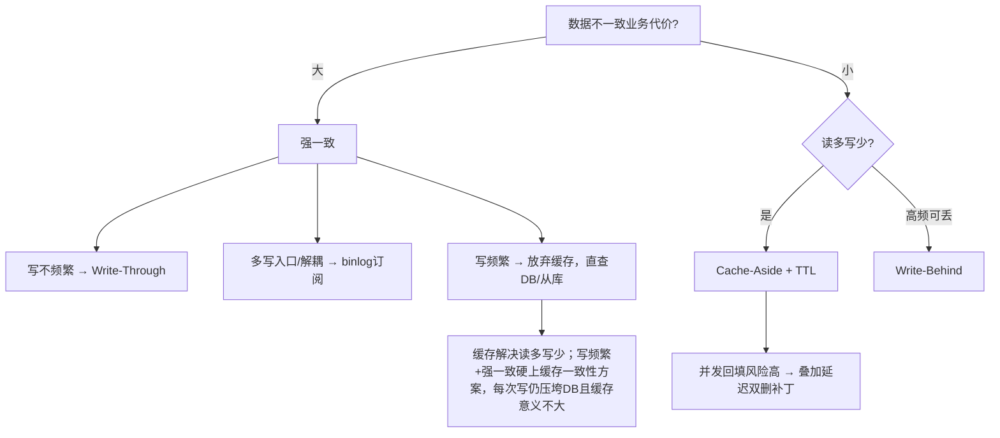

# 缓存与数据库一致性

## 思维链路速查

```chain
不一致是常态 | 接受窗口而非消灭 | 前提
四种策略全景 | 谁代理读写 | 选型
Cache-Aside 落地 | 删不更 · 提交后删 | 核心
兜底与选型 | TTL · 补偿 · 分级 | 收尾
```

缓存与 DB 之间必然存在不一致窗口 → 按一致性要求选策略 → Cache-Aside 是最常用的落地 → 全部靠 TTL 与补偿兜底收敛。

> [!important] 心法
> 一致性不靠「让缓存永远等于 DB」，而靠「缓存只是可丢弃、会过期的加速层」——读回源、写失效、短 TTL 兜底、故障直查 DB。

## 策略全景

| 策略 | 常见名称 | 思路 | 一致性 | 写延迟 | 适用 |
|---|---|---|---|---|---|
| Cache-Aside | 旁路缓存 | 读 miss 回源；写更新 DB + 删缓存 | 最终 | 低 | 读多写少 |
| Read/Write-Through | 读写穿透 / 直写直读 | 缓存层代理读写，写同步落 DB | 同步阻塞（代码层强依赖） | 高 | 强一致、写少 |
| Write-Behind | 异步回写 / Write-Back | 写只落缓存，异步批量落库 | 最终 | 极低 | 高频计数、可丢 |
| binlog 订阅 | Canal / Maxwell | 监听 binlog 异步删/更新缓存 | 近强 | 低 | 多写入口、解耦失效 |

## Cache-Aside

```
读: 命中→返回 / 未命中→查DB→回填→返回
写: 更新DB → 删缓存(不是改)
```

> [!note] 为什么删不是改
> 避免「写 DB 成功 → 更新缓存失败 → 永久脏」。删了下次读自然回填。

> [!note] ✅ 正确范式
> 先提交事务（afterCommit）→ 再删缓存。必须提前删时，用 1s TTL 兜底，否则回滚会留下脏缓存。

> [!warning] ❌ 反模式：先删缓存再更新 DB
> 删后、提交前如有并发读，会回填旧值；DB 虽已更新，缓存却长期为旧。严禁使用。

> [!important] 残留风险
> 更新 DB 后、删缓存前并发读仍可能回填旧值 → 叠加延迟双删或 TTL 兜底。



## 延迟双删（Cache-Aside 的并发补丁）

> [!note] 定位
> 不是独立策略，只是 Cache-Aside 的并发回填补丁：更新 DB 后延时再删一次，清掉并发读回填的旧值。

```chain
首次删除 | 更新 DB 后立刻删 | 清当前值
延时等待 | P99 读耗时 + 主从延迟 | 让并发读落地
二次删除 | 异步再删一次 | 清回填旧值
```

| 项 | 做法 |
|---|---|
| 延时 T | `P99 读耗时 + 主从延迟 + 100ms` |
| 二次删除 | 异步执行（MQ 延迟消息），不阻塞主流程 |
| ⚠️ 二次仍失败 | 不阻塞主线程，回退短 TTL + 补偿队列补删 |

## Read / Write-Through

| 模式 | 行为 | 职责归属 | 关键注意 |
|---|---|---|---|
| Read-Through | 读 miss 由缓存层自动回源回填 | 缓存层代理 | 业务无感知 |
| Write-Through | 写同步写缓存 + DB | 缓存层代理 | 代码层强依赖，但 ≠ 分布式线性一致 |
| Cache-Aside | 读 miss 业务回源；写更新 DB + 删缓存 | 业务代码 | 灵活、代码侵入 |

> [!warning] 分布式强一致？
> Write-Through 的同步阻塞 ≠ 线性一致。除非同一本地事务（如单机 JTA），否则缓存与 DB 间仍有极小提交时序 / 写失败窗口。真要分布式强一致需 TCC 等，代价极高，不建议让缓存参与。

## Write-Behind

```chain
写请求 | 只更缓存并记变更日志 | 立即返回
定时 flush | 批量拉取并合并落库 | 异步
清缓冲 | 落库成功才删 pending | 失败下轮重放
```

| 要点 | 说明 |
|---|---|
| 一致性 | 最终一致 |
| 性能来源 | 写路径不同步落库，只记缓存/日志 |
| 幂等 | 落库必须幂等，失败日志可下轮重放 |
| 风险 | 宕机可能丢未落库数据，仅用于可丢失场景 |
| 多实例 | 分布式锁防重复 flush |

## binlog 订阅

```chain
DB 变更 | binlog 落盘 | 源头
解析投递 | Canal / Maxwell 转消息 | 解耦
消费失效 | 异步删或更新缓存 | 落地
```

| 特性 | 说明 |
|---|---|
| 优势 | 与业务解耦，多写入口统一保证，近强一致 |
| 代价 | 引入中间件与消息链路，需处理丢失 / 乱序 / 延迟 |

## 兜底机制

缓存异常通常归为 [[缓存击穿]]、[[缓存穿透]]、[[缓存雪崩]] 三类；下表机制分别对症下药，全部再叠加短 TTL 兜底。

| 机制 | 作用 |
|---|---|
| 短 TTL | 遗漏失效 / 失败最终靠过期重建，窗口收敛到 TTL |
| 空值缓存 | 防 [[缓存穿透]]：查不到也写 null + 短 TTL，挡住反复 miss 的无效回源 |
| 布隆过滤器 | 在入口拦截不存在的 key，零 DB 开销（与空值缓存常叠加） |
| 失效失败重试 / 补偿 | 删缓存失败 → 重试 3 次（指数退避）→ 仍失败投递补偿队列（MQ）或记失败日志，定时任务扫表补偿；极端情况靠短 TTL 兜底，不无限重试阻塞主线程 |
| fail-open 降级 | 缓存异常不抛业务异常：读降级直查 DB、写放弃缓存 |

## 一致性级别与选型



<details>
<summary>面试问答 (4题)</summary>

Q：先删缓存还是先更新 DB？

A：先更新 DB，再删缓存。反过来（先删缓存后更 DB）时，删完到提交前的并发读会把旧值回填进缓存，DB 虽已更新，缓存却长期为旧——这是明确的反模式。更稳的做法是事务提交后（afterCommit）再删。

Q：为什么是删除缓存而不是更新缓存？

A：更新缓存要组装完整缓存对象，代价高且容易失败；更要命的是「写 DB 成功 → 更新缓存失败」会留下永久脏数据。删除则让下次读自然回填，失败最多是一次 cache miss。

Q：Cache-Aside 下怎么尽可能减少脏数据？

A：三层叠加——事务提交后再删缓存（afterCommit）；并发回填风险高时加延迟双删；无论怎样都配短 TTL 作为最后兜底，把不一致窗口收敛到 TTL 长度。

Q：Write-Through 能保证强一致吗？

A：不能。它只是把「写缓存 + 写 DB」同步阻塞在同一调用里，除非二者在同一本地事务中，否则仍存在提交时序与部分失败的窗口。真正的分布式强一致需要 TCC 之类的方案，代价极高，不建议让缓存参与。

</details>

<details>
<summary>常见误区 (3条)</summary>

- 误区：分布式锁防超卖 = 缓存一致性。锁解决的是 DB 并发写，缓存失效是另一件事，二者正交。
- 误区：缓存必须永远等于 DB。接受短暂不一致 + TTL 兜底，比追求瞬时一致稳健得多。
- 误区：只删缓存就够了。必须配合 TTL / 延迟双删 / 失败重试，单靠一次删除兜不住并发回填与删除失败。

</details>
