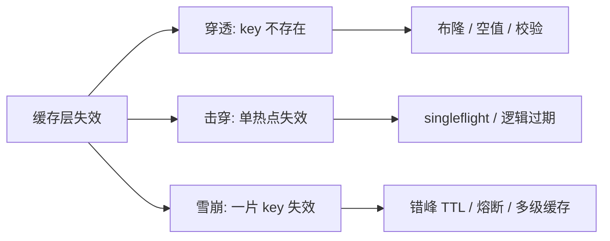

# 缓存穿透、击穿与雪崩

缓存三类异常本质都是「缓存层失效、请求落到 DB」。它们不是三个独立问题，而是**同一个处理过程里、失效范围由小到大的三阶**：

> 一个请求进来 → 缓存救不救得了你？
> 1. 数据根本不存在 → **穿透**（缓存管不了）
> 2. 单热点瞬间失效 → **击穿**（同一 key 并发回源）
> 3. 大量 key 同时失效 / 缓存层宕机 → **雪崩**（整片塌方）

> [!important] 排序口诀
> **穿透 → 击穿 → 雪崩**：从「数据问题」到「时间问题」再到「规模问题」；
> 解法也从「入口拦截 → 单点合并 → 整体防护」逐级升级。三者都建立在「缓存是可丢弃的加速层」前提上。

## 关系图

- [[缓存穿透]]
- [[缓存击穿]]
- [[缓存雪崩]]
