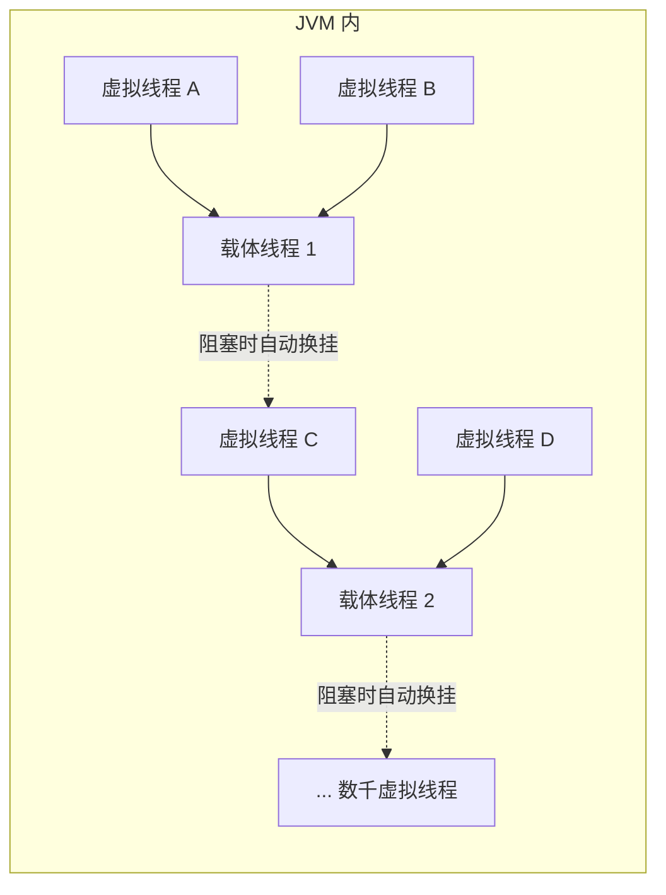

# 虚拟线程

:::lede
虚拟线程是 JVM 在用户态实现的轻量线程，由 JVM 调度器把大量虚拟线程挂载到少量平台线程上运行。它与平台线程的关键差异在于：线程本体不再是 OS 线程，阻塞时会让出载体而不占住内核线程。
:::

## 思维链路速查

```chain
平台线程对比 | 本质差异 | 定位
调度原理 | 为什么轻量 | 核心
创建方式 | 两种 API | 落地
适用场景 | 何时该用 | 决策
面试问答 | 高频考点 | 复盘
```

JDK 21 正式引入（JEP 444）的轻量线程：任务体仍是 `Thread`，但成千上万个虚拟线程只落在几十个载体线程上跑 —— 阻塞时自动让出载体，这就是它轻量的原因，也是「什么时候不该用」的由来。

## 平台线程 vs 虚拟线程

| 对比项 | 平台线程 | 虚拟线程 |
|---|---|---|
| 底层载体 | 每个线程 = 一个 OS 线程 | JVM 对象，映射到少量 OS「载体线程」 |
| 栈 | 固定（常 1MB），受内存上限 | 动态，可百万级同存 |
| 创建 / 销毁 | 走内核，开销大 | 纯用户态，近普通对象 |
| 阻塞代价 | 占住 OS 线程，白白等 | 自动让出载体，去跑别的任务 |
| 调度者 | OS 调度器 | JVM 调度器 |
| 状态 API | 全状态可见 | 只报 NEW / RUNNABLE / TERMINATED |

定位：面向 **IO 密集 + 海量任务**（每请求一线程模型），让「线程数」不再是瓶颈；CPU 密集与重度锁争用没有收益。平台线程怎么生出来见 [[线程创建]]。

## 调度原理

> [!tip] 轻量来自「阻塞不占坑」
> 平台线程阻塞在 IO / `park` 上会占住 OS 线程；虚拟线程阻塞时 JVM 把它**摘下（unmount）载体**，载体立刻转去执行别的虚拟线程——这就是上万虚拟线程只靠几十个载体线程的真相。

<details>
<summary>展开挂载示意</summary>



</details>

> [!warning] pinning：synchronized 会让载体被钉住
> 虚拟线程在 `synchronized` 块内阻塞时，载体被该线程**钉住（pinned）**，无法让出——JDK 21 仍如此；临界区高争用或长阻塞时改用 `ReentrantLock`（不 pin）。JDK 24 起（JEP 491）才解除 synchronized 钉住。

## 创建方式

| API | 形态 | 适合 |
|---|---|---|
| `Thread.ofVirtual().start(task)` | 单个虚拟线程 | 少量 / 组合结构 |
| `Executors.newVirtualThreadPerTaskExecutor()` | 每任务一线程的 ExecutorService | 批量 IO 任务，替代 `new Thread` |

虚拟线程按任务即建即弃，**不需要 core / max / 队列**，配池参数反而违背设计；`newVirtualThreadPerTaskExecutor` 实现 `AutoCloseable`，try 块结束即 `close()`（等待已提交任务完成后关闭）。

```java
try (var executor = Executors.newVirtualThreadPerTaskExecutor()) {
    for (String url : urls) {
        executor.submit(() -> fetch(url));   // 一万个 URL = 一万个虚拟线程
    }
}
```

## 适用场景

```branch
01: 任务类型
02: 按特征分流
- IO 密集 + 海量并发 | 虚拟线程 | 每请求一线程
- CPU 密集 | 平台线程 + 池 | 无收益，虚拟线程不加算力
- 高争用 synchronized | 先换 ReentrantLock | 避免 pinning
- 有界资源（DB 连接 / 下游限流） | 信号量限流 | 虚拟线程不解决资源上限
- 延迟敏感小任务 | 平台线程池 | 虚拟线程调度有额外开销
```

> [!danger] 有界资源仍需限流
> 虚拟线程消除了线程数上限，但**连接池 / 下游 QPS 上限还在**。无脑开万级并发打 DB 或第三方，等于把雪崩从「线程 OOM」挪到「打爆下游」，用 [[Java 锁对比]] 里的 Semaphore 限流，或靠池本身做反压。

线程池的调参与拒绝策略适用于**平台线程**（[[线程池创建]]）；虚拟线程把「并发度」从池参数里解放出来，改由资源限流决定。

<details>
<summary>面试问答 (4题)</summary>

Q：虚拟线程和平台线程的本质区别？

A：平台线程一线程一 OS 线程、栈固定约 1MB；虚拟线程是 JVM 对象，映射到少量载体线程，阻塞时自动摘下让出载体，能支撑百万级并发任务。

Q：虚拟线程为什么能扛那么多并发？

A：关键在「阻塞不占坑」：IO / `park` 阻塞时 JVM 把它从载体上摘下，载体立刻执行别的虚拟线程，OS 线程数量保持在几十个量级。

Q：什么场景用，什么场景不用？

A：用：IO 密集、海量并发任务。不用：CPU 密集（不加算力反增调度开销）、高争用 `synchronized`（pinning 钉住载体），有界资源场景必须额外限流。

Q：有了虚拟线程还需要线程池吗？

A：需要。CPU 密集、需排队限流的场景仍用平台线程池（[[ThreadPoolExecutor]]）；且虚拟线程不解决下游资源上限，DB / 第三方调用仍要限流反压。

</details>

<details>
<summary>常见误区 (3条)</summary>

- 误区：虚拟线程能提高 CPU 密集任务吞吐。它不加算力，密集计算收益约等于零，还有调度开销。
- 误区：虚拟线程数量随便开。并发数受下游资源约束，无界打 IO 是把雪崩从本地线程转移到远端服务。
- 误区：synchronized 也能放心用在虚拟线程里。阻塞时 pinning 钉住载体线程（JDK 21 仍如此），临界区优先 `ReentrantLock`。

</details>
