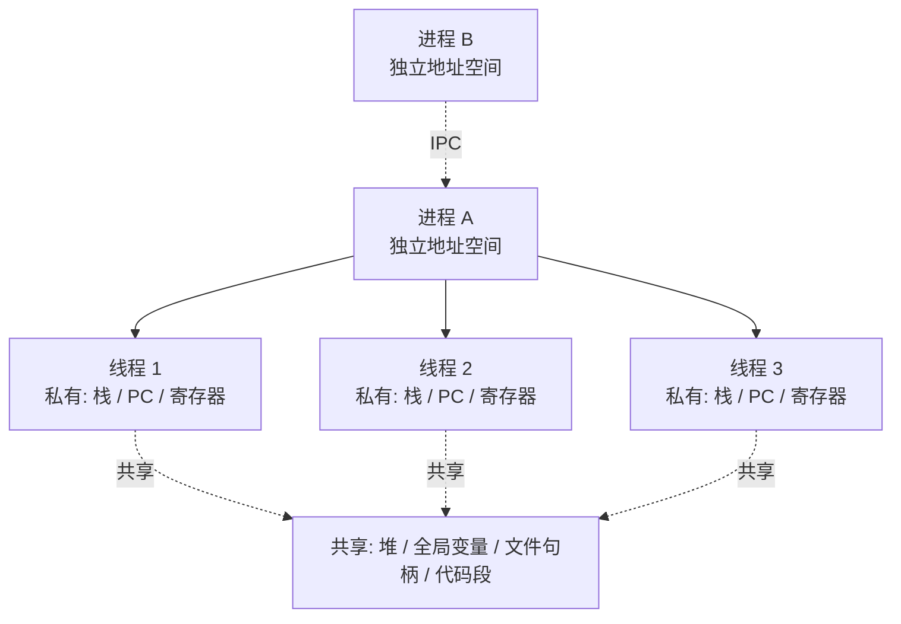

# 进程与线程

## 思维链路速查

```chain
资源视角对比 | 地址空间 / 开销 | 本质分野
调度与并发 | 谁被调度 | 核心
通信方式 | IPC vs 共享内存 | 实战
适用场景 | 多进程还是多线程 | 决策落地
面试问答 | 高频考点 | 复盘
```

进程是资源分配的最小单位，线程是 CPU 调度的最小单位 → 由此推出地址空间、开销、通信的根本差异 → 线程间共享内存、进程间走 IPC → 按崩溃隔离 / 共享需求选型 → 面试问答复盘。

## 一句话定义

| 维度 | 进程 Process | 线程 Thread |
|---|---|---|
| 本质 | **资源分配**的最小单位 | **CPU 调度**的最小单位 |
| 地址空间 | 独立，互不可见 | 同进程内共享同一地址空间 |
| 包含关系 | 一个进程可有多个线程 | 线程必须隶属于某个进程 |

> [!note] 一个好记的比喻
> 进程是**工厂**（独立厂房、资源边界），线程是**流水线工人**（共享厂房里的设备与原料，各自干活）。工厂之间搬东西要走正式的物流（IPC），工人之间直接递工具（共享内存）。

## 核心差异对比

| 对比项 | 进程 | 线程 |
|---|---|---|
| 创建 / 切换开销 | 大：切换虚拟内存映射 → **TLB 快表全失效**、CPU 缓存命中率骤降 | 小：不切换虚拟空间，TLB 与缓存仍有效，仅保存寄存器 / 栈 / PC |
| 崩溃影响 | 一个崩了不影响其他进程 | 一个崩了，全进程陪葬（"崩"指段错误 / 未处理致命异常；业务 `Exception` 被 `try-catch` 捕获则无碍） |
| 数量限制 | 受物理内存限制，通常较少（几百已近极限） | 受线程栈（常 1MB）限制但远多于进程（可数千）；超出 CPU 核心太多会频繁上下文切换，反噬性能 |
| 数据共享 | 默认隔离，要显式打通 | 默认共享，要显式隔离（锁 / `volatile`） |

> [!warning] 共享是把双刃剑
> 线程共享内存所以通信快，但也因此产生**竞态**——不加锁的并发写是 bug 温床；进程隔离所以安全，但通信成本高。这就是并发编程里"锁"存在的根本原因。

## 进程—线程结构



## 通信方式对照

| 场景 | 进程间 | 线程间 |
|---|---|---|
| 传递数据 | 管道 / 消息队列 / Socket / 共享内存（需 mmap 映射） | 直接读写共享变量 |
| 同步机制 | 信号量 / 文件锁（偏重） | `synchronized` / `Lock` / `volatile`（轻量） |
| 典型成本 | 内核介入、数据拷贝 | 多为用户态，开销低 |

> [!note] Java 的现实
> JVM 本身是一个进程；我们写的"多线程"都在同一个 JVM 进程内共享堆。这些线程怎么造出来见 [[线程创建]]，想做进程级隔离得另起 JVM 或用多进程框架，批量任务的归宿是 [[ThreadPoolExecutor]]。

## 适用场景

| 诉求 | 选型 | 理由 |
|---|---|---|
| 强故障隔离（如浏览器多 tab） | 多进程 | 一个崩了不连累其他 |
| 高并发、频繁共享状态（如 web 服务） | 多线程 / 线程池 | 共享内存通信快、开销低 |
| 多核 CPU 密集计算 | 多线程更省 | 避免 IPC 拷贝开销 |
| 跨机器 / 跨语言协作 | 多进程 + 网络 | 进程边界 = 自然的部署边界 |
| 高频交易 / 低延迟 | **必须多线程** | IPC 即便用共享内存也要走 mmap 等系统调用陷内核；线程自旋锁全在用户态，免内核陷入（Kernel Trap），省纳秒级却极关键的延迟 |

<details>
<summary>面试问答 (4题)</summary>

Q：进程和线程的根本区别是什么？

A：进程是资源分配的最小单位，拥有独立地址空间；线程是 CPU 调度的最小单位，同进程内线程共享地址空间。一句话定义表已概括本质、开销与崩溃差异。

Q：为什么线程切换比进程切换快？

A：线程切换不换虚拟内存映射，TLB 和 CPU 缓存依然有效，只保存 / 恢复寄存器、栈和 PC；进程切换要换整套虚拟地址空间，TLB 全失效、缓存命中率骤降，重建开销大得多。

Q：多线程共享什么、私有什么？

A：结构图已说明：共享堆、全局变量、文件句柄、代码段；每线程私有栈、PC、寄存器。正因为共享堆才需要锁保护共享数据。

Q：什么时候用多进程而不是多线程？

A：需要故障隔离（一模块崩不能拖垮整体）、跨语言 / 跨机器协作、或想避开锁争用时，优先多进程；否则高并发共享状态用多线程更划算。

</details>

<details>
<summary>常见误区 (3条)</summary>

- 误区：多线程一定比多进程快。只有涉及大量共享数据计算时多线程才更快；大量 I/O 或频繁申请大内存时，多进程的稳定性反而更好。
- 误区：进程间完全独立、没有任何共享。`fork` 后代码段通常与父进程只读共享，写时才拷贝（Copy-on-Write）；共享内存段（mmap）也能跨进程共享。
- 误区：线程越多跑得越快。受限于 Amdahl 定律与上下文切换开销，线程数超过 CPU 核心后吞吐量反而可能下降。

</details>
