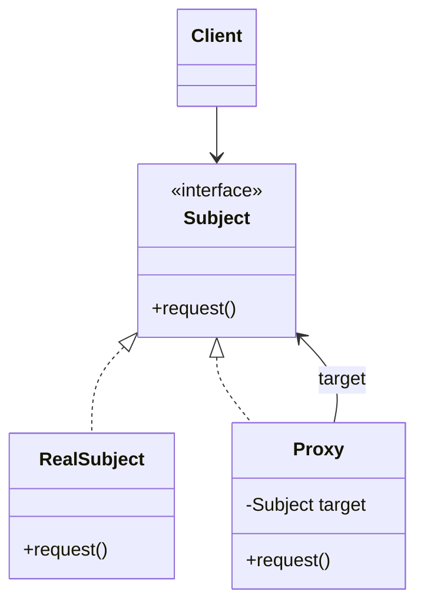
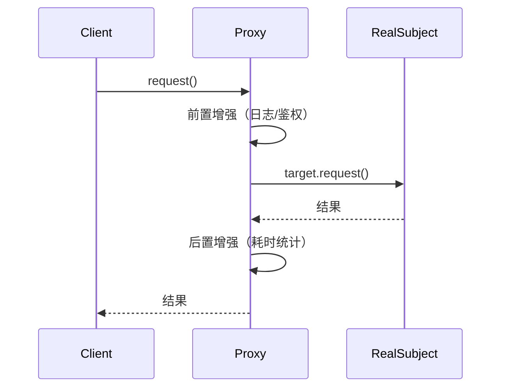

# 静态代理

## 思维链路速查

```chain
角色构成 | 四个角色各干什么 | 结构
调用时序 | 一次方法调用怎么走 | 流程
能力边界 | 好在哪、炸在哪 | 权衡
与装饰器辨析 | 长得像但不是一回事 | 辨析
详节落地 | 手写代码与陷阱 | 实战
面试问答 | 高频考点 | 复盘
```

静态代理把「转发 + 增强」在编译期写死：先认四个角色、走一遍调用时序，再掂量能力边界 —— 最大的坑是与装饰器长得太像，落地前先分清二者。

## 角色构成

代理类与被代理类**实现同一个接口**，代理类持有目标对象引用，在转发调用的前后织入增强逻辑 —— [[JavaSE]] 面向对象多态与组合的直接应用。

| 角色 | 职责 | 编译期是否已存在 |
|---|---|---|
| Subject | 定义行为契约（接口） | 是 |
| RealSubject | 真实业务逻辑 | 是 |
| Proxy | 持有 target，转发 + 增强 | 是（手写 .java 文件） |
| Client | 面向接口，拿到的是 Proxy | 是 |

> [!note] 「静态」指什么
> 静态 = **代理关系在编译期就固定**：Proxy 类是手写的源码，编译完就是 `.class`，运行期不再生成任何新类型。这是它与 [[动态代理]] 的唯一分水岭。

<details>
<summary>展开类图</summary>



</details>

## 调用时序

```chain
Client 调用 | proxy.request() | 入口
前置增强 | 日志 / 权限 / 事务 | 织入
转发真实对象 | target.request() | 委派
后置增强 | 收尾 / 统计耗时 | 织入
返回结果 | 原路返回 Client | 出口
```

<details>
<summary>展开时序图</summary>



</details>

## 能力边界

| 维度 | 表现 |
|---|---|
| 类型安全 | 编译期检查，接口方法签名错了编译不过 |
| 运行开销 | 无反射、无字节码生成，调用最快 |
| 可读性 | 代码直白，调用链一眼看穿，调试友好 |
| 维护成本 | 一个目标类配一个代理类，接口加方法要同步改所有代理类 |
| 增强复用 | 增强逻辑硬编码在代理类里，无法跨类复用 |

> [!danger] 类爆炸
> 每代理一个接口就要手写一个代理类，接口每加一个方法，所有实现它的代理类全部跟着改。这是静态代理在工程中几乎不被采用的根本原因 —— 规模一大就交给 [[动态代理]]。

> [!tip] 静态代理仅剩的适用场景
> 代理目标固定、数量极少（一两个），且不希望引入反射 / 字节码依赖时，例如给某个第三方 SDK 接口套一层埋点。

## 与装饰器辨析

> [!note] 为什么看代码分不出来
> 静态代理和装饰器的 Java 代码**几乎逐字节相同**：同一接口 + 构造器注入 target + 方法转发 + 前后织入。GOF 原书也承认两者结构一致——**区别不在代码本身，而在「谁创建、怎么用」**。对着代码找区别必然失败，要看使用语境。

先看一段谁都不是的代码——它叫代理还是装饰器，取决于外面怎么用它：

```java
class Wrap implements Service {
    private final Service target;          // 注入目标
    Wrap(Service t) { this.target = t; }
    public void go() {
        long t0 = System.nanoTime();       // 前置织入
        target.go();                       // 转发
        System.out.println("cost " + (System.nanoTime() - t0) + "ns"); // 后置织入
    }
}
```

用下面 4 个问题问它，答案决定身份：

| 判别问题 | 答案是装饰器 | 答案是静态代理 |
|---|---|---|
| 谁创建、谁知情？ | Client 亲手 `new`、层层拼装，全程知情 | 工厂 / 框架创建后塞给 Client，Client 可能不知道中间有层 |
| 能叠几层？ | 鼓励递归嵌套，层数随意 | 通常单层拦截在入口，不嵌套 |
| 行为契约？ | 透明：结果与 target 一致，只加外围能力 | 可拦、可换：鉴权、延迟加载，甚至可以不调 target |
| 管 target 死活？ | 不管，target 是 Client 自带的 | 常管：代理负责创建 / 持有 target |

**装饰器**——Client 亲手拼，行为透明，只加能力：

```java
// Client 自己逐层包：缓冲 → 解密 → 文件，哪层不要随时拆
InputStream in = new BufferedInputStream(
                     new CipherInputStream(
                         new FileInputStream("a.txt"), cipher));
```

**静态代理**——容器装配，Client 只摸到一个孤零零的对象：

```java
// 由框架创建；save() 实际经过鉴权代理，但 Client 毫无感知
UserService service = ctx.getBean(UserService.class);
service.save("tom");
```

> [!tip] 两个问题的快捷判别
> **谁给的？** 自己 new、自己拼 = 装饰器；别人塞给你 = 代理。
> **看得见链吗？** 代码里层层套 = 装饰器；只拿到一个对象 = 代理。
> 一句话：装饰器是「给对象加能力」，代理是「控制对这个对象的访问」——前者的代码里是 Client 在指挥，后者的代码里总有个第三方在发号施令。

## 详节

> [!note] 织入点的写法
> 前置与后置增强**成对出现**，后置收尾放进 `finally`：`target` 抛异常时耗时统计依然执行 —— 增强是附加动作，其成败不应影响业务成败。

```java
interface UserService { void save(String name); }

class UserServiceImpl implements UserService {
    public void save(String name) { System.out.println("save " + name); }
}

class UserServiceProxy implements UserService {
    private final UserService target;
    UserServiceProxy(UserService target) { this.target = target; }

    public void save(String name) {
        long t = System.nanoTime();          // 前置增强
        try {
            target.save(name);               // 委派真实对象
        } finally {
            System.out.println("cost " + (System.nanoTime() - t) + "ns"); // 后置增强
        }
    }
}

// 使用：Client 只认接口，拿到的是代理
UserService s = new UserServiceProxy(new UserServiceImpl());
s.save("tom");
```

> [!warning] 别在增强里改语义
> 代理的契约是「行为等价 + 附加动作」。若代理偷偷改了返回值或吞掉异常，Client 的行为会随注入对象不同而漂移 —— 这违反了里氏替换。

<details>
<summary>面试问答 (3题)</summary>

Q：什么是静态代理？

A：代理类由程序员手写（或工具生成源码）并在编译期确定，代理类与目标类实现同一接口，代理类持有目标引用，在转发调用前后织入增强逻辑。

Q：静态代理的缺点？

A：类爆炸 —— 一个接口一个代理类，接口方法变更会导致所有代理类同步修改；增强逻辑写死在代理类里无法复用。

Q：静态代理和装饰器模式的区别？

A：两者代码结构几乎同构（同接口 + 注入 target + 转发织入），GOF 也承认结构一致，区别在意图与用法：代理偏**控制访问、可对 Client 隐藏目标**（常由容器创建后塞给 Client）；装饰器偏**增强功能、Client 显式拼装、可递归叠加**（如 IO 流的逐层包装）。判别抓手是「谁创建链」和「增强是单层还是可叠」，不是结构本身。

</details>

<details>
<summary>常见误区 (3条)</summary>

- 误区：代理类要 extends 目标类。实际是**实现同一接口 + 组合持有**，继承会让代理与目标强耦合且无法代理 final 类。
- 误区：静态代理一定比动态代理快很多。调用本身确实快（无反射），但差额在纳秒级，真实瓶颈从不在代理调用上。
- 误区：静态代理和装饰器只是名字不同。结构同构不等于可互换——**判别的抓手不是结构，是使用语境**：Client 自己 new、能递归叠多层 = 装饰器；容器/工厂创建后塞进来、Client 不感知 = 代理。背「意图 vs 结构」两分法没意义，因为两者结构本来就一样。

</details>
